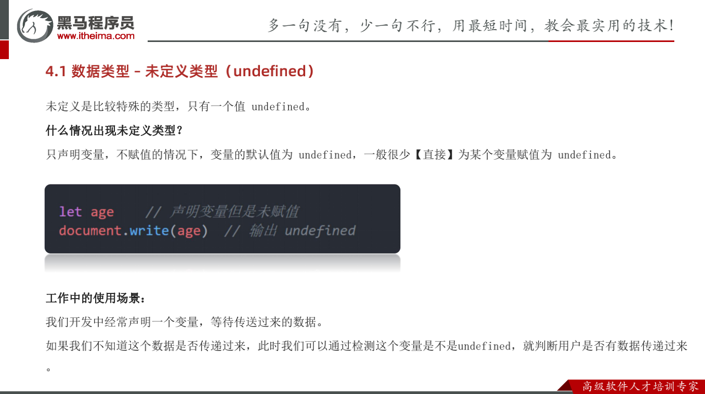
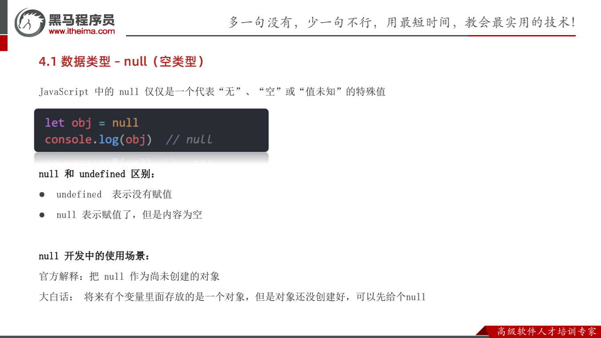

# 一、总结

```js
typeof undefined             // undefined
typeof null                  // object
null === undefined           // false
null == undefined            // true

// 计算有区别
console.log(undefined + 1)  // NaN
console.log(null + 1) // 1
```


# 二、GPT

在JavaScript中，`null` 和 `undefined` 是两个常见的基本数据类型，尽管它们都表示“没有值”或“空值”的概念，但它们在使用和语义上有一些关键区别。

### `undefined`

1. **定义**: `undefined` 是一种类型，表示变量已声明但尚未赋值。
2. **默认值**: 如果一个变量声明后没有赋值，它的值就是 `undefined`。
3. **全局对象属性**: `undefined` 也是全局对象的一个属性，即 `window.undefined` 或 `global.undefined`。
4. **未定义属性**: 访问对象中不存在的属性会返回 `undefined`。

示例：
```javascript
let a;
console.log(a); // 输出：undefined

let obj = {};
console.log(obj.nonExistentProperty); // 输出：undefined
```

### `null`

1. **定义**: `null` 是一个字面量，表示“空”或“无值”。它常用来显式地表示“没有对象”。
2. **类型**: `null` 是一种特殊的对象值，尽管使用 `typeof` 操作符时会返回 `"object"`。
3. **手动赋值**: 通常用来显式地给变量赋一个“空”值，表示变量不再引用任何对象。

示例：
```javascript
let b = null;
console.log(b); // 输出：null

let obj = { key: null };
console.log(obj.key); // 输出：null
```

### 关键区别

1. **类型**:
   - `typeof undefined` 返回 `"undefined"`。
   - `typeof null` 返回 `"object"`（这是一个历史遗留问题，尽管 `null` 是原始类型之一）。

2. **用法**:
   - `undefined` 表示变量已声明但尚未赋值，或尝试访问不存在的属性。
   - `null` 通常用来显式表示一个变量目前没有值或者不引用任何对象。

3. **值的比较**:
   - `null == undefined` 返回 `true`，因为它们都被认为是相等的非值。
   - `null === undefined` 返回 `false`，因为它们类型不同。

示例：
```javascript
console.log(null == undefined); // 输出：true
console.log(null === undefined); // 输出：false
```

### 何时使用

- **使用 `undefined`**:
  - 通常是由JavaScript引擎自动分配的，作为变量未赋值的默认状态。
  - 不推荐手动赋值变量为 `undefined`，而是通过声明但不赋值的方式让其保持 `undefined` 状态。

- **使用 `null`**:
  - 当你需要显式地表示变量不再引用任何对象或值时，使用 `null`。
  - 常用于对象初始化或重置。

示例：
```javascript
let person = {
  name: "Alice",
  age: 25
};

// 清除对象的引用
person = null;
```

### 总结

- `undefined` 通常表示变量尚未赋值或者属性不存在。
- `null` 用于明确表示“没有值”或“空对象引用”。
- 使用 `===` 操作符时需要注意它们的类型差异。


# 三、[undefined与null的区别](https://www.ruanyifeng.com/blog/2014/03/undefined-vs-null.html) - 阮一峰

作者： [阮一峰](https://www.ruanyifeng.com/)

日期： [2014年3月28日](https://www.ruanyifeng.com/blog/2014/03/)

大多数计算机语言，有且仅有一个表示"无"的值，比如，C语言的NULL，Java语言的null，Python语言的None，Ruby语言的nil。

有点奇怪的是，JavaScript语言居然有**两个**表示"无"的值：undefined和null。这是为什么？


## 1、相似性

在JavaScript中，将一个变量赋值为undefined或null，老实说，几乎没区别。

> ```javascript
> var a = undefined;
> 
> var a = null;
> ```

上面代码中，a变量分别被赋值为undefined和null，这两种写法几乎等价。

undefined和null在if语句中，都会被自动转为false，相等运算符甚至直接报告两者相等。

> ```javascript
> if (!undefined) 
>     console.log('undefined is false');
> // undefined is false
> 
> if (!null) 
>     console.log('null is false');
> // null is false
> 
> undefined == null
> // true
> 
> undefined === null
> // false
> ```

上面代码说明，两者的行为是何等相似！

既然undefined和null的含义与用法都差不多，为什么要同时设置两个这样的值，这不是无端增加JavaScript的复杂度，令初学者困扰吗？Google公司开发的JavaScript语言的替代品Dart语言，就明确规定只有null，没有undefined！


## 2、历史原因

最近，我在读新书[《Speaking JavaScript》](http://speakingjs.com/)时，意外发现了这个问题的答案！

原来，这与JavaScript的历史有关。1995年[JavaScript诞生](https://www.ruanyifeng.com/blog/2011/06/birth_of_javascript.html)时，最初像Java一样，只设置了null作为表示"无"的值。

根据C语言的传统，null被设计成可以自动转为0。

> ```javascript
> Number(null)
> // 0
> 
> 5 + null
> // 5
> ```

但是，JavaScript的设计者Brendan Eich，觉得这样做还不够，有两个原因。

首先，null像在Java里一样，被当成一个对象。但是，JavaScript的数据类型分成原始类型（primitive）和合成类型（complex）两大类，Brendan Eich觉得表示"无"的值最好不是对象。

其次，JavaScript的最初版本没有包括错误处理机制，发生数据类型不匹配时，往往是自动转换类型或者默默地失败。Brendan Eich觉得，如果null自动转为0，很不容易发现错误。

因此，Brendan Eich又设计了一个undefined。


## 3、最初设计

JavaScript的最初版本是这样区分的：**null是一个表示"无"的对象，转为数值时为0；undefined是一个表示"无"的原始值，转为数值时为NaN。**

> ```javascript
> Number(undefined)
> // NaN
> 
> 5 + undefined
> // NaN
> ```


## 4、目前的用法

但是，上面这样的区分，在实践中很快就被证明不可行。目前，null和undefined基本是同义的，只有一些细微的差别。

**null表示"没有对象"，即该处不应该有值。**典型用法是：

> （1） 作为函数的参数，表示该函数的参数不是对象。
>
> （2） 作为对象原型链的终点。

> ```javascript
> Object.getPrototypeOf(Object.prototype)
> // null
> ```

**undefined表示"缺少值"，就是此处应该有一个值，但是还没有定义。**典型用法是：

> （1）变量被声明了，但没有赋值时，就等于undefined。
>
> （2）调用函数时，应该提供的参数没有提供，该参数等于undefined。
>
> （3）对象没有赋值的属性，该属性的值为undefined。
>
> （4）函数没有返回值时，默认返回undefined。

> ```javascript
> var i;
> i // undefined
> 
> function f(x){console.log(x)}
> f() // undefined
> 
> var  o = new Object();
> o.p // undefined
> 
> var x = f();
> x // undefined
> ```


# 四、黑马







## undefined与null 计算有区别

```js
// 计算有区别
console.log(undefined + 1)  // NaN
console.log(null + 1) // 1
```

