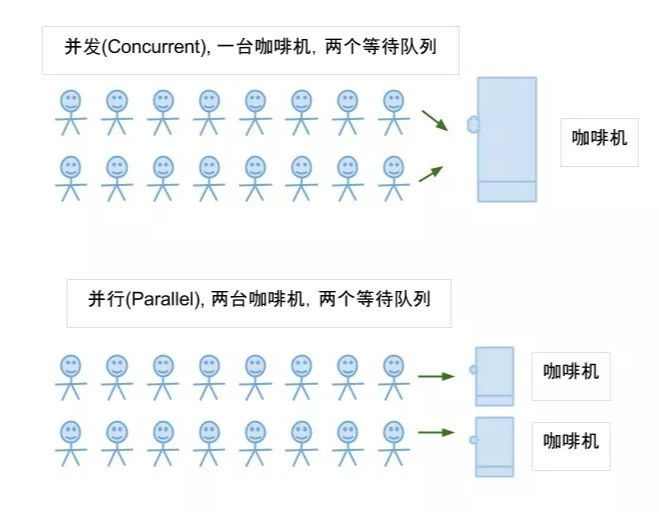

- [这一次，彻底弄懂 JavaScript 执行机制](https://juejin.im/post/59e85eebf265da430d571f89)
- [关于JavaScript单线程的一些事](https://github.com/JChehe/blog/blob/master/posts/%E5%85%B3%E4%BA%8EJavaScript%E5%8D%95%E7%BA%BF%E7%A8%8B%E7%9A%84%E4%B8%80%E4%BA%9B%E4%BA%8B.md)

* [前端面试题：JavaScript运行机制（一）单线程](https://www.bilibili.com/video/BV1gB4y1K7bD/?spm_id_from=333.337.search-card.all.click&vd_source=dc55c355e9f5b6174832aacfb5d8b6aa)


JavaScript 的执行是**单线程**的，意味着只有一个主线程在执行 JavaScript 代码，因此 JavaScript 需要注意避免长时间的占用主线程，否则会阻塞用户界面。同时，JavaScript 也支持异步操作，如定时器、事件监听等，这些异步操作可以增强用户体验，同时不会阻塞主线程。


# 一、JS异步操作的实现

JavaScript 中实现异步操作有多种方式，以下是常见的几种方法：

## 1. 回调函数

通过将一个函数作为参数传递给异步操作，当异步操作完成时调用这个函数，这个函数就是回调函数。回调函数是最早也是最常见的异步编程模式，例如：

```js
function fetchData(callback) {
    // 模拟异步操作
    setTimeout(() => {
        const data = '异步数据';
        callback(data);
    }, 1000);
}

fetchData((data) => {
    console.log(data);
});
```


## 2. Promise

Promise 是一种用于处理异步操作的对象，通过 Promise 可以更加清晰地处理异步操作成功、失败和异常的情况。例如：

```js
function fetchData() {
    return new Promise((resolve, reject) => {
        // 模拟异步操作
        setTimeout(() => {
            const data = '异步数据';
            resolve(data);
        }, 1000);
    });
}

fetchData()
    .then((data) => {
        console.log(data);
    })
    .catch((error) => {
        console.error(error);
    });
```


## 3. async / await

async/await 是基于 Promise 的异步编程语法糖，可以使异步代码看起来像同步代码。使用 async/await 可以在函数前加上 async 关键字，使其成为一个异步函数，并且在异步操作前使用 await 关键字等待异步操作的结果。例如：

```js
async function fetchData() {
    return new Promise((resolve, reject) => {
        // 模拟异步操作
        setTimeout(() => {
            const data = '异步数据';
            resolve(data);
        }, 1000);
    });
}

async function handleData() {
    const data = await fetchData();
    console.log(data);
}

handleData();
```


# 二、概念补充

## 1. 并发与并行

- **并发（Concurrency）**：指的是系统能够同时处理多个任务的能力，这些任务可能是交替执行的，也可能是同时执行的。在并发中，系统会通过时间片轮转等方式来实现多任务间的切换，以达到同时处理多个任务的效果。
- **并行（Parallelism）**：指的是系统同时执行多个任务的能力，这些任务真正同时在不同的处理器核心或计算单元上执行。在并行中，多个任务会同时进行，每个任务在不同的处理器上独立运行，从而提高系统的整体性能。

简单来说，并发是指多个任务之间可能交替执行，而并行是指多个任务同时执行。在现代计算机系统中，通常会同时使用并发和并行的技术来提高系统的性能和效率。




## 2. 同步与异步

- 同步(synchronous)：**顺序执行，需要协调等待**程序执行调用时，调用方得等待这个调用返回结果才能继续往后执行，即顺序执行代码片段；进程间相互依赖；
- 异步(asynchronous)：**彼此独立，互不干扰**和同步相反,调用方不会等待得到结果，而是在调用发出后调用者可用继续执行后续操作，被调用者通过状态来通知调用者，或者通过回调函数来处理这个调用；


## 3. 单线程与多线程

- 线程是cpu资源分配和调度的基本单位
- 多线程是进程中并发运行的一段代码


## 4. 异步与多线程

- 异步与多线程不是对等关系，多线程是实现异步的方式，异步是多线程的最终目的
- **相同点：** 避免线程阻塞、占用系统资源，提高软件的响应性
- **不同点：** 线程不是一个计算机硬件的功能，而是操作系统提供的一种逻辑功能；异步操作无须额外的线程负担，并且使用回调的方式进行处理


## 5. 并发和并行的区别

并发，指的是多个事情，在同一时间段内同时发生了。   

并行，指的是多个事情，在同一时间点上同时发生了。

并发的多个任务之间是互相抢占资源的。   

并行的多个任务之间是不互相抢占资源的、

只有在多CPU的情况中，才会发生并行。否则，看似同时发生的事情，其实都是并发执行的。


并发（concurrency）：把任务在不同的时间点交给处理器进行处理。在同一时间点，任务并不会同时运行。

并行（parallelism）：把每一个任务分配给每一个处理器独立完成。在同一时间点，任务一定是同时运行。


