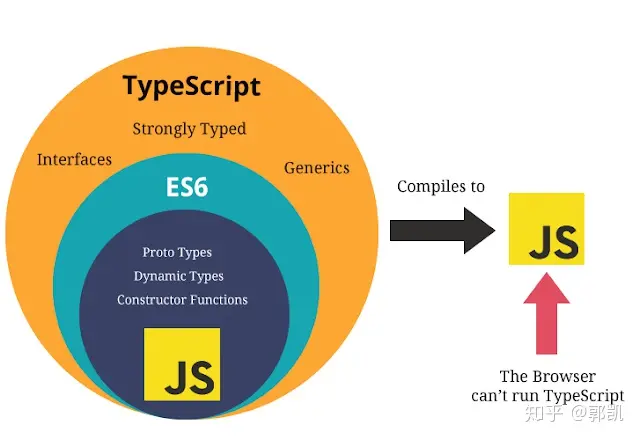

* [TypeScript官网](https://www.tslang.cn/docs/home.html)
* [Vue3 入门指南与实战案例](https://vue3.chengpeiquan.com/)
    * [快速上手 TypeScript](https://vue3.chengpeiquan.com/typescript.html#快速上手-typescript)

* [Vue官网 - 搭配 TypeScript 使用 Vue](https://cn.vuejs.org/guide/typescript/overview.html)

* [尚硅谷 - Vue3+TS 快速上手](https://24kcs.github.io/vue3_study/)


# typescript是什么

​		TypeScript 简称 TS ，既是一门新语言，也是 JS 的一个超集，它是在 JavaScript 的基础上增加了一套类型系统，它支持所有的 JS 语句，为工程化开发而生，最终在编译的时候去掉类型和特有的语法，生成 JS 代码。

​		TypeScript是一种开源的编程语言，它是JavaScript的超集。换句话说，TypeScript是建立在JavaScript之上的语言扩展。它添加了静态类型、类和模块等功能，并提供了更强大的工具和语言特性，以增强JavaScript的开发体验。

与JavaScript相比，TypeScript的主要特点包括：

1. 静态类型检查：TypeScript引入了静态类型系统，允许在编译时检测类型错误。通过在变量、函数参数和返回类型等位置显式地声明类型，可以减少潜在的运行时错误，并提供更好的代码提示和自动补全。
2. 类和接口：TypeScript支持面向对象编程的概念，包括类、继承、接口、抽象类等。这使得代码更易于组织、维护和重用，并且可以利用面向对象的设计模式。
3. 模块化：TypeScript支持使用模块来组织和管理代码。它遵循ES6模块化规范，并提供了额外的语法和功能，例如命名空间（namespace）和模块解析选项。
4. 编译时转换：TypeScript代码需要通过编译器将其转换为JavaScript代码。编译过程中，TypeScript的语法和特性将被转换成纯JavaScript代码，以便在任何支持JavaScript的环境中运行。
5. 工具和生态系统：TypeScript提供了强大的开发工具和生态系统支持。它包括类型定义文件（Type Declaration Files），可以描述现有JavaScript库的类型信息，以便在TypeScript项目中使用。此外，许多开发工具和框架，如VS Code、Angular、React等，都提供了对TypeScript的良好支持。

​		总之，TypeScript通过添加静态类型检查和其他高级特性，提供了更可靠、可扩展和可维护的JavaScript开发体验。它可以让开发者在大型项目中更轻松地捕获错误、重构代码，并提高代码质量和可读性。


# 为什么需要typescript

要想知道自己为什么要用 TypeScript ，得先从 JavaScript 有什么不足说起，举一个非常小的例子：

```tsx
function getFirstWord(msg) {
  console.log(msg.split(' ')[0])
}

getFirstWord('Hello World') // 输出 Hello

getFirstWord(123) // TypeError: msg.split is not a function
```

这里定义了一个用空格切割字符串的方法，并打印出第一个单词：

1. 第一次执行时，字符串支持 `split` 方法，所以成功获取到了第一个单词 `Hello`
2. 第二次执行时，由于数值不存在 `split` 方法，所以传入 `123` 引起了程序崩溃

这就是 JavaScript 的弊端，过于灵活，没有类型的约束，很容易因为类型的变化导致一些本可避免的 BUG 出现，而且这些 BUG 通常需要在程序运行的时候才会被发现，很容易引发生产事故。

虽然可以在执行 `split` 方法之前执行一层判断或者转换，但很明显增加了很多工作量。

TypeScript 的出现，在编译的时候就可以执行检查来避免掉这些问题，而且配合 VSCode 等编辑器的智能提示，可以很方便的知道每个变量对应的类型。


# js VS ts

> TypeScript is a syntactic sugar for JavaScript. TypeScript syntax is a superset of ECMAScript 2015 (ES2015) syntax. Every JavaScript program is also a TypeScript program.

- 语言层面：JavaScript和TypeScript都是ECMAScript（ECMA-262）的具体实现。
- 执行环境层面：浏览器引擎和Node.js都能够直接运行JavaScript，但无法直接运行TypeScript。
- 时序层面：TypeScript被真正执行前，会通过编译转换生成JavaScript，之后才能被解释执行。
- 厂商层面：JavaScript由Netscape率先推出，现在主要由各大浏览器厂商实现。而TypeScript is a trademark of Microsoft Corporation，目前由微软进行设计和维护。

TypeScript是ECMAScript 2015的语法超集，是JavaScript的语法糖。JavaScript程序可以直接移植到TypeScript，TypeScript需要编译（语法转换）生成JavaScript才能被浏览器执行。一图胜千言：




## GPT回答

JavaScript（JS）和TypeScript（TS）是两种相关但不同的编程语言。以下是它们之间的一些主要区别和比较：

1. **类型系统：**
    - JavaScript 是一种动态类型语言，变量的类型是在运行时确定的，可以随时更改。
    - TypeScript 是一种静态类型语言，它在编码阶段进行类型检查，可以帮助开发者发现潜在的类型错误。
2. **语法扩展：**
    - TypeScript 是 JavaScript 的超集，意味着 TypeScript 包含了 JavaScript 的所有特性，并在此基础上扩展了一些新的特性，如类型注解、接口、枚举等。
    - JavaScript 是一种标准的脚本语言，不包含 TypeScript 的类型系统和其他高级特性。
3. **开发效率：**
    - TypeScript 的类型系统可以提高代码的可读性、可维护性和可靠性，减少潜在的错误，从而提高开发效率。
    - JavaScript 在开发速度上可能略逊于 TypeScript，因为在 TypeScript 中需要花更多的时间来定义类型。
4. **生态系统：**
    - JavaScript 是一种非常流行的编程语言，拥有庞大而活跃的生态系统，有大量的库、框架和工具可供使用。
    - TypeScript 也在逐渐增长其生态系统，许多流行的库和框架都提供了 TypeScript 类型定义文件，使得在 TypeScript 中使用这些库更加方便。
5. **学习曲线：**
    - 对于有 JavaScript 经验的开发者来说，学习 TypeScript 相对较简单，因为 TypeScript 的语法和概念与 JavaScript 相似。
    - 对于初学者来说，学习 TypeScript 可能需要花费一些额外的时间来理解类型系统和其他概念。


# typescript安装 + 编译

[官网 - 安装](https://www.tslang.cn/index.html#download-links)

- 安装

    ```bash
    $ npm install -g typescript
    ```

- 编译

    ``` bash
    $ tsc helloworld.ts
    
    # --outDir 目录
    # --target 选项的作用是控制编译后的 JavaScript 版本，可选的值目前有： es3 ， es5 ， es6 ， es2015 ， es2016 ， es2017 ， es2018 ， es2019 ， es2020 ， es2021 ， es2022 ， esnext ，分别对应不同的 JS 规范（所以未来的可选值会根据 JS 规范一起增加）。
    $ tsc helloworld.ts --outDir dist --target es6 --module xxx
    ```

    生成新的文件 `helloworld.js`


# ts-node

## ts-node是什么

**ts-node 是一个 Node.js 的执行环境，它可以让你在 Node.js 环境中直接运行 TypeScript 代码。**

它通过在**运行时将 TypeScript 转译为 JavaScript 来实现**这一点，因此你不需要在编写 TypeScript 代码之前先将其转译为 JavaScript。这使得你可以在不离开 Node.js 环境的情况下使用 TypeScript 的语言特性。


## ts-node安装

ts-node 可以通过 npm 包管理器安装，在命令行中使用以下命令即可安装：

```bash
$ npm install -g ts-node
```


## 运行typescript

在安装完成后，你就可以在命令行中使用 `ts-node` 命令来运行 TypeScript 代码了。例如，你可以在命令行中输入以下命令来运行 TypeScript 文件：

```bash
$ ts-node myFile.ts
```


# [Hello TypeScript](https://vue3.chengpeiquan.com/typescript.html#hello-typescript)

* [Vue3 入门指南与实战案例](https://vue3.chengpeiquan.com/)

安装 TypeScript 开发的两个主要依赖包：

1. [typescript](https://www.npmjs.com/package/typescript) 这个包是用 TypeScript 编程的语言依赖包
2. [ts-node](https://www.npmjs.com/package/ts-node) 是让 Node 可以运行 TypeScript 的执行环境

```shell
$ npm install -D typescript ts-node
```

这次添加了一个 `-D` 参数，因为 TypeScript 和 TS-Node 是开发过程中使用的依赖，所以将其添加到 package.json 的 `devDependencies` 字段里。

```json
{
  "name": "hello-node",
  "version": "1.0.0",
  "description": "",
  "main": "index.js",
  "scripts": {
    "dev:cjs": "node src/cjs/index.cjs",
    "dev:esm": "node src/esm/index.mjs",
    "dev:ts": "ts-node src/ts/index.ts",
    "compile": "babel src/babel --out-dir compiled",
    "serve": "node server/index.js"
  },
  "keywords": [],
  "author": "",
  "license": "ISC",
  "dependencies": {
    "md5": "^2.3.0"
  },
  "devDependencies": {
    "ts-node": "^10.7.0",
    "typescript": "^4.6.3"
  }
}
```

> 请注意， `dev:ts` 这个 script 是用了 `ts-node` 来代替原来在用的 `node` ，因为使用 `node` 无法识别 TypeScript 语言。


# [TypeScript 如何编译为 JavaScript 代码](https://vue3.chengpeiquan.com/typescript.html#如何编译为-javascript-代码)

## 编译单个文件

package.json

```json
{
  "scripts": {
    "dev:ts": "ts-node src/ts/index.ts",
    "build": "tsc src/ts/index.ts --outDir dist",
  },
  "devDependencies": {
    "@types/md5": "^2.3.2",
    "ts-node": "^10.7.0",
    "typescript": "^4.6.3"
  }
}
```

​		这样在命令行运行 `npm run build` 的时候，就会把 `src/ts/index.ts` 这个 TS 文件编译，并输出到项目下与 src 文件夹同级的 dist 目录下。

​		其中 `tsc` 是 TypeScript 用来编译文件的命令， `--outDir` 是它的一个选项，用来指定输出目录，如果不指定，则默认生成到源文件所在的目录下面。


## [编译多个模块](https://vue3.chengpeiquan.com/typescript.html#编译多个模块)


## [修改编译后的 JS 版本](https://vue3.chengpeiquan.com/typescript.html#修改编译后的-js-版本)


# [了解 tsconfig.json](https://vue3.chengpeiquan.com/typescript.html#%E4%BA%86%E8%A7%A3-tsconfig-json)

