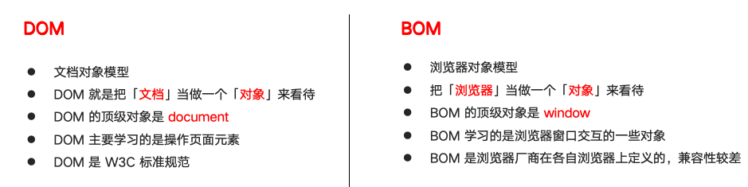
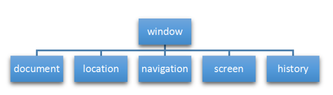

# 一、什么是Bom

* BOM（Browser Object Model）即浏览器对象模型，它提供了独立于内容而与浏览器窗口进行交互的对象，其核心对象是 window。
* BOM 由一系列相关的对象构成，并且每个对象都提供了很多方法与属性。
* BOM 缺乏标准，JavaScript 语法的标准化组织是 ECMA，DOM 的标准化组织是 W3C，BOM 最初是Netscape 浏览器标准的一部分。
* 浏览器对象模型 (BOM) 使 JavaScript 有能力与浏览器"对话"。

# 二、Bom vs Dom

BOM 比 DOM 更大，它包含 DOM。

