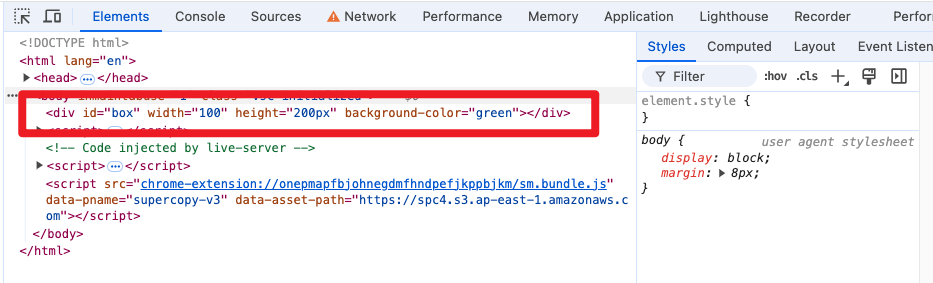
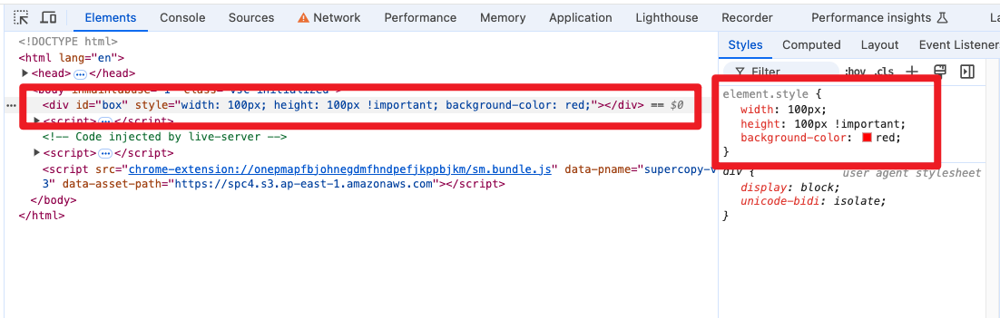
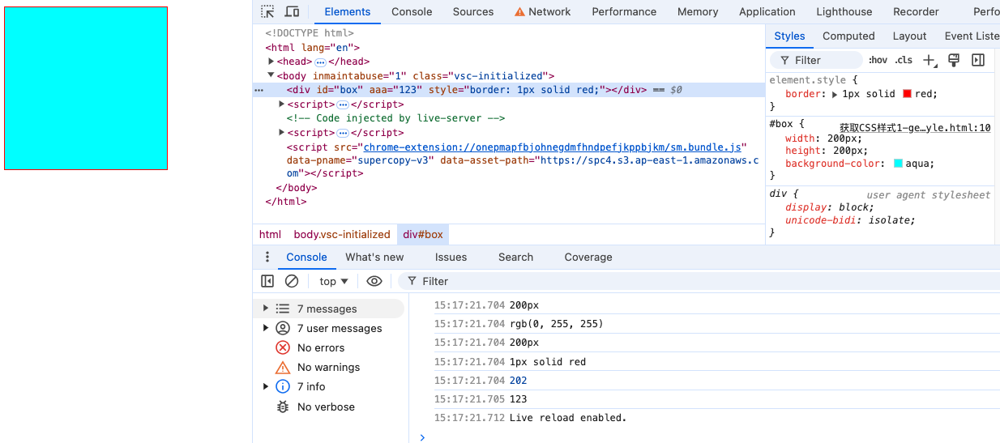

<font color='red' size=5>注：与《JavaScript操作元素属性》内容有重合！！！</font>

# 一、设置元素样式

* [操作元素样式 - 黑马](https://book.itheima.net/course/1258676978588860418/1277481554465005570/1277491444881301506)

操作元素样式有两种方式，一种是操作style属性，一种是操作className属性，下面我们分别进行讲解。

## 1. `element.style`

除了前面讲解的元素内容和属性外，对于元素对象的样式，可以直接通过 **“元素对象.style.样式属性名”** 的方式操作。样式属性名对应CSS样式名，但需要去掉CSS样式名里的半字线“-”，并将半字线后面的英文的首字母大写。例如，设置字体大小的样式名font-size，对应的样式属性名为fontSize。

为了便于读者的学习使用，下面我们通过表1列出常用style属性中CSS样式名称的书写及说明。

```html
<!DOCTYPE html>
<html lang="en">

<head>
  <meta charset="UTF-8">
  <meta name="viewport" content="width=device-width, initial-scale=1.0">
  <title>Document</title>
</head>

<body>
  <div id="box"></div>

  <script>
    var ele = document.querySelector('#box'); // 获取元素对象
    ele.style.backgroundColor = 'red';
    ele.style.width = '100px';
    ele.style.height = '100px';
    ele.style.transform = 'rotate(7deg)';
  </script>
</body
</html>
```


| **名称**                                                     | **说明**                                 |
| ------------------------------------------------------------ | ---------------------------------------- |
| [background](http://www.runoob.com/jsref/prop-style-background.html) | 设置或返回元素的背景属性                 |
| [backgroundColor](http://www.runoob.com/jsref/prop-style-backgroundcolor.html) | 设置或返回元素的背景色                   |
| [display](http://www.runoob.com/jsref/prop-style-display.html) | 设置或返回元素的显示类型                 |
| fontSize                                                     | 设置或返回元素的字体大小                 |
| [height](http://www.runoob.com/jsref/prop-style-height.html) | 设置或返回元素的高度                     |
| [left](http://www.runoob.com/jsref/prop-style-left.html)     | 设置或返回定位元素的左部位置             |
| [listStyleType](http://www.runoob.com/jsref/prop-style-liststyletype.html) | 设置或返回列表项标记的类型               |
| [overflow](http://www.runoob.com/jsref/prop-style-overflow.html) | 设置或返回如何处理呈现在元素框外面的内容 |
| [textAlign](http://www.runoob.com/jsref/prop-style-textalign.html) | 设置或返回文本的水平对齐方式             |
| [textDecoration](http://www.runoob.com/jsref/prop-style-textdecoration.html) | 设置或返回文本的修饰                     |
| [textIndent](http://www.runoob.com/jsref/prop-style-textindent.html) | 设置或返回文本第一行的缩进               |
| [transform](http://www.runoob.com/jsref/prop-style-transform.html) | 向元素应用2D或3D转换                     |


## 2. `element.setAttribute()`

### a. 直接设置属性

```html
<!DOCTYPE html>
<html lang="en">
<head>
  <meta charset="UTF-8">
  <meta name="viewport" content="width=device-width, initial-scale=1.0">
  <title>Document</title>
</head>
<body>
  <div id="box"></div>

  <script>
    var element = document.querySelector('#box'); // 获取元素对象

    // 虽然设置成功，但是不生效
    element.setAttribute('width', 100);
    element.setAttribute('height', '200px');
    element.setAttribute('background-color', 'green');
  </script>
</body>
</html>
```




###  b. 设置style的属性

```html
<!DOCTYPE html>
<html lang="en">

<head>
  <meta charset="UTF-8">
  <meta name="viewport" content="width=device-width, initial-scale=1.0">
  <title>Document</title>
</head>

<body>
  <div id="box"></div>

  <script>
    var element = document.querySelector('#box'); // 获取元素对象

    element.setAttribute('style', 'width: 100px; height: 100px !important; background-color: red;');
  </script>
</body>

</html>
```




## 3. `element.style.setProperty()`

```js
setProperty(propertyName, value)
setProperty(propertyName, value, priority)
```

| 参数           | 描述                                                         |
| :------------- | :----------------------------------------------------------- |
| *propertyname* | 必需。一个字符串，表示创建或修改的属性。                     |
| *value*        | 可选，新的属性值。                                           |
| *priority*     | 可选。字符串，规定是否需要设置属性的优先级 important。 可以是下面三个值: "important" undefined "" |

```html
<!DOCTYPE html>
<html lang="en">

<head>
  <meta charset="UTF-8">
  <meta name="viewport" content="width=device-width, initial-scale=1.0">
  <title>Document</title>
</head>

<body>
  <div id="box"></div>

  <script>
    var element = document.querySelector('#box'); // 获取元素对象
    // 原始样式
    element.setAttribute('style', 'width: 100px; height: 100px !important; background-color: red;');
    // 修改样式
    element.style.setProperty('background-color', 'green', 'important');
  </script>
</body>

</html>
```


## 4. `element.style.cssText`

```html
<!DOCTYPE html>
<html lang="en">

<head>
  <meta charset="UTF-8">
  <meta name="viewport" content="width=device-width, initial-scale=1.0">
  <title>Document</title>
</head>

<body>
  <div id="box"></div>

  <script>
    var element = document.querySelector('#box'); // 获取元素对象
    // 原始样式
    element.setAttribute('style', 'width: 100px; height: 100px !important; background-color: red;');
    // 修改样式
    element.style.cssText="width: 200px; height: 70px; background-color: green;";
  </script>
</body>
</html>
```


## 5. `element.className`

在开发中，如果样式修改较多，可以采取操作类名的方式更改元素样式，语法为“元素对象.className”。访问className属性的值表示获取元素的类名，为className属性赋值表示更改元素类名。如果元素有多个类名，在className中以空格分隔。

接下来，通过代码演示如何使用className更改元素的样式。

```html
<!DOCTYPE html>
<html lang="en">

<head>
  <meta charset="UTF-8">
  <meta name="viewport" content="width=device-width, initial-scale=1.0">
  <title>Document</title>

  <style>
    div {
      width: 100px;
      height: 100px;
      background-color: pink;
    }

    .change {
      background-color: purple;
      color: #fff;
      font-size: 25px;
      margin-top: 100px;
    }
  </style>
</head>

<body>
  <div class="first">文本</div>

  <script>
    var test = document.querySelector('div');
    test.onclick = function () {
      this.className = 'change';
    };
  </script>
</body>

</html>
```


## 6. `addRule()` or `insertRule()` - Deprecated


# 二、获取计算样式

## 1. `window.getComputedStyle()`

- `window.getComputedStyle(element)`：获取的是最终应用在元素上的所有CSS属性对象。
- **伪元素**：`getComputedStyle`方法还可以用于获取伪元素（如`:before`和`:after`）的计算后样式。例如，要获取`:before`伪元素的样式，可以传递`::before`作为第二个参数。
- **只读属性**：`getComputedStyle`返回的对象是只读的，无法通过它直接修改元素的样式。

```js
 	const styles = window.getComputedStyle(element);
    console.log(styles.width);
    console.log(styles.backgroundColor);
```


## 2. `window.getComputedStyle().getPropertyValue()`

```
 	const styles = window.getComputedStyle(element);
    console.log(styles.getPropertyValue("height"));
```


## 3. `element.style`

* 可读、可写
* `element.style`只能获取元素`style`属性中的CSS样式。

```
    console.log(element.style.border);
```


## 4. `CSS属性值`

可以通过访问CSS属性值来获取计算后的样式。例如，使用`element.offsetWidth`和`element.offsetHeight`可以获取元素的实际宽度和高度。

```js
	console.log(element.offsetWidth);
```


## 5. `element.getAttribute()`

```
	console.log(element.getAttribute("AAA"));
```


## 【1-5】code in one

```html
<!DOCTYPE html>
<html lang="en">
<head>
  <meta charset="UTF-8">
  <meta name="viewport" content="width=device-width, initial-scale=1.0">
  <title>Document</title>
  <style>
    #box {
      width: 200px;
      height: 200px;
      background-color: aqua;
    }
  </style>
</head>

<body>
  <div id="box" AAA="123" style="border: 1px solid red;"></div>
  <script>
    var element = document.querySelector('#box'); // 获取元素对象
    // 1. 
    const styles = window.getComputedStyle(element);
    console.log(styles.width);
    console.log(styles.backgroundColor);
    // 2.
    console.log(styles.getPropertyValue("height"));
    // 3.
    console.log(element.style.border);
    // 4.
    console.log(element.offsetWidth);
    // 5.
    console.log(element.getAttribute("AAA"));
  </script>
</body>
</html>
```




## 6. `currentStyle`  - Deprecated

* 在较旧版本的Internet Explorer中（IE8及更早版本），可以使用`currentStyle`属性来获取计算后的样式。
* **浏览器支持**：`currentStyle`仅在IE8及更早版本中受支持。在现代浏览器中，应使用`getComputedStyle`。
* **功能有限**：`currentStyle`返回的对象不如`getComputedStyle`提供的信息全面。

```js
// 获取目标元素
var element = document.querySelector('.my-element');

// 获取计算后的样式
var currentStyle = element.currentStyle;

// 访问特定的CSS属性值
var width = currentStyle.width;
var color = currentStyle.color;
console.log('Width: ', width);
console.log('Color: ', color);
```


## 7. 使用JQuery等库

忽略......


# 三、添加和删除 CSS 类

* [Element: classList property - MDN](https://developer.mozilla.org/en-US/docs/Web/API/Element/classList)
* [HTML DOM classList 属性 - 菜鸟教程](https://www.runoob.com/jsref/prop-element-classlist.html)

- `element.classList.add(className)`：添加 CSS 类。
- `element.classList.remove(className)`：删除 CSS 类。
- `element.classList.toggle(className)`：切换 CSS 类的存在状态。
- `element.classList.contains(className)`：检查元素是否包含某个类。


```html
<!DOCTYPE html>
<html>

<head>
  <meta charset="utf-8">
  <title>菜鸟教程(runoob.com)</title>
  <style>
    .mystyle {
      width: 500px;
      height: 50px;
      padding: 15px;
      border: 1px solid black;
    }
    .anotherClass {
      background-color: coral;
      color: white;
    }
    .thirdClass {
      text-transform: uppercase;
      text-align: center;
      font-size: 25px;
    }
    .newClassName {
      width: 400px;
      height: 100px;
      background-color: lightblue;
      text-align: center;
      font-size: 25px;
      color: navy;
      margin-bottom: 10px;
    }
  </style>
  </style>
</head>

<body>
  <p>点击按钮为 DIV 元素添加多个类。</p>
  <button onclick="addFunc()">新增</button>
  <button onclick="removeFunc()">移除</button>
  <button onclick="toggleFun()">切换</button>
  <button onclick="getAllClassNameFun()">获取所有className</button>
  <button onclick="isContainClassNameFun()">是否存在className</button>
  <p><strong>注意：</strong> Internet Explorer 9 及更早 IE 版本浏览器不支持 classList 属性。</p>
  <div id="myDIV">
    我是一个 DIV 元素。
  </div>
  <script>
    function addFunc() {
      document.getElementById("myDIV").classList.add("mystyle", "anotherClass", "thirdClass");
    }
    function removeFunc() {
      document.getElementById("myDIV").classList.remove("mystyle");
    }
    function toggleFun() {
      document.getElementById("myDIV").classList.toggle("newClassName");
    }
    function getAllClassNameFun() {
      const a = document.getElementById("myDIV").classList;
      alert(a);
    }
    function isContainClassNameFun() {
      var x = document.getElementById("myDIV").classList.contains("mystyle");
      alert(x);
    }
  </script>
</body>
</html>
```


