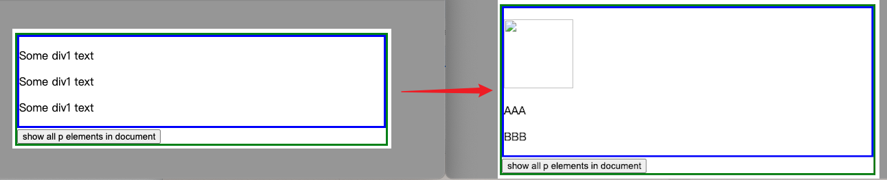

# 一、获取元素

## 1. `document.getElementById()`

* [根据id获取元素 - 黑马](https://book.itheima.net/course/1258676978588860418/1277481554465005570/1277491357669138438)

* `getElementById()` 方法是由document对象提供的用于查找元素的方法，该方法返回的是拥有指定id的元素，如果没有找到指定id的元素则返回null。
* 需要注意的是，JavaScript中严格区分大小写，所以在书写时一定要遵守书写规范，否则程序会报错。
* 需要注意的是，id值不能像CSS那样加“#”，如 `getElementById("#box")` 是错误的。

```html
<!DOCTYPE html>
<html lang="en">

<head>
  <meta charset="UTF-8">
  <meta name="viewport" content="width=device-width, initial-scale=1.0">
  <title>Document</title>
</head>

<body>
  <div id="box">你好</div>

  <script>
    /**
     * 获取元素
     * 
     * 1. 通过 id 获取元素
     *    document.getElementById('id值')
     * 
     */
    const Obox = document.getElementById('box');
    console.log(Obox);       // 结果为：<div id="box">你好</div>
    console.log(typeof Obox);   // 结果为：object
    console.dir(Obox);       // 结果为：div#box
  </script>
</body>
</html>
```


##2. `getElementsByTagName()`

* [element.getElementsByTagName() - MDN](https://developer.mozilla.org/zh-CN/docs/Web/API/Element/getElementsByTagName)
* [document.getElementsByTagName() - MDN](https://developer.mozilla.org/zh-CN/docs/Web/API/Document/getElementsByTagName)

### a. `element.getElementsByTagName()`

在以下的例子中，`getElementsByTagName()` 开始于一个具体的父级元素并且从它自上而下递归地在`DOM 树中`搜索符合标签名称参数的子元素。

注意调用 `getElementsByTagName()` 的不是那个文件节点 `document`，事实上是使用这个方法 [`element.getElementsByTagName()`](https://developer.mozilla.org/zh-CN/docs/Web/API/Element/getElementsByTagName)。

```html
<!doctype html>
<html lang="en">
  <head>
    <meta charset="UTF-8" />
    <title>getElementsByTagName example</title>
    <script>
      function getAllParaElems() {
        var allParas = document.getElementsByTagName("p");
        var num = allParas.length;
        alert("There are " + num + " paragraph in this document");
      }

      function div1ParaElems() {
        var div1 = document.getElementById("div1");
        var div1Paras = div1.getElementsByTagName("p");
        var num = div1Paras.length;
        alert("There are " + num + " paragraph in #div1");
      }

      let allDiv2 = null;
      function div2ParaElems() {
        var div2 = document.getElementById("div2");
        var div2Paras = div2.getElementsByTagName("p");
        allDiv2 = div2Paras;
        var num = div2Paras.length;
        alert("There are " + num + " paragraph in #div2");
      }

      function addDiv2() {
        // 创建li元素
        var p = document.createElement('p')
        // 向li中添加文本内容
        p.innerHTML = '我是新增的P'
        // 向指定div中插入li
        var div2 = document.getElementById("div2");
        div2.appendChild(p);
        /* 
         * 返回的 HTML 集合是动态的，意味着它可以自动更新自己来保持和 DOM 树的同步而不用再次调用
         *	document.getElementsByTagName()。
         */
        console.log(allDiv2);
      }
    </script>
  </head>
  <body style="border: solid green 3px">
    <p>Some outer text</p>
    <p>Some outer text</p>

    <div id="div1" style="border: solid blue 3px">
      <p>Some div1 text</p>
      <p>Some div1 text</p>
      <p>Some div1 text</p>

      <div id="div2" style="border: solid red 3px">
        <p>Some div2 text</p>
        <p>Some div2 text</p>
      </div>
    </div>

    <p>Some outer text</p>
    <p>Some outer text</p>

    <button onclick="getAllParaElems();">
      show all p elements in document
    </button><br />

    <button onclick="div1ParaElems();">
      show all p elements in div1 element
    </button><br />

    <button onclick="div2ParaElems();">
      show all p elements in div2 element
    </button><br />

    <button onclick="addDiv2();">
      新增一个div
    </button>

  </body>
</html>
```


### b. `document.getElementsByTagName()`

* [根据标签获取元素 - 黑马](https://book.itheima.net/course/1258676978588860418/1277481554465005570/1277491357669138437)

由于相同标签名的元素可能有多个，上述方法返回的不是单个元素对象，而是一个集合。这个集合是一个类数组对象，或称为伪数组，它可以像数组一样用索引来访问元素，但不能使用 `push()` 等方法。使用 `Array.isArray()` 也可以证明它不是一个数组。

```html
<!DOCTYPE html>
<html lang="en">

<head>
  <meta charset="UTF-8">
  <meta name="viewport" content="width=device-width, initial-scale=1.0">
  <title>Document</title>
</head>

<body>

  <ul>
    <li>苹果</li>
    <li>香蕉</li>
    <li>西瓜</li>
    <li>樱桃</li>
  </ul>

  <ol id="ol">
    <li>绿色</li>
    <li>蓝色</li>
    <li>白色</li>
    <li>红色</li>
  </ol>

  <script>
    var lis = document.getElementsByTagName('li');
    // 结果为：HTMLCollection(8) [li, li, li, li, li, li, li, li]
    console.log(lis);
    
    // 结果为：false，说明不是一个数组对象
    console.log(Array.isArray(lis));

    // 查看集合中的索引为0的元素，结果为：<li>苹果</li>
    console.log(lis[0]);

    // 遍历集合中的所有元素
    for (var i = 0; i < lis.length; i++) {
      console.log(lis[i]);
    }

    // 通过元素对象获取元素
    var ol = document.getElementById('ol');

    // 结果为：HTMLCollection(4) [li, li, li, li]
    console.log(ol.getElementsByTagName('li'));
  </script>
</body>

</html>
```


### c. 总结

* `element`是元素对象的统称，通过元素对象可以查找该元素的子元素或后代元素，实现局部查找元素的效果；

    而 `document` 对象是从整个文档中查找元素。

* `getElementsByTagName()` 返回的 `HTML 集合`是动态的，意味着它可以自动更新自己来保持和 DOM 树的同步而不用再次调用 `document.getElementsByTagName() / element.getElementsByTagName()`。


## 3. `document.getElementsByName()`

* [Document：getElementsByName() 方法 - MDN](https://developer.mozilla.org/zh-CN/docs/Web/API/Document/getElementsByName)
* [根据name获取元素 - 黑马](https://book.itheima.net/course/1258676978588860418/1277481554465005570/1277491357669138435)


* 通过name属性来获取元素使用document.getElementsByName()方法，一般用于获取表单元素。

* name属性的值不要求必须是唯一的，多个元素也可以有同样的名字，如表单中的单选框和复选框。

```html
<!DOCTYPE html>
<html lang="en">

<head>
  <meta charset="UTF-8">
  <meta name="viewport" content="width=device-width, initial-scale=1.0">
  <title>Document</title>
</head>

<body>

  <p>请选择你最喜欢的水果（多选）</p>
  <label><input type="checkbox" name="fruit" value="苹果">苹果</label>
  <label><input type="checkbox" name="fruit" value="香蕉">香蕉</label>
  <label><input type="checkbox" name="fruit" value="西瓜">西瓜</label>

  <script>
    /**
     * 获取元素
     * 
     * 3. 通过 name 获取元素
     *    document.getElementsByName('name值')
     * 
     */
    var fruits = document.getElementsByName('fruit');
    fruits[2].checked = true;

  </script>
</body>
</html>
```

`getElementsByName()` 方法返回的是一个对象集合，使用索引获取元素。`fruits[0].checked` 为 `true`，表示将fruits中的第1个元素的checked属性值设置为true，表示将这一项勾选。


## 4. `document.getElementsByClassName()` - HTML5

```html
<!DOCTYPE html>
<html lang="en">

<head>
  <meta charset="UTF-8">
  <meta name="viewport" content="width=device-width, initial-scale=1.0">
  <title>Document</title>
</head>

<body>
  <span class="one">英语</span> <span class="two">数学</span>
  <span class="one">语文</span> <span class="two">物理</span>

  <script>
    /**
    * 获取元素
    * 
    * 4. 通过类名获取元素
    *    document.getElementsByClassName('类名')
    * 
    */
    var Ospan1 = document.getElementsByClassName('one');
    var Ospan2 = document.getElementsByClassName('two');
    Ospan1[0].style.fontWeight = 'bold';
    Ospan2[1].style.background = 'red';
  </script>
</body>
</html>
```


## 5. `querySelector()`和`querySelectorAll()` - HTML5

* `document.querySelector(selector)`：通过 CSS 选择器获取第一个匹配的元素。

* `document.querySelectorAll(selector)`：通过 CSS 选择器获取所有匹配的元素集合。
* `queryselector` 和 `queryselectorA11` 里面的选择器需要加符号，比如：`document .queryselector("#nav");`

```html
<!DOCTYPE html>
<html lang="en">

<head>
  <meta charset="UTF-8">
  <meta name="viewport" content="width=device-width, initial-scale=1.0">
  <title>Document</title>
</head>

<body>
  <div class="box">盒子1</div>
  <div class="box">盒子2</div>
  <div id="nav">
    <ul>
      <li>首页</li>
      <li>产品</li>
    </ul>
  </div>

  <script>
    var firstBox = document.querySelector('.box');
    console.log(firstBox); // 获取class为box的第1个div

    var nav = document.querySelector('#nav');
    console.log(nav);    // 获取id为nav的第1个div 

    var li = document.querySelector('li');
    console.log(li);    // 获取匹配到的第一个li

    var allBox = document.querySelectorAll('.box');
    console.log(allBox);  // 获取class为box的所有div

    var lis = document.querySelectorAll('li');
    console.log(lis);    // 获取匹配到的所有li
  </script>
</body>
</html>
```


## 6. document对象的属性

* [document对象的属性 - 黑马](https://book.itheima.net/course/1258676978588860418/1277481554465005570/1277491357669138436)

| **属性**                 | **说明**                      |
| ------------------------ | ----------------------------- |
| document.body            | 返回文档的body元素            |
| document.title           | 返回文档的title元素           |
| document.documentElement | 返回文档的html元素            |
| document.forms           | 返回对文档中所有Form对象引用  |
| document.images          | 返回对文档中所有Image对象引用 |

```html
<!DOCTYPE html>
<html lang="en">

<head>
  <meta charset="UTF-8">
  <meta name="viewport" content="width=device-width, initial-scale=1.0">
  <title>Document 123</title>
</head>

<body>
  <div class="box">盒子1</div>
  <div class="box">盒子2</div>
  <div id="nav">
    <ul>
      <li>首页</li>
      <li>产品</li>
    </ul>
  </div>

  <script>
    let body = document.body;
    console.log('body =', body);
    
    let title = document.title;
    console.log('title =', title);

    let htmlEle = document.documentElement;
    console.log('htmlEle =', htmlEle);
  </script>
</body>

</html>
```


# 二、修改元素内容

* `element.innerHTML`：设置或获取元素的 HTML 内容。

* `element.textContent`：设置或获取元素的文本内容，忽略 HTML 标签。

* `element.innerText`：设置或获取元素的可见文本内容。

在JavaScript中，想要操作元素内容，首先要获取到该元素，前面已经讲解了获取元素的几种方式，在本小节中我们将利用DOM提供的属性实现对元素内容的操作。其中常用的属性如表1所示。

| **属性**            | **说明**                                                     |
| ------------------- | ------------------------------------------------------------ |
| element.innerHTML   | 设置或返回元素开始和结束标签之间的HTML，包括HTML标签，同时保留空格和换行 |
| element.innerText   | 设置或返回元素的文本内容，在返回的时候会去除HTML标签和多余的空格、换行，在设置的时候会进行特殊字符转义 |
| element.textContent | 设置或者返回指定节点的文本内容，同时保留空格和换行           |

区别

* `innerHTML` 在使用时会保持编写的格式以及标签样式
* `innerText` 则是去掉所有格式以及标签的纯文本内容
* `textContent` 属性在去掉标签后会保留文本格式

```html
<!doctype html>
<html lang="en">
  <head>
    <meta charset="UTF-8" />
    <title>getElementsByTagName example</title>
    <script>
      function div1ParaElems() {
        var div1 = document.getElementById("div1");
        var div1Paras = div1.getElementsByTagName("p");
        
        div1Paras[0].innerHTML = "";
        div1Paras[1].innerText = 'AAA';
        div1Paras[2].textContent = 'BBB';
      }
    </script>
  </head>
  <body style="border: solid green 3px">
    
    <div id="div1" style="border: solid blue 3px">
      <p>Some div1 text</p>
      <p>Some div1 text</p>
      <p>Some div1 text</p>
    </div>

    <button onclick="div1ParaElems();">
      show all p elements in document
    </button><br />

  </body>
</html>
```




# 三、创建和删除元素

* `document.createElement(tagName)`：创建一个新的元素。
* `element.appendChild(newElement)`：将新元素添加为指定元素的子元素。
* `element.insertBefore(newElement, referenceElement)`：在指定元素之前插入新元素。
* `element.removeChild(childElement)`：从父元素中删除指定子元素。
* `element.replaceChild(newElement, oldElement)`：替换子元素。


## 1. 创建元素

### a. `element.innerHTML`

```html
<!DOCTYPE html>
<html lang="en">
<head>
	<meta charset="UTF-8">
	<title>Document</title>
	<style>
		div{
			width:100px;
			height:100px;
			border: 10px solid #000;
		}
		.red{
			color: red;
		}
	</style>
</head>
<body>
	<div>这是页面中已经有的111</div>
	<div>这是页面中已经有的2222</div>
	<div id="test"></div>
	<script>
		document.getElementById('test').innerHTML = `<span class='red'>innerHTML方法添加进来的</span>`
	</script>
</body>
</html>
```


### b. `document.write()`

```html
<!DOCTYPE html>
<html lang="en">
<head>
	<meta charset="UTF-8">
	<title>Document</title>
	<style>
		div{
			width:100px;
			height:100px;
			border: 10px solid #000;
		}
	</style>
</head>
<body>
	<div>这是页面中已经有的111</div>
	<div>这是页面中已经有的2222</div>
	<script>
		document.write(`<div id="test" style='background-color: pink'>这是新添加进来的6666</div>`)
	</script>
</body>
</html>
```


### c. `document.createElement() + appendChild()`

```html
<!DOCTYPE html>
<html lang="en">
<head>
	<meta charset="UTF-8">
	<title>Document</title>
	<style>
		div{
			width:100px;
			height:100px;
			border: 10px solid #000;
		}
		.red{
			color: red;
		}
	</style>
</head>
<body>
	<div>这是页面中已经有的111</div>
	<div>这是页面中已经有的2222</div>
	<script>
		let dom = document.createElement('div')
		dom.classList.add('red')
		dom.textContent = '新插入的dom6666'
		document.body.appendChild(dom)
	</script>
</body>
</html>
```


### 【拓展】`createTextNode()` vs `createElement()`

`<td>hello</td>`
`createTextNode` 对应 hello
`createElement` 对应 `<td></td>`

```html
<div id="div1">
<p id="p1">这是一个段落。</p>
<p id="p2">这是另外一个段落。</p>
</div>
 
<script>
// 以下代码是用于创建 <p> 元素:
var para = document.createElement("p");
// 为 <p> 元素创建一个新的文本节点：
var node = document.createTextNode("这是一个新的段落。");
// 将文本节点添加到 <p> 元素中：
para.appendChild(node);
 
// 查找已存在的元素：
var element = document.getElementById("div1");
// 添加到已存在的元素中:
element.appendChild(para);
</script>
```


## 2. 添加元素

### a. `element.appendChild()`

`element.appendChild(newElement)`：将新元素添加为指定元素的子元素。


### b. `element.insertBefore()`

`element.insertBefore(newElement, referenceElement)`：在指定元素之前插入新元素。


## 3. 替换元素

### a. `element.replaceChild()`

- `element.replaceChild(newElement, oldElement)`：替换子元素。


## 4. 移除元素

### a. `element.removeChild()`

`element.removeChild(childElement)`：从父元素中删除指定子元素。


