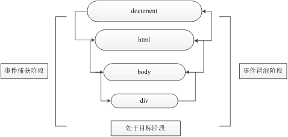

[HTML DOM 事件名称列表 - 菜鸟教程](https://www.runoob.com/jsref/dom-obj-event.html)


# 一、事件介绍

事件三要素

- 事件源：触发事件的元素。
- 事件类型：如 click 单击事件。
- 事件处理程序：事件触发后要执行的代码（函数形式），也称事件处理函数。

```html
<body>
  <button id="btn">单击</button>
  <script>
    // 第1步：获取事件源
    var btn = document.getElementById('btn'); 
    // 第2步：注册事件btn.onclick
    btn.onclick = function () {
      // 第3步：添加事件处理程序（采取函数赋值形式）
      alert('弹出');
    };
  </script>
</body>
```


# 二、注册 / 绑定事件

## 1. 传统方式

```html
<body>
  <button id="btn">单击</button>
  <script>
    var btn = document.getElementById('btn');
    btn.onclick = function () {
      alert('弹出');
    };
  </script>
</body>
```


## 2. 事件监听方式

```js
// 早期IE内核的浏览器
element.attachEvent(type, callback);

// 标准浏览器
element.addEventListener(type, callback, [capture]);
// 参数capture默认值为false，表示在冒泡阶段完成事件处理，将其设置为true时，表示在捕获阶段完成事件处理。
```

```html
<body>
  <button id="btn">单击</button>
  <script>
    var btn = document.getElementById('btn');
    btn.addEventListener('click', function () {
      alert('弹出');
    });
  </script>
</body>
```


# 三、删除事件

```js
element.onclick = null;               // 传统方式删除事件

element.detachEvent(type, callback);     // 早期版本IE浏览器

element.removeEventListener(type, callback); // 标准浏览器
```


# 四、事件对象

* [事件对象的使用 - 黑马](https://book.itheima.net/course/1258676978588860418/1277481554465005570/1277496188970475523)

事件处理函数中传递的参数e（参数名称只要符合变量定义的规则即可）表示的就是事件对象event。

通过“或”运算符实现不同浏览器间获取事件对象兼容的处理。若是标准浏览器，则可以直接通过e获取事件对象；否则若是早期版本的IE浏览器（IE 6~IE 8）则需要通过window.event才能获取事件对象。

```js
var event = window.event      // 早期IE内核浏览器

element.onclick = function (event) {}  // W3C内核浏览器
```

```html
<body>
  <button id="btn">获取event对象</button>
  <script>
    var btn = document.getElementById('btn');

    btn.onclick = function (e) {
      var event = e || window.event;  // 获取事件对象的兼容处理
      console.log(event);
    };
  </script>
</body>
```


# 五、事件对象的常见属性和方法

* [事件对象的常见属性和方法 - 黑马](https://book.itheima.net/course/1258676978588860418/1277481554465005570/1277496188962086913)

| **属性**            | **说明**                 | **浏览器**          |
| ------------------- | ------------------------ | ------------------- |
| e.target            | 返回触发事件的对象       | 标准浏览器          |
| e.srcElement        | 返回触发事件的对象       | 非标准IE 6~IE 8使用 |
| e.type              | 返回事件的类型           | 所有浏览器          |
| e.stopPropagation() | 阻止事件冒泡             | 标准浏览器          |
| e.cancelBubble      | 阻止事件冒泡             | 非标准IE 6~IE 8使用 |
| e.preventDefault()  | 阻止默认事件（默认行为） | 标准浏览器          |
| e.returnValue       | 阻止默认事件（默认行为） | 非标准IE 6~IE 8使用 |

## 1. 对比e.target和this的区别

在事件处理函数中，e.target返回的是触发事件的对象，而this返回的是绑定事件的对象。

简而言之，e.target 是哪个元素触发事件了，就返回哪个元素；而 this 是哪个元素绑定了这个事件，就返回哪个元素。

```html
<body>
  <button id="btn">获取event对象</button>

  <script>
    var btn = document.getElementById('btn');

    btn.onclick = function (e) {
      e = e || window.event;
      var target = e.target || e.srcElement;
      console.log(target);
    };
  </script>
</body>
```

值得一提的是，this 和 e.currentTarget 的值相同，但考虑到e.currentTarge有兼容性问题（IE 9以上支持），所以在实际开发中推荐使用this。


## 2. 阻止默认行为

在HTML中，有些元素标签拥有一些特殊的行为。例如，单击 `<a>` 标签后，会自动跳转到href属性指定的URL链接；单击表单的submit按钮后，会自动将表单数据提交到指定的服务器端页面处理。因此，我们把标签具有的这种行为称为默认行为。

```html
<body>
  <a href="http://www.baidu.com">百度</a>

  <script>
    var a = document.querySelector('a');
    a.addEventListener('click', function (e) {
      e.preventDefault();   // DOM标准写法，早期版本浏览器不支持
    });

    // 推荐使用传统的注册方式
    a.onclick = function (e) {
      e.preventDefault();  // 标准浏览器使用e.preventDefault()方法
        
      // or
      e.returnValue;     // 早期版本浏览器（IE 6~IE 8）使用returnValue属性
    };
  </script>
</body>
```

值得一提的是，针对于传统注册方式绑定事件，也可以使用return false来阻止默认事件。优点在于没有兼容性问题，缺点是return后面的代码不执行，而且只限于传统的注册方式。


## 3. 阻止事件冒泡

如果在开发中想要阻止事件冒泡，则可以利用事件对象调用stopPropagation()方法和设置cancelBubble属性，实现禁止所有浏览器的事件冒泡行为。

判断当前是否为早期版本的IE浏览器，如果是，则利用事件对象调用cancelBubble属性阻止事件冒泡；否则利用事件对象e调用stopPropagation()方法完成事件冒泡的阻止设置。

```html
<body>
  <a href="http://www.baidu.com">百度</a>

  <script>
    var a = document.querySelector('a');

    a.onclick = function (e) {
      if (window.event) { // 早期版本的浏览器
        window.event.cancelBubble = true;
      } else {  // 标准浏览器
        e.stopPropagation();
      }
    };
  </script>
</body>
```


## 4. 事件委托

事件委托的原理是，不给每个子节点单独设置事件监听器，而是把事件监听器设置在其父节点上，让其利用事件冒泡的原理影响到每个子节点。简而言之，就是不给子元素注册事件，给父元素注册事件，让处理代码在父元素的事件中执行。这样做的优点在于，只操作了一次DOM ，提高了程序的性能。

```html
<body>
  <ul>
    <li>我是第 1 个li</li>
    <li>我是第 2 个li</li>
    <li>我是第 3 个li</li>
    <li>我是第 4 个li</li>
    <li>我是第 5 个li</li>
  </ul>

  <script>
    var ul = document.querySelector('ul');
    ul.addEventListener('click', function (e) {
      e.target.style.backgroundColor = 'pink';
    });
  </script>
</body>
```


# 六、事件流

JavaScript 事件流（Event Flow）是指事件在 HTML DOM 中传播的顺序。事件流通常包括三个阶段：

1. **捕获阶段（Capturing Phase）**：事件从文档根节点逐层向下传播，直到目标元素。
2. **目标阶段（Target Phase）**：事件到达目标元素。
3. **冒泡阶段（Bubbling Phase）**：事件从目标元素逐层向上传播回根节点。

事件流的主要机制是**事件捕获**和**事件冒泡**：




## 1. '事件捕获' 和 '事件冒泡'

- **事件捕获**（Event Capturing）:
  - 捕获阶段的事件会从外层元素向内层元素传播。
  - 捕获阶段较少使用，但它允许在事件到达目标元素之前进行拦截。

- **事件冒泡**（Event Bubbling）:
  - 冒泡阶段的事件从目标元素向上传播回根节点。
  - 默认情况下，JavaScript 中的事件是冒泡的。


## 2. 指定事件处理阶段

在 JavaScript 中，`addEventListener` 方法可以指定事件处理程序是在捕获阶段还是冒泡阶段执行。

```js
/** 
 * useCapture	可选。布尔值，指定事件是否在捕获或冒泡阶段执行。
 *  	true - 事件句柄在捕获阶段执行
 *  	false- false- 默认。事件句柄在冒泡阶段执行
 */
element.addEventListener(event, function, useCapture)

// eg
element.addEventListener("click", function() {
  console.log("事件触发");
}, true);  // 使用 true 开启捕获阶段
```

其中 `true` 表示在捕获阶段执行，`false`（默认值）表示在冒泡阶段执行。


## 3. 事件流的应用场景 - 同五

- **事件委托**：通过事件冒泡机制，可以将子元素的事件委托给父元素处理。例如，在列表中动态添加元素时，使用事件委托来统一处理点击事件：

  ```javascript
  document.getElementById("list").addEventListener("click", function(event) {
    if (event.target.tagName === "LI") {
      console.log("列表项被点击：" + event.target.textContent);
    }
  });
  ```

- **阻止事件传播**：可以使用 `stopPropagation` 方法阻止事件在事件流中进一步传播。
  
  ```javascript
  element.addEventListener("click", function(event) {
    event.stopPropagation();  // 阻止事件传播
  });
  ```

- **阻止默认行为**：可以使用 `preventDefault` 方法来阻止事件的默认行为，例如阻止表单提交。


## 4. 总结

JavaScript 的事件流控制和管理使得事件处理变得灵活。事件捕获阶段适用于希望提前拦截事件的场景，而事件冒泡通常用于简化 DOM 中的事件管理。


# 七、JS事件有哪些

* [鼠标事件的常用方法 - 黑马](https://book.itheima.net/course/1258676978588860418/1277481554465005570/1277496257278910466)
* [键盘事件的常用方法 - 黑马](https://book.itheima.net/course/1258676978588860418/1277481554465005570/1277496309615435779)

JavaScript 事件是用户与网页进行交互时触发的操作。常见的 JavaScript 事件包括点击按钮、提交表单、加载页面等。这些事件可以帮助开发者在用户与网页交互时触发相应的功能。以下是一些常用的 JavaScript 事件：

## 1. 鼠标事件
- **click**: 用户点击元素时触发。
- **dblclick**: 用户双击元素时触发。
- **mouseover**: 用户将鼠标移到元素上时触发。
- **mouseout**: 用户将鼠标移出元素时触发。
- **mousedown**: 鼠标按下时触发。
- **mouseup**: 鼠标按键释放时触发。

## 2. 键盘事件
- **keydown**: 用户按下键盘按键时触发。
- **keyup**: 用户释放键盘按键时触发。
- **keypress**: 用户按下并释放按键时触发（仅字符键）。

## 3. 表单事件
- **submit**: 表单提交时触发。
- **change**: 输入字段（如文本框）内容改变时触发。
- **focus**: 元素获得焦点时触发。
- **blur**: 元素失去焦点时触发。

## 4. 窗口事件
- **load**: 页面加载完成时触发。
- **resize**: 窗口大小调整时触发。
- **scroll**: 用户滚动页面时触发。
- **unload**: 用户离开页面时触发。

## 5. 触摸事件（移动端常用）
- **touchstart**: 屏幕上触摸点触发。
- **touchmove**: 触摸点移动时触发。
- **touchend**: 触摸结束时触发。

## 6. 使用示例
可以通过 JavaScript 的 `addEventListener` 方法监听事件：

```javascript
document.getElementById("myButton").addEventListener("click", function() {
  alert("按钮被点击！");
});
```

这种方式能够将事件处理程序独立于 HTML，使代码更易维护。


