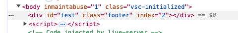
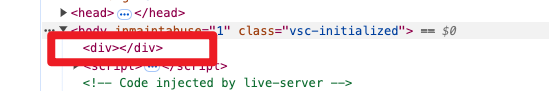
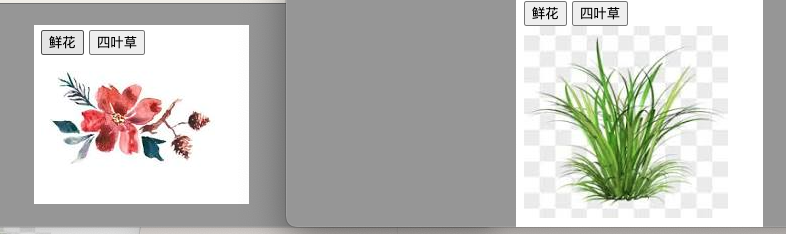

# 获取属性值

在DOM对象中可以使用 **“element.属性”** 的方式来获取 **内置的属性值**，但是DOM对象并不能直接使用点语法获取到 **自定义属性** 的值，那么如何获取自定义属性值呢？在DOM中，可以使用 `getAttribute('属性')` 方法来返回指定元素的属性值。

```html
<!DOCTYPE html>
<html lang="en">

<head>
  <meta charset="UTF-8">
  <meta name="viewport" content="width=device-width, initial-scale=1.0">
  <title>Document</title>
</head>

<body>
  <div id="demo" index="1" class="nav"></div>

  <script>
    var div = document.querySelector('div');
    console.log(div.id);  // 结果为：demo
    console.log(div.getAttribute('id'));  // 结果为：demo

    console.log(div.index); // undefine      
    console.log(div.getAttribute('index')); // 结果为：1
  </script>
</body>
</html>
```

以上两种方式都可以获取内置属性值，但是在实际运用中推荐使用 `“element.属性”` 这种较为简洁的方式。


# 设置属性值

在DOM对象中可以使用 **“element.属性= '值'”** 的方式来设置内置的属性值，并且针对于自定义属性，提供了 **“element.setAttribute('属性', '值')”** 的方式进行设置。值得一提的是，设置了自定义属性的标签，在浏览器中的HTML结构中可以看到该属性。

```html
<!DOCTYPE html>
<html lang="en">

<head>
  <meta charset="UTF-8">
  <meta name="viewport" content="width=device-width, initial-scale=1.0">
  <title>Document</title>
</head>

<body>

  <div></div>

  <script>
    var div = document.querySelector('div');
    div.id = 'test';
    div.className = 'footer';
    // or
    // div.setAttribute('class', 'footer');
    div.setAttribute('index', 2);
  </script>
</body>

</html>
```




# 移除属性

在DOM中使用 **“element.removeAttribute('属性')”** 的方式来移除元素属性。

```html
<!DOCTYPE html>
<html lang="en">

<head>
  <meta charset="UTF-8">
  <meta name="viewport" content="width=device-width, initial-scale=1.0">
  <title>Document</title>
</head>

<body>
  <div id="test" class="footer" index="2"></div>

  <script>
    var div = document.querySelector('div');
    div.removeAttribute('id');
    div.removeAttribute('class');
    div.removeAttribute('index');
  </script>
</body>
</html>
```




# 二、操作元素属性（单独文档）

* [操作元素属性 - 黑马](https://book.itheima.net/course/1258676978588860418/1277481554465005570/1277491444889690113)

在DOM中，HTML属性操作是指使用JavaScript来操作一个元素的HTML属性。一个元素包含很多的属性，例如，对于一个img图片元素来说，我们可以操作它的src、title属性等；或者对于input元素来说，我们可以操作它的disabled、checked、selected属性等。接下来以案例的形式讲解如何操作常用元素属性及表单元素属性。

## **1. img元素的属性操作**

```js
<!DOCTYPE html>
<html lang="en">

<head>
  <meta charset="UTF-8">
  <meta name="viewport" content="width=device-width, initial-scale=1.0">
  <title>Document</title>
</head>

<body>
  <button id="flower">鲜花</button>
  <button id="grass">四叶草</button> <br>
  

  <script>
    // 1. 获取元素
    var flower = document.getElementById('flower');
    var grass = document.getElementById('grass');
    var img = document.querySelector('img');

    // 2. 注册事件处理程序
    flower.onclick = function () {
      img.src = 'images/flower.jpeg';
      img.title = '鲜花';
    };

    grass.onclick = function () {
      img.src = 'images/grass.jpeg';
      img.title = '四叶草';
    };
  </script>
</body>
</html>
```




## 2. 表单input元素的属性操作

这里我们以单击按钮操作input表单属性为例进行代码演示，示例代码如下。

```html
<!DOCTYPE html>
<html lang="en">

<head>
  <meta charset="UTF-8">
  <meta name="viewport" content="width=device-width, initial-scale=1.0">
  <title>Document</title>
</head>

<body>
  <button>按钮</button>
  <input type="text" value="输入内容">

  <script>
    // 1. 获取元素
    var btn = document.querySelector('button');
    var input = document.querySelector('input');

    // 2. 注册事件处理程序
    btn.onclick = function () {
      input.value = '被点击了！'; // 通过value来修改表单里面的值
      this.disabled = true;   // this指向的是事件函数的调用者 btn
    };
  </script>
</body>
</html>
```


