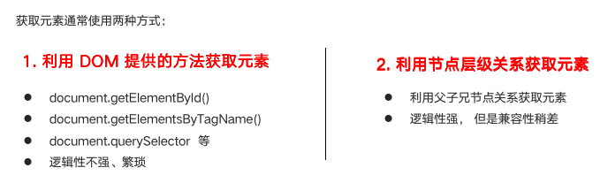
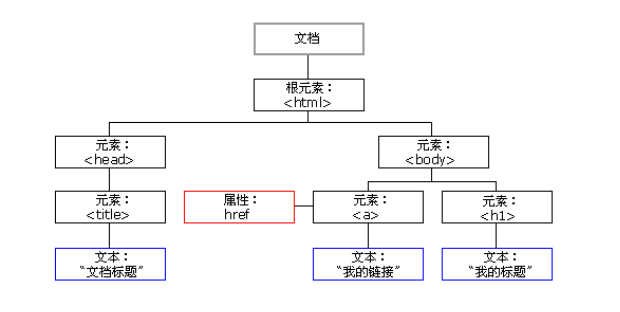

# 一、节点介绍

<font color='red' size=5>获取元素通用有两种方式，Element在单独文档《JavaScript操作HTML》</font>




## 1. 节点概述

一般地，节点至少拥有 `nodeType`（节点类型）、`nodeName`（节点名称）和 `nodeValue`（节点值）这三个基本属性。

* 元素节点  `nodeType`  为 1
* 属性节点  `nodeType`  为 2
* 文本节点  `nodeType`  为 3 （文本节点包含文字、空格、换行等）

我们在实际开发中，节点操作主要操作的是 **元素节点**。开发者可以根据nodeType的值来判断是否为元素节点。


## 2. 节点层级



- 根节点：`<html>` 标签是整个文档的根节点，有且仅有一个。
- 父节点：指的是某一个节点的上级节点，例如，`<html> `元素则是 `<head>` 和 `<body>` 的父节点。
- 子节点：指的是某一个节点的下级节点，例如，`<head> ` 和 `<body>` 节点是 `<html>` 节点的子节点。
- 兄弟节点：两个节点同属于一个父节点，例如，`<head> ` 和 `<body> ` 互为兄弟节点。


### a. 根节点

根节点：`<html>` 标签是整个文档的根节点，有且仅有一个。

```
	document.documentElement;
```


### a. 获取父级节点

* `parentNode` 属性可返回某节点的父节点，注意是最近的一个父节点
* 如果指定的节点没有父节点则返回 null 

```js
    // 获取父节点
    var child = document.querySelector('.box');
    console.log(child.parentNode);
```


### b. 获取子级节点

* `childNodes`
* `children`
* `firstChild`
* `lastChild`
* `firstElementChild`
* `lastElementChild`


### c. 获取兄弟节点

* `previousSibling`
* `nextSibling`
* `previousElementSibling`
* `nextElementSibling`


# 二、创建、添加、删除、拷贝节点

<font color='red' size=5>具体查看《JavaScript操作HTML》元素的相关操作！！！</font>


# 二、Node vs Element

* [DOM 精通了？请问 Node 和 Element 有何区别？](https://juejin.cn/post/7066778860024496165)

```html
<div id="parent">
    This is parent content.
    <div id="child1">This is child1.</div>
    <div id="child2">This is child2.</div>
</div>
```

