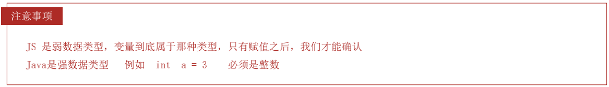

# JavaScript数据类型

JavaScript 有七种基本数据类型，分别是：

1. **Undefined**：变量未被赋值时的默认值；表示一个未定义的值。
2. **Null**：表示“无”或“空值”的特殊类型；
3. **Boolean**：只有两个值：`true` 和 `false`。
4. **Number**：表示数字，包括整数和浮点数。
5. **BigInt**：表示任意精度的整数，用于表示比 `Number` 更大的整数，ES6 新增。
6. **String**：表示文本数据，用单引号或双引号表示。
7. **Symbol**：表示唯一的、独一无二的值、不可变的值，常用于对象属性的键，ES6 新增。

**引用数据类型（对象类型）**：

1. **Object**：对象
2. **Array**：数组
3. **Function**：函数
4. **RegExp**：正则
5. **Date**：日期


## JS是弱数据类型




# 一、Number

* 在JS中所有的数值都是Number类型，包括 **整数** 和 **浮点数**（小数）

* JS中可以表示的数字的最大值、最小值
    * 最大值：Number.MAX_VALUE
        * 1.7976931348623157e+308
    * 大于0的最小值：Number.MIN_VALUE
        * 5e-324

* 如果使用Number表示的数字超过了最大值，则会返回一个

    * Infinity表示：正无穷

    * -Infinity表示：负无穷
    * 使用 `typeof` 检查 `Infinity` 也会返回number
* `NaN` 是一个特殊的数字，表示：Not A Number
    * 使用`typeof` 检查一个 `NaN` 也会返回number


## 1. Infinity

```js
// 两个很大的数相乘
a = -Number.MAX_VALUE * Number.MAX_VALUE;
console.log(a);

// -Infinity
```


## 2. NaN

* `NaN` 是一个特殊的数字，表示：Not A Number

* 使用`typeof` 检查一个 `NaN` 也会返回number

```js
// 两个字符串相乘
console.log("abc" * "bcd");	 // NaN
console.log('pink老师' - 2);  // NaN
console.log(NaN - 2);	// NaN
console.log(NaN + 2);	// NaN
console.log(NaN / 2);	// NaN
console.log(NaN === NaN);	// false
```


## 3. 浮点运算不精确

```js
/*
 * 如果使用JS进行浮点运算，可能得到一个不精确的结果
 * 所以千万不要使用JS进行对精确度要求比较高的运算	
 */
var c = 0.1 + 0.2;
console.log(c);

// 0.30000000000000004
```


## 4. 二、八、十六进制的数字

```js
/*
 * 在js中，如果需要表示16进制的数字，则需要以0x开头
 * 			  如果需要表示8进制的数字，则需要以0开头
 * 			  如果要要表示2进制的数字，则需要以0b开头
 * 				但是不是所有的浏览器都支持
 */

//十六进制
a = 0x10;  	// number 16
a = 0xff;		// number 255
a = 0xCafe;	// number 51966

//八进制数字
a = 070;	// number 56

//二进制数字
a = 0b10;	// number 2

//向"070"这种字符串，有些浏览器会当成8进制解析，有些会当成10进制解析
a = "070";

//可以在parseInt()中传递一个第二个参数，来指定数字的进制
a = "0101";
a = parseInt(a, 2); // 2
a = parseInt(a, 8); // 65
a = parseInt(a, 10); // 101
a = parseInt(a, 16); // 257

console.log(typeof a);
console.log(a);
```


# 二、字符串 String

## 1. 转义字符

```js
/*
  在字符串中我们可以使用\作为转义字符，
    当表示一些特殊符号时可以使用\进行转义

    \" 表示 "
    \' 表示 '
    \n 表示换行
    \t 制表符
    \\ 表示\
*/
str = "我说:\"今天\t天气真不错！\"";  
str = "\\\\\\"; 

// 我说:"今天	天气真不错！"
// \\\
```


## 2. 模板字符串

```js
// 模板字符串 外面用`` 里面 ${变量名}
let age = 20
document.write(`我今年${age}岁了`)
```


## 3. 字符串方法

```js
//创建一个字符串
var str = "Hello Atguigu";

/*
 * 在底层字符串是以字符数组的形式保存的
 * ["H","e","l"]
 */
```

### a. length属性

```js
/*
 * length属性
 * 	- 可以用来获取字符串的长度
 */
console.log(str.length);
```

### b. charAt()

```js
/*
 * charAt()
 * 	- 可以返回字符串中指定位置的字符
 * 	- 根据索引获取指定的字符	
 */
str = "中Hello Atguigu";
var result = str.charAt(6);
```

### c. charCodeAt()

```js
/*
 * charCodeAt()
 * 	- 获取指定位置字符的字符编码（Unicode编码）
 */
result = str.charCodeAt(0);
```

### d. formCharCode

```js
/*
 * String.formCharCode()
 * 	- 可以根据字符编码去获取字符
 */
result = String.fromCharCode(0x2692);
```

### e. concat()

```js
/*
 * concat()
 * 	- 可以用来连接两个或多个字符串
 * 	- 作用和+一样
 */
result = str.concat("你好","再见");
```

### f. indexof() & lastIndexOf()

```js
/*
 * indexof()
 * 	- 该方法可以检索一个字符串中是否含有指定内容
 * 	- 如果字符串中含有该内容，则会返回其第一次出现的索引
 * 		如果没有找到指定的内容，则返回-1
 * 	- 可以指定一个第二个参数，指定开始查找的位置
 * 
 * lastIndexOf();
 * 	- 该方法的用法和indexOf()一样，
 * 		不同的是indexOf是从前往后找，
 * 		而lastIndexOf是从后往前找
 * 	- 也可以指定开始查找的位置
 */
str = "hello hatguigu";
result = str.indexOf("h",1);
result = str.lastIndexOf("h",5);
```

### g. slice()

```js
/*
 * slice()
 * 	- 可以从字符串中截取指定的内容
 * 	- 不会影响原字符串，而是将截取到内容返回
 * 	- 参数：
 * 		第一个，开始位置的索引（包括开始位置）
 * 		第二个，结束位置的索引（不包括结束位置）
 * 			- 如果省略第二个参数，则会截取到后边所有的
 * 		- 也可以传递一个负数作为参数，负数的话将会从后边计算
 */
str = "abcdefghijk";
result = str.slice(1,4);
result = str.slice(1,-1);
```

### h. substring()

```js
/*
 * substring()
 * 	- 可以用来截取一个字符串，可以slice()类似
 * 	- 参数：
 * 		- 第一个：开始截取位置的索引（包括开始位置）
 * 		- 第二个：结束位置的索引（不包括结束位置）
 * 		- 不同的是这个方法不能接受负值作为参数，
 * 			如果传递了一个负值，则默认使用0
 * 		- 而且他还自动调整参数的位置，如果第二个参数小于第一个，则自动交换
 */
result = str.substring(0,1);
```

### i. substr()

```js
/*
 * substr()
 * 	- 用来截取字符串
 * 	- 参数：
 * 		1.截取开始位置的索引
 * 		2.截取的长度
 */
str = "abcdefg";
result = str.substr(3,2);
```

### j. split()

```js
/*
 * split()
 * 	- 可以将一个字符串拆分为一个数组
 * 	- 参数：
 * 		-需要一个字符串作为参数，将会根据该字符串去拆分数组
 */
str = "abcbcdefghij";
result = str.split("d");

/*
 * 如果传递一个空串作为参数，则会将每个字符都拆分为数组中的一个元素
 */
result = str.split("");
```

### k. toUpperCase()

```js
/*
 * toUpperCase()
 * 	- 将一个字符串转换为大写并返回
 */
result = str.toUpperCase();
```

### l. toLowerCase()

```js
/*
 * toLowerCase()
 * 	-将一个字符串转换为小写并返回
 */
result = str.toLowerCase();
```


# 三、布尔值 - Boolean

```js
/*
 * Boolean 布尔值
 * 	布尔值只有两个，主要用来做逻辑判断
 * 	true
 * 		- 表示真
 * 	false
 * 		- 表示假
 * 
 * 使用typeof检查一个布尔值时，会返回boolean
 */
var bool = false;			
console.log(typeof bool);
console.log(bool);

// boolean
// false
```


# 四、空值 - Null

Javaseript 中的nul1 仅仅是一个代表“无”、“空”或“值未知”的特殊值。

**null工作中的使用场景：**

* 官方解释：把nul1 作为尚未创建的对象。
* 大白话：将来有个变量里面存放的是一个对象，但是对象还没创建好，可以先给个null。

```js
/*
 * Null（空值）类型的值只有一个，就是null
 * null这个值专门用来表示一个为空的对象
 * 使用typeof检查一个null值时，会返回object
 */
var a = null;
console.log(typeof a);

// object
```


# 五、未定义 - Undefine

只声明变量，不赋值的情况下，变量的默认值为 undefined，一般很少【直接】为某个变量赋值为 undefined.

**Undefine工作中的使用场景：**

* 我们开发中经常声明一个变量，等待传送过来的数据。
* 如果我们不知道这个数据是否传递过来，此时我们可以通过检测这个变量是不是undefined，就判断用户是否有数据传递过来。

```js
/*
 * Undefined（未定义）类型的值只有一个，就undefind
 * 	当声明一个变量，但是并不给变量赋值时，它的值就是undefined
 * 	使用typeof检查一个undefined时也会返回undefined
 */
var b = undefined;
console.log(typeof b);

// undefined
```


## 1. null 和 undefined 区别（单独文档⭐️）

详细文档：《JS中undefined与null》

- undefined 表示没有赋值
- null 表示赋值了，但是内容为空

* undefined值实际上是由null值衍生出来的，所以如果比较undefined和null是否相等，会返回true；

```js
console.log(null == undefined);  // true
console.log(null === undefined); // false
```


## 


