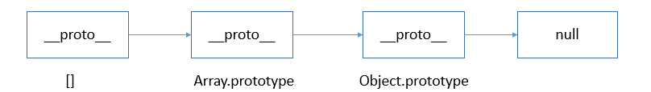

* [typeof - MDN](https://developer.mozilla.org/zh-CN/docs/Web/JavaScript/Reference/Operators/typeof)
    * [typeof null](https://developer.mozilla.org/zh-CN/docs/Web/JavaScript/Reference/Operators/typeof#typeof_null)
* [判断JS数据类型的四种方法 ](https://www.cnblogs.com/onepixel/p/5126046.html)


# 一、JavaScript类型判断

## 1. typeof

typeof 是一个操作符，其右侧跟一个一元表达式，并返回这个表达式的数据类型。返回的结果用该类型的字符串(全小写字母)形式表示，包括以下 7 种：`number、boolean、symbol、string、object、undefined、function` 。

- `typeof` 用于检查一个变量的数据类型，返回一个表示变量类型的字符串。

- `typeof` 返回的结果包括：`"undefined"、"boolean"、"number"、"string"、"object"、"function" 和 "symbol"`。

    | 类型                                                         | 结果                                                         |
    | :----------------------------------------------------------- | :----------------------------------------------------------- |
    | [Undefined](https://developer.mozilla.org/zh-CN/docs/Glossary/Undefined) | `"undefined"`                                                |
    | [Null](https://developer.mozilla.org/zh-CN/docs/Glossary/Null) | `"object"`（[原因](https://developer.mozilla.org/zh-CN/docs/Web/JavaScript/Reference/Operators/typeof#typeof_null)） |
    | [Boolean](https://developer.mozilla.org/zh-CN/docs/Glossary/Boolean) | `"boolean"`                                                  |
    | [Number](https://developer.mozilla.org/zh-CN/docs/Glossary/Number) | `"number"`                                                   |
    | [BigInt](https://developer.mozilla.org/zh-CN/docs/Glossary/BigInt) | `"bigint"`                                                   |
    | [String](https://developer.mozilla.org/zh-CN/docs/Glossary/String) | `"string"`                                                   |
    | [Symbol](https://developer.mozilla.org/zh-CN/docs/Web/JavaScript/Reference/Global_Objects/Symbol) | `"symbol"`                                                   |
    | [Function](https://developer.mozilla.org/zh-CN/docs/Glossary/Function)（在 ECMA-262 中实现 [[Call]]；[classes](https://developer.mozilla.org/zh-CN/docs/Web/JavaScript/Reference/Statements/class)也是函数) | `"function"`                                                 |
    | 其他任何对象                                                 | `"object"`                                                   |

- 例如：

    ```js
    typeof 42; // "number"
    typeof Infinity  	// number
    typeof NaN  		// number
    
    typeof "Hello"; // "string"
    typeof true; // "boolean"
    typeof undefined; // "undefined"
    
    typeof null; // "object"
    
    typeof [] ; // "object"
    typeof {}; // "object"
    typeof function(){}; // "function"
    typeof new Function(); // "function"
    typeof new Date(); // "object"
    typeof new RegExp(); // "object"
    typeof Symbol(); // "symbol"
    ```

有些时候，typeof 操作符会返回一些令人迷惑但技术上却正确的值：

- 对于基本类型，除 null 以外，均可以返回正确的结果。
- 对于引用类型，除 function 以外，一律返回 object 类型。
- 对于 null ，返回 object 类型。
- 对于 function 返回  function 类型。

其中，null 有属于自己的数据类型 Null ， 引用类型中的 数组、日期、正则 也都有属于自己的具体类型，而 typeof 对于这些类型的处理，只返回了处于其原型链最顶端的 Object 类型，没有错，但不是我们想要的结果。


### a. `typeof null`

[typeof null - MDN](https://developer.mozilla.org/zh-CN/docs/Web/JavaScript/Reference/Operators/typeof#typeof_null)

```javascript
// JavaScript 诞生以来便如此
typeof null === "object";
```

在 JavaScript 最初的实现中，JavaScript 中的值是由一个表示类型的标签和实际数据值表示的。对象的类型标签是 0。由于 `null` 代表的是空指针（大多数平台下值为 0x00），因此，null 的类型标签是 0，`typeof null` 也因此返回 `"object"`。（[参考来源](https://www.2ality.com/2013/10/typeof-null.html)）

曾有一个 ECMAScript 的修复提案（通过选择性加入的方式），但[被拒绝了](http://wiki.ecmascript.org/doku.php?id=harmony:typeof_null)。该提案会导致 `typeof null === 'null'`。


## 2. instanceof

instanceof 是用来判断 A 是否为 B 的实例，表达式为：A instanceof B，如果 A 是 B 的实例，则返回 true,否则返回 false。 在这里需要特别注意的是：**instanceof 检测的是原型**，我们用一段伪代码来模拟其内部执行过程：

```js
instanceof (A,B) = {
    var L = A.__proto__;
    var R = B.prototype;
    if(L === R) {
        // A的内部属性 __proto__ 指向 B 的原型对象
        return true;
    }
    return false;
}
```

从上述过程可以看出，当 A 的 __proto__ 指向 B 的 prototype 时，就认为 A 就是 B 的实例。

再来看几个例子：

```js
console.log([] instanceof Array); // true
console.log({} instanceof Object); // true
console.log(new Date() instanceof Date); // true

function Person() {}
console.log(new Person() instanceof Person); // true

console.log([] instanceof Object); // true
console.log(new Date() instanceof Object); // true
console.log(new Person instanceof Object); // true
```

我们发现，虽然 instanceof 能够判断出 [ ] 是Array的实例，但它认为 [ ] 也是Object的实例，为什么呢？

因此，**instanceof 只能用来判断两个对象是否属于实例关系**， 而不能判断一个对象实例具体属于哪种类型。


### a. 深入分析 [ ]、Array、Object 三者之间的关系

我们来分析一下 [ ]、Array、Object 三者之间的关系：

从 `instanceof` 能够判断出 `[ ].__proto__`  指向 `Array.prototype`，而 `Array.prototype.__proto__` 又指向了 `Object.prototype`，最终 `Object.prototype.__proto__` 指向了`null`，标志着原型链的结束。因此，[]、Array、Object 就在内部形成了一条原型链：



从原型链可以看出，`[]` 的 `__proto__`  直接指向 `Array.prototype`，间接指向 `Object.prototype`，所以按照 instanceof 的判断规则，[] 就是Object的实例。依次类推，类似的 new Date()、new Person() 也会形成一条对应的原型链 。因此，**instanceof 只能用来判断两个对象是否属于实例关系， 而不能判断一个对象实例具体属于哪种类型。**

instanceof 操作符的问题在于，它假定只有一个全局执行环境。如果网页中包含多个框架，那实际上就存在两个以上不同的全局执行环境，从而存在两个以上不同版本的构造函数。如果你从一个框架向另一个框架传入一个数组，那么传入的数组与在第二个框架中原生创建的数组分别具有各自不同的构造函数。

```javascript
var iframe = document.createElement('iframe');
document.body.appendChild(iframe);
xArray = window.frames[0].Array;
var arr = new xArray(1,2,3);
// [1,2,3]``arr instanceof Array; // false
```

针对数组的这个问题，ES5 提供了 Array.isArray() 方法 。该方法用以确认某个对象本身是否为 Array 类型，而不区分该对象在哪个环境中创建。

```javascript
if (Array.isArray(value)) {  
		// 对数组执行某些操作
}
```

Array.isArray() 本质上检测的是对象的 [[Class]] 值，[[Class]] 是对象的一个内部属性，里面包含了对象的类型信息，其格式为 [object Xxx] ，Xxx 就是对应的具体类型 。对于数组而言，[[Class]] 的值就是 [object Array] 。


## 3. `Object.prototype.toString.call()`

toString() 是 Object 的原型方法，调用该方法，默认返回当前对象的 [[Class]] 。这是一个内部属性，其格式为 [object Xxx] ，其中 Xxx 就是对象的类型。

对于 Object 对象，直接调用 toString() 就能返回 [object Object] 。而对于其他对象，则需要通过 call / apply 来调用才能返回正确的类型信息。

```js
Object.prototype.toString.call('') ;	// [object String]
Object.prototype.toString.call(1);	// [object Number]
Object.prototype.toString.call(true) ; // [object Boolean]
Object.prototype.toString.call(Symbol()); //[object Symbol]
Object.prototype.toString.call(undefined) ; // [object Undefined]
Object.prototype.toString.call(null) ; // [object Null]
Object.prototype.toString.call(new Function()) ; // [object Function]
Object.prototype.toString.call(new Date()) ; // [object Date]
Object.prototype.toString.call([]) ; // [object Array]
Object.prototype.toString.call(new RegExp()) ; // [object RegExp]
Object.prototype.toString.call(new Error()) ; // [object Error]
Object.prototype.toString.call(document) ; // [object HTMLDocument]
Object.prototype.toString.call(window) ; // [object global] window 是全局对象 global 的引用
```


## 4. constructor

当一个函数 F被定义时，JS引擎会为F添加 prototype 原型，然后再在 prototype上添加一个 constructor 属性，并让其指向 F 的引用。如下所示：


当执行 var f = new F() 时，F 被当成了构造函数，f 是F的实例对象，此时 F 原型上的 constructor 传递到了 f 上，因此 f.constructor == F


可以看出，F 利用原型对象上的 constructor 引用了自身，当 F 作为构造函数来创建对象时，原型上的 constructor 就被遗传到了新创建的对象上， 从原型链角度讲，构造函数 F 就是新对象的类型。这样做的意义是，让新对象在诞生以后，就具有可追溯的数据类型。

同样，JavaScript 中的内置对象在内部构建时也是这样做的：


**细节问题：**

> 1. null 和 undefined 是无效的对象，因此是不会有 constructor 存在的，这两种类型的数据需要通过其他方式来判断。
> 2. 函数的 constructor 是不稳定的，这个主要体现在自定义对象上，当开发者重写 prototype 后，原有的 constructor 引用会丢失，constructor 会默认为 Object


为什么变成了 Object？

因为 prototype 被重新赋值的是一个 { }， { } 是 new Object() 的字面量，因此 new Object() 会将 Object 原型上的 constructor 传递给 { }，也就是 Object 本身。

因此，为了规范开发，在重写对象原型时一般都需要重新给 constructor 赋值，以保证对象实例的类型不被篡改。


## 5. `Array.isArray()`

专门用于判断是否为数组。

```js
console.log(Array.isArray([])); // true
```


# 二、如何判断 null 与 undefined

## 1. 如何判断 null

在 JavaScript 中，可以通过以下几种方法判断一个值是否为 `null`：

### a. **严格相等 (`===`)** ⭐️：

```javascript
const value = null;
console.log(value === null); // true
```

### b. **`typeof` 运算符**：

- 注意：`typeof null` 返回 `"object"`，这可能导致误解。
```javascript
const value = null;
console.log(typeof value === "object" && value === null); // true
```

### c. **直接比较**：

- 直接使用 `==` 比较，但不推荐，因为它会进行类型转换。
```javascript
const value = null;
console.log(value == null); // true
```

### d. **`Object.is()`**：

- 该方法可以精确判断是否为 `null`。
```javascript
const value = null;
console.log(Object.is(value, null)); // true
```

### e. `??` （看下一章节）


<font color='red' size=6>总结：推荐使用严格相等 (`===`) 来判断 `null`，以避免潜在的类型转换问题。</font>


## 2. 如何判断 undefined

在 JavaScript 中，可以通过以下几种方法判断一个值是否为 `undefined`：

### a. **严格相等 (`===`)**⭐️：

```javascript
const value = undefined;
console.log(value === undefined); // true
```

### b. **`typeof` 运算符**：

- `typeof` 对 `undefined` 返回 `"undefined"`。
```javascript
const value = undefined;
console.log(typeof value === "undefined"); // true
```

### c. **直接比较**：

- 使用 `==` 比较，但不推荐，因为它会进行类型转换。
```javascript
const value = undefined;
console.log(value == undefined); // true
```

### d. **检查变量是否声明**：

- 如果尝试访问一个未声明的变量，会抛出错误，可以用 `try...catch` 来捕获。
```javascript
let value;
try {
    console.log(variableThatIsNotDeclared); // ReferenceError
} catch (e) {
    console.log(e instanceof ReferenceError); // true
}
```

### e. `??` （看下一章节）

 

<font color='red' size=5>总结：推荐使用严格相等 (`===`) 或 `typeof` 来判断 `undefined`，</font>


# 三、 `||` 与 `??`

在 JavaScript 中，`||` 和 `??` 都是用于逻辑运算的运算符，但它们的行为不同：

## 1. `||`（逻辑或）

- `||` 运算符会返回第一个真值，如果所有操作数都是假值，则返回最后一个操作数。
- 假值包括：`false`、`0`、`""`（空字符串）、`null`、`undefined` 和 `NaN`。

**示例**：
```javascript
const value1 = 0;
const value2 = "Hello";

console.log(value1 || value2); // "Hello"
```


## 2. `??`（空值合并运算符）

- `??` 运算符只返回第一个非 `null` 或 `undefined` 的值。它不会考虑其他假值，如 `0` 或 `""`。

**示例**：
```javascript
const value1 = null;
const value2 = "Hello";

console.log(value1 ?? value2); // "Hello"
```


## 3. 示例

```js
// ??
console.log(undefined ?? 2);  // 2
console.log(null ?? 2);  // 2
console.log(0 ?? 2);  // 0
console.log("" ?? 2);  // ''
console.log(true ?? 2);  // true
console.log(false ?? 2);  // false

// ||
console.log(undefined || 2);  // 2
console.log(null || 2);  // 2
console.log(0 || 2);  // 2
console.log("" || 2);  // 2
console.log(true || 2);  // true
console.log(false || 2);  // 2
```


## 4. 区别总结

- 使用 `||` 时，所有假值都会被认为是“无效”的。
- 使用 `??` 时，仅 `null` 和 `undefined` 会被视为“无效”。

在选择使用时，可以根据你的需求来决定使用哪个运算符。如果你需要更多信息或示例，请随时告诉我！


# 四、判断一个对象中是否含有指定的属性

在 JavaScript 中，可以使用 `hasOwnProperty()` 方法或 `in` 操作符来检查一个对象中是否包含指定的属性。

## 1. hasOwnProperty()

1. 使用 `hasOwnProperty()` 方法：

    - `hasOwnProperty()` 方法用于检查对象自身是否包含指定属性，**不会检查原型链上的属性**。

    - 语法：`object.hasOwnProperty(property)`

    - 示例：

        ```javascript
        const person = {
          name: 'Alice',
          age: 30
        };
        
        console.log(person.hasOwnProperty('name')); // true
        console.log(person.hasOwnProperty('gender')); // false
        ```


## 2. in 操作符

1. 使用 `in` 操作符：

    - `in` 操作符用于检查对象及其**原型链**上是否包含指定属性。

    - 语法：`property in object`

    - 示例：

        ```javascript
        const person = {
          name: 'Alice',
          age: 30
        };
        
        console.log('name' in person); // true
        console.log('gender' in person); // false
        ```

通过使用 `hasOwnProperty()` 方法或 `in` 操作符，可以方便地检查一个对象中是否包含指定的属性。根据需要选择合适的方法来进行属性检查。


## 3. **`Object.keys()` 和 `includes()`**：

获取对象的所有属性并检查。

```js
const obj = { name: "Alice" };
console.log(Object.keys(obj).includes("name")); // true
```


