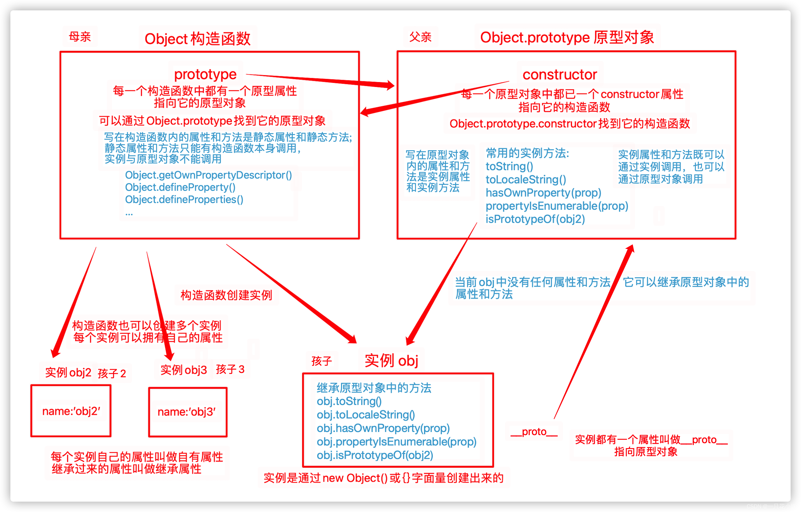

* https://www.cnblogs.com/nangezi/p/10182752.html
* https://www.cnblogs.com/padding1015/p/prototype-chain.html

* https://github.com/mqyqingfeng/Blog/blob/master/articles/%E6%B7%B1%E5%85%A5%E7%B3%BB%E5%88%97%E6%96%87%E7%AB%A0/JavaScript%E6%B7%B1%E5%85%A5%E4%B9%8B%E4%BB%8E%E5%8E%9F%E5%9E%8B%E5%88%B0%E5%8E%9F%E5%9E%8B%E9%93%BE.md

> **每个构造函数都有一个原型对象，原型对象都包含一个指向构造函数的指针，实例都包含一个指向原型对象的内部指针。** ----《JavaScript高级程序设计》

其实其中想告诉我们的就是，每一个构造函数中都有一个指针（prototype）指向它的原型对象，每一个原型对象中都有一个指针（constructor）指向它的构造函数，每一个实例对象中都有一个指针（__protot__）指向它的原型对象。

从图中可以清晰地得知：

1. 在构造函数Object中有一个prototype指针，它指向了它的原型对象 Object.prototype,写在构造函数中的是静态属性和静态方法，只能由构造函数本身调用。

2. 在原型对象Object.prototype中，有一个指针constructor指向它的构造函数Object，写在原型对象中的是实例属性和[实例方法](https://so.csdn.net/so/search?q=实例方法&spm=1001.2101.3001.7020)，它可以通过原型对象本身调用或者通过实例对象调用。

3. 在实例对象中，有一个__proto__指针，指向它的原型对象Object.prototype,实例对象可以调用继承自原型对象的实例属性和实例方法。

