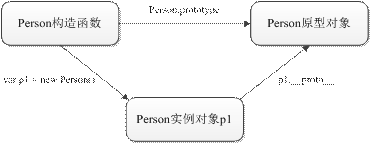
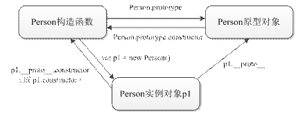
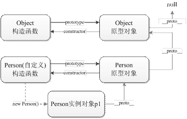

* [原型对象 - 黑马](https://book.itheima.net/course/1258676978588860418/1277481554465005570/1277497920576299011)


# 一、原型对象

在JavaScript中，每个构造函数都有一个原型对象存在，这个原型对象通过构造函数的prototype属性来访问，示例代码如下。

```javascript
function Person() {}          // 定义函数

console.log(Person.prototype);     // 输出结果：{constructor: ƒ}

console.log(typeof Person.prototype);  // 输出结果：object
```

在上述代码中，Person函数的prototype属性指向的对象就是Person的原型对象。

利用原型对象，可以实现为所有的实例对象共享实例方法，我们可以将实例方法定义在原型对象中，然后所有的实例方法就都可以访问原型对象的方法了。因此，原型对象其实就是所有实例对象的原型。下面我们通过代码演示原型对象的使用。

```javascript
function Person(uname) {
	this.uname = uname;
}

Person.prototype.sayHello = function() {
	console.log('你好，我叫' + this.uname);
};

var p1 = new Person('张三');
var p2 = new Person('李四');

console.log(p1.sayHello === p2.sayHello);  // 输出结果：true

p1.sayHello();   // 输出结果：你好，我叫张三
p2.sayHello();   // 输出结果：你好，我叫李四
```

从上述代码可以看出，实例对象p1和p2原本没有sayHello()方法，但是在为原型对象添加了sayHello()方法以后，p1和p2就都拥有了sayHello()方法，并且是同一个方法。在原型对象的方法中，this表示的是调用此方法的实例对象。


# 二、访问对象的原型对象

在JavaScript中，每个对象都有一个**proto**属性，这个属性指向了对象的原型对象。在前面的学习中我们知道，如果知道了一个对象的构造函数，可以用构造函数的prototype属性访问原型对象。但如果不知道对象的构造函数，则可以用**proto**属性直接访问原型对象。示例代码如下。

```javascript
function Person() {}

var p1 = new Person();

console.log(p1.__proto__ === Person.prototype); // 输出结果：true
```

从上述代码可以看出，实例对象的**proto**属性指向的原型对象和构造函数的prototype属性指向的原型对象是同一个对象。图1演示了实例对象和原型对象的关系。



图1 实例对象和原型对象

需要注意的是，**proto**是一个非标准的属性，是浏览器为了方便用户查看对象的原型而提供的，在实际开发中不推荐使用这个属性。


# 三、访问对象的构造函数

在原型对象里面有一个constructor属性，该属性指向了构造函数。由于实例对象可以访问原型对象的属性和方法，所以通过实例对象的constructor属性就可以访问实例对象的构造函数。下面通过代码进行演示。

```javascript
function Person() {}

// 通过原型对象访问构造函数
console.log(Person.prototype.constructor === Person);  // 输出结果：true

// 通过实例对象访问构造函数
var p1 = new Person();

console.log(p1.constructor === Person);       // 输出结果：true
```

需要注意的是，如果将构造函数的原型对象修改为另一个不同的对象，就无法使用constructor属性访问原来的构造函数了，示例代码如下。

```javascript
function Person() {}

// 修改原型对象为一个新的对象
Person.prototype = {
	sayHello: function() {
		console.log('hello');
	}
};

var p1 = new Person();

// 使用实例对象p1可以访问新的原型对象中的属性
p1.sayHello();         // 输出结果：hello

// 使用constructor属性无法访问原来的构造函数
console.log(p1.constructor);  // 输出结果：Object() { [native code] }
```

从上述代码可以看出，p1.constructor的访问结果是Object构造函数，而不是p1原本的构造函数Person。之所以会出现这个效果，是因为第3行为Person.prototype赋值了一个新的字面量对象，这个字面量对象的constructor属性指向的就是Object构造函数，所以p1使用constructor属性访问到的就是Object构造函数了。

为了能在修改了原型对象的情况下仍然能通过constructor属性访问正确的构造函数，我们可以在新的原型对象中将constructor属性指向Person构造函数。示例代码如下。

```javascript
function Person() {}

Person.prototype = {
	constructor: Person, // 手动指向Person构造函数
	sayHello: function() {
		console.log('hello');
	}
};

var p1 = new Person();
console.log(p1.constructor === Person); // 输出结果：true
```

在上述代码中，由于新的原型对象也是一个对象，这个对象原来的constructor属性指向Object构造函数，所以原来的constructor属性其实是Object.prototype原型对象的属性。第3行将constructor属性指向Person构造函数以后，当通过实例对象访问这个属性时，就直接返回Person构造函数，不再到Object.prototype原型对象中查找了。

在掌握了prototype、**proto**、constructor这些属性的使用以后，就可以在构造函数、原型对象、实例对象之间互相访问了，下面我们通过图1演示这三者的关系。



图1 构造函数、实例对象和原型对象互相访问


# 四、原型对象的原型对象

通过前面的学习可知，原型对象也是对象，那么这个对象应该也会有一个原型对象存在。为了确认原型对象有没有原型对象，可以用如下代码来测试。

```javascript
function Person() {}

// 查看原型对象的原型对象
console.log(Person.prototype.__proto__);

// 查看原型对象的原型对象的构造函数
console.log(Person.prototype.__proto__.constructor);
```

上述代码执行后，在控制台就会看到一个打印出来的对象，这个对象的构造函数是Object()。由此可见，Person.prototype.**proto**这个对象其实就是Object.prototype对象，这个对象是所有Object实例对象的原型对象，下面我们通过代码进行验证。

```javascript
function Person() {}
console.log(Person.prototype.__proto__ === Object.prototype);  // true

var obj = {};
console.log(obj.__proto__ === Object.prototype);        // true
```

如果继续访问Object.prototype的原型对象，则结果为null，如下所示。

```javascript
console.log(Object.prototype.__proto__);  // 输出结果：null
```

由此可见，在JavaScript中，原型对象与原型对象是像链条一样连起来的，这个链条的尽头的对象就是Object.prototype。


# 五、绘制原型链

通过前面的分析，我们可以将原型链的结构总结为以下4点：

① 每个构造函数都有一个prototype属性指向原型对象。

② 原型对象通过constructor属性指向构造函数。

③ 通过实例对象的**proto**属性可以访问原型对象。

④ Object的原型对象的**proto**属性为null。

接下来我们根据以上4点，绘制原型链的结构图，如图1所示。




# 六、成员查找机制

当访问一个实例对象的成员的时候，JavaScript首先会判断实例对象有没有这个成员，如果有，就直接使用，如果没有，再判断原型对象中有没有这个成员。如果在原型对象中找到了这个成员，就使用，没有找到，就继续查找原型对象的原型对象，如果直到最后都没有找到，则返回undefined。下面我们通过代码演示对象成员的查找顺序。

```javascript
function Person() {
	this.name = '张三';
}

Person.prototype.name = '李四';

var p = new Person();
console.log(p.name);      // 输出结果：张三

delete p.name;         // 删除对象p的name属性
console.log(p.name);      // 输出结果：李四

delete Person.prototype.name;  // 删除原型对象的name属性
console.log(p.name);      // 输出结果：undefined
```

需要注意的是，成员查找机制只对访问操作有效，对于添加或修改操作，都是在当前对象中进行的。具体示例如下。

```javascript
function Person() {}

Person.prototype.name = '李四';

var p = new Person();
p.name = '张三';

console.log(p.name);          // 输出结果：张三
console.log(Person.prototype.name); // 输出结果：李四
```

从上述代码可以看出，为对象p的name属性赋值“张三”后，原型对象中同名的name属性的值没有发生改变。


