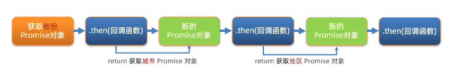

- [这一次，彻底弄懂 JavaScript 执行机制](https://juejin.im/post/59e85eebf265da430d571f89)
- [关于JavaScript单线程的一些事](https://github.com/JChehe/blog/blob/master/posts/%E5%85%B3%E4%BA%8EJavaScript%E5%8D%95%E7%BA%BF%E7%A8%8B%E7%9A%84%E4%B8%80%E4%BA%9B%E4%BA%8B.md)

* [前端面试题：JavaScript运行机制（一）单线程](https://www.bilibili.com/video/BV1gB4y1K7bD/?spm_id_from=333.337.search-card.all.click&vd_source=dc55c355e9f5b6174832aacfb5d8b6aa)
* [Javascript异步编程的4种方法](https://www.ruanyifeng.com/blog/2012/12/asynchronous%EF%BC%BFjavascript.html)


# 一、补充概念

## 1. 并发与并行

- **并发（Concurrency）**：指的是系统能够同时处理多个任务的能力，这些任务可能是交替执行的，也可能是同时执行的。在并发中，系统会通过时间片轮转等方式来实现多任务间的切换，以达到同时处理多个任务的效果。（**单核处理器**）
- **并行（Parallelism）**：指的是系统同时执行多个任务的能力，这些任务真正同时在不同的处理器核心或计算单元上执行。在并行中，多个任务会同时进行，每个任务在不同的处理器上独立运行，从而提高系统的整体性能。（**多核处理器**）

简单来说，并发是指多个任务之间可能交替执行，而并行是指多个任务同时执行。在现代计算机系统中，通常会同时使用并发和并行的技术来提高系统的性能和效率。


## 2. 同步与异步

- 同步（synchronous）：**顺序执行，需要协调等待**程序执行调用时，调用方得等待这个调用返回结果才能继续往后执行，即顺序执行代码片段；进程间相互依赖；
- 异步（asynchronous）：**彼此独立，互不干扰**和同步相反,调用方不会等待得到结果，而是在调用发出后调用者可用继续执行后续操作，被调用者通过状态来通知调用者，或者通过回调函数来处理这个调用；

## 3. 单线程与多线程

- 线程是cpu资源分配和调度的基本单位
- 多线程是进程中并发运行的一段代码

## 4. 异步与多线程

- 异步与多线程不是对等关系，多线程是实现异步的方式，异步是多线程的最终目的
- **相同点：** 避免线程阻塞、占用系统资源，提高软件的响应性
- **不同点：** 线程不是一个计算机硬件的功能，而是操作系统提供的一种逻辑功能；异步操作无须额外的线程负担，并且使用回调的方式进行处理


# 二、JS核心概念篇

JavaScript 的执行机制涉及多个重要概念，包括**单线程模型**、**事件循环**、**调用栈**、**任务队列**等，它们共同决定了 JavaScript 如何处理同步与异步代码。

记住两个核心：

> - javascript是一门单线程语言。
> - Event Loop是javascript的执行机制。

## 1. **单线程模型**

JavaScript 是**单线程**的语言，这意味着它一次只能执行一个任务（代码）。单线程的优势是避免了多线程带来的复杂性（如竞争条件、死锁等），但也意味着如果一个任务执行时间过长，整个程序的其他任务都会被阻塞。因此，JavaScript 引入了**异步机制**，以便处理长时间任务而不阻塞主线程。

## 2. **调用栈（Call Stack）**

**调用栈**是 JavaScript 中执行同步代码的机制。它是一个栈结构，用于存储函数调用。每当一个函数被调用时，它会被压入栈顶；当函数执行完毕时，它会被弹出栈。

### 调用栈示例：

```javascript
function foo() {
  console.log('foo');
}

function bar() {
  foo();
  console.log('bar');
}

bar();
```

执行步骤：

1. 首先 `bar()` 被压入调用栈；
2. `bar()` 调用 `foo()`，`foo()` 被压入调用栈；
3. `foo()` 执行完后，从调用栈弹出；
4. `bar()` 执行完后，从调用栈弹出。

## 3. **同步与异步任务**

在 JavaScript 中，任务分为**同步任务**和**异步任务**：

- **同步任务**：立即执行，直接进入调用栈处理。
- **异步任务**：不会立即执行，等到特定条件满足（如定时器结束、网络请求返回等）后再执行。异步任务通过事件循环机制处理。

## 4. **事件循环（Event Loop）**

**事件循环**是 JavaScript 处理异步任务的核心机制。事件循环负责监控调用栈和任务队列。当调用栈为空时，它会从任务队列中取出任务，放入调用栈中执行。

### a. 事件循环工作流程：

1. **调用栈中的任务执行完毕**后，事件循环会检查是否有待处理的任务。
2. **如果调用栈为空**，事件循环从**任务队列**中取出第一个任务并将其放入调用栈执行。
3. **如果调用栈不为空**，事件循环等待栈中任务执行完再继续。

### b. **任务队列（Task Queue）**

任务队列是存放**异步任务**的地方，任务分为**宏任务**（macro task）和**微任务**（micro task）。不同类型的任务会进入不同的队列：

- **宏任务**（macro task）：如 `setTimeout`、`setInterval`、`I/O` 操作等，执行顺序相对较低。
- **微任务**（micro task）：如 `Promise.then`、`MutationObserver`，执行顺序比宏任务要高。

#### Ⅰ. 任务队列的执行顺序：

1. **执行一个宏任务**（如从 `setTimeout` 中取出一个回调）。
2. **执行完宏任务后**，会检查是否有微任务队列中的任务，并执行所有微任务。
3. **所有微任务执行完后**，再去执行下一个宏任务。

#### Ⅱ. 示例：

```javascript
console.log('start');

setTimeout(() => {
  console.log('setTimeout');
}, 0);

Promise.resolve().then(() => {
  console.log('Promise');
});

console.log('end');
```

执行顺序：

1. **同步代码**：`console.log('start')` 和 `console.log('end')` 会首先执行，依次输出 `start` 和 `end`。
2. **微任务**：`Promise.resolve().then()` 属于微任务，它会在当前宏任务执行结束后立即执行，输出 `Promise`。
3. **宏任务**：`setTimeout()` 是宏任务，它会在微任务执行完后执行，最后输出 `setTimeout`。

最终输出结果是：

```
start
end
Promise
setTimeout
```

### c. **宏任务与微任务的执行顺序**

- **微任务**（如 `Promise` 的 `.then`）在每个宏任务之后立即执行。
- **宏任务**（如 `setTimeout` 和 `setInterval`）是按事件循环的调度执行。

每次事件循环都会执行一个宏任务，执行完后会立刻检查微任务队列，并清空所有的微任务。


# 三、JS异步编程的核心

JavaScript 的 **事件循环机制**（Event Loop） 是其异步编程的核心。它处理所有异步任务，允许主线程继续执行同步代码，而异步任务（如 `setTimeout`、`setInterval`、`I/O` 操作等）则在任务队列中等待，直到**调用栈**空闲时执行。

## 示例：

```javascript
console.log('Start');

setTimeout(() => {
  console.log('Async task finished');
}, 1000);

console.log('End');

// Output:
// Start
// End
// Async task finished
```

## **事件循环工作原理**⭐️

1. JavaScript 引擎执行同步代码。
    * **调用栈**是 JavaScript 中执行同步代码的机制。
    * **调用栈**处理同步任务，函数调用以先进后出的方式进行。
2. 遇到异步任务（如 `setTimeout`），将其放入任务队列中。
    * **任务队列**存放异步任务，任务分为宏任务和微任务。
    * **微任务**优先于宏任务执行，且微任务会在每次宏任务执行完之后立即处理。
3. **事件循环**负责监控**调用栈**，当栈为空时，它会从**任务队列**中取出任务进行执行。


# 四、JS异步操作的实现

​		JavaScript 的执行是**单线程**的，意味着只有一个主线程在执行 JavaScript 代码，因此 JavaScript 需要注意避免长时间的占用主线程，否则会阻塞用户界面。同时，JavaScript 也支持异步操作，如定时器、事件监听等，这些异步操作可以增强用户体验，同时不会阻塞主线程。

JavaScript 提供了多种异步编程方式：

1. **回调函数**：简单但容易出现回调地狱。
2. **Promise**：解决了回调地狱问题，提供链式调用和错误处理。
3. **Async/Await**：基于 Promise 的语法糖，使异步代码更像同步代码，易读性强。
4. **Generator 函数**：更底层的异步控制，但复杂度较高。
5. **事件循环**：JavaScript 的核心机制，通过任务队列和事件循环处理异步任务。
6. **Observables**：用于处理复杂异步事件流，通常与 `RxJS` 库结合使用。


JavaScript 异步编程允许我们在执行长时间操作时，不阻塞主线程（如用户界面），从而提升应用的响应性。以下是 JavaScript 中几种常见的异步编程方法：

## 1. **回调函数（Callback）**

通过将一个函数作为参数传递给异步操作，当异步操作完成时调用这个函数，这个函数就是回调函数。回调函数是最早也是最常见的异步编程模式。

这种方法虽然简单，但容易导致**回调地狱**问题（即多层嵌套的回调函数）。

### 示例：
```javascript
function fetchData(callback) {
  setTimeout(() => {
    callback('Data fetched');
  }, 1000);
}

fetchData(function(result) {
  console.log(result); // "Data fetched"
});
```

优点：
- 简单直接。

缺点：
- **回调地狱**：当有多个异步操作需要依赖前一个操作时，代码会变得难以阅读和维护。

### 回调地狱示例：
```javascript
getData1(function(result1) {
  getData2(result1, function(result2) {
    getData3(result2, function(result3) {
      console.log(result3);
    });
  });
});
```

## 2. **Promise** （单独文档⭐️）
`Promise` 是 ES6 引入的异步编程方式，解决了回调函数中嵌套过深的问题。Promise 是一种用于处理异步操作的对象，通过 Promise 可以更加清晰地处理异步操作成功、失败和异常的情况。

`Promise` 对象表示一个尚未完成的异步操作，它有三种状态：**pending**（进行中）、**fulfilled**（已完成）和 **rejected**（已失败）。

### 示例：
```javascript
let promise = new Promise((resolve, reject) => {
  setTimeout(() => {
    resolve('Data fetched');
  }, 1000);
});

promise.then((result) => {
  console.log(result); // "Data fetched"
}).catch((error) => {
  console.error(error);
});
```

优点：
- 可以链式调用，避免了回调地狱。
- 更容易处理错误（通过 `.catch` 捕获）。

缺点：
- 代码仍然比较冗长，尤其是有多个 `then` 链式调用时。

### 链式调用示例：
```javascript
getData1()
  .then(result1 => getData2(result1))
  .then(result2 => getData3(result2))
  .then(result3 => console.log(result3))
  .catch(error => console.error(error));
```

## 3. **async / await**
`async/await` 是基于 `Promise` 的**语法糖**，它提供了更接近**同步代码**风格的异步写法，使得代码可读性大大增强。

- `async` 函数返回一个 `Promise`。
- `await` 可以暂停 `async` 函数的执行，等待 `Promise` 返回结果后再继续执行后续代码。

### 示例：
```javascript
async function fetchData() {
  const result = await new Promise((resolve) => {
    setTimeout(() => {
      resolve('Data fetched');
    }, 1000);
  });
  
  console.log(result); // "Data fetched"
}

fetchData();
```

优点：
- 使异步代码看起来像同步代码，逻辑清晰。
- 错误处理更简单，可以使用 `try/catch` 语句。

缺点：
- 必须运行在支持 `Promise` 的环境中。
  
### 使用 `async/await` 处理多个异步操作：

* 对比 `Promise.all()`

处理任何一个请求失败时的错误

```javascript
async function processData() {
  try {
    const result1 = await getData1();
    const result2 = await getData2(result1);
    const result3 = await getData3(result2);
    console.log(result3);
  } catch (error) {
    console.error(error);
  }
}
```

## 4. **Generator 函数**（单独文档⭐️）

* [阮一峰 - ECMAScript 6 入门 - Generator](https://es6.ruanyifeng.com/#docs/generator)

`Generator` 是一种更底层的异步编程方式，配合 `yield` 和 `next()` 控制执行流程。`async/await` 可以看作是 `Generator` 的语法糖。

### 示例：
```javascript
function* fetchData() {
  yield new Promise((resolve) => {
    setTimeout(() => {
      resolve('Data fetched');
    }, 1000);
  });
}

const generator = fetchData();
generator.next().value.then((result) => console.log(result)); // "Data fetched"
```

优点：
- 可以手动控制异步任务的执行顺序和时机。

缺点：
- 较为复杂，通常不直接使用，而是通过 `async/await` 来简化。


## 5. Web Worker（单独文档⭐️）

* [阮一峰 - Web Worker 使用教程](https://www.ruanyifeng.com/blog/2018/07/web-worker.html)
* [MDN - 使用 Web Workers](https://developer.mozilla.org/zh-CN/docs/Web/API/Web_Workers_API/Using_web_workers)
* [demo](https://stackblitz.com/edit/web-worker-demo-16?file=index.js)

`Web Worker` 是 HTML5 标准的一部分，这一规范定义了一套 API，允许我们在 js 主线程之外开辟新的 Worker 线程，并将一段 js 脚本运行其中，它赋予了开发者利用 js 操作多线程的能力。

HTML5中支持了 `Web Worker`，使得能够同时执行两段JS了，那是不是就是说JS实现了“多线程”了呢？我们来看看Web Worker的官方解释：

> 通过使用Web Workers，Web应用程序可以在独立于主线程的后台线程中，运行一个脚本操作。这样做的好处是可以在独立线程中执行费时的处理任务，从而允许主线程（通常是UI线程）不会因此被阻塞/放慢。

独立线程，看似像是实现了“多线程”，然而他是独立于主线程，也就是主线程依然是那个主线程没有变！虽然你大妈已经不是你大妈了，但是你大爷还是你大爷！JS单线程的本质依然没有变！

WebWorker是向浏览器申请一个子线程，该子线程服务于主线程，完全受主线程控制。


- **Web Worker 是 JavaScript 异步编程的一种方式**，但与 `Promise`、`async/await` 这种基于事件循环的异步方式不同，Web Worker 提供了真正的多线程环境来处理计算密集型任务。
- 在需要执行大量耗时操作的场景中，Web Worker 可以将任务移至后台线程中，避免阻塞主线程的执行，从而提高用户体验和性能。


## 6. **Observables (RxJS)**
`Observables` 是基于推送数据流的异步编程模型，通常与 `RxJS` 库结合使用。它提供了更强大的功能来处理复杂的异步数据流（如事件、用户交互、网络请求等）。

### 示例（RxJS）：
```javascript
import { of } from 'rxjs';
import { delay } from 'rxjs/operators';

of('Data fetched').pipe(delay(1000)).subscribe(result => {
  console.log(result);
});
```

优点：
- 提供强大的操作符来处理异步事件流。
- 可以轻松处理多个异步事件组合、取消、错误处理等复杂场景。

缺点：
- 学习曲线较陡峭。
- 依赖第三方库（如 `RxJS`）。


# 五、深入

## 1. 回调函数地狱

1. 展示默认第一个省，第一个城市，第一个地区在下拉菜单中
2. 概念：在回调函数中嵌套回调函数，一直嵌套下去就形成了回调函数地狱
3. 缺点：可读性差，异常无法捕获，耦合性严重，牵一发动全身


```js
axios({ url: 'http://hmajax.itheima.net/api/province' }).then(result => {
  const pname = result.data.list[0]
  document.querySelector('.province').innerHTML = pname
  // 获取第一个省份默认下属的第一个城市名字
  axios({ url: 'http://hmajax.itheima.net/api/city', params: { pname } }).then(result => {
    const cname = result.data.list[0]
    document.querySelector('.city').innerHTML = cname
    // 获取第一个城市默认下属第一个地区名字
    axios({ url: 'http://hmajax.itheima.net/api/area', params: { pname, cname } }).then(result => {
      document.querySelector('.area').innerHTML = result.data.list[0]
    })
  })
})
```


## 2. Promise链式调用 - 解决回调地狱

1. 概念：依靠 then() 方法会返回一个新生成的 Promise 对象特性，继续串联下一环任务，直到结束
2. 细节：then() 回调函数中的返回值，会影响新生成的 Promise 对象最终状态和结果
3. 好处：通过链式调用，解决回调函数嵌套问题


```js
/**
 * 目标：掌握Promise的链式调用
 * 需求：把省市的嵌套结构，改成链式调用的线性结构
*/
// 1. 创建Promise对象-模拟请求省份名字
const p = new Promise((resolve, reject) => {
  setTimeout(() => {
    resolve('北京市')
  }, 2000)
})

// 2. 获取省份名字
const p2 = p.then(result => {
  console.log(result)
  // 3. 创建Promise对象-模拟请求城市名字
  // return Promise对象最终状态和结果，影响到新的Promise对象
  return new Promise((resolve, reject) => {
    setTimeout(() => {
      resolve(result + '--- 北京')
    }, 2000)
  })
})

// 4. 获取城市名字
p2.then(result => {
  console.log(result)
})

// then()原地的结果是一个新的Promise对象
console.log(p2 === p)
```



```js
/**
 * 目标：把回调函数嵌套代码，改成Promise链式调用结构
 * 需求：获取默认第一个省，第一个市，第一个地区并展示在下拉菜单中
*/
let pname = ''
// 1. 得到-获取省份Promise对象
axios({url: 'http://hmajax.itheima.net/api/province'}).then(result => {
  pname = result.data.list[0]
  document.querySelector('.province').innerHTML = pname
  // 2. 得到-获取城市Promise对象
  return axios({url: 'http://hmajax.itheima.net/api/city', params: { pname }})
}).then(result => {
  const cname = result.data.list[0]
  document.querySelector('.city').innerHTML = cname
  // 3. 得到-获取地区Promise对象
  return axios({url: 'http://hmajax.itheima.net/api/area', params: { pname, cname }})
}).then(result => {
  console.log(result)
  const areaName = result.data.list[0]
  document.querySelector('.area').innerHTML = areaName
})
```


## 3. setTimeout / setInterval的弊端

大名鼎鼎的`setTimeout`无需再多言，大家对他的第一印象就是异步可以延时执行，我们经常这么实现延时3秒执行：

```
 setTimeout(() => {
     console.log('延时3秒');
 },3000)
```

渐渐的`setTimeout`用的地方多了，问题也出现了，有时候明明写的延时3秒，实际却5，6秒才执行函数，这又咋回事啊？

先看一个例子：

```
 setTimeout(() => {
     task();
 },3000)
 console.log('执行console');
```

根据前面我们的结论，`setTimeout`是异步的，应该先执行`console.log`这个同步任务，所以我们的结论是：

```
 //执行console
 //task()
```

去验证一下，结果正确！ 然后我们修改一下前面的代码：

```
 setTimeout(() => {
     task()
 },3000)
 
 sleep(10000000)
```

乍一看其实差不多嘛，但我们把这段代码在chrome执行一下，却发现控制台执行`task()`需要的时间远远超过3秒，说好的延时三秒，为啥现在需要这么长时间啊？

这时候我们需要重新理解`setTimeout`的定义。我们先说上述代码是怎么执行的：

- `task()`进入Event Table并注册,计时开始。
- 执行`sleep`函数，很慢，非常慢，计时仍在继续。
- 3秒到了，计时事件`timeout`完成，`task()`进入Event Queue，但是`sleep`也太慢了吧，还没执行完，只好等着。
- `sleep`终于执行完了，`task()`终于从Event Queue进入了主线程执行。

上述的流程走完，我们知道`setTimeout`这个函数，是经过指定时间后，把要执行的任务(本例中为`task()`)加入到Event Queue中，又因为是单线程任务要一个一个执行，如果前面的任务需要的时间太久，那么只能等着，导致真正的延迟时间远远大于3秒。

我们还经常遇到`setTimeout(fn,0)`这样的代码，0秒后执行又是什么意思呢？是不是可以立即执行呢？

答案是不会的，`setTimeout(fn,0)`的含义是，指定某个任务在主线程最早可得的空闲时间执行，意思就是不用再等多少秒了，只要主线程执行栈内的同步任务全部执行完成，栈为空就马上执行。举例说明：

```
 //代码1
 console.log('先执行这里');
 setTimeout(() => {
     console.log('执行啦')
 },0);
 
 //代码2
 console.log('先执行这里');
 setTimeout(() => {
     console.log('执行啦')
 },3000);  
```

代码1的输出结果是：

```
 //先执行这里
 //执行啦
```

代码2的输出结果是：

```
 //先执行这里
 // ... 3s later
 // 执行啦
```

关于`setTimeout`要补充的是，即便主线程为空，0毫秒实际上也是达不到的。根据HTML的标准，最低是4毫秒。有兴趣的同学可以自行了解。


### a. setInterval

上面说完了`setTimeout`，当然不能错过它的孪生兄弟`setInterval`。他俩差不多，只不过后者是循环的执行。对于执行顺序来说，`setInterval`会每隔指定的时间将注册的函数置入Event Queue，如果前面的任务耗时太久，那么同样需要等待。

唯一需要注意的一点是，对于`setInterval(fn,ms)`来说，我们已经知道不是每过`ms`秒会执行一次`fn`，而是每过`ms`秒，会有`fn`进入Event Queue。一旦**`setInterval`的回调函数`fn`执行时间超过了延迟时间`ms`，那么就完全看不出来有时间间隔了**。这句话请读者仔细品味。


