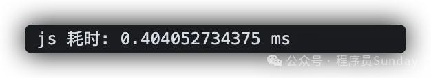
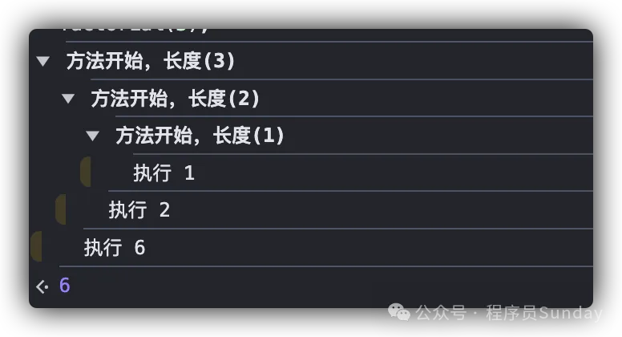

[不要过度使用console.log啦！我们有更好的调试方式！](https://mp.weixin.qq.com/s/-Lg5KLMyP6CXItvrUEJx-w)

[调试只会console.log？来看一看这 6 种惊艳的调试技巧！](https://mp.weixin.qq.com/s?__biz=MzkxNjUxMDg4Ng==&mid=2247490819&idx=1&sn=99e50fcc55a590966fac3aa1543cb435&chksm=c14f9ccaf63815dc1637f9452bf2fcca2d031b516826fcda773739d7c7a8aa692b2edba6619c&token=760951566&lang=zh_CN&scene=21&key=daf9bdc5abc4e8d09c493e77f0d9ca09de41d688d7a18cada489aa30a3345e1caa169b0acb5612c96a3923464e5d901aef512e5dd42e74c68a0c9f87c47d21bcf01424c64b642321ff0ad32d4a198f67edb6ae8f20305651e24df47298f9444420314ea4eaffedd95547492d896c68315040f15f1cc14ad8bfd3e14370a02edf&ascene=0&uin=OTUyODY5NDIz&devicetype=iMac+Macmini8%2C1+OSX+OSX+13.2+build(22D49)&version=13070110&nettype=WIFI&countrycode=CN&fontScale=100&exportkey=n_ChQIAhIQmltlWKaeNbHqvZR2nHl1qxKCAgIE97dBBAEAAAAAALz7L8uQPW4AAAAOpnltbLcz9gKNyK89dVj0TO%2B7Hh8GkhB%2BLNj3zMf3kSahqaPSMz7A4Qz6s0sNkp60ZptQmzCPUU6T12LvZBTMd%2BSdzWfIqsCEfxNfPxa4f0aUfTzVFhpQKFlA61zuW7FDpdaBLr3GZwhcIhuv4vF4wtQkAgCxpVsIWFH2QCwCC5bVrj0dyGxQd%2BLlv9Ll2wpCCJV%2BmgROOlVOxsj8M1OK2KglQQ2HkTyr%2B7OX2HJy5fUhUknUEl%2FQAdJwo4C4K%2F2JCWlwTl11BHvC68OTOJ6EdLsWT4N28kCqdLPh0jgAZ8vMJdw7yCZBGH9lbw%3D%3D&acctmode=0&pass_ticket=jecZ4Ja37yvI2bIvairwS2ufAnH%2BwQpYkWoXMab%2FF10dNRQrjN6fJthH4TEaxpYA&wx_header=0&nwr_flag=1#wechat_redirect)

[前端 Chrome 调试技巧最全汇总](https://mp.weixin.qq.com/s?__biz=Mzg3MTYxNDQwMA==&mid=2247497160&idx=1&sn=ab478b35b35b8910bdbef6a95c9d08a1&chksm=cf20c396c63190cf1be6264132fc41da8ce1f20164492c9b9e3d7940840cfd3381f82c179800&scene=126&sessionid=1730266201&subscene=90&clicktime=1730266230&enterid=1730266230&ascene=3&devicetype=iOS16.2&version=1800352c&nettype=WIFI&abtest_cookie=AAACAA%3D%3D&lang=zh_CN&countrycode=CN&fontScale=100&exportkey=n_ChQIAhIQ3LCBcTDFS4vAK1Q9AIY0OxLfAQIE97dBBAEAAAAAAHdeECKiHdkAAAAOpnltbLcz9gKNyK89dVj0Va0zj1ILFgVt6qZ3%2BjtF1ap8wCRrG7czNJEjidhIRruYoqbVhBxzKGRPX8RMshoZ%2F7L%2BZWkwvUQ6c7DoOasibs6Ax9lf88%2FLd%2BYAOUf0LpuS90WsL07Yvkv2526VijQ01wH%2FPXB0Yu5a2paGKDFgYfpAKn%2FsQlgi9bs0Fvd4WY98AyHQ9VFsvsh8w1ug5KepNDSvXWlZYl8MyiHzpY3uHwdZufviEpDyrXKGDrltFAP2GSu4oMGeS7Y%3D&pass_ticket=unOX6t%2BvJzIKHaBRaW5Jf%2Fz9JxqhqZlpAZfUDBmhWKH8uUtaxwcFajn2w2lxD2Mn&wx_header=3&nwr_flag=1#wechat_redirect)


# 一、之前文章 - 《调试技巧_模拟环境》


# 二、前端冷知识，妙用「浏览器地址栏」

## 1. 弹框

```
javascript:alert('I am wscats :)');

javascript:alert(3+4-6);

javascript:alert(355/113);void(0);

javascript:alert("本网址域名为:" + location.protocol + "//" + location.hostname + "/" + "\n此时浏览的地址为:" + location.href + "\n" + "\n注意：如果域名对不上，就赶紧关掉噢");
```


## 2. textarea框

```
data:text/html, <textarea style="font-size: 1.5em; width: 100%; height: 100%;" autofocus />

data:text/html,<button onClick="SaveTextArea()">Save</button> <script language="javascript" type="text/javascript"> function SaveTextArea() { window.location = "data:application/octet-stream," + escape(txtBody.value); } </script> <textarea id="txtBody" style="font-size: 1.5em; width: 100%; height: 100%; boarder: none; outline: none" autofocus> </textarea>
```


## 3. 其他的用法如下

1. data:,<文本数据>
2. data:text/plain,<文本数据>
3. data:text/html,<HTML代码>
4. data:text/html;base64,<base64编码的HTML代码>
5. data:text/css,<CSS代码>
6. data:text/css;base64,<base64编码的CSS代码>
7. data:text/javascript,<Javascript代码>
8. data:text/javascript;base64,<base64编码的Javascript代码>
9. data:image/gif;base64,base64编码的gif图片数据
10. data:image/png;base64,base64编码的png图片数据
11. data:image/jpeg;base64,base64编码的jpeg图片数据
12. data:image/x-icon;base64,base64编码的icon图片数据


# 三、console更多用法

## **01. console.table**

使用 console.table 可视化复杂的对象和数组：

```js
const myData = [
  { name: "程序员Sunday", age: 30 },
  { name: "Sunday", age: 25 }
];
console.table(myData);
```

打印结果如下：


## **02. console.trace**

使用 console.trace 可以明确函数的调用逻辑关系：

```js
function fn() {
  function test() {
    console.trace("这是一个利用trace的测试打印"); 
  }
  test();
}
fn();
```

打印结果如下：


## **03. console.time && console.timeEnd**

使用 console.time && console.timeEnd 来记录代码的执行耗时：

```js
console.time('js 耗时')  // key对应
const vNodes = []
for (let i = 0; i < 10000; i++) {
  const vNode = {
    type: 'div'
  }
  vNodes.push(vNode)
}
console.timeEnd('js 耗时')
```

打印结果如下：



## **04. console.assert**

使用 console.assert **断言**你的判断逻辑。

如果断言为假，它抛出一个你指定的错误：

```js
const myArray = []
console.assert(myArray.length > 0, "myArray 是空的!");
```

打印结果如下：


## **05. console.clear**

在很多时候，我们的控制台可能会打印非常多的内容。所以，可以让代码在执行到某一个特定的时机时，**利用 console.clear() 清空控制台**

```js
console.clear()
```

执行之后会打印这个：


## **06. console.error**

使用 console.error 直接打印一个错误级别的描述：

```js
console.error('错误信息')
```

打印结果如下：


## 07. console.dir

`console.dir()` 是一个专门打印 **对象** 的 API。


## 08. console.group && console.groupEnd

使用 console.group() 控制打印组

这在 **嵌套函数、递归** 中非常有用，配合 `console.groupEnd()` 可以帮助我们完成分组打印。

```js
function factorial(n) {
    console.group(`方法开始，长度(${n})`);
    if (n <= 1) {
        console.log("执行 1");
        console.groupEnd();
        return 1;
    } else {
        let result = n * factorial(n - 1);
        console.log(`执行 ${result}`);
        console.groupEnd();
        return result;
    }
}

factorial(3);
```




