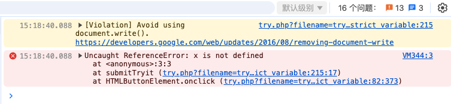

# JavaScript 严格模式(use strict)

## 使用 "use strict" 指令

* "use strict" 指令在 JavaScript 1.8.5 (ECMAScript5) 中新增。
* 它不是一条语句，但是是一个字面量表达式，在 JavaScript 旧版本中会被忽略。
* "use strict" 的目的是指定代码在严格条件下执行。
* 严格模式下你不能使用未声明的变量。


## 示例

* [菜鸟教程 - 严格模式demo](https://www.runoob.com/try/try.php?filename=tryjs_strict_variable)

```js
<!DOCTYPE html>
<html>
<head>
<meta charset="utf-8">
<title>菜鸟教程(runoob.com)</title>
</head>
<body>

<script>
	"use strict";
	x = 3.14;       // 报错 (x 未定义)
</script>

</body>
</html>
```

