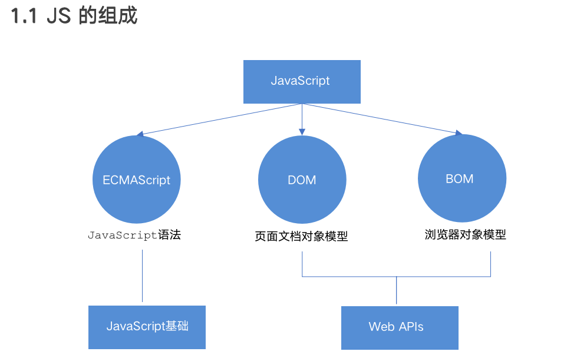
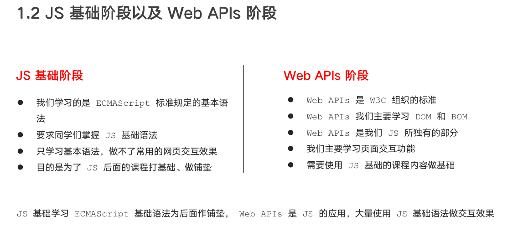
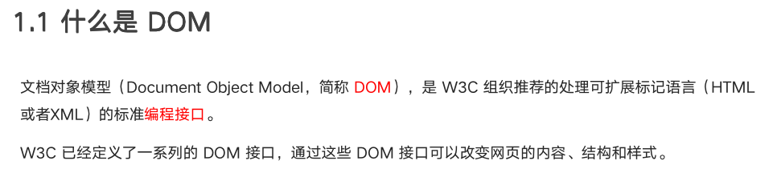
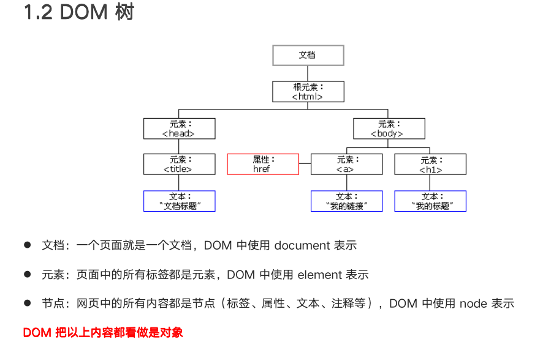

# 迅速回忆


# 一、JS 与 Web API的关系






# 二、什么是DOM






# 三、获取元素

> DOM在我们实际开发中主要用来操作元素。


## 3.1 根据 ID 获取

```html
<div id="time">2019-9-9</div>

<script>
    // 1. 因为我们文档页面从上往下加载，所以先得有标签 所以我们script写到标签的下面
    // 2. get 获得 element 元素 by 通过 驼峰命名法 
    // 3. 参数 id是大小写敏感的字符串
    // 4. 返回的是一个元素对象
    var timer = document.getElementById('time');
    console.log(timer);
    console.log(typeof timer);
    // 5. console.dir 打印我们返回的元素对象 更好的查看里面的属性和方法
    console.dir(timer);
</script>
```

## 3.2 根据标签名获取


## 3.3 通过 HTML5 新增的方法获取


## 3.4 特殊元素获取


