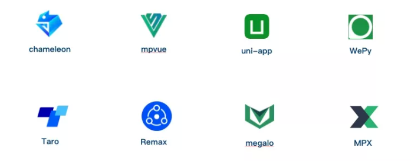

# 一、现有小程序方案

* [微信小程序](https://developers.weixin.qq.com/miniprogram/dev/framework/)
* [美团 MPVue](http://mpvue.com/)
* [Uni-app](https://uniapp.dcloud.net.cn/)
* [Taro 京东](https://taro-docs.jd.com/docs)
* [WePY 腾讯](https://wepyjs.github.io/wepy-docs/)
* [Chameleon 变色龙 - 滴滴](https://cml.js.org/docs/)
* [Remax - 阿里](https://opendocs.alipay.com/mini/component-ext/Remax)

这些小程序开发框架最主要的区别是 DSL，这点从 logo 颜色上就可以看出来，除了滴滴的 **Chameleon**[4] 是自定义 DSL 外，其余的绿色的 logo 是遵循了 Vue 语法（如 mpvue ），蓝色的 logo 是遵循了 React 的语法（如 Taro）。

