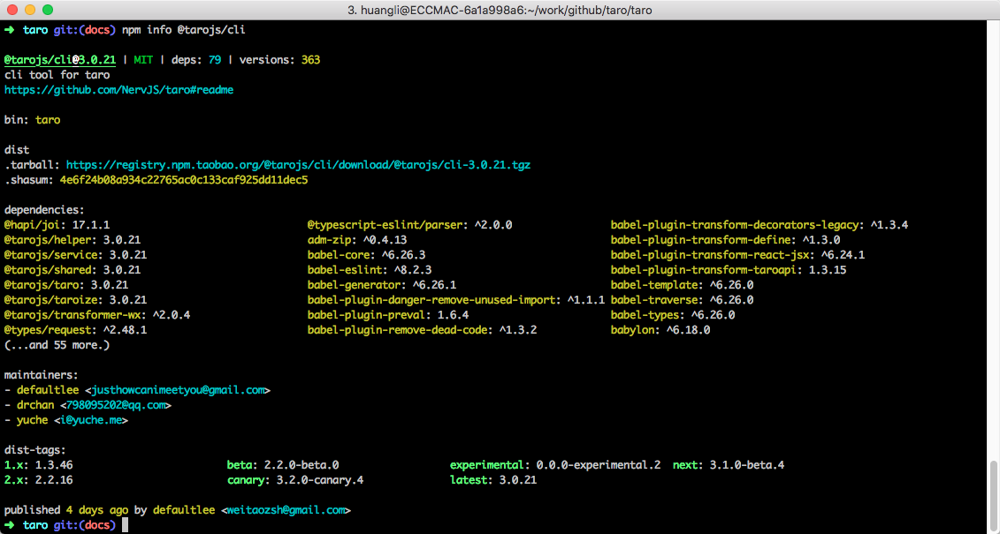
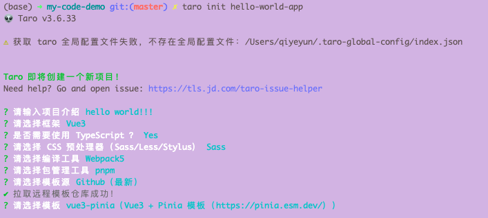

* [Taro官网 - 快速开始](https://taro-docs.jd.com/docs/GETTING-STARTED)


# 一、快速开始

## 1. 安装

* node 环境（>=16.20.0）

* 全局安装 `@tarojs/cli`

    * ```sh
        # 使用 npm 安装 CLI
        $ npm install -g @tarojs/cli
        ```

* 查看 Taro 全部版本信息

    * ```sh
        $ npm info @tarojs/cli
        ```

    * 


## 2. 项目初始化

使用命令创建模板项目：

```bash
$ taro init hello-world-app
```

npm 5.2+ 也可在不全局安装的情况下使用 npx 创建模板项目：

```bash
$ npx @tarojs/cli init hello-world-app
```



```sh
# 进入项目根目录
$ cd hello-world-app

# 使用 pnpm 安装依赖
$ pnpm install
```


## 3. 编译运行

使用 Taro 的 `build` 命令可以把 Taro 代码编译成不同端的代码，然后在对应的开发工具中查看效果。

Taro 编译分为 `dev` 和 `build` 模式：

- **dev 模式（增加 --watch 参数）** 将会监听文件修改。
- **build 模式（去掉 --watch 参数）** 将不会监听文件修改，并会对代码进行压缩打包。
- dev 模式生成的文件较大，设置环境变量 `NODE_ENV` 为 `production` 可以开启压缩，方便预览，但编译速度会下降。


【看官网-更详细】


