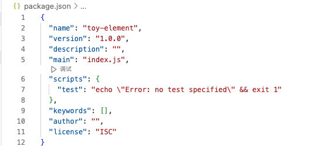
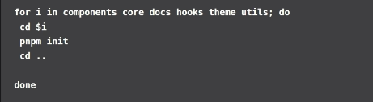
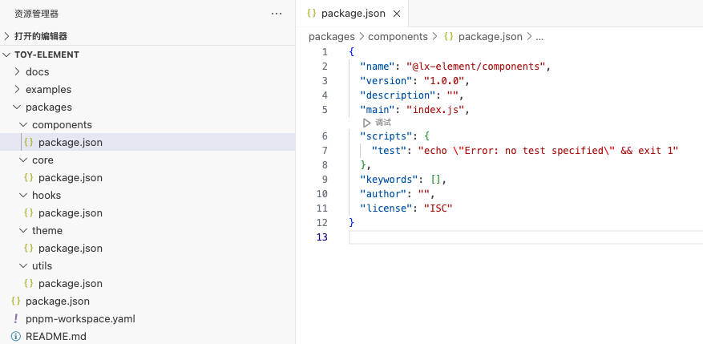
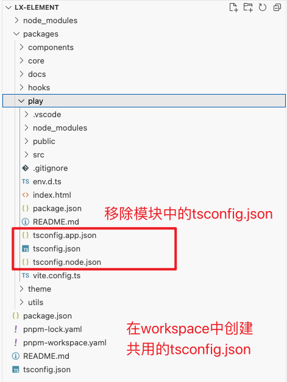
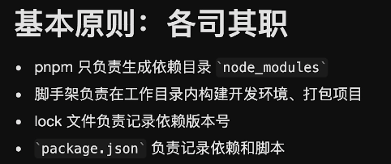
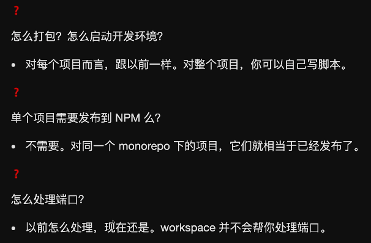

# 参考文档

* [pnpm官网 - workspace](https://pnpm.io/zh/workspaces)

* [教程 - 使用 pnpm workspace 管理 monorepo](https://www.bilibili.com/video/BV1qg4y157dv/?spm_id_from=333.337.search-card.all.click&vd_source=dc55c355e9f5b6174832aacfb5d8b6aa)
* [教程 - Managing a full-stack, multipackage monorepo using pnpm](https://blog.logrocket.com/managing-full-stack-monorepo-pnpm/#layout-basic-monorepo)


* 本人的demo：./monorepo-demo

* 手搓组件: 制作npm包/手搓UI组件库/lx-element


# 一、pnpm创建Monorepo工程 - `lx-element`

## 1. `pnpm`初始化工程，生成 `package.json`

```sh
$ pnpm init -y
```



这里可以将 `package.json` 中的 name 属性删掉，或者改名为 `  "name": "@lx-element/workspace"`，表示公共空间；

并且添加一个 `"private": true` 属性，因为它是不需要发布的。


## 2. 配置 `pnpm` 的 `monorepo` 工作区

<font size=5 color='green'>创建 `pnpm-workspace.yaml` </font>

```yaml
packages:
  - packages/* # packages 目录下都是组件包
  - examples/* # 存放组件示例
  - docs # 存放组件文档
```


## 3. 在 `packages` 目录下创建多个项目

小脚本，批量创建项目





模块命名规则：

```
core模块：组件入口
  "name": "lx-element",

components：组件模块
  "name": "@lx-element/components",

docs：文档模块
  "name": "@lx-element/docs",
```


## 4. 公共模块，安装依赖

开发环境需要的，所以安装的时候需要添加一个 `-D` 参数表示安装到开发环境，`-w` 表示安装到公共空间的 `packages.json` 中，也就是根目录下的 `packages.json` 中。

```sh
# -Dw : devDependencies + workspace
$ pnpm add -Dw typescript@^5.2.2 vite@^5.1.4
# or
$ pnpm add -D -w vue typescript@^5.2.2 vite@^5.1.4
```

```sh
# -w : dependencies + workspace
$ pnpm add -w lodash-es vue
```


## 5. 项目内的包相互调用

 这几个包要互相进行调用呢，就需要把它们安装到仓库根目录下的 `node_modules` 目录中。然后我们在根目录下进行安装操作。

`-w` = `--workspace-root` 表示安装到公共空间的 `packages.json` 中，也就是**根目录**下的 `packages.json`。

```sh
# 安装core 到 公共
$ pnpm add lx-element -w
Already up to date

dependencies:
+ lx-element 1.0.0 <- packages/core


$ pnpm install @lx-element/components -w
Already up to date

dependencies:
+ @lx-element/components 1.0.0 <- packages/components
```

安装后根目录下的 `package.json` 的内容为：

```json
{
  "dependencies": {
    "@lx-element/components": "workspace:^",
    "@lx-element/hooks": "workspace:^",
    "lx-element": "workspace:*"
  }
}
```

<font color='red' size=5> `workspace:^` 与 `workspace:*` 区别</font>，这里推荐使用 `workspace:*`，便于统一版本！！


## 6. 单个repo安装包

在 ***根目录*** 下执行：

```sh
# 将 jsdom 安装到 @lx-element/components
$ pnpm add -D jsdom --filter @lx-element/components

$ pnpm add aync-validator@4.2.5 --filter @lx-element/components
```

<font color='red' size=5>`pnpm --filter`</font>：介绍

`pnpm --filter` 是管理 monorepo 的强大工具，它允许你选择性地对特定包执行操作，从而提高效率和灵活性。在使用 `pnpm` 处理大型项目时，善用 `--filter` 选项可以显著简化你的工作流程。


## 7. 统一 `typeScript.config`

先移除模块中的`typeScript.config`文件，在 `workspace` 中创建 `tsconfig.json` 文件，共用！！！

因为我们使用了 TypeScript，这样我们想要去校验我们的代码，让我们代码有提示，并且可以按照一些规则来解析我们的语法，给我们更友好的提示，我们就需要去初始化一下这个 TypeScript 配置命令。 又因为我们安装了 typescript，所以在 `node_modules` 目录下 `bin` 目录里面就会存在一个 tsc 的命令，这个命令，就可以帮我们进行初始化，我们可以使用 `npm tsc --init` 来初始化，也可以使用 `pnpm tsc --init` 那么执行这个命令，它就会去 `node_modules` 目录下 `bin` 目录找这个 tsc 命令进行执行。





# 二、GPT - `workspace:^`  vs  `workspace:*` 

在 `pnpm` 中，`workspace:^` 和 `workspace:*` 是用于指定工作区（workspace）内部包的版本范围的特殊符号。它们的作用是通过不同的版本号策略来管理依赖关系。


## 1. `workspace:^`

- **`^`（插入符号）**：表示“兼容版本”范围，即允许依赖包在小版本（minor）和补丁版本（patch）上进行升级。具体来说，`^1.2.3` 表示 `>=1.2.3 <2.0.0`。
- **`workspace:^`**：将依赖包的版本锁定到工作区中最新的兼容版本（即遵循 semver 的 ^ 规则）。如果你在工作区中有一个包版本是 `1.2.3`，使用 `workspace:^` 表示你希望依赖于 `1.x.x` 版本，并且自动选择最新的符合条件的版本。


## 2. `workspace:*`

- **`*`（星号）**：表示任何版本，即允许依赖包的任何版本。
- **`workspace:*`**：表示依赖于工作区中当前存在的包的确切版本，无论它是什么版本号。也就是说，使用 `workspace:*` 会确保使用工作区中当前的确切版本，而不考虑 semver 规则。


## 3. 比较与用法场景

- **`workspace:^`**：适合在工作区内希望自动跟随兼容版本的更新。对于大多数情况下，你希望小版本和补丁版本可以自动升级时使用这个符号。

- **`workspace:*`**：适合在工作区内希望锁定到当前版本，而不考虑未来版本更新。这样可以确保所有工作区依赖于完全相同的版本。


## 4. 示例

假设工作区内有一个包 `my-package`，当前版本是 `1.2.3`，并且你在另一个包的 `package.json` 文件中依赖它：

- 使用 `workspace:^`：
  ```json
  {
    "dependencies": {
      "my-package": "workspace:^1.2.3"
    }
  }
  ```
  这意味着你希望依赖 `my-package` 的任何兼容版本，譬如 `1.3.0` 或 `1.2.4`。

- 使用 `workspace:*`：
  ```json
  {
    "dependencies": {
      "my-package": "workspace:*"
    }
  }
  ```
  这意味着你希望依赖 `my-package` 的确切版本 `1.2.3`，并且不会自动升级到 `1.3.0` 或 `1.2.4`。


## 5. 总结

- **`workspace:^`**：表示遵循 semver 兼容性规则，适合希望兼容版本自动升级的场景。
- **`workspace:*`**：表示使用当前确切版本，适合需要严格版本控制的场景。

这两个符号的选择取决于你希望如何管理工作区内部包之间的版本依赖。


# 三、monorepo常见问题

[bilibili - 使用 pnpm workspace 管理 monorepo](https://www.bilibili.com/video/BV1qg4y157dv/?spm_id_from=333.337.search-card.all.click&vd_source=dc55c355e9f5b6174832aacfb5d8b6aa)








