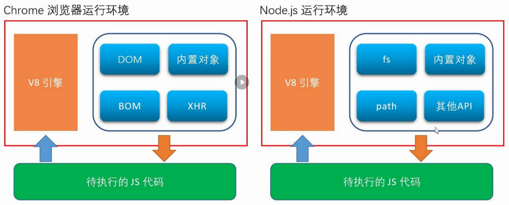
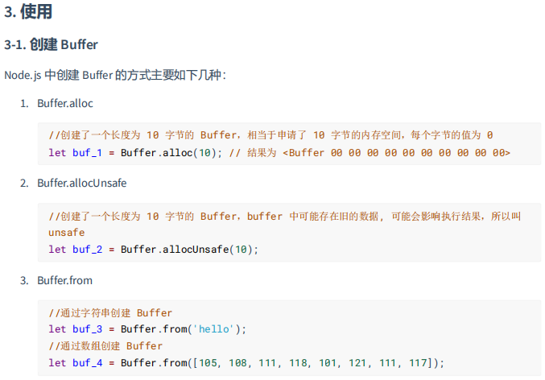
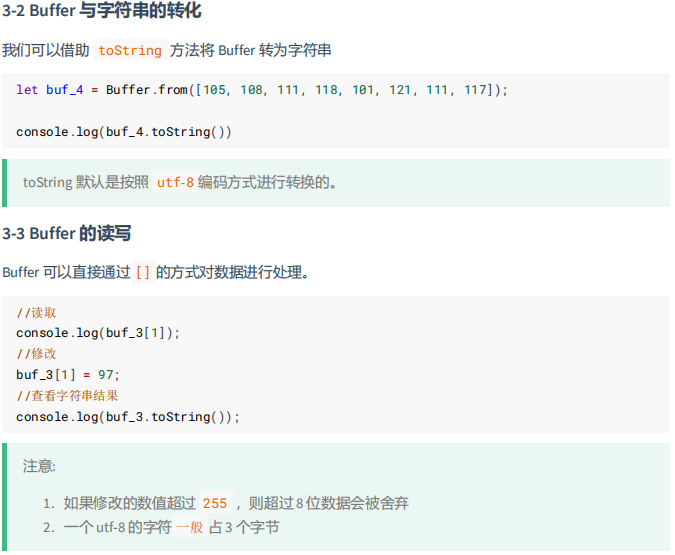
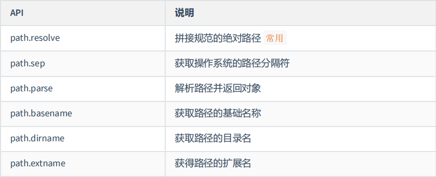

# 一、NodeJS简介

## [什么是Node.js](https://vue3.chengpeiquan.com/engineering.html#什么是-node-js)

* [node.js官网](https://nodejs.org)

> Node.js® is an open-source, cross-platform JavaScript runtime environment.
>
> Node.js是一个开源、跨平台的 JavaScript 运行时环境。
>
> Node.js （简称 Node ） 是一个基于 Chrome V8 引擎构建的 JS 运行时（ JavaScript Runtime ）。
>
> 它让 JavaScript 代码不再局限于网页上，还可以跑在客户端、服务端等场景，极大的推动了前端开发的发展，现代的前端开发几乎都离不开 Node 。
>
> 通俗来说：Node.js就是 <font color=red>一款应用程序</font>， 是<font color=red>一款软件</font>，它可以运行 JavaScript。
>

## [什么是 Runtime](https://vue3.chengpeiquan.com/engineering.html#什么是-runtime)

Runtime ，可以叫它 "运行时" 或者 "运行时环境"，这个概念是指，项目的代码在哪里运行，哪里就是运行时。

传统的 JavaScript 只能跑在浏览器上，每个浏览器都为 JS 提供了一个运行时环境，可以简单的把浏览器当成一个 Runtime ，明白了这一点，相信就能明白什么是 Node 。

Node 就是一个让 JS 可以脱离浏览器运行的环境，当然，这里并不是说 Node 就是浏览器。


# 二、下载和安装 Node

* [Current 版本](https://vue3.chengpeiquan.com/guide.html#current-版本) ：Current 是最新发布版本
* [LTS 版本](https://vue3.chengpeiquan.com/guide.html#lts-版本) ：全称 Long Time Support ，长期维护版本

> 关于 Node.js 的版本发布时间表可以在官方 GitHub 的 [Release 仓库](https://github.com/nodejs/Release) 查看。


## 方式一：手动下载安装

点击访问：[Node.js 官网下载](https://nodejs.org/zh-cn/download/)

```shell
$ node -v
```


## 方式二：homebrew

使用 brew 命令来安装：

```shell
$ brew install node
```


## 方式三：NVM

点击访问：[NVM 官方](https://github.com/nvm-sh/nvm)

> 详情 看专门文档

```shell
$ nvm --version
```


# 三、浏览器中的JavaScript 与 NodeJS中的JavaScript



## 1. 使用node运行js文件

创建一个 `001_helloworld.js` 文件：

```js
console.log("使用node运行js！！！Hello world！！！")
```

在终端运行：

```sh
$ node 001_helloworld.js 
使用node运行js！！！Hello world！！！
```


## 2. Node.js中不能使用BOM、DOM

* 浏览器中的JavaScript，包含：
    * 核心语法：ECMAScript
    * Web API：DOM、BOM、AJAX、Storage、console、定时器.....
* Node.js中的JavaScript，包含：
    * 核心语法：ECMAScript
    * Node API：fs、url、http、util、console、定时器......


**验证下：在node中调用Web API，报错！！**

```js
// DOM  不支持
console.log(document);
// BOM  不支持
console.log(window);
// 定时器 支持
setTimeout(()=> {
    console.log("i love")
}, 1000);


// 运行 报错
$ node 002_NodeJS中调用WebAPI.js
```


## 3. 顶级对象

* 浏览器中的顶级对象：window
* Node.js中的顶级对象：global、globalThis
    * global === globalThis

```js
// Node.js中的顶级对象
console.log(global)

// ES2020
console.log(globalThis)

// true
console.log(globalThis === global)
```


# 四、Buffer（缓冲器）

[Buffer课件](./尚硅谷课件/NodeJS基础课件/01_Buffer.pdf)







# 五、fs模块

fs 全称为 file system ，称之为 文件系统 ，是 Node.js 中的 **内置模块** ，可以对计算机中的磁盘进行操作。

## 1. 文件写入

**同步VS异步**

> Node.js 中的磁盘操作是由 **其他线程** 完成的，结果的处理有两种模式：
>
> * 同步处理 JavaScript 主线程 **会等待** 其他线程的执行结果，然后再继续执行主线程的代码，效率较低
>
> * 异步处理 JavaScript 主线程 **不会等待** 其他线程的执行结果，直接执行后续的主线程代码，效率较好 

### a. **writeFile** 异步写入

```js
// 1. 导入 fs 模块
// require 是 Node.js 环境中的'全局'变量，用来导入模块
const fs = require('fs');

fs.writeFile('./座右铭.txt', '我是你大爷', err => {
    //如果写入失败，则回调函数调用时，会传入错误对象，如写入成功，会传入 null
    if (err) {
        console.log('写入失败！！！');
        return;
    } else {
        console.log('写入成功！！！');
    }
})
```

### b. writeFileSync 同步写入

```js
try {
  	fs.writeFileSync("./座右铭.txt", "三人行，必有我师焉。");
} catch (e) {
  	console.log(e);
}
```

### c. appendFile 异步追加写入

```js
fs.appendFile("./座右铭.txt", "择其善者而从之，其不善者而改之。", (err) => {
  	if (err) throw err;
  	console.log("追加成功");
});
```

### d. appendFileSync 同步追加写入

```js
try {
	fs.appendFileSync("./座右铭.txt", "\r\n温故而知新, 可以为师矣");
} catch (e) {
  	console.log(e);
}
```

### e. createWriteStream 流式写入

> 程序打开一个文件是需要消耗资源的 ，流式写入可以减少打开关闭文件的次数。
>
> 流式写入方式适用于 大文件写入或者频繁写入 的场景, writeFile 适合于 写入频率较低的场景。

```js
let ws = fs.createWriteStream("./观书有感.txt");
ws.write("半亩方塘一鉴开\r\n");
ws.write("天光云影共徘徊\r\n");
ws.write("问渠那得清如许\r\n");
ws.write("为有源头活水来\r\n");
ws.end();
```


## 2. 文件读取

### a. readFile异步读取

```js
//导入 fs 模块
const fs = require("fs");
fs.readFile("./座右铭.txt", (err, data) => {
  	if (err) throw err;
  	console.log(data);
});

fs.readFile("./座右铭.txt", "utf-8", (err, data) => {
  	if (err) throw err;
  	console.log(data);
});
```

### b. readFileSync 同步读取

```js
let data = fs.readFileSync('./座右铭.txt'); 
let data2 = fs.readFileSync('./座右铭.txt', 'utf-8');
```

### c. createReadStream 流式读取

```js
//创建读取流对象
let rs = fs.createReadStream("./观书有感.txt");
//每次取出 64k 数据后执行一次 data 回调
rs.on("data", (data) => {
  	console.log(data);
  	console.log(data.length);
}); 
//读取完毕后, 执行 end 回调
rs.on("end", () => {
  	console.log("读取完成");
});
```


## 3. 文件移动与重命名

```js
//导入 fs 模块
const fs = require("fs");

fs.rename("./观书有感.txt", "./论语/观书有感.txt", (err) => {
  if (err) throw err;
  console.log("移动完成");
});

fs.renameSync("./座右铭.txt", "./论语/我的座右铭.txt");
```


## 4. 文件删除

```js
//导入 fs 模块
const fs = require("fs");

fs.unlink("./test.txt", (err) => {
  if (err) throw err;
  console.log("删除成功");
});

fs.unlinkSync("./test2.txt");
```


## 5. 文件夹操作

### a. mkdir / mkdirSync 创建文件夹

```js
//导入 fs 模块
const fs = require("fs");

//异步创建文件夹
fs.mkdir("./page", (err) => {
  if (err) throw err;
  console.log("创建成功");
});

//递归异步创建
fs.mkdir("./1/2/3", { recursive: true }, (err) => {
  if (err) throw err;
  console.log("递归创建成功");
});

//递归同步创建文件夹
fs.mkdirSync("./x/y/z", { recursive: true });

```

### b. **readdir** **读取文件夹** 

```js
//导入 fs 模块
const fs = require("fs");

//异步读取
fs.readdir("./论语", (err, data) => {
  if (err) throw err;
  console.log(data);
});

//同步读取
let data = fs.readdirSync("./论语");
console.log(data);
```

### c.  rmdir 删除文件夹

```js
//导入 fs 模块
const fs = require("fs");

//异步删除文件夹
fs.rmdir("./page", (err) => {
  if (err) throw err;
  console.log("删除成功");
});

//异步递归删除文件夹
fs.rmdir("./1", { recursive: true }, (err) => {
  if (err) {
    console.log(err);
  }
  console.log("递归删除");
});

//同步递归删除文件夹
fs.rmdirSync("./x", { recursive: true });
```


## 6. 查看资源状态

```js
//导入 fs 模块
const fs = require("fs");

//异步获取状态
fs.stat("./data.txt", (err, data) => {
  if (err) throw err;
  console.log(data);
});

//同步获取状态
let data = fs.statSync("./data.txt");
```


## 7. __dirname 

* `__dirname` 与 `require` 类似，都是 Node.js 环境中的'全局'变量
* `__dirname` 保存着 当前文件 **所在目录的绝对路径** ，可以使用 `__dirname` 与文件名拼接成 **绝对路径**
* 使用 fs 模块的时候，尽量使用 `__dirname` 将路径转化为绝对路径，这样可以避免相对路径产生的Bug 

```js
//导入 fs 模块
const fs = require("fs");

console.log(__dirname);
```


# 六、path模块

path 模块提供了 **操作路径** 的功能，我们将介绍如下几个较为常用的几个 API：



```js
const path = require("path");

//拼接绝对路径（用的最多）
console.log(path.resolve(__dirname, "test"));

//获取路径分隔符
console.log(path.sep);

//解析路径
let pathname = "D:/program file/nodejs/node.exe";
console.log(path.parse(pathname));

//获取路径基础名称
console.log(path.basename(pathname));

//获取路径的目录名
console.log(path.dirname(pathname));

//获取路径的扩展名
console.log(path.extname(pathname));
```


# 七、http模块（未深入）

* [MDN - Hello Node.js](https://developer.mozilla.org/zh-CN/docs/Learn/Server-side/Express_Nodejs/Introduction#hello_node.js)

## 1. 第一个node服务端

```js
//1. 导入 http 模块
const http = require("http");

//2. 创建服务对象 create 创建 server 服务
// request 意为请求. 是对请求报文的封装对象, 通过 request 对象可以获得请求报文的数据
// response 意为响应. 是对响应报文的封装对象, 通过 response 对象可以设置响应报文
const server = http.createServer((request, response) => {
  response.end("Hello HTTP server");
});

//3. 监听端口, 启动服务
server.listen(9000, () => {
  console.log("服务已经启动, 端口 9000 监听中...");
});
```

### a. 运行步骤

运行 node xx.js，终端输出："服务已经启动, 端口 9000 监听中..."，

在浏览器输入：127.0.0.1:9000

返回：Hello HTTP server

### b. 注意事项

1. 命令行 ctrl + c 停止服务

2. 当服务启动后，更新代码 必须重启服务才能生效 

3. 响应内容中文乱码的解决办法

4. 端口号被占用

​	1）关闭当前正在运行监听端口的服务 （ 使用较多 ） 

​	2）修改其他端口号

5. HTTP 协议默认端口是 80 。HTTPS 协议的默认端口是 443, HTTP 服务开发常用端口有 3000，8080，8090，9000 等


# 八、Node.js 模块化

## 1. 模块化概念

### a. 什么是模块化与模块?

将一个复杂的程序文件依据一定规则（规范）拆分成多个文件的过程称之为 模块化

其中拆分出的 每个文件就是一个模块 ，模块的内部数据是私有的，不过模块可以暴露内部数据以便其他

模块使用

### b. 什么是模块化项目?

编码时是按照模块一个一个编码的， 整个项目就是一个模块化的项目

### c. 模块化好处

下面是模块化的一些好处：

1. 防止命名冲突
2. 高复用性
3. 高维护性


## 2. 模块暴露数据

### a. 模块化初体验

1. 创建 me.js 

    ```js
    //声明函数
    function tiemo(){ 
    		console.log('贴膜....');
    }
    
    //暴露数据 
    module.exports = tiemo; 
    ```

2. 创建 index.js 

    ```js
    //导入模块 
    const tiemo = require('./me.js'); 
    
    //调用函数 
    tiemo();
    ```


### b. 暴露数据的方式

方式一：module.exports = value 

方式二：exports.name = value

> 使用时有几点注意：
>
> 1. module.exports 可以暴露 **任意** 数据；
>
> 2. 不能使用 exports = value 的形式暴露数据，模块内部 module 与 exports 的隐式关系 `exports = module.exports = {}` ，**require 返回的是目标模块中 module.exports 的值**。


## 3. 导入模块


# 九、express框架


# 十、


# [npm 使用介绍](https://www.runoob.com/nodejs/nodejs-npm.html)

NPM是随同Node JS一起安装的包管理工具，能解决NodeJS代码部署上的很多问题，常见的使用场景有以下几种：

- 允许用户从NPM服务器下载别人编写的第三方包到本地使用。
- 允许用户从NPM服务器下载并安装别人编写的命令行程序到本地使用。
- 允许用户将自己编写的包或命令行程序上传到NPM服务器供别人使用。

由于新版的nodejs已经集成了npm，所以之前npm也一并安装好了。同样可以通过输入 **"npm -v"** 来测试是否成功安装。命令如下，出现版本提示表示安装成功:

```shell
# 查看
$ npm -v
2.3.0

# 升级npm
$ sudo npm install npm -g

# 使用 npm 命令安装模块
$ npm install <Module Name> 		# 本地安装
$ npm install <Module Name> -g	# 全局安装

# 备注
	#本地安装
1. 将安装包放在 ./node_modules 下（运行 npm 命令时所在的目录），如果没有 node_modules 目录，会在当前执行 npm 命令的目录下生成 node_modules 目录。
2. 可以通过 require() 来引入本地安装的包。
	#全局安装
1. 将安装包放在 /usr/local 下或者你 node 的安装目录。
2. 可以直接在命令行里使用。
```


# [基础的 Node 项目](https://vue3.chengpeiquan.com/guide.html#%E5%9F%BA%E7%A1%80%E7%9A%84-node-%E9%A1%B9%E7%9B%AE)

## npm

我们强烈建议使用像 **nvm** 这样的Node版本管理器来安装Node.js和npm。

注意：安装node.js时，将自动安装npm。

```shell
$ npm -v
9.6.3
```


## npm构建node项目

```shell
# 初始化一个项目
$ npm init    

# 可以直接加上 -y 参数，这样会以 Node 推荐的答案帮快速生成项目信息。
$ npm init -y 
```


## 脚本命令的配置

在工作中，会频繁接触到 `npm run dev` 启动开发环境、 `npm run build` 构建打包等操作，这些操作其实是对命令行的一种别名。

它在 package.json 里是存放于 `scripts` 字段，以 `[key: string]: string` 为格式的键值对存放数据（ `key: value` ）。

json

```json
{
  "scripts": {
    // ...
  }
}
```

Eg:

```json
{
  "name": "hello-node",
  "version": "1.0.0",
  "description": "npm创建的第一个node项目",
  "main": "index.js",
  "scripts": {
    "test": "echo \"Error: no test specified\" && exit 1"
  },
  "author": "",
  "license": "ISC"
}
```


```sh
$ npm run test

> hello-node@1.0.0 test
> echo "Error: no test specified" && exit 1

Error: no test specified
```


# 模块化 vs 组件化

* 模块化属于 JavaScript 的概念，但作为一个页面，都知道它是由 HTML + CSS + JS 三部分组成的，既然 JS 代码可以按照不同的功能、需求划分成模块，那么页面是否也可以呢？
* 组件化：组件就是把一些可复用的 HTML 结构和 CSS 样式再做一层抽离，然后再放置到需要展示的位置。

每个组件都有自己的 “作用域” ， JavaScript 部分利用 [模块化](https://vue3.chengpeiquan.com/guide.html#学习模块化设计) 来实现作用域隔离， HTML 和 CSS 代码则借助 [Style Scoped](https://vue3.chengpeiquan.com/component.html#style-scoped) 来生成独有的 hash ，避免全局污染，这些方案组合起来，使得组件与组件之间的代码不会互相影响。

* 在 Vue ，是通过 Single-File Component （简称 SFC ， `.vue` 单文件组件）来实现组件化开发。


