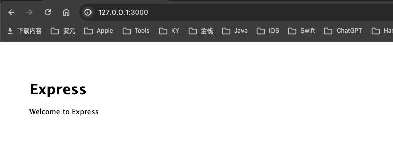
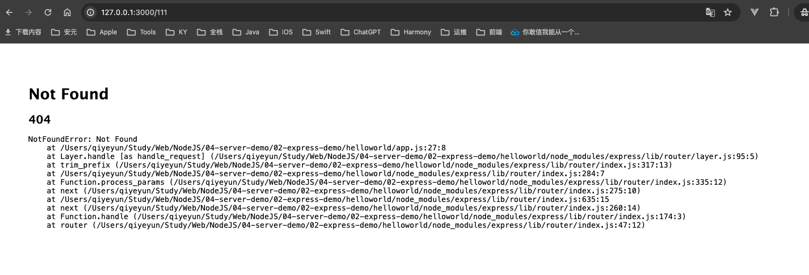
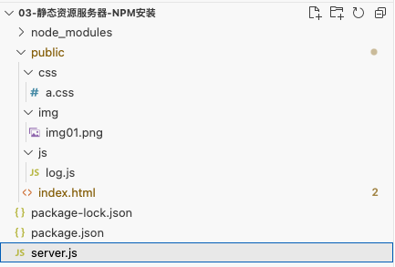

- [Express 官网](https://link.juejin.cn/?target=http%3A%2F%2Fexpressjs.com%2F)
- [Express 中文文档（非官方）](https://link.juejin.cn/?target=http%3A%2F%2Fwww.expressjs.com.cn%2F)
- [Express GitHub仓库](https://link.juejin.cn/?target=https%3A%2F%2Fgithub.com%2Fexpressjs%2Fexpress) 


# 一、Node开发环境

[MDN - 设置 Node 开发环境](https://developer.mozilla.org/zh-CN/docs/Learn/Server-side/Express_Nodejs/development_environment)

* Node.js 
* NPM
* express-generator：Express 应用生成器（可选项）


# 二、Express创建最简单的web服务器

* Demo路径
    * my-code-demo-express-Base/02-express-demo/xxxx
    
        

## a. 使用Express 应用生成器

[MDN - 安装 Express 应用生成器](https://developer.mozilla.org/zh-CN/docs/Learn/Server-side/Express_Nodejs/development_environment#安装_express_应用生成器)

[官方文档 - Express 应用程序生成器](https://www.expressjs.com.cn/starter/generator.html)

### ① 官方介绍

Express 应用程序生成器

通过应用生成器工具 `express-generator` 可以快速创建一个应用的骨架。

你可以通过 `npx` （包含在 Node.js 8.2.0 及更高版本中）命令来运行 Express 应用程序生成器。

```console
$ npx express-generator
```

对于较老的 Node 版本，请通过 npm 将 Express 应用程序生成器安装到全局环境中并使用：

```console
$ npm install -g express-generator
$ express
```


### ② 操作步骤

全局安装

```sh
$ npm install express-generator -g
```

查看是否全局安装成功

```sh
$ npm list -g
/Users/qiyeyun/.nvm/versions/node/v18.16.0/lib
├── @qpaas/lego-cli-v3@3.4.2
├── @vue/cli@5.0.8
├── express-generator@4.16.1         <========  安装成功！
├── npm@9.5.1
├── nrm@1.2.6
├── pnpm@6.35.1
├── sass@1.69.5
├── ts-node@10.9.1
├── typescript@5.2.2
└── yarn@1.22.19
```

创建一个名为 "helloworld" 的 Express 应用：

```sh
$ express helloworld
```

帮助

```sh
$ express --help
```

运行

```sh
$ cd helloworld
$ npm install
$ npm run start
```

打开浏览器并访问 http://127.0.0.1:3000/ 将看到 Express 的默认欢迎页面。



 http://127.0.0.1:3000/111 错误的路由显示：




## b. 安装express npm包

在 `express-demo` 文件夹下执行 `$ npm init -y` 命令，然后一路回车，就会帮我们创建一个 `package.json` 文件，然后再执行 `$ npm install express `来安装express模块，然后改写 `server.js` 。

```js
// 0. 加载 Express
const express = require('express')

// 1. 调用 express() 得到一个 app
//    类似于 http.createServer()
const app = express()

// 2. 设置请求对应的处理函数
//    当客户端以 GET 方法请求 / 的时候就会调用第二个参数：请求处理函数
app.get('/', (req, res) => {
  res.send('hello world')
})

// 3. 监听端口号，启动 Web 服务
app.listen(3000, () => console.log('app listening on port 3000!'))
```

`package.json`中新增script命令：`    "serve": "node app.js",`

运行项目：`npm run serve` 

打开浏览器并访问 http://127.0.0.1:3001/ 将看到返回数据。


# 三、Express 托管静态资源 - web服务器

* [Express官网 - Serving static files in Express](https://expressjs.com/en/starter/static-files.html)

让用户直接访问静态资源是一个web服务器最基本的功能。

例如，如上url分别是请求一张图片，一份样式文件，一份js代码。我们实现的web服务器需要能够直接返回这些文件的内容给客户端浏览器。

在前面学习http模块时，我们已经实现了这些功能了，但是要写很多代码，现在使用express框架，只需一句代码就可以搞定了，这句代码是  `express.static('public')`

```js
// 加载 Express
const express = require('express')

// 1. 调用 express() 得到一个 app
//    类似于 http.createServer()
const app = express();

// 2. 设置请求对应的处理函数
app.use(express.static('public'))

// 3. 监听端口号，启动 Web 服务
app.listen(3003, () => console.log('app listening on port 3003!'))
```



```
根目录
├── public
│   ├── css
│   │   └── index.css
│   ├── img
│   │   └── bg.jpeg
│   ├── js
│   │   └── axios.js
│   └── index.html
└── serve.js     # 服务器
```


## a. 忽略前缀

```js
// 2. 设置请求对应的处理函数
app.use(express.static('public'))
```

此时，所有放在public下的内容可以直接访问，注意，此时在url中并不需要出现public这级目录。在public下新建index.html，可以直接访问到。


## b. 限制前缀

```js
// 限制访问前缀
app.use('/public', express.static('public'))
```

这意味着想要访问public下的内容，必须要在请求url中加上/public


# 四、Express项目结构

* [Best practices for Express app structure](https://www.terlici.com/2014/08/25/best-practices-express-structure.html)
    * [[译]Express应用结构的最佳实践](https://github.com/DavidCai1111/my-blog/issues/17)


