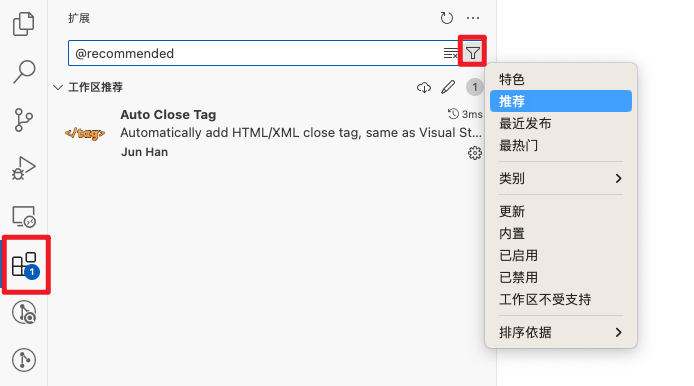
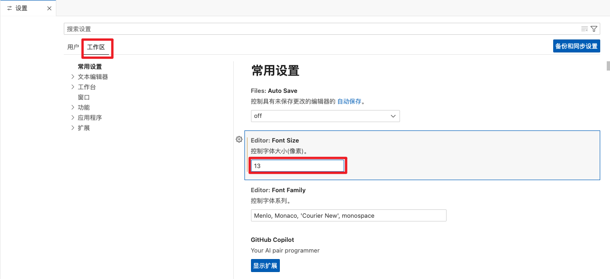
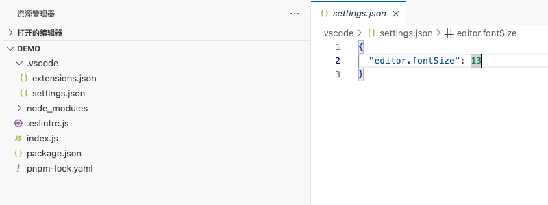
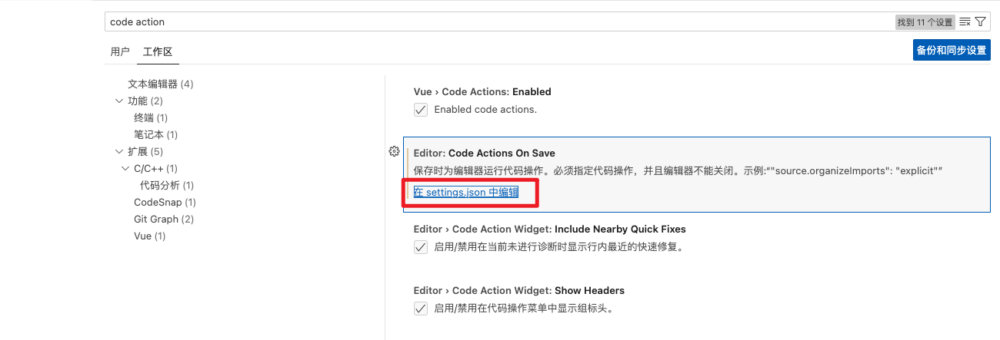
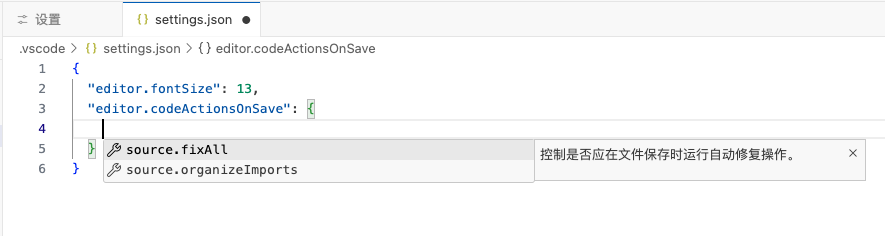
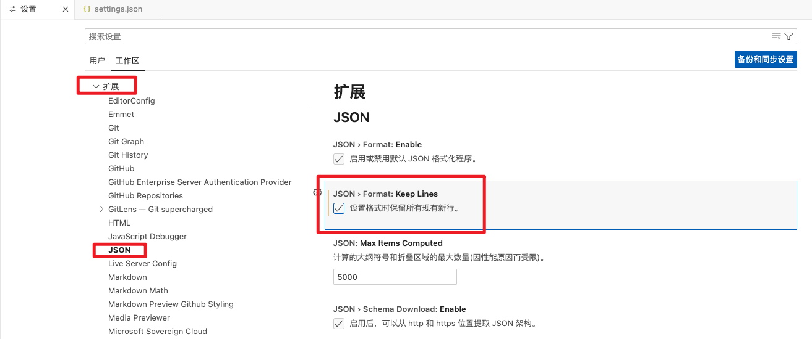
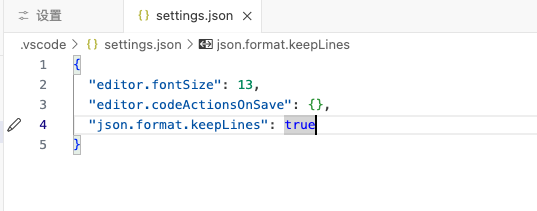
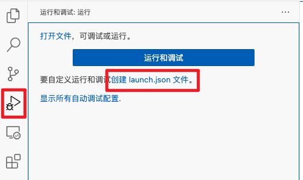
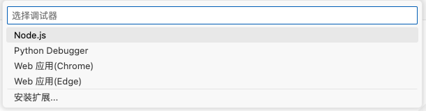
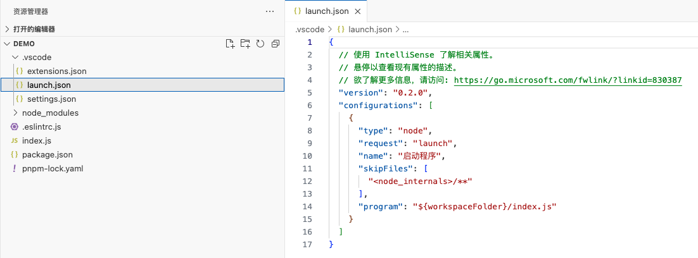

* [.vscode 文件夹是什么，里面有什么？](https://blog.csdn.net/qq_43220213/article/details/129646049)

众所周知，vscode的配置分两类，一是全局的用户配置，二是当前工作区配置。

vscode 打开的文件夹的根目录是一个工作区，`.vscode`目录就是存放当前工作区相关配置文件的目录。

`.vscode`目录下一般有 4 种配置文件和项目中的代码片段：

1. `extensions.json`：推荐当前项目使用的插件
2. `setting.json`：vscode编辑器和插件的相关配置
3. `launch.json`：调试配置文件
4. `task.json`：任务配置
5. `xxxxxxx.code-snippets`：项目中共享的代码片段

# 一、extensions.json

## 1. 将插件添加到工作区

## 2. 查看项目推荐的插件

拿到别人项目，如何查看项目推荐的插件？

# 二、setting.json

创建工作区设置配置文件：

进入工作区设置界面，点击任一【在setting.json中编辑】都会自动创建setting.json文件。

## 1. Editor: Font Size

## 2. Editor: Code Actions On Save

## 3. 修改插件配置

生成 setting.json 文件后，在[可视化](https://so.csdn.net/so/search?q=可视化&spm=1001.2101.3001.7020)的工作区设置界面，修改的设置都会自动添加到 setting.json 文件中。包括对插件的设置。

# 三、launch.json

创建调试配置文件：

选择调试引擎后，就会自动生成调试配置文件，以 node.js 为调试引擎为例：

# 四、task.json

[w3cschool - vscode 如何创建自定义的任务](https://www.w3cschool.cn/vscode/vscode-create-custom-task.html)

之前很多工作都是通过命令行为完成，比如执行一个文件 node test.js。这种工作就可以配置成任务，让vscode一键执行。

# 五、代码片段

[《VSCode  Snippets.md》](../VSCode  Snippets/VSCode  Snippets.md)

