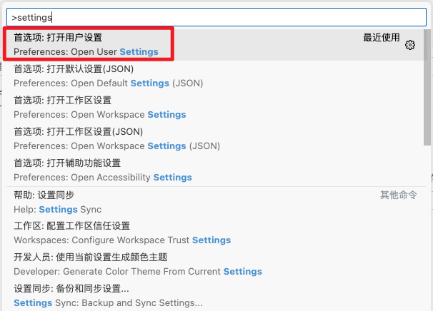
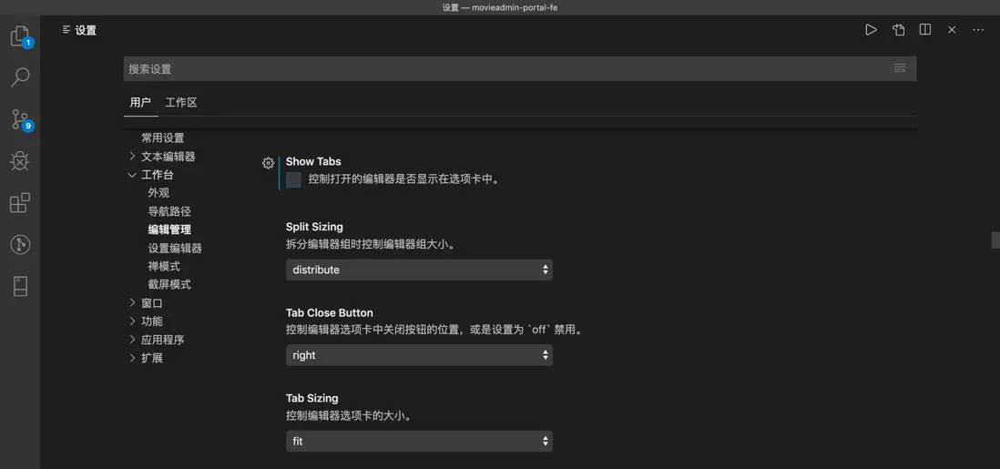
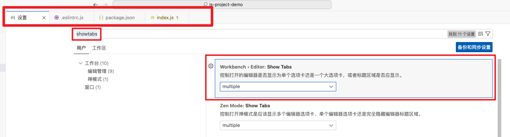
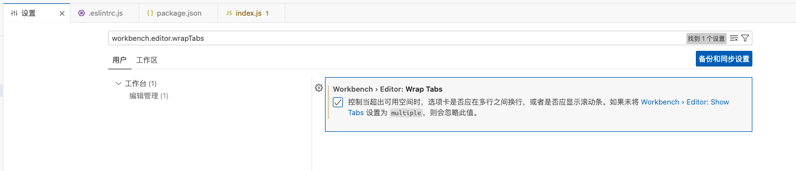

* [Visual Studio Code 教程](https://www.w3cschool.cn/vscode/)


# 1. 打开配置页面

## a. 快捷键

```
Command + ,
```

## b. 设置按钮


## c. 首选项


## d. 控制面板 -> settings




# 2. 控制面板

```
Command + shift + p
```


# 3. 设置成中文

1. 打开控制面板 `Command + shift + p`
2. 搜索框输入：`Configure Display Language`


# 4. 设置页面 - 显示样式

VScode支持选择配置，也支持编辑setting.json文件修改默认配置。

新版的vscode设置默认为UI的设置，而非之前的json设置。如果你想复制我上面这段代码进行配置，可以进行下面的修改

文件>首选项>设置 > 搜索 `workbench.settings.editor`，选中json即可改成json设置；

## a. UI -> Json


## b. Json -> UI


# 5. 用户 VS 工作区

- **用户设置**： 这种方式进行的设置，会应用于该用户打开的所有工程；

- **工作空间设置**：工作空间是指使用VS Code打开的某个文件夹，在该文件夹下会创建一个名为.vscode的隐藏文件夹，里面包含着仅适用于当前目录的VS Code的设置，工作空间的设置会覆盖用户的设置。


## a. GPT

在 Visual Studio Code（VS Code）中，有两种不同的配置方式：工作区配置和用户配置。这两种配置方式的主要区别在于作用范围和优先级。

1. **用户配置（User Settings）：**
    - 用户配置是指对整个 VS Code 应用程序实例生效的配置，会应用于所有工作区和项目。
    - 用户配置位于 VS Code 的用户设置（User Settings）中，可以通过 `File -> Preferences -> Settings` 或快捷键 `Ctrl + ,` 打开用户设置。
    - 用户配置一般用于全局设置，比如主题、字体大小、代码格式化选项等。
2. **工作区配置（Workspace Settings）：**
    - 工作区配置是指对当前打开的工作区或项目生效的配置，只在当前工作区中生效。
    - 工作区配置位于工作区文件夹中的 `.vscode/settings.json` 文件中，也可以通过 VS Code 的设置界面进行配置。
    - 工作区配置可以覆盖用户配置中的相同设置，允许在不同项目中使用不同的配置。

主要区别：

- 用户配置是全局设置，对所有工作区和项目生效；工作区配置是针对当前工作区或项目的设置。
- 工作区配置具有更高的优先级，可以覆盖用户配置中的相同设置。

根据不同的需求和场景，您可以选择使用用户配置或工作区配置来定制和管理您的 VS Code 环墋。这种灵活的配置方式可以帮助您更好地适应不同的开发环境和项目需求。希望这个解释对您有所帮助。


# 6. 缩进


# 7. 文件标签栏

## a. 标签栏不见了？

> 设置页 -》 搜索"showtabs"






## b. 标签栏多行显示

> ### 输入workbench.editor.wrapTabs，勾选该设置项即可




