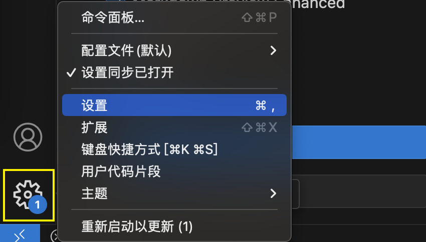
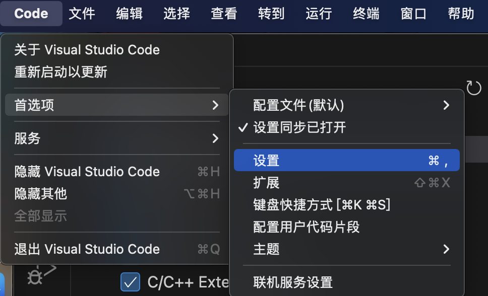
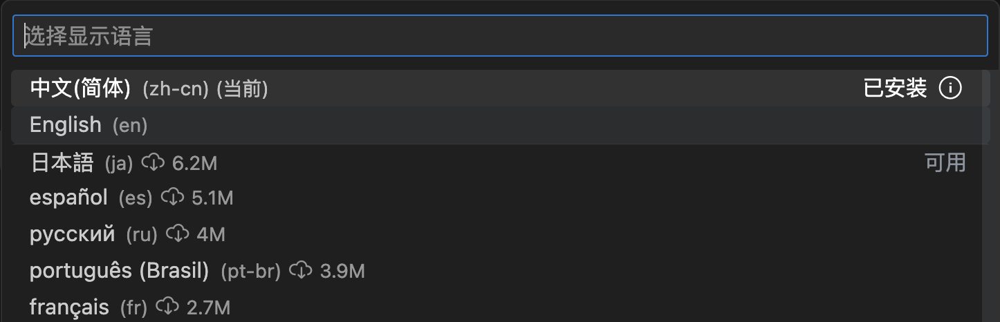
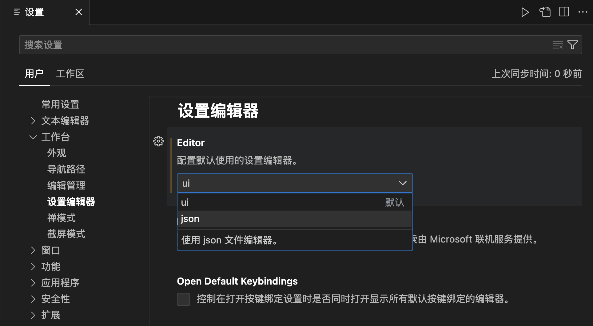
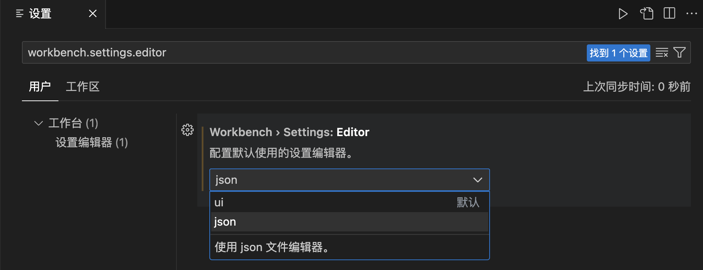
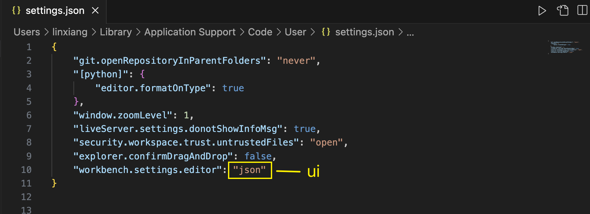
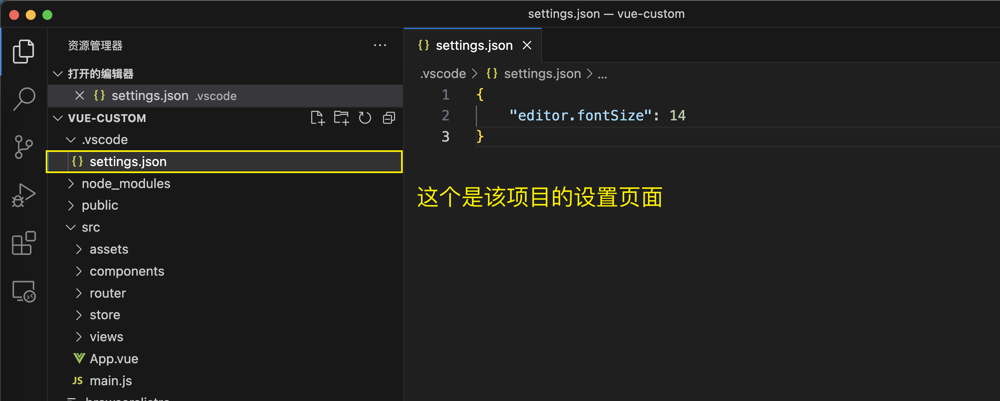
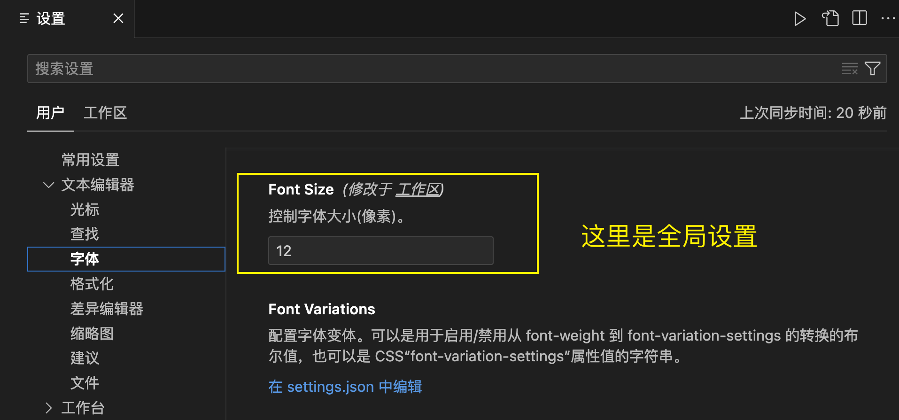
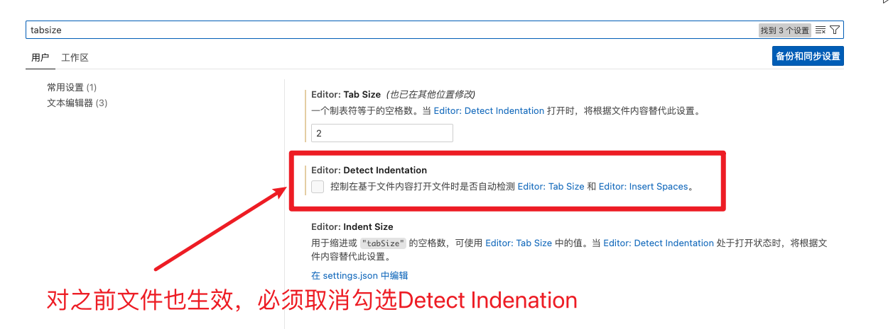

# 打开配置页面

## 1. 快捷键

```
Command + ,
```

## 2. 设置按钮



## 3. 首选项




# 控制面板

```
Command + shift + p
```


# 设置成中文

1. 打开控制面板 `Command + shift + p`
2. 搜索框输入：`Configure Display Language`




# 设置页面 - 显示样式

VScode支持选择配置，也支持编辑setting.json文件修改默认配置。

新版的vscode设置默认为UI的设置，而非之前的json设置。如果你想复制我上面这段代码进行配置，可以进行下面的修改

文件>首选项>设置 > 搜索 `workbench.settings.editor`，选中json即可改成json设置；

## UI -> Json





## Json -> UI




# 用户 VS 工作区

- **用户设置**： 这种方式进行的设置，会应用于该用户打开的所有工程；

- **工作空间设置**：工作空间是指使用VS Code打开的某个文件夹，在该文件夹下会创建一个名为.vscode的隐藏文件夹，里面包含着仅适用于当前目录的VS Code的设置，工作空间的设置会覆盖用户的设置。






# 缩进




