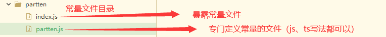
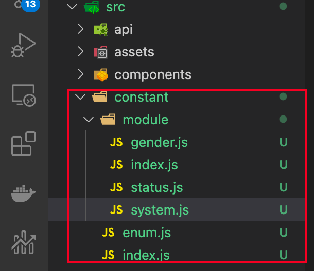

# 一、js中的常量 

## 方式一

[原文](https://blog.csdn.net/qq_41193701/article/details/104990501)



**partten.js 文件用于存放需要的常量 使用export const 进行声明（此处以正则位例）**

```js
export const textLength = 30;

export const areaLength = 500;

export const phoneNum =  /^((1[3,5,8][0-9])|(14[5,7])|(17[0,6,7,8])|(19[7]))\d{8}$/;

export const email = /^\w+([-+.]\w+)*@\w+([-.]\w+)*\.\w+([-.]\w+)*$/;
```

**index.js文件 暴露**

```js
import * as Partten from './partten.js';
export {
  	Partten
};
```

**项目中引用**

```js
import { Partten } from "@/partten"

created() {
	// 我们这里先直接输出Partten
	console.log('常量', Partten.phoneNum)
},
```


## 方式二

[原文](https://www.cnblogs.com/zhangruifeng/p/16449092.html)

一般我们会在一个单独的js文件中定义常量，如：

```js
export const SYSTEM_NAME = 'RAYF管理系统'
export const SYSTEM_VERSION = '1.0'

// 角色性别
export const ROLE_GENDER = {
  MAN: {
    value: '0',
    desc: '男'
  },
  WOMAN: {
    value: '1',
    desc: '女'
  }
}
```

如果需要使用，只需要在相应的页面加入 `import` 即可

```js
import { ROLE_GENDER } from '@/constant/module/gender'
import { APPINFO, SYSTEM_NAME, SYSTEM_VERSION } from '@/constant/module/system' 
```

或   再封装一层，添加一些逻辑判断

```js
// 统一管理常量的入口
import { ROLE_GENDER } from '@/constant/module/gender'
import { APPINFO, SYSTEM_NAME, SYSTEM_VERSION } from '@/constant/module/system' 

// 逻辑判断
let appDesc = '百度app'
if (APPINFO.SYSTEM_NAME === 'RA系统') {
  appDesc = APPINFO.SYSTEM_NAME
}

export { APPINFO, ROLE_GENDER, appDesc }
```

> ## 但这样做有一个弊端，无法在页面上直接使用，只能在 `<script></script>` 内使用，如果想在页面内使用，不妨试试下面的方法。


## 将常量挂载到原型

```js
Vue.prototype.NET = net

console.log(this.NET.BASE_URL);
```

## 全局常量

为了解决上面的问题，我们可以将常量封装为全局常量，使用方法也非常的简单。

1、创建constant文件夹

在src下创建`constant`文件夹，用于存放全局常量相关配置，创建好后在其内创建`module`文件夹，用于存放常量文件。

`constant`内的`enum.js`和`index.js`，`module`内的`index.js`的代码可以直接参照下面来写。`module`其他的js文件存储章节1中的普通常量文件即可。



`constant\module\index.js`

```
/** module/index.js
 * 常量枚举池
 * 可以根据文件对枚举所属的模块进行拆分
 * 此文件主要是收集模块常量然后统一暴露出去
 */

const EnumModule = {}

const req = context => context.keys().map(context)
const options = req(require.context('./', true, /\.js$/)) // 批量导入当前文件所在目录下的.js文件

options.forEach(option => {
  Object.assign(EnumModule, {
    ...option
  })
})

export default EnumModule
```


`constant\enum.js`

```
/** enum.js
 * 枚举工具类的定义
 * 可以全局使用this.$enum.getDescByValue()等等...
 */

const EnumUtil = {}

EnumUtil.install = function (Vue, data) {
  const constantInfo = data || {}
  const Enum = { ...data }
  /**
   * 根据枚举值获取描述
   * @param {*} constantName  枚举对象的名字
   * @param {*} value         枚举值
   * @param {*} desc          枚举值所对应的描述
   */
  Enum.getDescByValue = function (constantName, value) {
    if (!constantInfo.hasOwnProperty(constantName)) {
      return ''
    }
    let constantItem = constantInfo[constantName] // 通过传进来的名字拿到所对应的常量项
    for (let item in constantItem) {
      // 循环常量项
      if (constantItem[item].value === value) {
        return constantItem[item].desc
      }
    }
  }

  Vue.prototype.$enum = Enum // 挂在原型上，方便使用
}

export default EnumUtil
```


`constant\index.js`

```
// constant/index.js

import Vue from 'vue'
import Enum from './enum'
import EnumModule from './module'

Vue.use(Enum, EnumModule)
```


最后在`main.js`内引入

```js
// 引入常量
import './constant/'
```

> ### 此时，就可以在页面内使用常量了，使用方法：`<div>{{ $enum.SYSTEM_NAME }}</div>`


