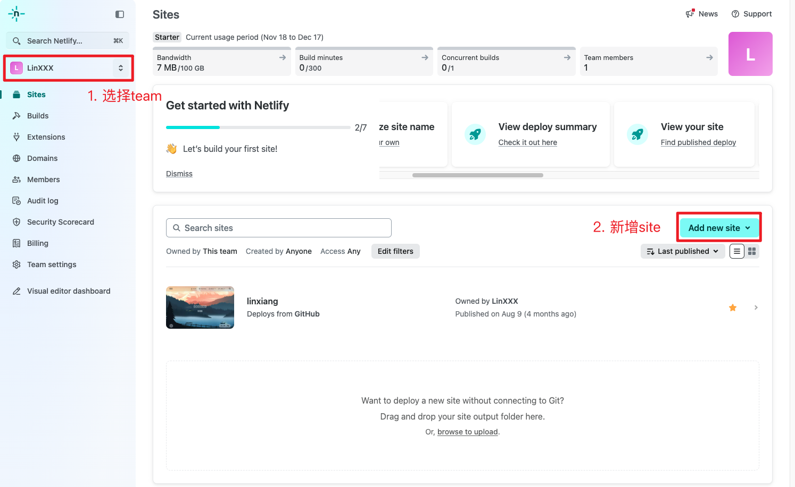
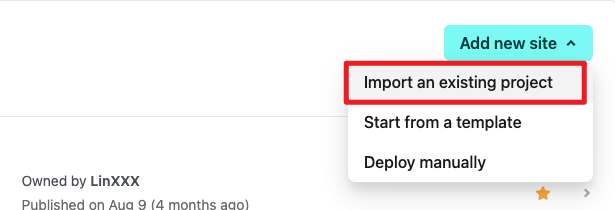
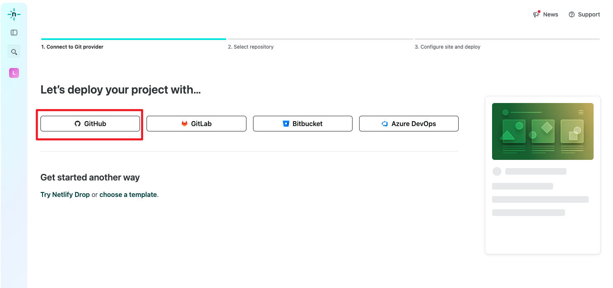
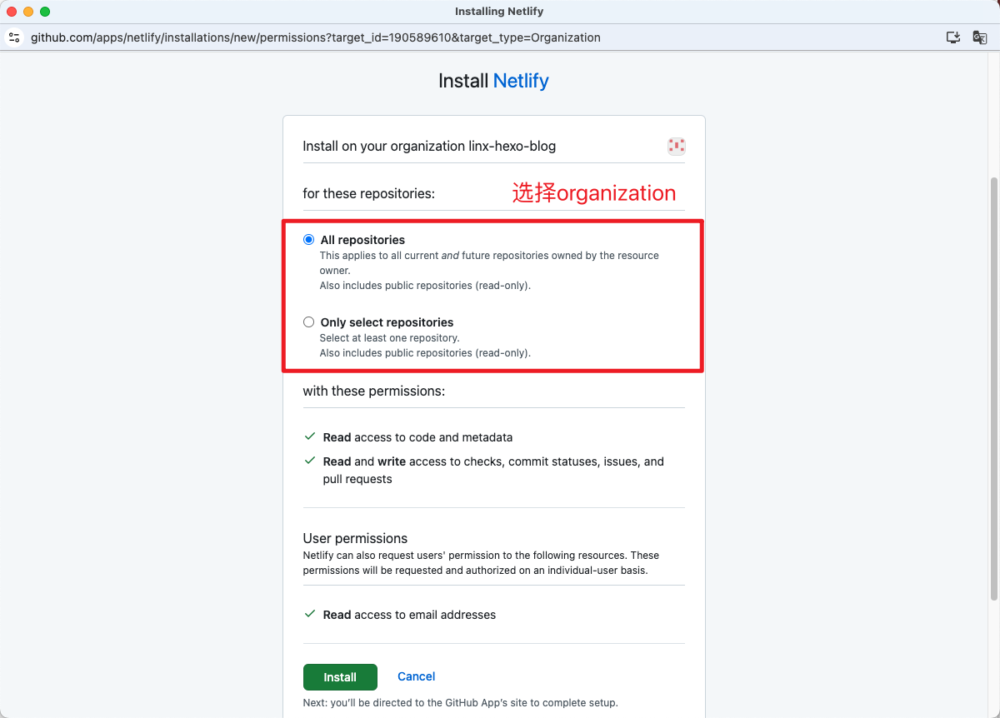
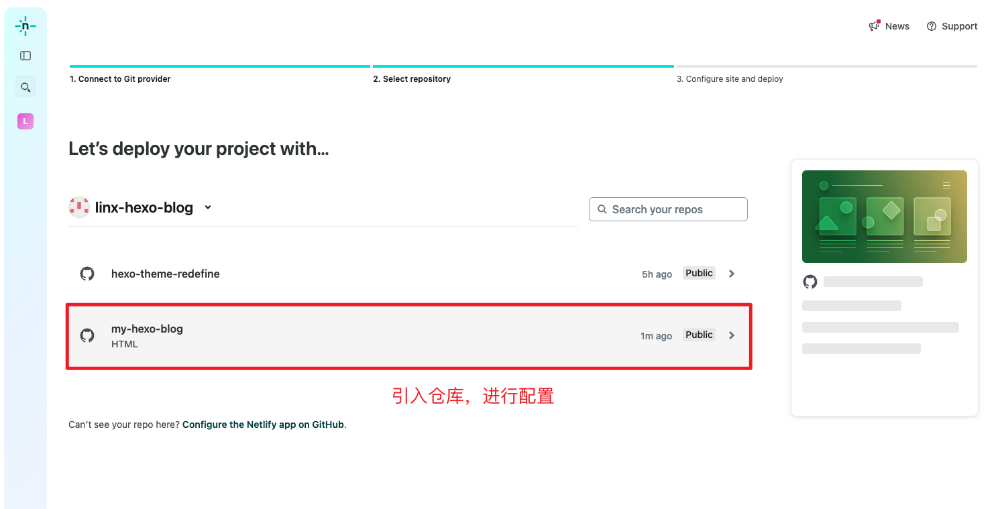
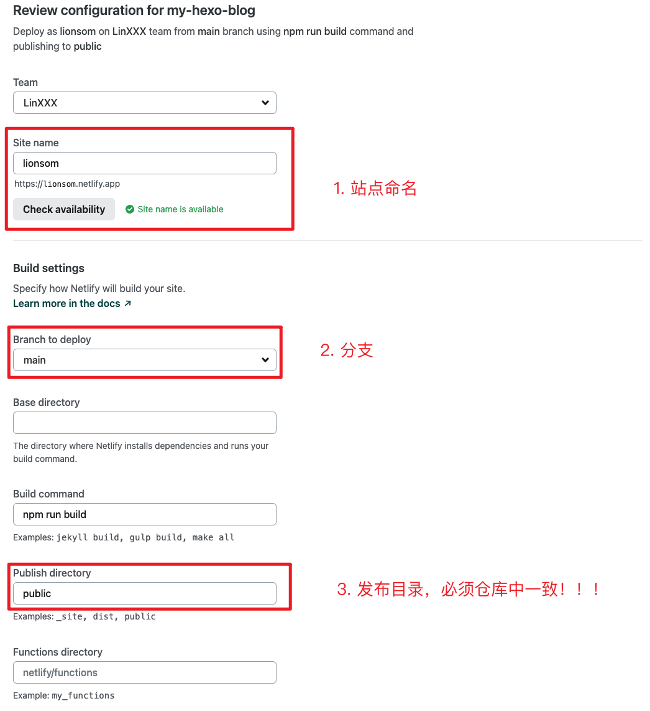
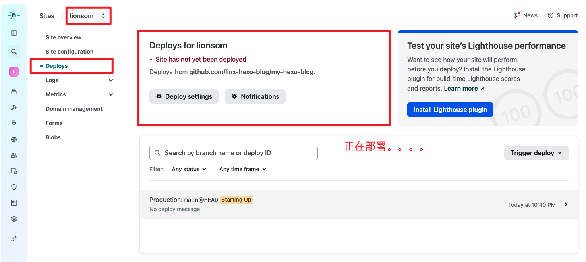
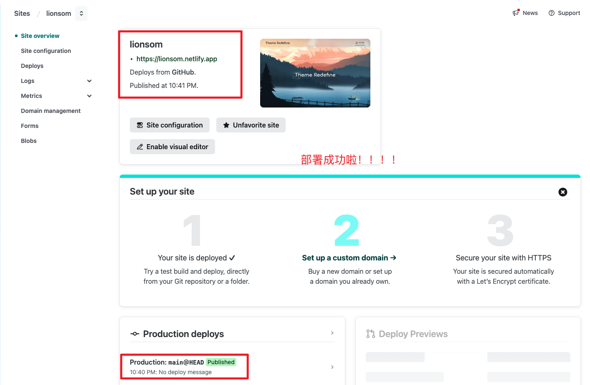
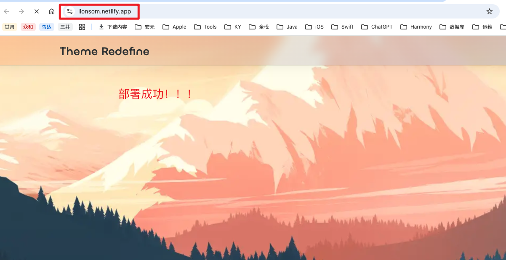

# 文档

* [2018 - Mac+Hexo+github搭建myblog完整版 ](https://www.jianshu.com/p/0206f62000a1)
* [2024 - hexo实操](https://linxiang.netlify.app/tags/hexo/)

# 仓库

* hexo仓库：https://github.com/linx-hexo-blog/my-hexo-blog

* hexo theme fork仓库：https://github.com/linx-hexo-blog/hexo-theme-redefine

# Netlify实操

* 官网：https://www.netlify.com/

## 1. 新建site

## 2. 选择仓库

## 3. 发布配置

## 4. 发布成功

