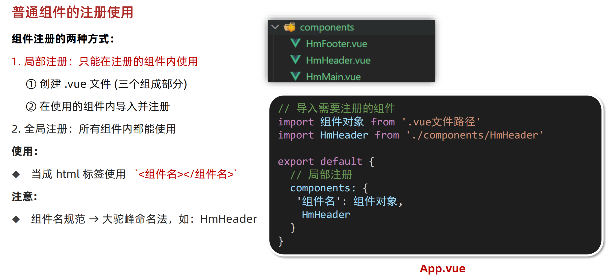
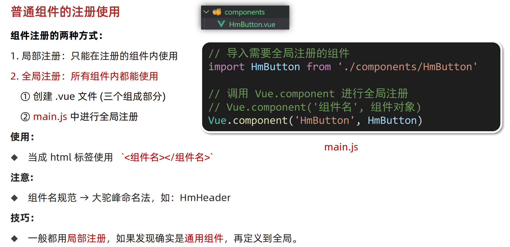
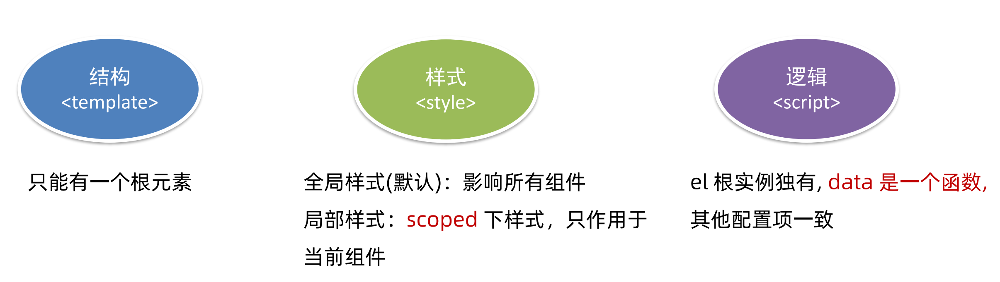
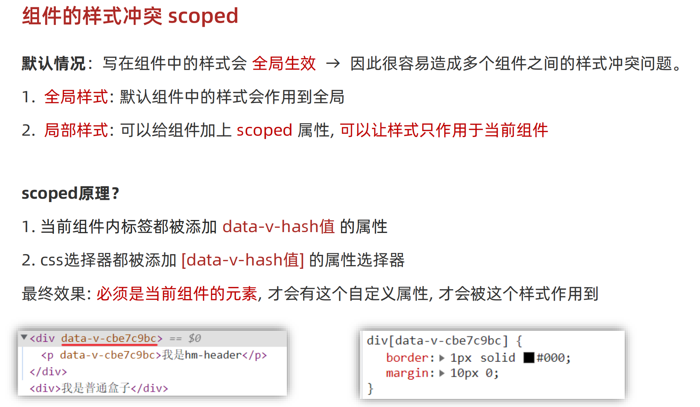
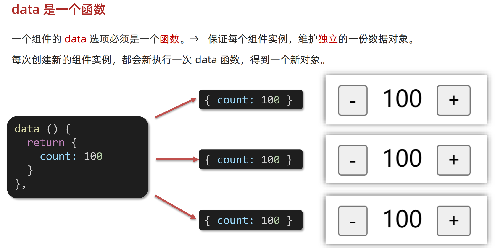

# 一、App.Vue是根组件

快速生成Vue代码

`<vue>`


# 二、普通组件的注册使用

## 2.1 局部注册

### 1. 概述




### 2. 实操代码

#### 1. App.Vue

```vue
<template>
  <div class="App">
    <!-- 头部组件 -->
    <HmHeader></HmHeader>
    <!-- 主体组件 -->
    <HmMain></HmMain>
    <!-- 底部组件 -->
    <HmFooter></HmFooter>

    <!-- 如果 HmFooter + tab 出不来 → 需要配置 vscode
         设置中搜索 trigger on tab → 勾上
    -->
  </div>
</template>

<script>
import HmHeader from './components/HmHeader.vue'
import HmMain from './components/HmMain.vue'
import HmFooter from './components/HmFooter.vue'
export default {
  components: {
    // '组件名': 组件对象
    HmHeader: HmHeader,
    HmMain,
    HmFooter
  }
}
</script>

<style>
.App {
  width: 600px;
  height: 700px;
  background-color: #87ceeb;
  margin: 0 auto;
  padding: 20px;
}
</style>
```


#### 2. HmHeader组件

```vue
<template>
  <div class="hm-header">
    我是hm-header
  </div>
</template>

<script>
export default {

}
</script>

<style>
.hm-header {
  height: 100px;
  line-height: 100px;
  text-align: center;
  font-size: 30px;
  background-color: #8064a2;
  color: white;
}
</style>
```


#### 3. HmMain组件

```vue
<template>
  <div class="hm-main">
    我是hm-main
  </div>
</template>

<script>
export default {

}
</script>

<style>
.hm-main {
  height: 400px;
  line-height: 400px;
  text-align: center;
  font-size: 30px;
  background-color: #f79646;
  color: white;
  margin: 20px 0;
}
</style>
```


#### 4. HmFooter组件

```vue
<template>
  <div class="hm-footer">
    我是hm-footer
  </div>
</template>

<script>
export default {

}
</script>

<style>
.hm-footer {
  height: 100px;
  line-height: 100px;
  text-align: center;
  font-size: 30px;
  background-color: #4f81bd;
  color: white;
}
</style>
```


## 2.2 全局注册

### 1. 概述




### 2. 代码实操

#### 1. HmButton.vue全局组件

```vue
<template>
  <button class="hm-button">通用按钮</button>
</template>

<script>
export default {

}
</script>

<style>
.hm-button {
  height: 50px;
  line-height: 50px;
  padding: 0 20px;
  background-color: #3bae56;
  border-radius: 5px;
  color: white;
  border: none;
  vertical-align: middle;
  cursor: pointer;
}
</style>
```

#### 2. main.js中注册全局组件

```js
// 编写导入的代码，往代码的顶部编写(规范)
import HmButton from './components/HmButton'

// 进行全局注册 → 在所有的组件范围内都能直接使用
// Vue.component(组件名，组件对象)
Vue.component('HmButton', HmButton)
```

#### 3. HmFooter组件中调用全局组件

```vue
<template>
    <div class="hm-footer">
        我是hm-footer

        <LxButton>ddd</LxButton>
        <LxButton>ddd</LxButton>
    </div>

</template>

<script>

</script>

<style>
.hm-footer {
  height: 100px;
  line-height: 100px;
  text-align: center;
  font-size: 30px;
  background-color: #4f81bd;
  color: white;
}
</style>
```


# 三、组件注意



## 3.1 template只有一个根元素

Vue2 `<template>`  必须只有一个根元素；

Vue3 无此规定。


## 3.2 组件的样式问题




## 3.3 data是一个函数




```vue
<template>
  <div class="base-count">
    <button @click="count--">-</button>
    <span>{{ count }}</span>
    <button @click="count++">+</button>
  </div>
</template>

<script>
export default {
  // data() {
  //   console.log('函数执行了')
  //   return {
  //     count: 100,
  //   }
  // },
  data: function () {   // 函数
    return {
      count: 100,
    }
  },
}
</script>

<style>
.base-count {
  margin: 20px;
}
</style>
```


