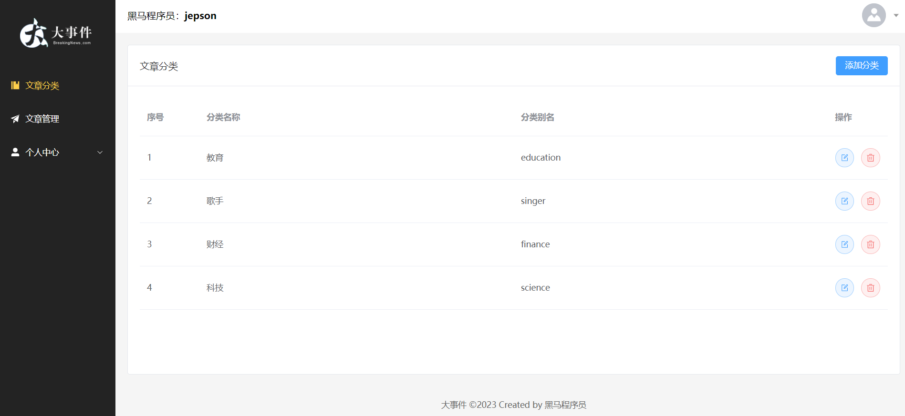
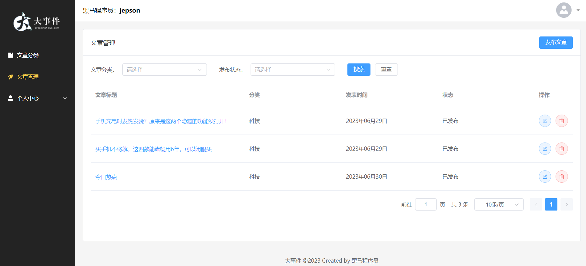
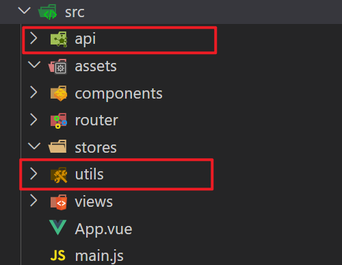
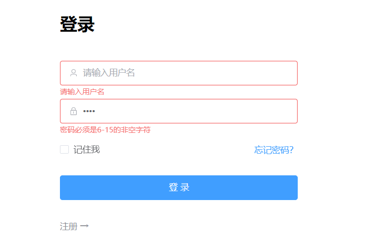

# 后台数据管理系统 - 项目架构设计

在线演示：https://fe-bigevent-web.itheima.net/login

接口文档:   https://apifox.com/apidoc/shared-26c67aee-0233-4d23-aab7-08448fdf95ff/api-93850835

**接口根路径：**  http://big-event-vue-api-t.itheima.net

本项目的技术栈 本项目技术栈基于 [ES6](http://es6.ruanyifeng.com/)、[vue3](https://cn.vuejs.org/index.html)、[pinia](https://pinia.web3doc.top/)、[vue-router](https://router.vuejs.org/) 、vite 、axios 和 [element-plus](https://element-plus.org/)


## 项目页面介绍







## pnpm 包管理器 - 创建项目

一些优势：比同类工具快 2倍 左右、节省磁盘空间... https://www.pnpm.cn/

安装方式：

```
npm install -g pnpm
```

创建项目：

```
pnpm create vue
```


## ESLint & prettier 配置代码风格

**环境同步：**

1. **安装了插件 ESlint，开启保存自动修复**
2. **禁用了插件 Prettier，并关闭保存自动格式化**

```jsx
// ESlint插件 + Vscode配置 实现自动格式化修复
"editor.codeActionsOnSave": {
    "source.fixAll": true
},
"editor.formatOnSave": false,
```

**配置文件 .eslintrc.cjs**

1. prettier 风格配置 [https://prettier.io](https://prettier.io/docs/en/options.html )

   1. 单引号

   2. 不使用分号

   3. 每行宽度至多80字符

   4. 不加对象|数组最后逗号

   5. 换行符号不限制（win mac 不一致）

2. vue组件名称多单词组成（忽略index.vue）

3. props解构（关闭）

```jsx
  rules: {
    'prettier/prettier': [
      'warn',
      {
        singleQuote: true, // 单引号
        semi: false, // 无分号
        printWidth: 80, // 每行宽度至多80字符
        trailingComma: 'none', // 不加对象|数组最后逗号
        endOfLine: 'auto' // 换行符号不限制（win mac 不一致）
      }
    ],
    'vue/multi-word-component-names': [
      'warn',
      {
        ignores: ['index'] // vue组件名称多单词组成（忽略index.vue）
      }
    ],
    'vue/no-setup-props-destructure': ['off'], // 关闭 props 解构的校验
    // 💡 添加未定义变量错误提示，create-vue@3.6.3 关闭，这里加上是为了支持下一个章节演示。
    'no-undef': 'error'
  }
```


## 基于 husky  的代码检查工作流

husky 是一个 git hooks 工具  ( git的钩子工具，可以在特定时机执行特定的命令 )

**husky 配置**

1. git初始化 git init

2. 初始化 husky 工具配置  https://typicode.github.io/husky/

```jsx
pnpm dlx husky-init && pnpm install
```

3. 修改 .husky/pre-commit 文件

```jsx
pnpm lint
```

**问题：**默认进行的是全量检查，耗时问题，历史问题。


**lint-staged 配置**

1. 安装

```jsx
pnpm i lint-staged -D
```

2. 配置 `package.json`

```jsx
{
  // ... 省略 ...
  "lint-staged": {
    "*.{js,ts,vue}": [
      "eslint --fix"
    ]
  }
}

{
  "scripts": {
    // ... 省略 ...
    "lint-staged": "lint-staged"
  }
}
```

3. 修改 .husky/pre-commit 文件

```jsx
pnpm lint-staged
```


## 调整项目目录

默认生成的目录结构不满足我们的开发需求，所以这里需要做一些自定义改动。主要是两个工作：

- 删除初始化的默认文件
- 修改剩余代码内容
- 新增调整我们需要的目录结构
- 拷贝初始化资源文件，安装预处理器插件

1. 删除文件

2. 修改内容

`src/router/index.js`

```jsx
import { createRouter, createWebHistory } from 'vue-router'

const router = createRouter({
  history: createWebHistory(import.meta.env.BASE_URL),
  routes: []
})

export default router
```

`src/App.vue`

```jsx
<script setup></script>

<template>
  <div>
    <router-view></router-view>
  </div>
</template>

<style scoped></style>
```

`src/main.js`

```jsx
import { createApp } from 'vue'
import { createPinia } from 'pinia'

import App from './App.vue'
import router from './router'

const app = createApp(App)

app.use(createPinia())
app.use(router)
app.mount('#app')
```

3. 新增需要目录 api  utils



4. 将项目需要的全局样式 和 图片文件，复制到 assets 文件夹中,  并将全局样式在main.js中引入

```jsx
import '@/assets/main.scss'
```

- 安装 sass 依赖

```jsx
pnpm add sass -D
```


## VueRouter4 路由代码解析

基础代码解析

```jsx
import { createRouter, createWebHistory } from 'vue-router'

// createRouter 创建路由实例，===> new VueRouter()
// 1. history模式: createWebHistory()   http://xxx/user
// 2. hash模式: createWebHashHistory()  http://xxx/#/user

// vite 的配置 import.meta.env.BASE_URL 是路由的基准地址，默认是 ’/‘
// https://vitejs.dev/guide/build.html#public-base-path

// 如果将来你部署的域名路径是：http://xxx/my-path/user
// vite.config.ts  添加配置  base: my-path，路由这就会加上 my-path 前缀了

const router = createRouter({
  history: createWebHistory(import.meta.env.BASE_URL),
  routes: []
})

export default router
```

import.meta.env.BASE_URL 是Vite 环境变量：[https://cn.vitejs.dev/guide/env-and-mode.html](https://cn.vitejs.dev/guide/env-and-mode.html)


## 引入 element-ui 组件库

**官方文档：** https://element-plus.org/zh-CN/

- 安装

```jsx
$ pnpm add element-plus
```

**自动按需：**

1. 安装插件

```jsx
pnpm add -D unplugin-vue-components unplugin-auto-import
```

2. 然后把下列代码插入到你的 `Vite` 或 `Webpack` 的配置文件中

```jsx
...
import AutoImport from 'unplugin-auto-import/vite'
import Components from 'unplugin-vue-components/vite'
import { ElementPlusResolver } from 'unplugin-vue-components/resolvers'

// https://vitejs.dev/config/
export default defineConfig({
  plugins: [
    ...
    AutoImport({
      resolvers: [ElementPlusResolver()]
    }),
    Components({
      resolvers: [ElementPlusResolver()]
    })
  ]
})

```

3. 直接使用

```jsx
<template>
  <div>
    <el-button type="primary">Primary</el-button>
    <el-button type="success">Success</el-button>
    <el-button type="info">Info</el-button>
    <el-button type="warning">Warning</el-button>
    <el-button type="danger">Danger</el-button>
    ...
  </div>
</template>
```


**彩蛋：**默认 components 下的文件也会被自动注册~


## Pinia - 构建用户仓库 和 持久化

官方文档：https://prazdevs.github.io/pinia-plugin-persistedstate/zh/

1. 安装插件 pinia-plugin-persistedstate

```jsx
pnpm add pinia-plugin-persistedstate -D
```

2. 使用 main.js

```jsx
import persist from 'pinia-plugin-persistedstate'
...
app.use(createPinia().use(persist))
```

3. 配置 stores/user.js

```jsx
import { defineStore } from 'pinia'
import { ref } from 'vue'

// 用户模块
export const useUserStore = defineStore(
  'big-user',
  () => {
    const token = ref('') // 定义 token
    const setToken = (t) => (token.value = t) // 设置 token

    return { token, setToken }
  },
  {
    persist: true // 持久化
  }
)

```


## Pinia - 配置仓库统一管理

pinia 独立维护

\- 现在：初始化代码在 main.js 中，仓库代码在 stores 中，代码分散职能不单一

\- 优化：由 stores 统一维护，在 stores/index.js 中完成 pinia 初始化，交付 main.js 使用


仓库 统一导出

\- 现在：使用一个仓库 import { useUserStore } from `./stores/user.js` 不同仓库路径不一致

\- 优化：由 stores/index.js 统一导出，导入路径统一 `./stores`，而且仓库维护在 stores/modules 中


## 数据交互 - 请求工具设计


### 1. 创建 axios 实例

们会使用 axios 来请求后端接口, 一般都会对 axios 进行一些配置 (比如: 配置基础地址等)

一般项目开发中, 都会对 axios 进行基本的二次封装, 单独封装到一个模块中, 便于使用

1. 安装 axios

```
pnpm add axios
```

2. 新建 `utils/request.js` 封装 axios 模块

   利用 axios.create 创建一个自定义的 axios 来使用

   http://www.axios-js.com/zh-cn/docs/#axios-create-config

```js
import axios from 'axios'

const baseURL = 'http://big-event-vue-api-t.itheima.net'

const instance = axios.create({
  // TODO 1. 基础地址，超时时间
})

instance.interceptors.request.use(
  (config) => {
    // TODO 2. 携带token
    return config
  },
  (err) => Promise.reject(err)
)

instance.interceptors.response.use(
  (res) => {
    // TODO 3. 处理业务失败
    // TODO 4. 摘取核心响应数据
    return res
  },
  (err) => {
    // TODO 5. 处理401错误
    return Promise.reject(err)
  }
)

export default instance
```


### 2. 完成 axios 基本配置 

```jsx
import { useUserStore } from '@/stores/user'
import axios from 'axios'
import router from '@/router'
import { ElMessage } from 'element-plus'

const baseURL = 'http://big-event-vue-api-t.itheima.net'

const instance = axios.create({
  baseURL,
  timeout: 100000
})

instance.interceptors.request.use(
  (config) => {
    const userStore = useUserStore()
    if (userStore.token) {
      config.headers.Authorization = userStore.token
    }
    return config
  },
  (err) => Promise.reject(err)
)

instance.interceptors.response.use(
  (res) => {
    if (res.data.code === 0) {
      return res
    }
    ElMessage({ message: res.data.message || '服务异常', type: 'error' })
    return Promise.reject(res.data)
  },
  (err) => {
    ElMessage({ message: err.response.data.message || '服务异常', type: 'error' })
    console.log(err)
    if (err.response?.status === 401) {
      router.push('/login')
    }
    return Promise.reject(err)
  }
)

export default instance
export { baseURL }

```


## 首页整体路由设计

**实现目标:**

- 完成整体路由规划【搞清楚要做几个页面，它们分别在哪个路由下面，怎么跳转的.....】
- 通过观察,  点击左侧导航,  右侧区域在切换,  那右侧区域内容一直在变,  那这个地方就是一个路由的出口
- 我们需要搭建嵌套路由

目标：

- 把项目中所有用到的组件及路由表, 约定下来

**约定路由规则**

| path                | 文件                             | 功能      | 组件名          | 路由级别 |
| ------------------- | -------------------------------- | --------- | --------------- | -------- |
| /login              | views/login/LoginPage.vue        | 登录&注册 | LoginPage       | 一级路由 |
| /                   | views/layout/LayoutContainer.vue | 布局架子  | LayoutContainer | 一级路由 |
| ├─ /article/manage  | views/article/ArticleManage.vue  | 文章管理  | ArticleManage   | 二级路由 |
| ├─ /article/channel | views/article/ArticleChannel.vue | 频道管理  | ArticleChannel  | 二级路由 |
| ├─ /user/profile    | views/user/UserProfile.vue       | 个人详情  | UserProfile     | 二级路由 |
| ├─ /user/avatar     | views/user/UserAvatar.vue        | 更换头像  | UserAvatar      | 二级路由 |
| ├─ /user/password   | views/user/UserPassword.vue      | 重置密码  | UserPassword    | 二级路由 |

明确了路由规则，可以全部配完，也可以边写边配。


# 登录页面 (预习作业)

## 登录效果图


## 创建组件&配置路由


## 实现表单预校验

【需求说明】给输入框添加表单校验

1. 用户名不能为空，用户名必须是5-10位的字符，失去焦点 和 修改内容时触发校验
2. 密码不能为空，密码必须是6-15位的字符，失去焦点 和 修改内容时触发校验


## 登录操作

### 登录前的预校验

【需求说明】登录之前的预校验

- 登录请求之前，需要对用户的输入内容，进行校验
- 校验通过才发送请求




### 登录完成

【需求说明】**登录功能**

1. 封装登录API，点击按钮发送登录请求
2. 登录成功存储token，存入pinia 和 持久化本地storage
3. 跳转到首页，给提示

【测试账号】

- 登录的测试账号:  shuaipeng

- 登录测试密码:  123456

PS: 每天账号会重置，如果被重置了，可以去注册页，注册一个新号


# 注册页面 (预习作业)

## 效果图


## 注册页面切换


## 实现注册页面表单基本校验

【需求】注册页面基本校验

1. 用户名非空，长度校验5-11位
2. 密码非空，长度校验6-15位
3. 再次输入密码，非空，长度校验6-15位

【进阶】再次输入密码需要自定义校验规则，和密码框值一致（可选）


## 点击注册按钮实现注册

【需求】注册功能

- 注册之前进行校验
- 封装注册api，进行注册，注册成功切换到登录
