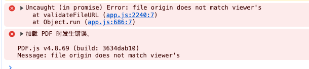
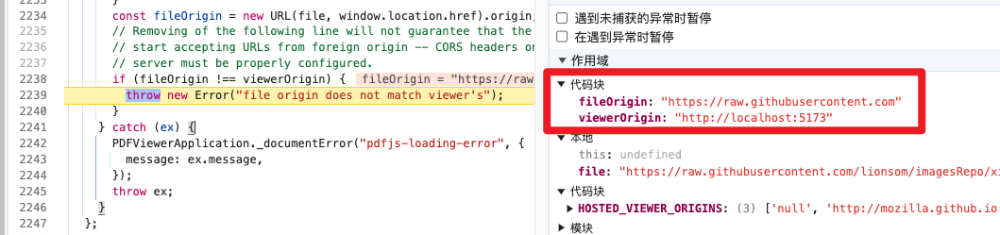
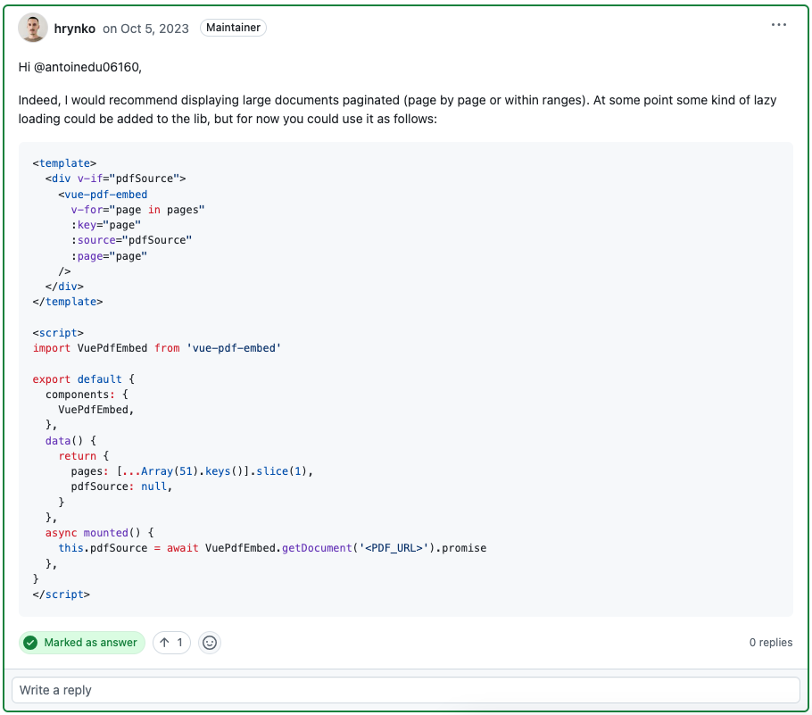

* [前端实现 PDF 预览的常见方案](https://juejin.cn/post/7143088940953075743#heading-6)


# 方案一：`pdfjs-dist`

* [pdfjs-dist - npm](https://www.npmjs.com/package/pdfjs-dist)
* [pdf.js - github](https://github.com/mozilla/pdf.js)
* [pdf.js - 官网](https://mozilla.github.io/pdf.js/)

* [vue3中如何使用pdfjs来展示pdf文档](https://juejin.cn/post/7277475232320536633#heading-0)
    * [前端预览 PDF 文件（使用PDFJS）](https://segmentfault.com/a/1190000040331855)


## 方法一：手搓代码

>  		pdfjs展示pdf文档的原理，实际上是将pdf中的内容渲染到解析，然后渲染到 `canvas` 中进行展示，因此我们使用pdfjs渲染出来的pdf文件，实际上是一张张canvas图片。

1. 首先 `npm i pdfjs-dist` 下载 pdf.js 的 Prebuilt 包
2. 设置 `PDFJS.GlobalWorkerOptions.workerSrc` 的地址
3. 通过 `PDFJS.getDocument`（pdf 文件的 url） 处理 pdf 数据，返回一个 `PDFDocumentLoadingTask`
4. 通过 `pdfDoc.getPage(i)` 单独获取第 i 页的数据
5. 创建一个 canvas 元素，并设置元素的画布属性
6. 通过 `page.render` 方法，将数据渲染到画布上

```js
// 第 2 步：设置 workerSrc 地址 （具体包的地址需要依自身项目决定）
import * as PDFJS from "./build/pdf.js";
import pdfjsWorker from "./build/pdf.worker.js";
PDFJS.GlobalWorkerOptions.workerSrc = pdfjsWorker;
const pdfUrl = "./test.pdf"; //具体路径由自身项目决定，另外这可能会涉及跨域问题可参照官网解决
console.log(pdfUrl);
// 第 3 步：使用 PDFJS.getDocument（） 处理 pdf 文档
PDFJS.getDocument(pdfUrl).promise.then((pdfDoc) => {
  const totalPages = pdfDoc.numPages; // pdf 的总页数
  const canvasContainer = document.getElementById("#canvasContainer"); //html中需创建一个相应的div容器，用于存放canvas元素
  for (let i = 1; i <= totalPages; i++) {
    // 第4步：使用 pdfDoc.getPage（i） 获取第 i 页的数据
    pdfDoc.getPage(i).then((page) => {
      let scaledViewport = page.getViewport({ scale: 1.5 }); //可通过scale来调节初始的缩放比
      //第5步：创建一个 canvas 元素，并设置元素的画布属性
      let canvas = document.createElement("canvas");
      canvas.setAttribute("id", "the-canvas" + i);
      canvas.height = scaledViewport.height;
      canvas.width = scaledViewport.width;
      let context = canvas.getContext("2d");
      let renderContext = {
        canvasContext: context,
        viewport: scaledViewport,
      };
      //第 6 步: 使用 page.render 将数据渲染到画布上
      page.render(renderContext).promise.then(() => {});
      canvasContainer.appendChildren(canvas); //将canvas元素加入到容器中
    });
  }
});
```


## 方法二：直接使用官方封装好的 viewer.html

* [vue3中使用pdf.js、实现移动端、PC端的PDF预览、支持绝大部分情况](https://blog.csdn.net/qq_40893035/article/details/132761003)

直接使用官方封装好的 viewer.html 来展示自己的 PDF 文档，该方法比较简单，不用去操作 API；而且功能比较齐全，还可复制 pdf 中的文本。

具体步骤如下：

1. 去[官网下载](https://mozilla.github.io/pdf.js/getting_started/)打包好的 Prebuilt 版本压缩包
2. 将需要打开的 PDF 文档放到与 viewer.html 文档的同一目录下
3. 新建一个 html 文件，使用 window.open 方法 或 iframe 标签 来打开 viewer.html，并使用 file 字段来传入 pdf 名字信息，该方法的[更多详细信息可参照博文](https://link.juejin.cn/?target=https%3A%2F%2Fblog.csdn.net%2Fweixin_40507164%2Farticle%2Fdetails%2F122947377%3Fops_request_misc%3D%257B%2522request%255Fid%2522%253A%2522166283283616800180636037%2522%252C%2522scm%2522%253A%252220140713.130102334..%2522%257D%26request_id%3D166283283616800180636037%26biz_id%3D0%26utm_medium%3Ddistribute.pc_search_result.none-task-blog-2~all~sobaiduend~default-3-122947377-null-null.142%5Ev47%5Epc_rank_34_2%2C201%5Ev3%5Eadd_ask%26utm_term%3Dpdf.js%E9%A2%84%E8%A7%88%26spm%3D1018.2226.3001.4187) 具体代码如下：

```HTML
<!-- 使用iframe -->
<!-- 该方法会受iframe标签兼容性限制 -->
<iframe
  src="./web/viewer.html?file=test.pdf"
  frameborder="0"
  style="height: 800px; width: 100%"
></iframe>
<!-- 使用window.open-->
<!-- 该方法会打开新窗口 -->
<script type="text/javascript">
    window.open("./web/viewer.html?file=test.pdf");//文件和 viewer.html 同路径时
</script>
```

* 本地文件
    * http://localhost:5173/pdfjs-4.8.69-dist/web/viewer.html

* 远程文件

    * http://localhost:5173/pdfjs-4.8.69-dist/web/viewer.html?file=https://raw.githubusercontent.com/lionsom/imagesRepo/xishanlin/genealogy/%E8%8E%86%E7%94%B0%E6%9E%97%E6%B0%8F%E8%A5%BF%E5%B1%B1%E6%9C%AC%E6%94%AF%E6%97%8F%E8%B0%B1(%E5%8D%B7%E4%B8%80).pdf

    * 存在跨域问题：

        

    * 解决：

        


# 方案二：`vue-pdf-embed`

* [Vue3 实现 PDF 文件在线预览功能](https://juejin.cn/post/7105933034771185701)
    * [vue-pdf-embed](https://www.npmjs.com/package/vue-pdf-embed)
    * [vue3-pdfjs](https://www.npmjs.com/package/vue3-pdfjs)

* [vue3中使用 vue-pdf-embed 实现pdf文件预览、翻页、下载等功能](https://blog.csdn.net/qq_45897239/article/details/136080318)

    * **无需安装 vue3-pdfjs** 获取文件总页数

        * **后续在 `github` 上看到 `vue-pdf-embed` 的作者的留言中发现了新的写法。**

            参考链接：https://github.com/hrynko/vue-pdf-embed/discussions/166

            


# 方案三：`pdfjs`

* [pdfjs](https://www.npmjs.com/package/pdfjs)

```
$ npm install pdfjs
```


# 方案四：`pdfobject`

* [npm - pdfobject](https://www.npmjs.com/package/pdfobject)

* [PDF预览之PDFObject.js总结](https://blog.csdn.net/beyond__devil/article/details/78826826)

    * [官网](https://pdfobject.com/)

    * [github地址](https://github.com/pipwerks/PDFObject)

          

