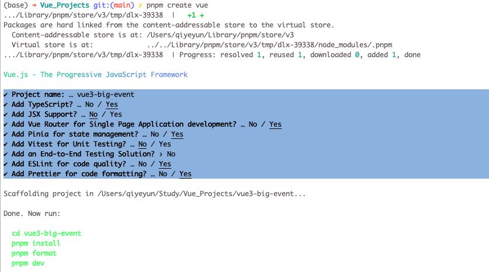
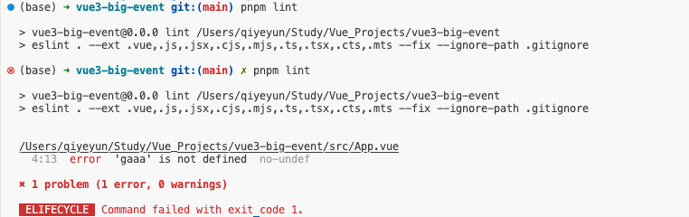
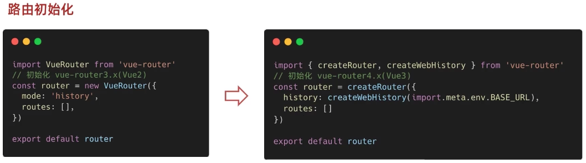

# 一、pnpm创建Vue3大事件项目




# 二、配置ESLint + Prettier

* <font color=red>禁止Prettier插件，使用Prettier包</font>，关闭  `format on save`
* 安装ESLint插件，并配置保存时自动修复
* 在 `eslintrc.cjs` 中配置 `prettier规则` 和 `eslint规则`


```json
/* eslint-env node */
require('@rushstack/eslint-patch/modern-module-resolution')

module.exports = {
  root: true,
  extends: [
    'plugin:vue/vue3-essential',
    'eslint:recommended',
    '@vue/eslint-config-typescript',
    '@vue/eslint-config-prettier/skip-formatting'
  ],
  parserOptions: {
    ecmaVersion: 'latest'
  },
  rules: {
    // 前置条件:
    // 1. 禁用Prettier插件，关闭 format on save
    // 2. 安装ESLint插件，并配置保存时自动修复
    'prettier/prettier': [
      'warn',
      {
        singleQuote: true, // 单引号
        semi: false, // 无分号
        printWidth: 80, // 一行最多80个字符
        trailingComma: 'none', // 不加对象、数组最后一个逗号
        endOfLine: 'auto' // 换行符号不限制
      }
    ],
    // ESLint
    'vue/multi-word-component-names': [
      'warn',
      {
        ignores: ['index'] // vue组件名称多个单词组成（忽略index.vue）
      }
    ],
    // 关闭props解构的校验 (props解构会丢失响应式，所以要提示报错，但是我们有解决办法，所以可以关闭)
    'vue/no-setup-props-destructure': ['off'],
    // 添加未定义变量错误提示，create-vue@3.6.3关闭
    'no-undef': 'error'
  }
}
```


# 三、hosky + lint-staged

hosky：git hooks工具，在代码提交前，进行校验；


##eslint校验

eslint校验

```json
{
  "scripts": {
    "lint": "eslint . --ext .vue,.js,.jsx,.cjs,.mjs,.ts,.tsx,.cts,.mts --fix --ignore-path .gitignore",
  }
}
```

执行

```bash
$ pnpm lint
```

输出报错




## 安装husky

提交前做代码检查

1. 初始化 git 仓库，执行 `git init` 即可

2. 初始化husky工具配置，执行 `pnpm dlx husky-init && pnpm install` 即可。

    [https:l/typicode.github.io/huskyl](https:l/typicode.github.io/huskyl)

3. 修改 `.husky/pre-commit` 文件

缺陷：对于旧项目，无法一次性处理完成，所以可以对新增的代码进行代码检查，减少工作量。


## 安装lint-staged

暂存区 eslint 校验，避免历史代码影响代码提交。

1. 安装 `lint-staged` 包 `pnpm i lint-staged -D`

2. `package.json` 配置 `lint-staged` 命令

    ```json
    {
      "name": "vue3-big-event",
      "version": "0.0.0",
      "private": true,
      "scripts": {
    	// 2.新增lint-staged脚本
        "lint-staged": "lint-staged"
      },
      "dependencies": {
    
      },
      "devDependencies": {
    
      }
      // 1.新增lint-staged
      "lint-staged": {
      	"*.{js,ts,vue}": [
          "eslint --fix" 
        ]
      }
    }
    
    ```

3. `.husky/pre-commit` 文件修改

    ```json
    // 3.提交前。执行命令
    pnpm lint-staged
    ```

    

# 四、Vue Router

##  Vue2 与 Vue3 路由对比




## Vue3 Router初始化

```typescript
import {
  createRouter,
  createWebHistory,
  createWebHashHistory
} from 'vue-router'

/*
 * createRouter创建路由实例
 * 配置 history 路由模式
 *  1. history模式：createWebHistory       地址栏不带#
 *  2. hash模式：   createWebHashHistory   地址栏带#
 */
const router = createRouter({
  // import.meta.env.BASE_URL: 是vite中的环境变量，就是 vite.config.ts 中base选项的值。可以在vite.config.ts中配置
  history: createWebHistory(import.meta.env.BASE_URL),
  routes: []
})

export default router
```


## 路由跳转

```vue
<script setup lang="ts">
/* 在vue3 组合值API中
 *  1. 获取路由对象router  ->  useRouter
 *     const router = useRouter()
 *  2. 获取路由参数route   ->  useRoute
 *     const route = useRoute()
 */
import { useRouter, useRoute } from 'vue-router'
const router = useRouter()
const route = useRoute()

function goMe() {
  console.log(router, route)
  router.push('/me')
}
</script>

<template>
  <h1>我是app</h1>
  <button @click="$router.push('/home')">首页</button>
  <button @click="$router.push('/list')">列表</button>
  <button @click="goMe">我的</button>
</template>
```


# 五、element-plus

* https://element-plus.org/zh-CN/guide/installation.html

```bash
# 选择一个你喜欢的包管理器

# NPM
$ npm install element-plus --save

# Yarn
$ yarn add element-plus

# pnpm
$ pnpm install element-plus
```


## 按需导入 - 自动导入推荐[#](https://element-plus.org/zh-CN/guide/quickstart.html#自动导入-推荐)

首先你需要安装`unplugin-vue-components` 和 `unplugin-auto-import`这两款插件

```bash
$ pnpm install -D unplugin-vue-components unplugin-auto-import
```


## 配置

```tsx
// vite.config.ts
import { defineConfig } from 'vite'
import AutoImport from 'unplugin-auto-import/vite'
import Components from 'unplugin-vue-components/vite'
import { ElementPlusResolver } from 'unplugin-vue-components/resolvers'

export default defineConfig({
  // ...
  plugins: [
    // ...
    AutoImport({
      resolvers: [ElementPlusResolver()],
    }),
    Components({
      resolvers: [ElementPlusResolver()],
    }),
  ],
})
```

 

## 直接使用，无序导入

```vue
<template>
  <el-row class="mb-4">
    <el-button>Default</el-button>
    <el-button type="primary">Primary</el-button>
    <el-button type="success">Success</el-button>
    <el-button type="info">Info</el-button>
    <el-button type="warning">Warning</el-button>
    <el-button type="danger">Danger</el-button>
  </el-row>
</template>
```


# 六、pinia使用 + 持久化

## 持久化

安装插件 `pinia-plugin-persistedstate`

```bash
$ pnpm add pinia-plugin-persistedstate -D
```

设置

```ts
// 用户模块
export const useUserStore = defineStore(
  'big-user',
  () => {
    const token = ref('')
    const setToken = (newToken: string) => {
      token.value = newToken
    }
    const removeToken = () => {
      token.value = ''
    }
    return {
      token,
      setToken,
      removeToken
    }
  },
  // 设置持久化
  {
    persist: true
  }
)
```


## pinia统一管理

```ts
import { createPinia } from 'pinia'
import persist from 'pinia-plugin-persistedstate'

const pinia = createPinia()
pinia.use(persist)

export default pinia

// ********************************
// ****** 统一管理模块，统一出口 ******
// ********************************

// 方式一
import { useUserStore } from './modules/user'
export { useUserStore }

// 方式二: 接收所有conter模块的导出
export * from './modules/counter'
```


## pinia使用

```vue
<script setup lang="ts">

// pinia
import { useUserStore, useCounterStore } from '@/stores'
const userStore = useUserStore()
const counterStore = useCounterStore()

</script>

<template>
  <p>{{ userStore.token }}</p>
  <el-row class="mb-1">
    <el-button type="primary" @click="userStore.setToken('123456')">
      登录
    </el-button>
    <el-button type="success" @click="userStore.removeToken()">
      退出
    </el-button>
  </el-row>

  {{ counterStore.count }}
  {{ counterStore.doubleCount }}
  <el-row class="mb-2">
    <el-button type="primary" @click="counterStore.increment()">
      计数器++
    </el-button>
  </el-row>
</template>
```


# 七、axios封装

axios安装

```bash
$ pnpm add axios
```

大致流程

```ts
import axios from 'axios'
import { useUserStore } from '@/stores'
import { ElMessage } from 'element-plus'

const baseURL = 'http://www.baidu.com'

const instance = axios.create({
  // 基础配置
  baseURL,
  timeout: 10000
})

// 请求拦截器
instance.interceptors.request.use(
  (config) => {
    // 发送请求之前做些什么
    const userStore = useUserStore()
    if (userStore.token) {
      config.headers.Authorization = `AAAAA ${userStore.token}`
    }
    return config
  },
  (error) => {
    // 请求错误处理
    return Promise.reject(error)
  }
)

// 响应拦截器
instance.interceptors.response.use(
  (response) => {
    // 对响应数据做些事
    if (response.data.code === 0) {
      return response
    }
    // 处理业务失败，给错误提示
    ElMessage.error(response.data.message || '服务异常')
    return Promise.reject(response.data)
  },
  (error) => {
    // 请求错误处理
    if (error.response.status === 401) {
      ElMessage.error('登录已过期，请重新登录')
    }
    ElMessage.error(error.response.data.message || '服务异常')
    return Promise.reject(error)
  }
)

export default instance
export { baseURL }
```


# 八、路由


