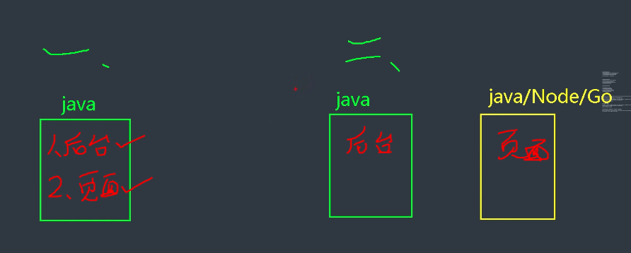
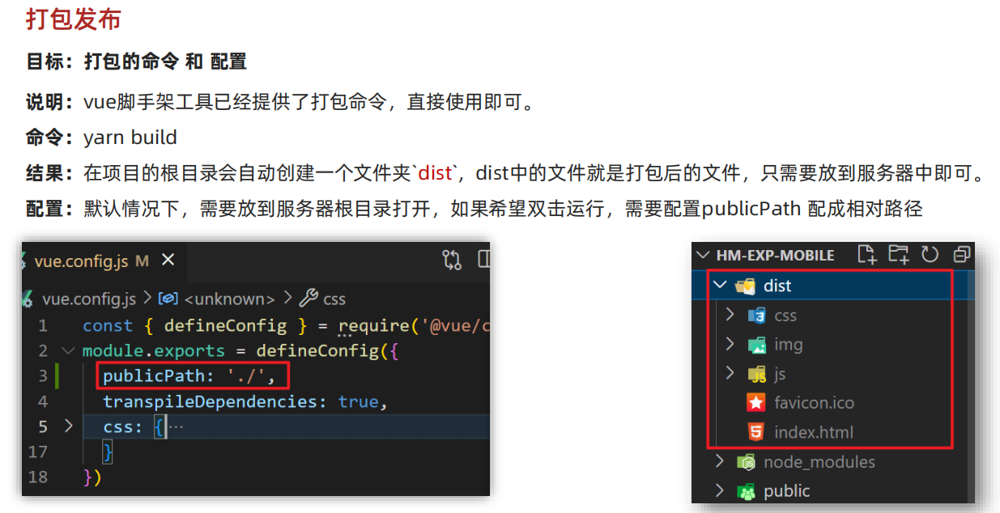

* [黑马前端Vue人力资源项目，Nginx项目部署上线Mac/Windows解决方案](https://www.bilibili.com/video/BV1JE421M7oe/?spm_id_from=333.337.search-card.all.click&vd_source=dc55c355e9f5b6174832aacfb5d8b6aa)
* Webpack5 学习笔记：Webpack&Vite/Webpack5


# 一、关联文档

* Server文件夹 
* NodeJS文件夹


# 二、跨域请求、Vue代理

单独的文章介绍：[Vue代理-跨域请求](./Vue2&3/10-Vue代理-跨域请求/Vue代理-跨域请求.md)

[哔哩哔哩 -【前端面试题-Vue】Vue设置代理](https://www.bilibili.com/video/BV1wp42197GM/?spm_id_from=333.788&vd_source=dc55c355e9f5b6174832aacfb5d8b6aa)


# 三、部署实操

* [禹神：前端项目部署指南，前端项目打包上线](https://www.bilibili.com/video/BV19n4y1d7Gr/?spm_id_from=333.1007.tianma.1-1-1.click&vd_source=dc55c355e9f5b6174832aacfb5d8b6aa)

## 1. 新建Vue3 + Vite项目

```sh
$ npm create vue@latest

Vue.js - The Progressive JavaScript Framework

✔ Project name: … vue3-vite-deploy
✔ Add TypeScript? … No / Yes
✔ Add JSX Support? … No / Yes
✔ Add Vue Router for Single Page Application development? … No / Yes
✔ Add Pinia for state management? … No / Yes
✔ Add Vitest for Unit Testing? … No / Yes
✔ Add an End-to-End Testing Solution? › No
✔ Add ESLint for code quality? … No / Yes
✔ Add Vue DevTools 7 extension for debugging? (experimental) … No / Yes

Scaffolding project in /Users/qiyeyun/Study/Web/Vue2&3/09-Vue部署/vue3-vite-deploy...

Done. Now run:

  cd vue3-vite-deploy
  npm install
  npm run dev
```


### a. 构建打包

`$ pnpm build`


### b. 预览构建好的包

**打出来的包，需要放在服务器上，无法本地直接打开！！**


打开：http://127.0.0.1:5500/dist/index.html

！！！！空白！！！！


* 或者放到服务器上查看；
* 只能通过 `$ vite preview` 进行预览；


## 2. 项目分析

### a. 接口代理

> 本地接口 -> 通过localhost本地代理 -> 远程接口


### b. 接口与页面分开部署




### c. 本地API服务器

写一个本地的api接口服务器，用来给下面Vue3项目ajax网络请求。


## 3. ⭐️方式一：本地服务器部署

### a. 创建express服务器项目

* 文档：创建express服务器：NodeJS/03-Express/express入门

在 `express-demo` 文件夹下执行 `$ npm init -y` 命令，然后一路回车，就会帮我们创建一个 `package.json` 文件，然后再执行 `$ npm install express `来安装express模块，然后改写 `server.js` 。

```js
// 0. 加载 Express
const express = require('express')

// 1. 调用 express() 得到一个 app
//    类似于 http.createServer()
const app = express()

// 2. 设置请求对应的处理函数
//    当客户端以 GET 方法请求 / 的时候就会调用第二个参数：请求处理函数
app.get('/', (req, res) => {
  res.send('hello world')
})

// 3. 监听端口号，启动 Web 服务
app.listen(3000, () => console.log('app listening on port 3000!'))
```

`package.json`中新增script命令：`    "serve": "node app.js",`

新增nodemon：`pnpm add nodemon`

`"serve": "nodemon ./src/server.js"`

运行项目：`npm run serve` 

打开浏览器并访问 http://127.0.0.1:3000/ 将看到返回数据。


### b. 配置静态资源

1. 创建public静态资源文件夹
2. 新增代码

```js
// 3. 配置静态资源 /public/index.html
app.use('/index', express.static('public'))
```


3. 打开`http://localhost:3002/index`，就打开了服务器的静态资源（index.html文件）


### c. 构建的项目放到express服务器项目中

1. 将构建的项目包，导入express服务器中。


2. 代码入口配置

```js
// 3. 配置静态资源 /public/index.html
app.use('/', express.static('public'))
```


3. 打开`http://localhost:3002`，就打开了服务器的静态资源（index.html文件）


### d. 问题一：刷新页面404

#### Ⅰ. 问题复现：

**正常打开后，点击页面上按钮，跳转到Vue路由 `http://localhost:3002/about` ——【正常打开】**

**但是 直接输入 `http://localhost:3002/about` 或者 刷新，则无法打开！！**


**刷新该地址，无法访问！！！！**


#### Ⅱ. 问题原因：

**原因：express服务器误认为 /about 是自己的后端路由，所以去服务器中寻找，但是找不到！！！**

```js
// 这里 /hello 就是后端路由
app.get('/hello', (req, res) => {
  res.send('hello world')
})
```


#### Ⅲ. 解决方案一：`hash模式`

`修改Vue路由的方案，由history模式 改为 hash模式`


**重新打包！！！重新部署！！！，此时，地址中有#号，可以区分开 Vue路由与后端路由！！！**


#### Ⅳ. 解决方案二：`服务器重定向`

```js
// 3.1. 后端路由匹配不到，则需要重定向给 /public/index.html  -》 Vue  -》 JS -> 前端路由
app.get('*', (req, res) => {
  // 获取上级路径
  res.sendFile(path.resolve(__dirname, '..') + '/public/index.html')
})
```


#### Ⅴ. 解决方案三：`服务端安装插件解决` - 比方案二更优雅

connect-history-api-fallback：https://www.npmjs.com/package/connect-history-api-fallback

`$ pnpm add --save connect-history-api-fallback`


**使用文档**

Import the library

```js
var history = require('connect-history-api-fallback');
```

Now you only need to add the middleware to your application like so

```js
var connect = require('connect');

var app = connect()
  .use(history())
  .listen(3000);
```

Of course you can also use this piece of middleware with express:

```js
var express = require('express');

var app = express();
app.use(history());
```


**具体实操**


**更多自定义配置**

```js
app.use(history ({
	rewrites: [
		// 若匹配到 /login 路由，走后端路由
		{ from: /^\/login.*$/, to: (context) => context.parsedUr1.path },
	]
}))
```


### e. 问题二：Ajax请求失效

#### Ⅰ. 问题原因：


> 开发时，脚手架会帮我们配置一个代理服务器，localhost的请求，会通过代理到远程的地址上，所以能够正常访问；
>
> 打包后，就是纯html、css、js文件，没有脚手架了，所以也没有了网络代理，导致请求找不到服务器的IP地址。


#### Ⅱ. 解决方案：`服务器端安装插件`

http-proxy-middleware：https://www.npmjs.com/package/http-proxy-middleware

```sh
$ pnpm add http-proxy-middleware
```

在server.js中增加该插件的配置：

```js
const { createProxyMiddleware } = require('http-proxy-middleware');  // 解决请求跨域问题

app.use(
  '/dev',  // 同vue项目中的配置
  createProxyMiddleware({
    target: 'http://www.example.org/secret',  // 跨域的地址
    changeOrigin: true,
    pathRewrite: {
      '^/dev': ''    // 移除链接中的/dev
    }
  }),
);
```


### f. 运行，局域网内可访问

```
$ pnpm run serve
```

局域网内，都可访问：192.168.1.101:3002`


## 4. ⭐️方式二：本地nginx服务器部署

> 前往 Server仓库 -》 Nginx -》 Nginx实操篇 -》六、Vue项目部署到Nginx ⭐️⭐️


## 5. ⭐️方式三：云服务器部署

### a. **GitHub Pages**：

方式一：

1. 将代码推送到 GitHub 仓库。
2. 在项目设置中启用 GitHub Pages，选择 `dist` 文件夹。

方式二：`gh-pages`

* [用最简单的方式来部署自己的gh-pages 网页](https://israynotarray.com/git/20230530/3386912069/)


### b. **Vercel/Netlify**：

1. 注册 Vercel 或 Netlify 账户。
2. 直接将项目链接到平台，通过自动化流程进行部署。


## 6. **Docker 部署** （未学习）


# 其他：VueCli 打包配置

## 相对路径配置




## 优化：路由懒加载


