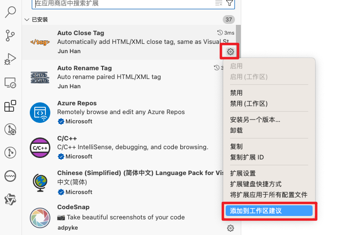

众所周知，vscode的配置分两类，一是全局的用户配置，二是当前工作区配置。

vscode 打开的文件夹的根目录是一个工作区，`.vscode`目录就是存放当前工作区相关配置文件的目录。

`.vscode`目录下一般有 4 种配置文件和项目中的代码片段：

1. `extensions.json`：推荐当前项目使用的插件
2. `setting.json`：vscode编辑器和插件的相关配置
3. `launch.json`：调试配置文件
4. `task.json`：任务配置
5. `xxxxxxx.code-snippets`：项目中共享的代码片段

## `.vscode` 目录下 `extensions.json`

