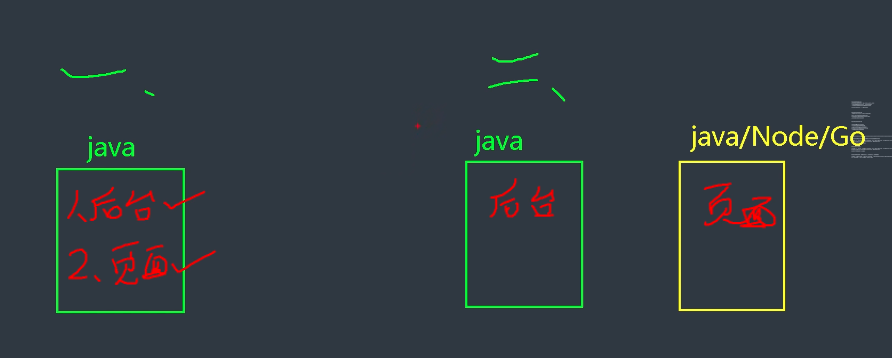
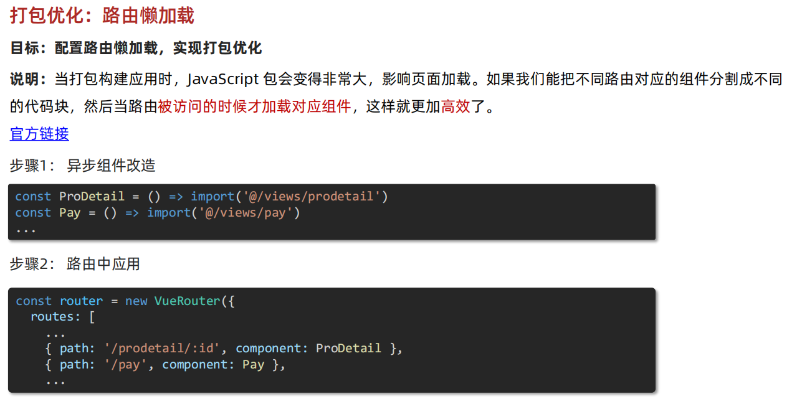

* [禹神：前端项目部署指南，前端项目打包上线](https://www.bilibili.com/video/BV19n4y1d7Gr/?spm_id_from=333.1007.tianma.1-1-1.click&vd_source=dc55c355e9f5b6174832aacfb5d8b6aa)
* [黑马前端Vue人力资源项目，Nginx项目部署上线Mac/Windows解决方案](https://www.bilibili.com/video/BV1JE421M7oe/?spm_id_from=333.337.search-card.all.click&vd_source=dc55c355e9f5b6174832aacfb5d8b6aa)

# 一、关联文档

* Server文件夹 
* NodeJS文件夹

# 一、跨域请求、Vue代理

单独的文章介绍：[Vue代理-跨域请求](./Vue2&3/10-Vue代理-跨域请求/Vue代理-跨域请求.md)

[哔哩哔哩 -【前端面试题-Vue】Vue设置代理](https://www.bilibili.com/video/BV1wp42197GM/?spm_id_from=333.788&vd_source=dc55c355e9f5b6174832aacfb5d8b6aa)

# 二、接口与页面分开部署

# 二、Vue打包配置

## 相对路径配置

## 优化：路由懒加载

