* [禹神：一小时彻底搞懂跨域&解决方案](https://www.bilibili.com/video/BV1pT421k7yz/?spm_id_from=333.1007.tianma.2-2-5.click&vd_source=dc55c355e9f5b6174832aacfb5d8b6aa)

* [哔哩哔哩 -【前端面试题-Vue】Vue设置代理](https://www.bilibili.com/video/BV1wp42197GM/?spm_id_from=333.788&vd_source=dc55c355e9f5b6174832aacfb5d8b6aa)


# 一、禹神视频笔记

## 1. 浏览器的同源策略

### a. 同源策略

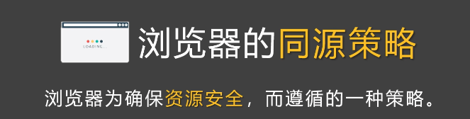

### b. 什么是源？


### c. 什么是非同源

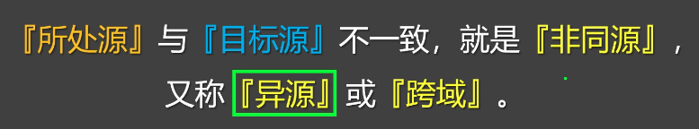


### d. 同源与非同源

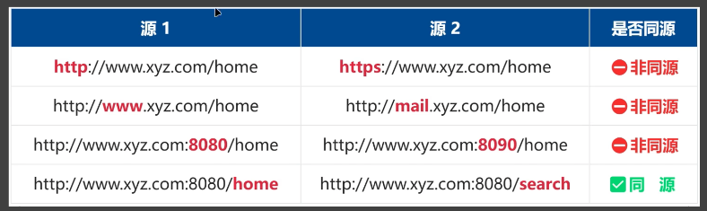

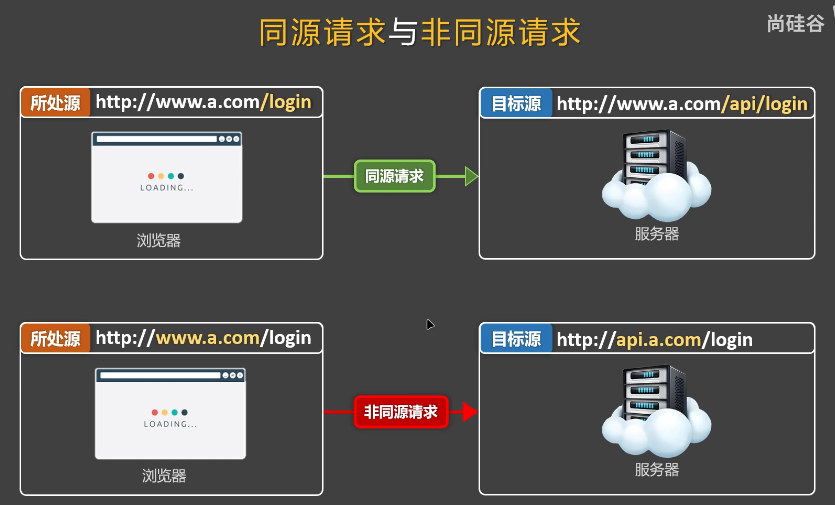


## 2. 浏览器对跨域做出哪些限制？

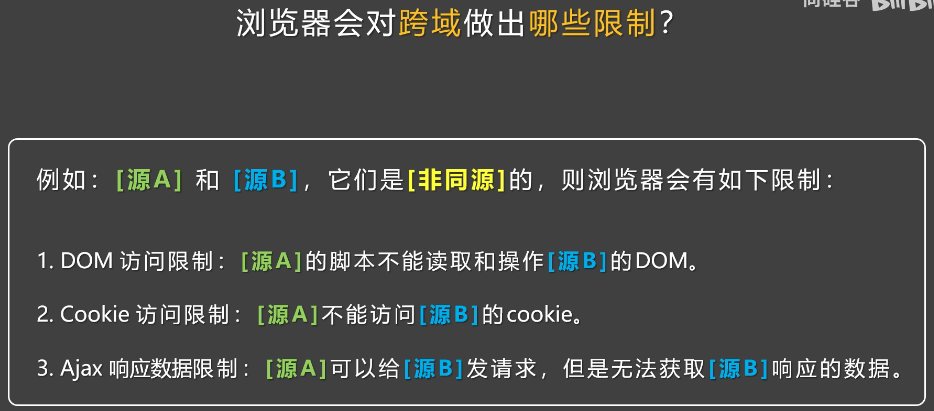


### a. Dom访问限制

#### Ⅰ. 打开同源的html网页，访问Dom

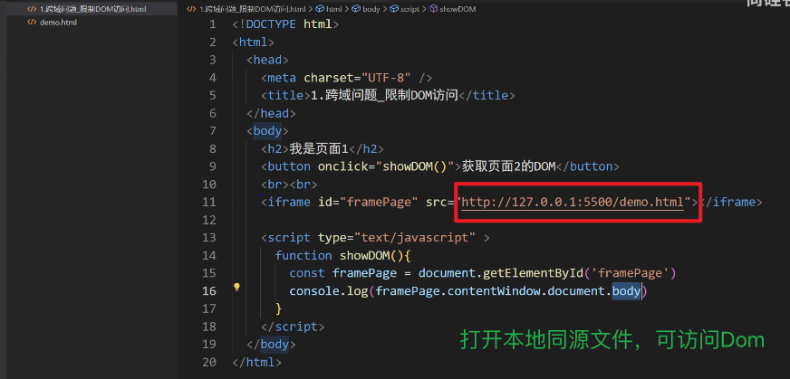


#### Ⅱ. 打开非同源网页，无法访问Dom

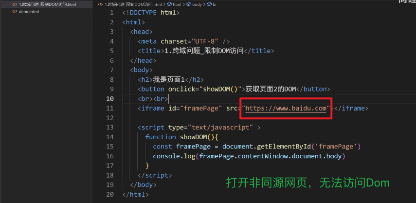


### b. Cookie访问限制

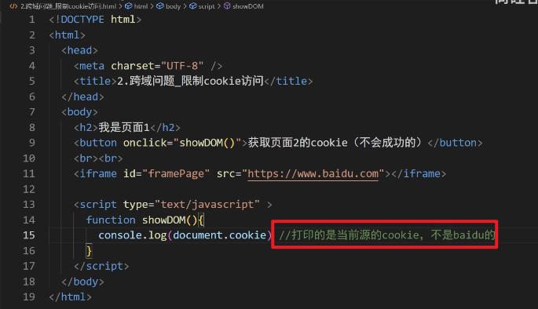

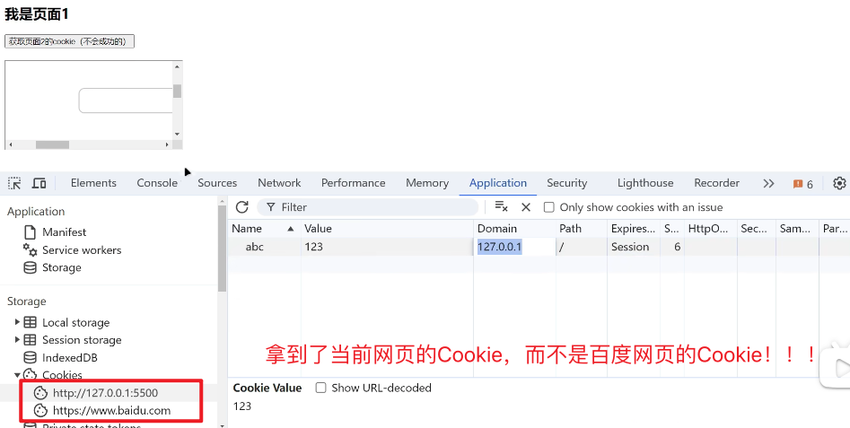


### c. 限制Ajax获取数据

1. Ajax 响应数据限制：**[源A]可以给[源B1发请求，但是无法获取[源B1响应的数据。**

2. 在上述限制中，浏览器对 Ajax 获取数据的限制是影响最大的一个，旦实际开发中经常遇到。

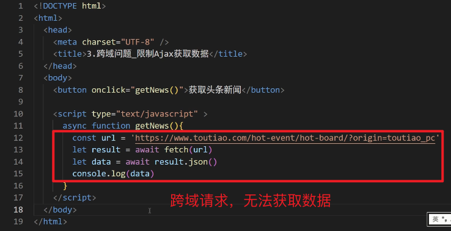


头条数据API：https://www.toutiao.com/hot-event/hot-board/?origin=toutiao_pc

直接放到浏览器，可以请求到数据！

放到html中，无法请求

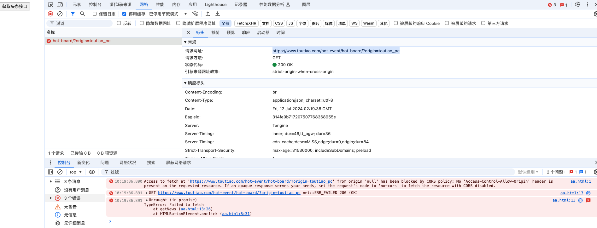

错误信息：

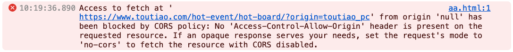


## 3. 几个注意点

1. 跨域限制仅存在浏览器端，服务端不存在跨域限制；
2. 即使跨域了，Ajax请求也可以正常发出，但响应数据不会交给开发者。

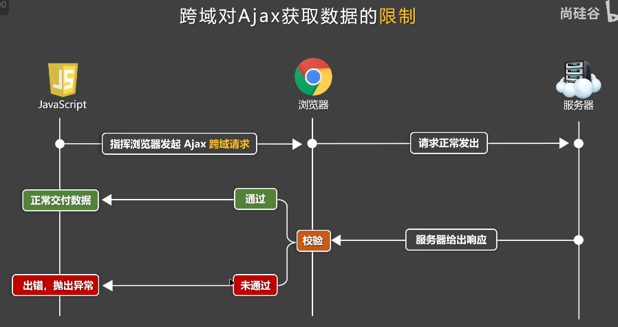

3. `<link>` 、`<script>`、`` 这些标签发出的请求也可能跨域，只不讨浏览器对标签跨域不做严格限制，对开发几乎无影响！！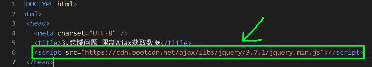


## 4. CORS解决Ajax跨域问题

### a. CORS概述

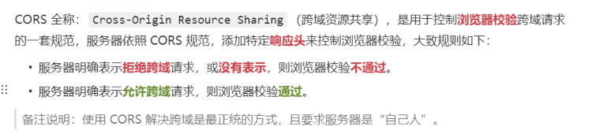


### b. CORS解决简单请求

> 整体思路：服务器在给出响应时，通过添加 `Access-Control-Allow-Origin` 响应头，来明确表达允许某个源发起的跨域请求，随后浏览器校验时，直接通过！！

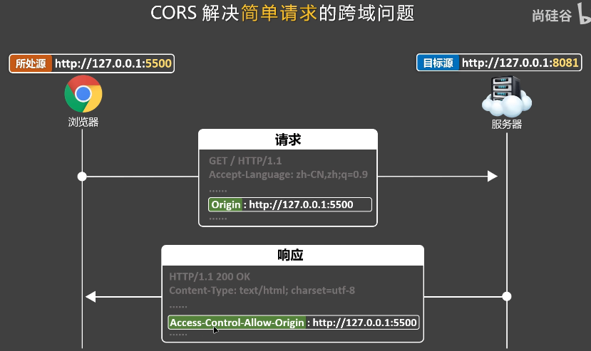

服务端配置：

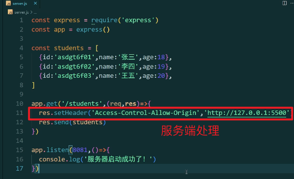

客户端请求：

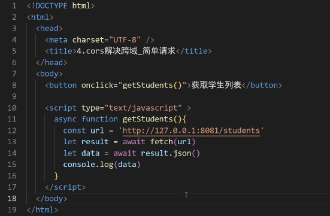


### c. 简单请求与复杂请求

| 简单请求                                                     |                           复杂请求                           |
| :----------------------------------------------------------- | :----------------------------------------------------------: |
| 1. 请求方法（method）：`GET`、`HEAD`、`POST`<br />2. 请求头字段要符合：[<font color=Blue>《CORS安全规范》</font>](https://fetch.spec.whatwg.org/#http-cors-protocol) <br />（速记：只要不手动修改请求头，一般都能符合该规范）<br />3. 请求头的 `Content-type` 的值必须是以下三种：<br />* `text/plain`<br />* `multipart/form-data`<br />* `application/x-www-form-urlencoded` | 1. 不是**简单请求**，就是**复杂请求**；<br />2. **复杂请求** 会自动发送 <font color=Blue>预检请求</font>； |

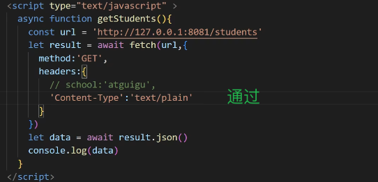

#### Ⅰ. 预检请求

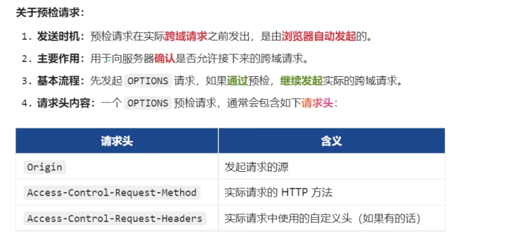


### d. CORS解决复杂请求

**第一步：服务器先<font color=green>通过</font>浏览器的<font color=green>预检请求</font>，服务器需要返回如下<font color=green>响应头</font>**

| 响应头                         | 含义                           |
| :----------------------------- | ------------------------------ |
| `Access-Control-Allow-Origin`  | 允许的源                       |
| `Access-Control-Allow-Methods` | 允许的方法                     |
| `Access-Control-Allow-Headers` | 运行的自定义头                 |
| `Access-Control-Max-Age`       | 预检请求的结果缓存时间（可选） |

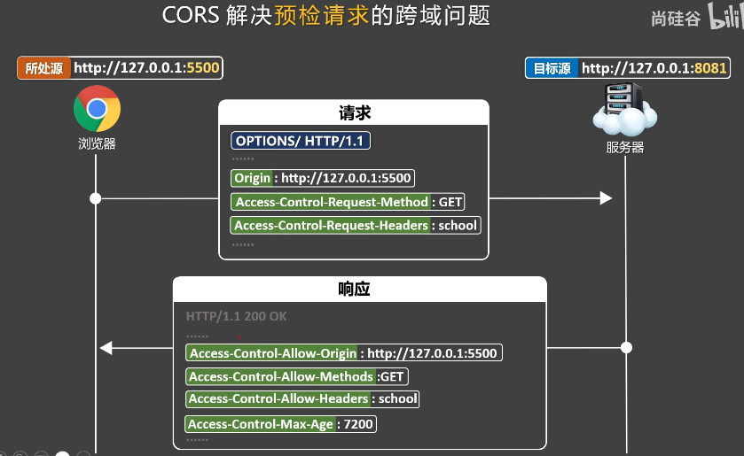

**第二步：正常请求，与简单请求一样**

> 整体思路：服务器在给出响应时，通过添加 `Access-Control-Allow-Origin` 响应头，来明确表达允许某个源发起的跨域请求，随后浏览器校验时，直接通过！！


服务器端配置：

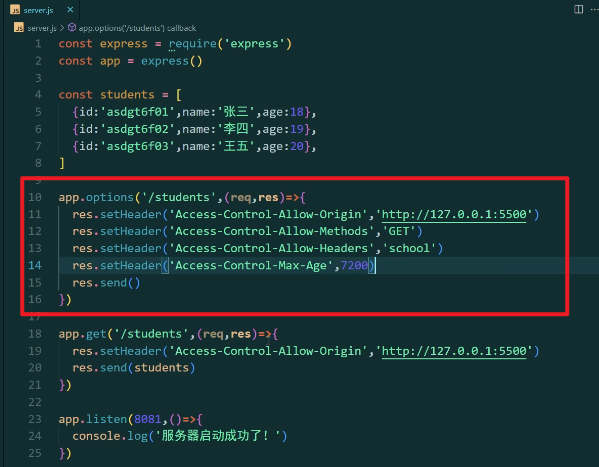

客户端请求：

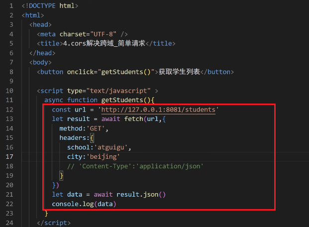


### e. 借助 cors 库快速完成配置

上述配置需要自己手动配置响应头，可以通过 `cors` 库，快速的完成配置！！！

* 安装 `cors`

    ```sh
    $ npm i cors
    ```

* 简单配置

    ```js
    // 引入
    const cors = require('cors')
    
    // use
    app.use(cors());
    ```

* 完整配置

    ```js
    // 引入
    const cors = require('cors')
    
    // use
    app.use(cors({
    	orgigin: 'http://127.0.0.1:5500', // 允许的源
        methods: ['GET', 'POST', 'PUT', 'DELETE', 'HEAD', 'OPTIONS'], // 运行的方法
        allowedHeaders: ['school'], // 允许的自定义头
        exposedHeaders: ['abc'], // 要暴露的响应头
    }));
    ```

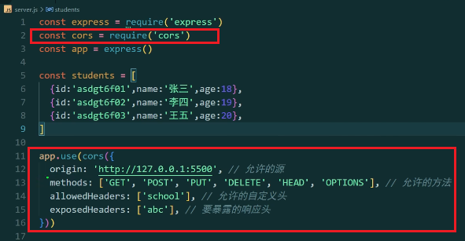

客户端获取header： abc

**如果服务器端不暴露：`exposedHeaders: ['abc'], // 要暴露的响应头` ，则无法获取！！！**

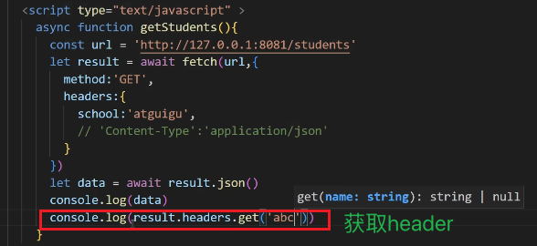


## 5. JSONP 解决跨域问题 - 旧方法（了解）

### a. 引入 - script标签发送请求

1. JSONP概述：JSONP是利用了 `<script>` 标签可以跨域加载脚本，且不受严格限制的特性，可以说是程序员智慧的结晶，早期浏览器不支持CORS时，可以靠JSONP解决跨域；
2. 基本流程：
    * 第一步：客户端创建一个 `<script>` 标签，并将其 `src` 属性设置为包含跨域请求的URL，同时，准备一个回调函数，这个函数用于处理返回的数据。
    * 第二步：服务器端接受到请求后，将数据封装在回调函数中并返回；
    * 第三步：客户端的回调函数被调用，数据以参数的形式传入回调函数。

3. script标签发送请求，标签默认返回值都是js。

4. 缺陷：script标签发送的请求，都是GET请求。无法解决其他方式的跨域问题！！！


#### Ⅰ. 原理图

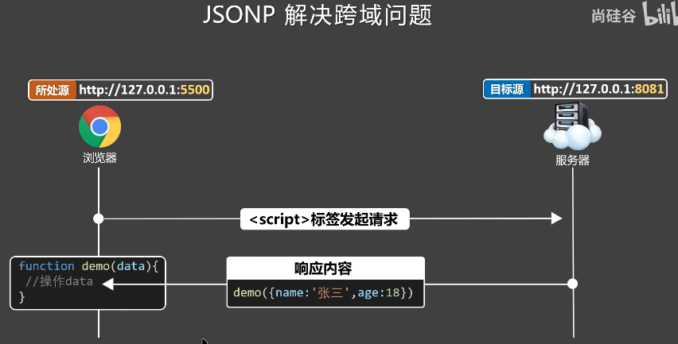


#### Ⅱ. 代码实操

服务器端：这里返回字符串hello，对前端来说就是js

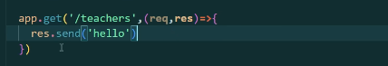

前端代码：script调用 `/teachers` 

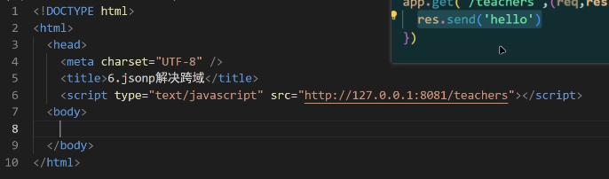

结果：ERROR

原因：前端代码获取到后端返回的hello，这里的hello就是js方法，但是前端没有hello方法，所以未定义！！

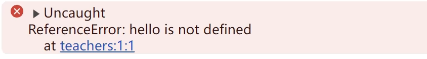

此刻，服务器端返回值改成：` alert(6666)`，前端调用时，便直接弹出框！

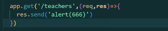

说明我们只需要在前端定义下方法即可！

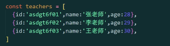

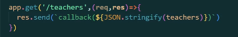

服务器端：定义 `callback` 方法，注意script顺序，此时会从服务器端获取到callback返回值，前端本地的方法就会触发！

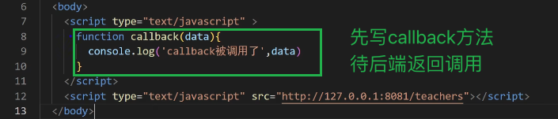


#### Ⅲ. 将上方引入方案，代码化

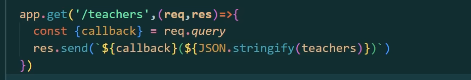

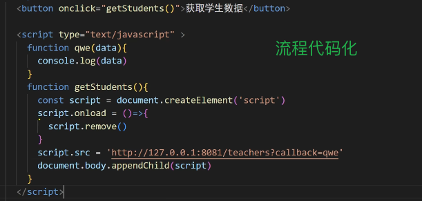


### b. JQuery封装`<script>`标签请求

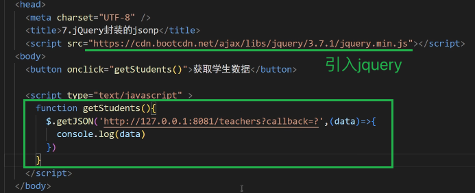


## 6. 配置代理解决跨域

### a. 自己配置代理服务器

借助 `http-proxy-middleware` 配置代理。

[npm - http-proxy-middleware](https://www.npmjs.com/package/http-proxy-middleware)

[./09-Vue部署/打包部署.md/方式一：本地服务器部署]()


#### Ⅰ. 基本原理

假设前端项目的端口是8080，服务器的端口号是5000。这时候受到同源策略的影响就会产生跨域。

那这时候，启用一个代理服务器。这个代理服务器的端口和前端项目的端口保持一致，都是8080。这时候，前端发起请求，直接访问这个代理服务器。然后通过这个代理服务器去访问那个5000端口的服务器。代理服务器的端口虽然是8080，但是服务器之间没有同源策略，所以不会跨域。这就是代理服务器解决跨域的方法。


#### Ⅱ. 实操

服务器端：

```js
// 引入
const { createProxyMiddleware } = require('http-proxy-middleware');  // 解决请求跨域问题

// 配置
app.use('/api', createProxyMiddleware({
	target: 'https://www.toutiao.com',
    changeOrigin: true,
    pathRewrite: {
    	'^/api': '',   
    }
}))
```

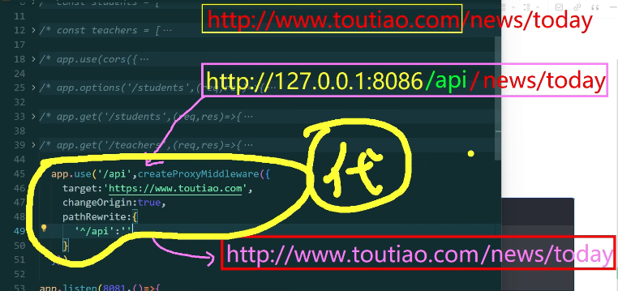

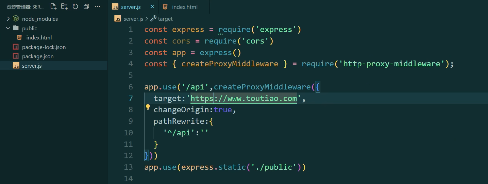

在服务器端，增加前端代码 `/public/index.html` ，整个工程类似于脚手架工程中`devServer`处理跨域。

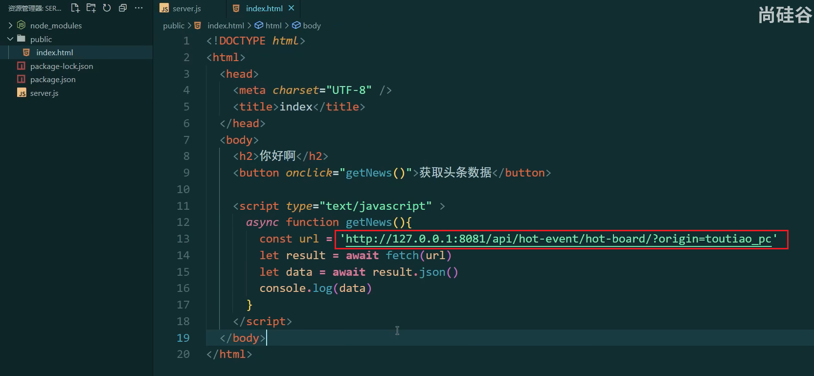


### b. 使用Nginx搭建代理服务器


### c. 借助脚手架搭建服务器

打开vue的官方文档，里面有说明：[配置参考 | Vue CLI](https://cli.vuejs.org/zh/config/#devserver-proxy)


# 二、GPT

在 Web 开发中，跨域请求是指从一个域（Origin）向另一个不同域的资源发起请求。域的定义包括协议（如 `http`、`https`）、主机（如 `example.com`）和端口（如 `80`、`443`）。如果这些部分中的任何一个不同，就被视为不同的域。

## 1. 什么是跨域请求？

假设你有一个 Vue 应用运行在 `http://localhost:8080`，并且你需要向位于 `http://api.example.com` 的 API 服务器发起请求。这种请求就是跨域请求，因为协议和主机都不同。

## 2. 为什么跨域请求会有问题？

出于安全考虑，浏览器默认会限制网页发起跨域请求。这种限制称为同源策略（Same-Origin Policy），它可以防止恶意网站读取另一个网站的敏感数据。

## 3. 如何解决跨域请求问题？

为了允许跨域请求，服务器和客户端需要进行一些配置。最常见的解决方法是使用 CORS（跨域资源共享，Cross-Origin Resource Sharing）。

### a. 配置服务器端的 CORS

在服务器上，你需要设置适当的 HTTP 响应头，以允许跨域请求。这是通过设置 `Access-Control-Allow-Origin` 头来实现的。

例如，在一个 Node.js/Express 应用中，你可以使用 `cors` 中间件：

```js
const express = require('express');
const cors = require('cors');
const app = express();

app.use(cors());

app.get('/api/data', (req, res) => {
    res.json({ message: 'This is CORS-enabled for all origins!' });
});

app.listen(3000, () => {
    console.log('Server running on port 3000');
});
```

这将允许所有域访问 `/api/data` 端点。如果你只想允许特定的域访问，可以传递一个配置对象给 `cors` 中间件：

```js
app.use(cors({
    origin: 'http://localhost:8080'
}));
```

### b. 在 Vue 中配置代理（开发阶段）⭐️⭐️⭐️

在开发阶段，你可以使用 Vue CLI 提供的代理功能来解决跨域问题。你可以在 `vue.config.js` 中配置代理。

```js
module.exports = {
    devServer: {
        proxy: {
            '/api': {
                target: 'http://api.example.com',
                changeOrigin: true,
                pathRewrite: { '^/api': '' }
            }
        }
    }
};
```

在这个配置中，所有发往 `/api` 的请求都会被代理到 `http://api.example.com`，并且 `changeOrigin: true` 会修改请求头中的 `Origin` 字段，使其看起来像是从目标域发出的请求。

## 4. 示例：在 Vue 应用中发起跨域请求

假设你已经在服务器端配置好了 CORS 或在开发阶段使用了代理，你可以使用 `axios` 或原生 `fetch` 在 Vue 应用中发起跨域请求。

### a. 使用 `axios`

首先，安装 `axios`：

```sh
npm install axios
```

然后，在 Vue 组件中发起请求：

```js
<template>
  <div>
    <h1>{{ message }}</h1>
  </div>
</template>

<script>
import axios from 'axios';

export default {
  data() {
    return {
      message: ''
    };
  },
  mounted() {
    axios.get('/api/data')
      .then(response => {
        this.message = response.data.message;
      })
      .catch(error => {
        console.error('There was an error!', error);
      });
  }
};
</script>
```

### b. 使用 `fetch`

你也可以使用原生的 `fetch` 方法：

```js
<template>
  <div>
    <h1>{{ message }}</h1>
  </div>
</template>

<script>
export default {
  data() {
    return {
      message: ''
    };
  },
  mounted() {
    fetch('/api/data')
      .then(response => response.json())
      .then(data => {
        this.message = data.message;
      })
      .catch(error => {
        console.error('There was an error!', error);
      });
  }
};
</script>
```

## 5. 总结

跨域请求是 Web 开发中常见的问题，但可以通过服务器端配置 CORS 或在开发阶段使用代理来解决。理解并正确配置这些机制，可以使你的 Vue 应用成功地与不同域的资源进行通信。