* [尚硅谷 - Vue3+TS 快速上手](https://24kcs.github.io/vue3_study/)


# 脚手架

* Vue2  -> [Vue CLI](https://cli.vuejs.org/zh/#%E8%B5%B7%E6%AD%A5) -> Webpack
* Vue3 -> [create-vue](https://cn.vuejs.org/guide/scaling-up/tooling.html#project-scaffolding)  -> Vite


```bash
# Vue CLI 创建Vue2项目
$ vue create hello-world

# create-vue 创建Vue3项目
$ npm create vue@latest
# Or, if you need to support IE11, you can create a Vue 2 project with:
$ npm create vue@legacy
```


```bash
# 创建Vue3项目
$ pnpm create vue
```


## create-vue创建Vue3

[github - create-vue](https://github.com/vuejs/create-vue)

* 前提环境条件：已安装 16.0 或更高版本的 Node.js
    * `node -v`

* 创建一个Vue应用
    * `npm init vue@latest`
    * `npm create vue@latest`
    * 这一指令将会安装并执行 create-vue

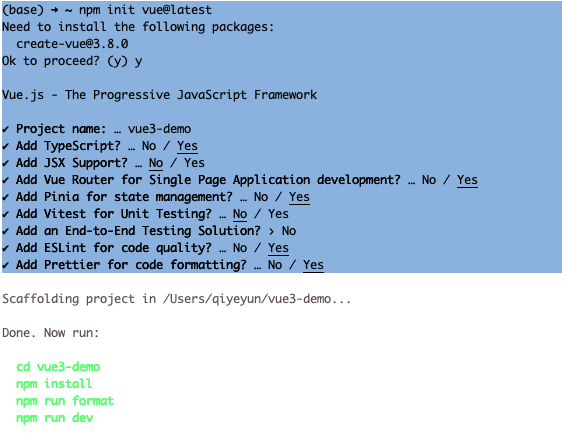


# Vue3优势

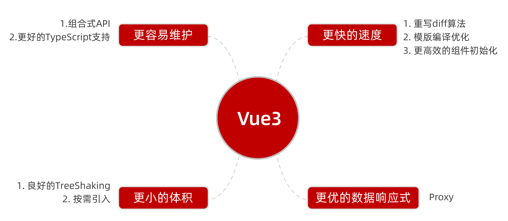


# Vue2 / 3 项目差异


## 1. vite.config.js 配置文件

* vue.config.js

* vite.config.js


## 2. Package.json 依赖变化


## 3. Main.js

**Vue2**

```js
import Vue from 'vue'
import App from './App.vue'

Vue.config.productionTip = false

new Vue({
  render: h => h(App)
}).$mount('#app')
```

**Vue3**

```js
import { createApp } from 'vue'
import App from './App.vue'

createApp(App).mount('#app')
```


## 4. App.vue

app.vue - 根组件 SFC单文件组件 script - template - style 

* 变化一：脚本script和模板template顺序调整 

* 变化二：模板template不再要求唯一根元素 

* 变化三：脚本script添加setup标识支持组合式API 


## 5. index.html

微调


# 组合式API vs 选项式API


# setup选项

## setup选项的写法和执行时机 

* 原始繁琐写法

```vue
<script>
// setup
// 1. 执行时机，比beforeCreate还要早
// 2. setup函数中，获取不到this (this是undefined)
// 3. 数据 和 函数，需要在 setup 最后 return，才能模板中应用
//    问题：每次都要return，好麻烦？
// 4. 通过 setup 语法糖简化代码
export default {
  setup () {
    // 此时this=undefine，因为太早了
    console.log('setup函数', this)
    // 数据
    const message = 'hello Vue3'
    // 函数
    const logMessage = () => {
      console.log(message)
    }
    return {
      message,
      logMessage
    }
  },
  name: 'setup-base-page',
  beforeCreate () {
    console.log('beforeCreate函数')
  }
}
</script>
```


* 语法糖改进后写法

```vue
<script setup>
const message = 'this is a message'
const logMessage = () => {
  console.log(message)
}
</script>

<template>
  <div>{{ message }}</div>
  <button @click="logMessage">按钮</button>
</template>
```


## setup语法糖

* 原始复杂写法，需要 return

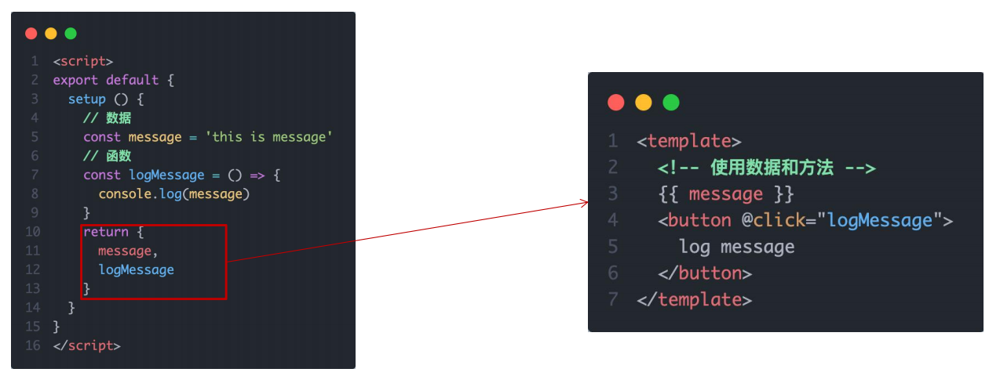


* 语法糖语法，简化代码

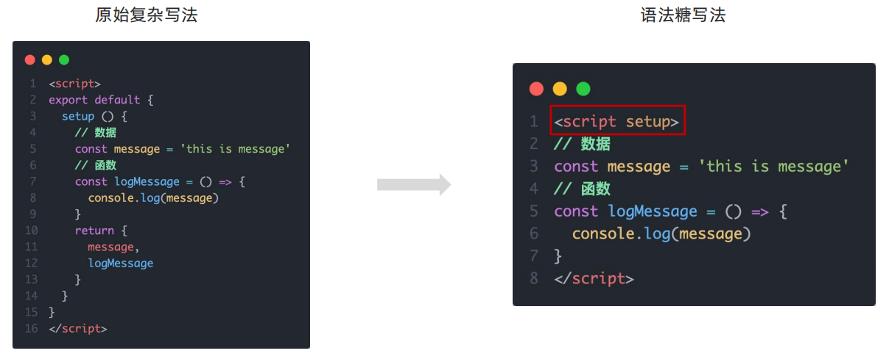


## setup语法糖原理

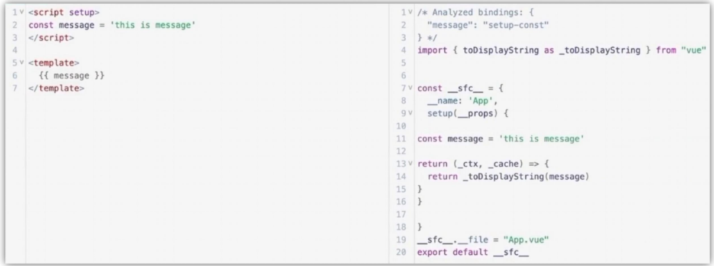


## setup总结


# reactive & ref

* reactive

    * **作用：**接受 **对象类型数据** 的参数传入并 **返回一个响应式的对象**

    * 使用：

        1. 从 vue 包中导入 reactive 函数 

        2. 在 `<script setup>` 中执行 reactive 函数并传入类型为对象的初始值，并使用变量接收返回值 

        ```vue
        <script setup>
        	// 导入
        	import { reactive } from 'vue'
        	// 执行西数 传入参数 变量接收
        	const state = reactive(对象类型数据）
        </script>
        ```

* ref

    * **作用：**接收 **简单类型** 或者 **对象类型** 的数据传入并返回一个 **响应式的对象** 

    * 使用：

        1. 从 vue 包中导入 ref 函数 

        2. 在 `<script setup>` 中执行 ref 函数并传入初始值，使用变量接收 ref 函数的返回值

        ```vue
        <script setup>
        	// 导入
        	import { ref } from 'vue'
        	// 执行西数 传入参数 变量接收
        	const count = ref(简单类型或者复杂类型数据）
        </script>
        ```


## 总结

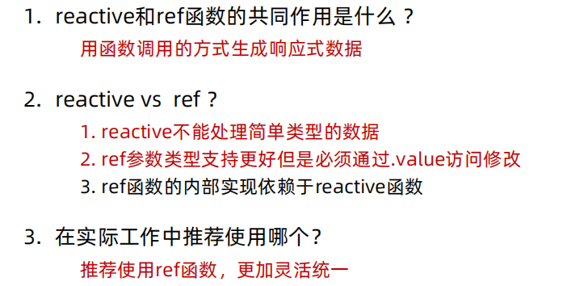


# 生命周期函数

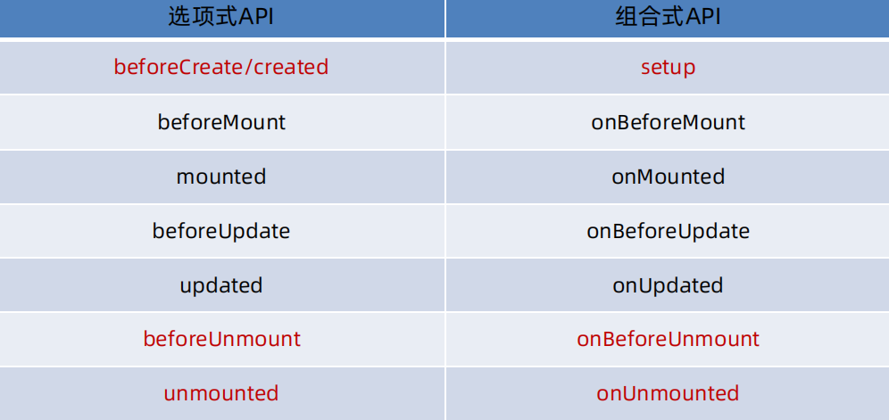

```vue
<script setup>

import { onMounted } from 'vue';

// beforeCreate 和 created 的相关代码
// 一律放在 setup 中执行

const getList = () => {
  setTimeout(() => {
    console.log('发送请求，获取数据')
  }, 2000)
}
// 一进入页面的请求
getList()

// 如果有些代码需要在mounted生命周期中执行
onMounted(() => {
  console.log('mounted生命周期函数 - 逻辑1')
})

// 写成函数的调用方式，可以调用多次，并不会冲突，而是按照顺序依次执行
onMounted(() => {
  console.log('mounted生命周期函数 - 逻辑2')
})

</script>
```


# 父子通讯 - props & emit

## 父传子

基本思想 

1. 父组件中给子组件绑定属性 

2. 子组件内部通过props选项接收 

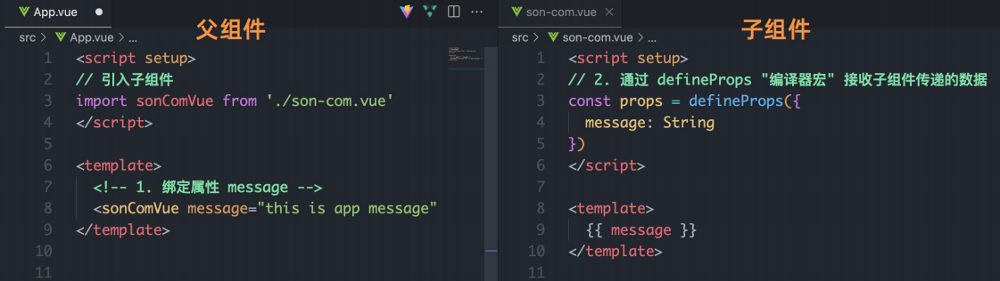


## defineProps()

```vue
// 注意：由于写了 setup，所以无法直接配置 props 选项
// 所以：此处需要借助于 “编译器宏” 函数接收子组件传递的数据

const props = defineProps({
    car: String,
    money: Number
})
```

defineProps 原理：就是编译阶段的一个标识，实际编译器解析时，遇到后会进行编译转换

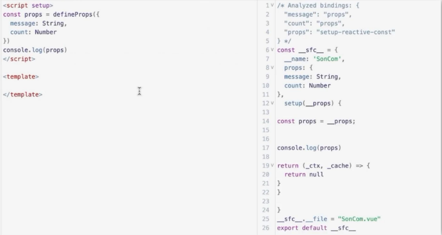


## 子传父

基本思想 

1. 父组件中给子组件标签通过@绑定事件 

2. 子组件内部通过 emit 方法触发事件

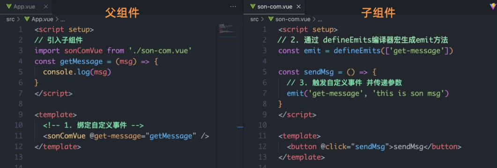


## defineEmits()

```vue
// 子传父 emit，注册emit
const emit = defineEmits(['changeMoney'])
const buy = () => {
    emit('changeMoney', 5)
}
```


## 总结

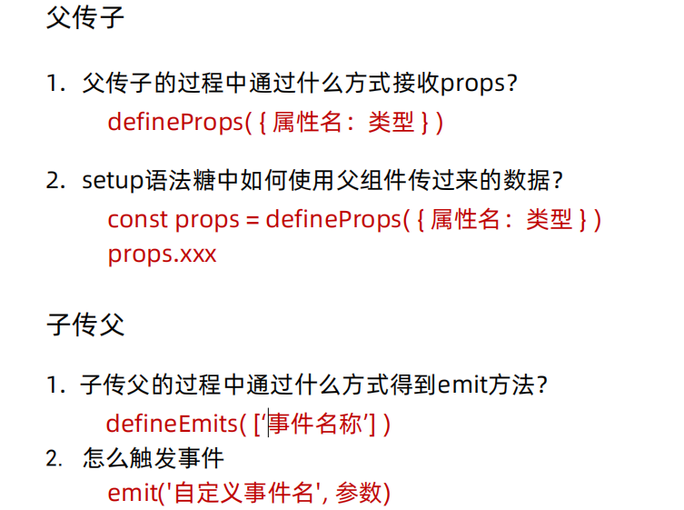


# 模板引用 - ref标识

* 通过 **ref标识** 获取真实的 **dom对象或者组件实例对象**

* 获取模板引用的时机：组件挂载完毕

```vue
<script setup>

import { ref, onMounted } from 'vue';
import SonCom from '@/demo-views/09-refs-son.vue'

// 模板引用(可以获取dom，也可以获取组件)
// 1. 调用ref函数，生成一个ref对象
// 2. 通过ref标识，进行绑定
// 3. 通过ref对象.value即可访问到绑定的元素(必须渲染完成后，才能拿到)
const inp = ref(null)

// 生命周期钩子onMounted
// 获取模板引用的时机：组件挂载完毕
onMounted(() => {
  console.log(inp.value)
  // inp.value.focus()
})
const clickFn = () => {
  inp.value.focus()
}

// ---------------- 获取子组件 -----------------
const sonRef = ref(null)
const getCom = () => {
  console.log(sonRef.value.count)
  sonRef.value.sayHi()
}

</script>

<template>
  <div>
    <input ref="inp" type="text">
    <button @click="clickFn">点击让输入框聚焦</button>
  </div>

  <!-- 子组件 -->
  <SonCom ref="sonRef"></SonCom>
  <button @click="getCom">获取组件</button>
</template>
```


## defineExpose()

* 默认情况下在 `<script setup>` 语法糖下组件内部的属性和方法是不开放给父组件访问的，
* 可以通过defineExpose编译宏指定哪些 **属性** 和 **方法** 允许访问。

```vue
<script setup>
const count = 999
const sayHi = () => {
  console.log('打招呼')
}

// 默认情况下在<script setup>语法糖下组件内部的属性和方法是不开放给父组件访问的，
// 可以通过defineExpose编译宏指定哪些属性和方法允许访问。
defineExpose({
  count,
  sayHi
})
</script>

<template>
  <div>
    我是用于测试的组件 - {{ count }}
  </div>
</template>
```


## 总结

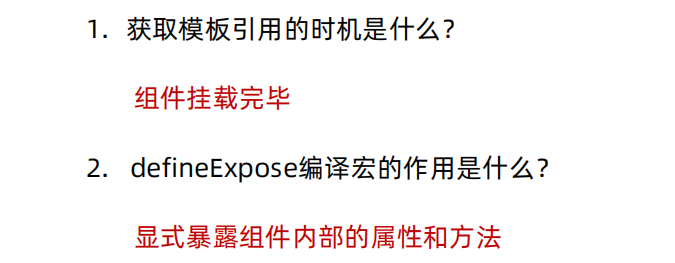


# 跨层组件通信 - provide & inject

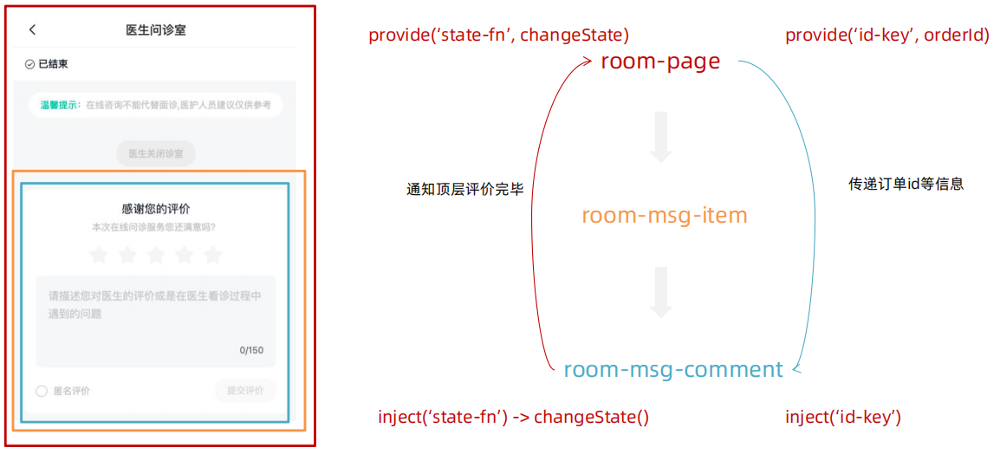


* 跨层传递 **普通数据**

```js
// 1. 顶层组件通过provide函数提供数据 
provide('key', 顶层组件中的数据）

// 2. 底层组件通过inject函数获取数据
const message = inject('key')
```

* 跨层传递 **响应式数据**

```js
// 在调用provide函数时，第二个参数设置为ref对象
provide('key', ref对象）

const message = inject('key')
```

* 跨层传递 **方法**

```js
// 3. 跨层传递函数 => 给子孙后代传递可以修改数据的方法
provide('changeCount', (newCount) => {
  count.value = newCount
})

// 子孙组件获取方法
const changeCount = inject('changeCount')
const clickFn = () => {
  changeCount(1000)
}
```


# Vue3.3新特性 - defineOptions()

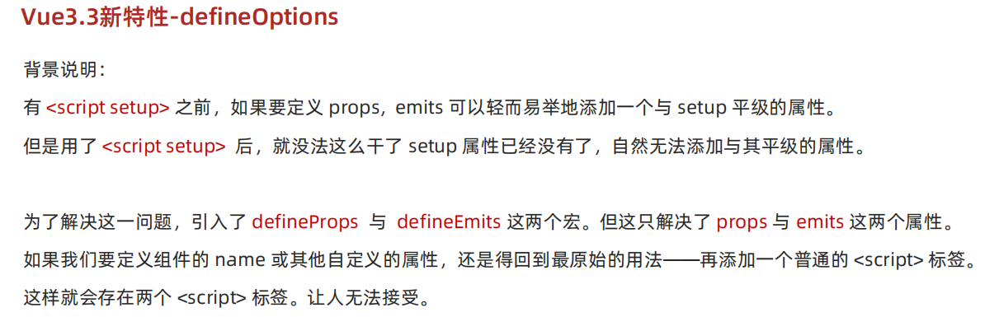


## `<script setup>` 之前

```vue
<script>
export default {
  setup () {
    // 数据
    const message = 'hello Vue3'
    // 函数
    const logMessage = () => {
      console.log(message)
    }
    return {
      message,
      logMessage
    }
  },

  // 与setup同一级别
  name: 'setup-base-page'
}
</script>
```


## `<script setup>` 之后

```vue
<script>
export default {
  name: 'test-index-111'
}
</script>

<script setup>
//.....
</script>
```


## defineOptions() 之后

```vue
<script setup>
defineOptions({
    name: 'defineOptionsIndex',
    inheritAttrs: true,
    .....
})
</script>
```


# Vue3.3新特性-defineModel（试验中...）

* 试验特性，需要开启权限

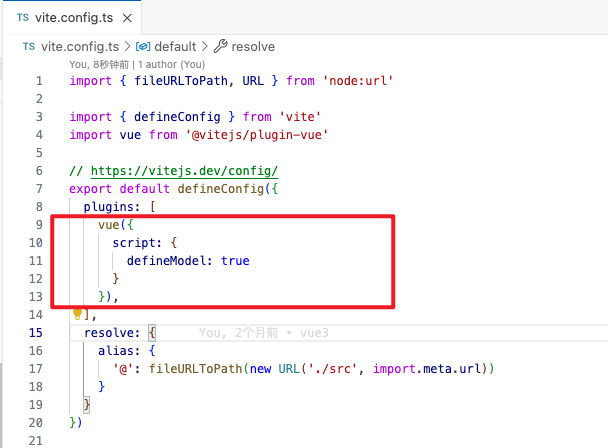


## 原始 v-model 写法

```vue
<script setup>

import myInput from '@/12-my-input.vue'
import { ref } from 'vue'

const txt = ref('1111')

</script>

<template>

<myInput v-model="txt"></myInput>

{{ txt }}

</template>
```

```vue
<script setup>

defineProps({
  modelValue: String
})

const emit = defineEmits(['update:modelValue'])

</script>

<template>
  <input
    type="text"
    :value="modelValue"
    @input="e => emit('update:modelValue', e.target.value)"
  />
</template>
```


## defineModel 写法

```vue
<script setup>

import { defineModel } from 'vue'

const modelValue = defineModel()

</script>

<template>
  <input 
    type="txt"
    :value="modelValue"
    @input="e => modelValue = e.target.value"
  >
</template>
```


