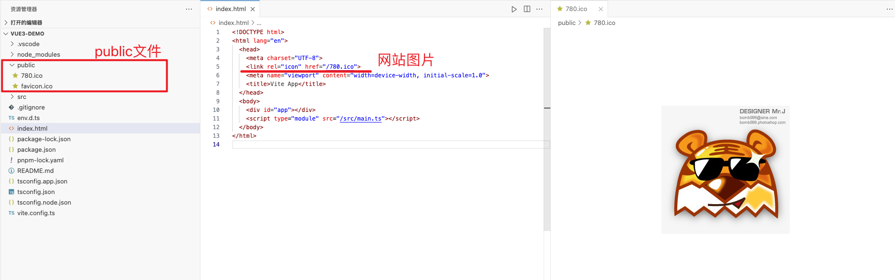
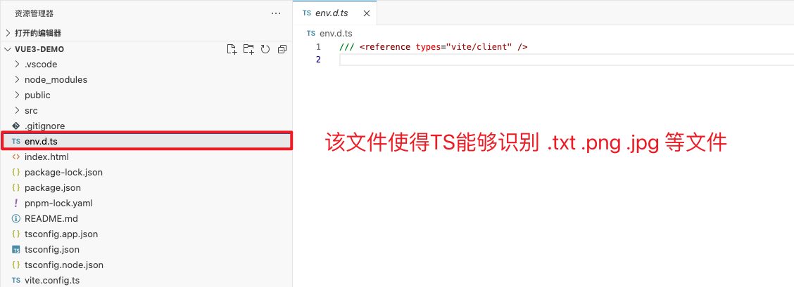
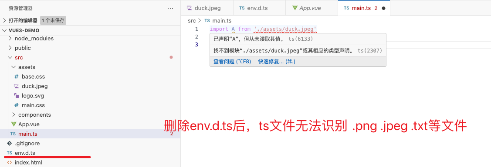

# 创建

```bash
$ npm create vue@latest

Vue.js - The Progressive JavaScript Framework

✔ Project name: … vue3-demo
✔ Add TypeScript? … No / Yes
✔ Add JSX Support? … No / Yes
✔ Add Vue Router for Single Page Application development? … No / Yes
✔ Add Pinia for state management? … No / Yes
✔ Add Vitest for Unit Testing? … No / Yes
✔ Add an End-to-End Testing Solution? › No
✔ Add ESLint for code quality? … No / Yes

Scaffolding project in /Users/qiyeyun/Study/Web/Vue3/禹神-新版Vue3+TS/vue3-demo...

Done. Now run:

  cd vue3-demo
  npm install
  npm run dev
```


# 文件介绍

## public文件夹

public下的图片，在 `index.html` 中调用，作为网站的头。




## env.d.ts文件

使得 ts 能够识别到 .txt .js .png 等文件



测试：删除 `env.d.ts` 文件后，在 main.ts 中无法识别 .txt .jpeg .png 等文件。




## index.html - 入口文件


## vite.config.ts 文件

配置插件 和 代理


## main.ts

```tsx
import './assets/main.css'

import { createApp } from 'vue'  // createApp == 花盆，创建应用
import App from './App.vue'	  // App == 花的根，根组件

createApp(App).mount('#app')
// createApp(App)  把花插在花盆里
// mount('#app')   把花盆放在某个地方
// 总结：createApp创建应用，应用有个根组件是App，把应用挂载在一个名为'app'的div容器中（div在index.html里）。
```


