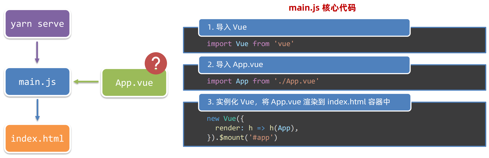

参考：黑马vue / day03


# Vue-Cli脚手架

1. 全局安装（只需安装一次即可）： `npm i @vue/cli -g`
2. 查看vue/cli版本：`vue --version`
3. 创建项目架子：`vue create project-name` (项目名不能使用中文)
4. 启动项目：`npm run serve` (命令不固定，找package.json)


# 工程目录


目前咱们只需认识三个文件即可

1. main.js  入口文件
2. App.vue  App根组件 
3. index.html 模板文件


# 程序执行流程




## main.js - 入口文件

main.js是入口文件，是程序执行的第一入口。

main.js核心作用：导入App.vue，基于App.vue创建结构渲染index.html

```js
// 文件核心作用：导入App.vue，基于App.vue创建结构渲染index.html
// 1. 导入 Vue 核心包
import Vue from 'vue'

// 2. 导入 App.vue 根组件
import App from './App.vue'

// 提示：当前处于什么环境 (生产环境 / 开发环境)
Vue.config.productionTip = false

// 3. Vue实例化，提供render方法 → 基于App.vue创建结构渲染index.html
new Vue({
  // render: h => h(App),
  // 等价于
  render: (createElement) => {
    // 基于App创建元素结构
    return createElement(App)
  }
}).$mount('#app')


// 4. 等价
new Vue({
  	// 这里的#app 就是 index.html 内的<div id="app">
  	el: '#app',    // 作用：和$mount('选择器')作用一致，用于指定Vue所管理容器
  	render: h => h(App)
})
```


## App.Vue - 根组件

```vue
<template>
  <div class="App">
    <div class="box" @click="fn"></div>
  </div>
</template>

<script>
// 导出的是当前组件的配置项
// 里面可以提供 data(特殊) methods computed watch 生命周期八大钩子
export default {
  created () {
    console.log('我是created')
  },
  methods: {
    fn () {
      alert('你好')
    }
  }
}
</script>

<style lang="less">
/* 让style支持less
   1. 给style加上 lang="less"
   2. 安装依赖包 less less-loader
      yarn add less less-loader -D (开发依赖)
*/
.App {
  width: 400px;
  height: 400px;
  background-color: pink;
  .box {
    width: 100px;
    height: 100px;
    background-color: skyblue;
  }
}
</style>
```


## index.html - 模板文件

```html
<!DOCTYPE html>
<html lang="">
  <head>
    <meta charset="utf-8">
    <meta http-equiv="X-UA-Compatible" content="IE=edge">
    <meta name="viewport" content="width=device-width,initial-scale=1.0">
    <link rel="icon" href="<%= BASE_URL %>favicon.ico">
    <title><%= htmlWebpackPlugin.options.title %></title>
  </head>
  <body>
    <!-- 兼容：给不支持js的浏览器一个提示 -->
    <noscript>
      <strong>We're sorry but <%= htmlWebpackPlugin.options.title %> doesn't work properly without JavaScript enabled. Please enable it to continue.</strong>
    </noscript>

    <!-- Vue所管理的容器：将来创建结构动态渲染这个容器 -->
    <div id="app">
      <!-- 工程化开发模式中：这里不再直接编写模板语法，通过 App.vue 提供结构渲染 -->
    </div>

    <!-- built files will be auto injected -->
  </body>
</html>
```


# 组件目录

## 1.组件分类

 .vue文件分为2类，都是 **.vue文件（本质无区别）**

- 页面组件 （配置路由规则时使用的组件）
- 复用组件（多个组件中都使用到的组件）


## 2.存放目录

分类开来的目的就是为了 **更易维护**

1. src/views文件夹

    页面组件 - 页面展示 - 配合路由用

2. src/components文件夹

    复用组件 - 展示数据 - 常用于复用


# 文件说明⭐️

## jsconfig.json

* [官网 - jsconfig.json](https://code.visualstudio.com/docs/languages/jsconfig)
    * [中文翻译参考](https://juejin.cn/post/6930549887402672135)

* 目录中存在`jsconfig.json`文件时，表明该目录是 JavaScript 项目的根目录。
* 如果不使用 JavaScript，那么无需关心`jsconfig.json`
* `jsconfig.json`源于 TypeScript 的配置文件 [tsconfig.json](https://link.juejin.cn/?target=https%3A%2F%2Fwww.typescriptlang.org%2Fdocs%2Fhandbook%2Ftsconfig-json.html)。相当于`tsconfig.json`的`allowJs`属性设置为`true`


## tsconfig.json

* [官网 - tsconfig.json](https://link.juejin.cn/?target=https%3A%2F%2Fwww.typescriptlang.org%2Fdocs%2Fhandbook%2Ftsconfig-json.html)


