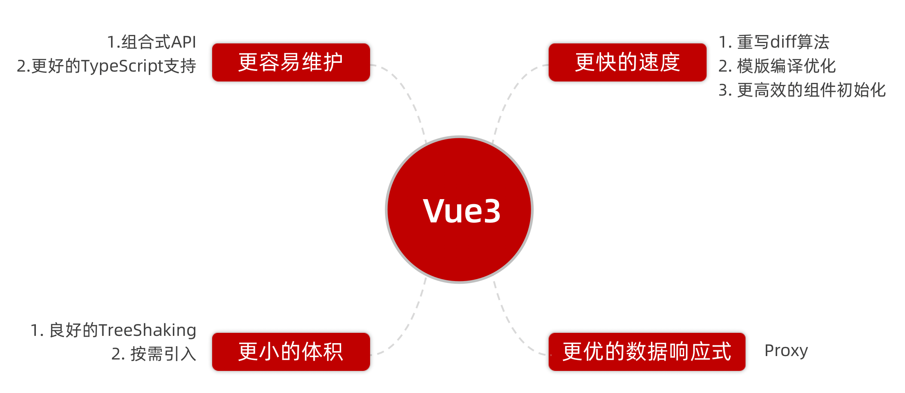
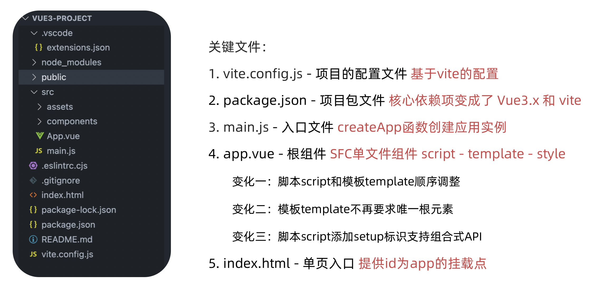
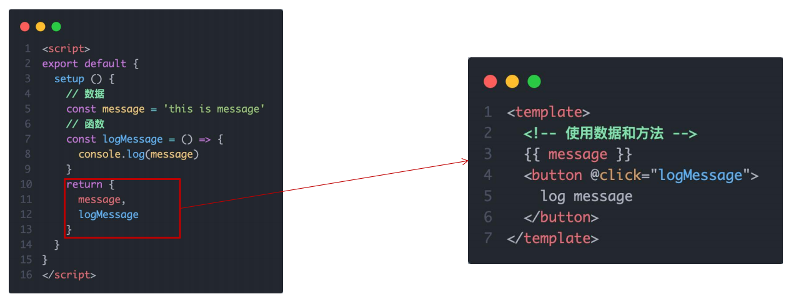

# 脚手架

* Vue2  -> [Vue CLI](https://cli.vuejs.org/zh/#%E8%B5%B7%E6%AD%A5) -> Webpack
* Vue3 -> [create-vue](https://cn.vuejs.org/guide/scaling-up/tooling.html#project-scaffolding)  -> Vite


## create-vue创建Vue3

[github - create-vue](https://github.com/vuejs/create-vue)

* 前提环境条件：已安装 16.0 或更高版本的 Node.js
    * `node -v`

* 创建一个Vue应用
    * `npm init vue@latest`
    * `npm create vue@latest`
    * 这一指令将会安装并执行 create-vue


# Vue3优势




# Vue2 / 3 项目差异



## 1. vite.config.js 配置文件

* vue.config.js

* vite.config.js


## 2. Package.json 依赖变化


## 3. Main.js

**Vue2**

```js
import Vue from 'vue'
import App from './App.vue'

Vue.config.productionTip = false

new Vue({
  render: h => h(App)
}).$mount('#app')
```

**Vue3**

```js
import { createApp } from 'vue'
import App from './App.vue'

createApp(App).mount('#app')
```


## 4. App.vue

app.vue - 根组件 SFC单文件组件 script - template - style 

* 变化一：脚本script和模板template顺序调整 

* 变化二：模板template不再要求唯一根元素 

* 变化三：脚本script添加setup标识支持组合式API 


## 5. index.html

微调


# 组合式API vs 选项式API


# setup选项

## setup选项的写法和执行时机 

* 原始繁琐写法

```vue
<script>
// setup
// 1. 执行时机，比beforeCreate还要早
// 2. setup函数中，获取不到this (this是undefined)
// 3. 数据 和 函数，需要在 setup 最后 return，才能模板中应用
//    问题：每次都要return，好麻烦？
// 4. 通过 setup 语法糖简化代码
export default {
  setup () {
    // 此时this=undefine，因为太早了
    console.log('setup函数', this)
    // 数据
    const message = 'hello Vue3'
    // 函数
    const logMessage = () => {
      console.log(message)
    }
    return {
      message,
      logMessage
    }
  },
  name: 'setup-base-page',
  beforeCreate () {
    console.log('beforeCreate函数')
  }
}
</script>
```


* 语法糖改进后写法

```vue
<script setup>
const message = 'this is a message'
const logMessage = () => {
  console.log(message)
}
</script>

<template>
  <div>{{ message }}</div>
  <button @click="logMessage">按钮</button>
</template>
```


## setup语法糖

* 原始复杂写法，需要 return




* 语法糖语法，简化代码


## setup语法糖原理


## setup总结


