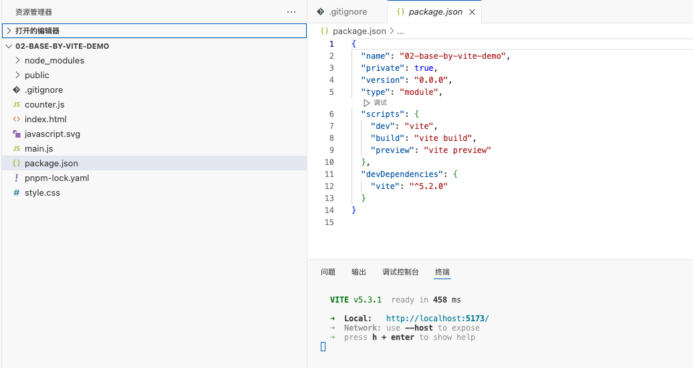

视频

* [前端构建工具（webpack&vite）教程 李立超](https://www.bilibili.com/video/BV1Kd4y147gg?p=11&vd_source=dc55c355e9f5b6174832aacfb5d8b6aa)


# 一、Vite vs Webpack

## 1. Webpack

**Webpack** 是一个模块打包工具，可以处理各种静态资源（JavaScript、CSS、图片等）并将其打包成一个或多个文件。它功能强大，适用于大型项目和复杂的配置需求。


## 2. Vite

**Vite** 是由 Vue.js 作者尤雨溪开发的新一代前端构建工具，专注于提升开发体验和构建速度。Vite 利用浏览器 **原生 ES 模块加载**，在开发阶段提供极快的冷启动时间。


## 3. Webpack 与 Vite 的对比

| 特性              | Webpack                    | Vite                                    |
| ----------------- | -------------------------- | --------------------------------------- |
| 启动速度          | 慢（依赖解析时间长）       | 快（基于 ES 模块的即时服务）            |
| 构建速度          | 较慢（需要多次打包优化）   | 快（生产模式下使用 Rollup 打包）        |
| 配置复杂度        | 高（灵活但复杂）           | 低（默认配置开箱即用）                  |
| 热模块替换（HMR） | 有（但速度较慢）           | 快速（基于 ES 模块）                    |
| 插件生态          | 丰富（大量插件和加载器）   | 增长中（已有许多常用插件）              |
| 使用场景          | 适用于大型和复杂项目       | 适用于快速开发和中小型项目              |
| 框架支持          | 通用（需配置对应框架插件） | 多框架开箱即用（Vue、React、Svelte 等） |
| 文档和社区支持    | 成熟且丰富                 | 新兴但快速增长                          |


# 二、创建Vite项目

## 1. 手动创建vite项目

> Demo: my-code-demo/01-base-by-hand-demo


### a. 初始化项目

```sh
$ npm init -y
```

安装vite

```sh
$ npm install vite -D
$ pnpm add vite -D
```


### b. 新增测试代码

* index.html

> **type="module"：采用的是ES模块化规范。**

```html
<!DOCTYPE html>
<html lang="en">
<head>
  <meta charset="UTF-8">
  <meta name="viewport" content="width=device-width, initial-scale=1.0">
  <title>Document</title>
</head>
<body>
  <script type="module" src="./main.js"></script>
</body>
</html>
```

* main.js

```js
document.body.insertAdjacentHTML('beforeend', '<h1>你好 Vite！！</h1>')
```


### c. 新增代码路径

#### Ⅰ. 可直接放在根目录下


运行：`$ pnpm vite`

直接打开：http://localhost:5173/ ，默认根目录下的index.html


#### Ⅱ. 放到src目录下


```html
<!DOCTYPE html>
<html lang="en">
<head>
  <meta charset="UTF-8">
  <meta name="viewport" content="width=device-width, initial-scale=1.0">
  <title>Document</title>
</head>
<body>
  <script type="module" src="./src/main.js"></script>
  <script type="module" src="./src/main02.js"></script>
</body>
</html>
```

运行：`$ pnpm vite`


## 2. 自动创建vite项目

> Demo: my-code-demo/02-base-by-vite-demo

```sh
$ npm create vite@latest

$ pnpm create vite
```


```sh
# 运行
$ pnpm install
$ pnpm run dev
```




## 3. vite打包、预览

`pnpm vite build`：打包项目


**【问题】：打出来的文件无法访问，需要放到服务器上，才能正常打开！！！**


`pnpm vite preview`：开启一个服务器，预览打包好的项目

**前提：必须先打包好，才能预览，否则报错！**


## 4. vite命令总结

```json
// package.json
{
  "scripts": {
    "dev": "vite",
    "build": "vite build",
    "preview": "vite preview"
  },
}
```

* `pnpm vite` : 启动一个开发的服务器，不会做任何打包操作
    * vite的源码目录，就是项目的根目录

* `pnpm vite build`：打包项目
* `pnpm vite preview`：开启一个服务器，预览打包好的项目


# 三、vite处理css

> Demo: my-code-demo/03-css-vite-demo

**结论：无需任何配置。内置已经配置好了，这与webpack很不一样！！！**


新建一个css文件 index.css

```css
h1 {
  background-color: aqua;
}
```

在main.js中引入index.css，便于打包时候找到

```js
// 导入css
import './styles/index.css'
```

打包 & 预览

```sh
# 打包
$ pnpm run build

# 预览
$ pnpm run preview     
```

显示正常！！！


# 四、处理js版本兼容

在 `main.js` 中写一个ES6函数

```js
// 自写函数，如何兼容
document.body.onclick = () => {
  console.log('哈哈哈哈哈')
}
```


## 1. 直接打包

```sh
$ pnpm run build
```


**【无法兼容】：可以发现，打出的包中，高级的函数没有被兼容到低版本的浏览器**

```js
document.body.onclick=()=>{console.log("哈哈哈哈哈")};
```


## 2. 使用插件兼容js

[Vite官网 - 使用插件](https://cn.vitejs.dev/guide/using-plugins.html)


### a. 安装插件

```sh
$ pnpm add -D @vitejs/plugin-legacy
$ pnpm add -D terser 
```


### b.  `vite.config.js` 配置文件

```js
// vite.config.js
import legacy from '@vitejs/plugin-legacy'
import { defineConfig } from 'vite'

export default defineConfig({
  plugins: [
    legacy({
      targets: ['defaults', 'IE 11'],
    }),
  ],
})
```


### c. `defineConfig` 介绍

* `import { defineConfig } from 'vite'`，是vite包中的方法。
* `defineConfig` ：可写可不写！写了之后，就有了输入提示。

无 `defineConfig`，如下：

```js
// vite.config.js
import legacy from '@vitejs/plugin-legacy'

export default {
  plugins: [
    legacy({
      targets: ['defaults', 'IE 11'],
    }),
  ],
}
```


### d. Vite导出模式 vs Webpack导出模式

Vite 使用 **ES6 模块化** 规范来导出文件

```js
// vite.config.js
export default {
	......
}
```

webpack使用 **Common.js 模块化** 规范

```js
// webpack.config.js
module.exports = {
	......
}
```


Vite包的 `package.json` 中可以看到 `"type": "module",`


### e. 打包，查看

```js
// vite.config.js
import { defineConfig } from "vite";
import legacy from "@vitejs/plugin-legacy";

export default defineConfig({
  plugins: [
    legacy({
      targets: ["defaults", "IE 11"]     // 默认是支持ES6，所以后面必须指定也要支持IE11，才会兼容代码
    })
  ]
})
```


同一个文件，会导出两个文件，一个是默认支持ES6的，一个含 `legacy` 文件是支持IE11的兼容文件，如下图：


