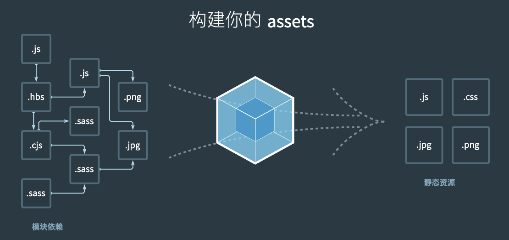

# 学习资源

[Webpack4实战教程](https://mouday.github.io/coding-tree/#/blog/webpack/index?id=webpack4实战教程)

尚硅谷新版Webpack4实战教程(从入门到精通) https://www.bilibili.com/video/BV1e7411j7T5

尚硅谷前端Webpack4教程（高级进阶篇） https://www.bilibili.com/video/BV1cv411C74F

笔记分享: https://lab.puji.design/webpack-getting-started-manual/

课件地址webpack从入门到精通

- 下载地址：https://pan.baidu.com/s/1JxvXF8EyG9TSNLqkc98YzQ 提取码：i5qc
- 备用地址：https://pan.baidu.com/s/1T2g37SpIQRjF6fjFDl_YwA 密码:uw5q


[尚硅谷前端技术之webpack从入门到精通(上).pdf](./尚硅谷资料-Webpack4-1基础/课件/尚硅谷前端技术之webpack从入门到精通(上).pdf)


# 一、Webpack简介

## 1.1 引入

* less编写css，在html中引入`'./com.less'`，浏览器无法识别，需要工具将 `.less -> .css` 文件；

* 用 ES6 高级语法编写 js 代码，浏览器也无法识别，需要工具编译成浏览器认识的语法；
* 等等等，一个个小工具编译成浏览器能够识别的代码；这些小工具的集合就是 **构建工具**，而 webpack 就是构建工具的一种。


## 1.2 什么是webpack

> webpack 是一种前端资源 **构建工具**，一个静态模块打包器 (module bundler)。 
>
> 在 webpack 看来, 前端的所有资源文件(js/json/css/img/less/...)都会作为 **模块** 处理。 
>
> 它将根据模块的依赖关系进行静态分析，打包生成对应的 **静态资源(bundle)**。




## 1.3 [Webpack五个核心概念](https://mouday.github.io/coding-tree/#/blog/webpack/index?id=_22、webpack五个核心概念)

1. Entry：入口(Entry)指示 webpack 以哪个文件为入口起点开始打包，分析构建内部依赖图。

2. Output：输出(Output)指示 webpack 打包后的资源 bundles 输出到哪里去，以及如何命名。

3. Loader ：处理非js文件，翻译工作

    Loader 让 webpack 能 够 去 处 理 那 些 非 JavaScript 文 件 ( **webpack 自 身 只 理 解 JavaScript** ) 

4. Plugins：插件，执行范围更广的任务，打包优化，压缩，定义环境中的变量等

    插件(Plugins)可以用于执行范围更广的任务。插件的范围包括，从打包优化和压缩，一直到重新定义环境中的变量等。

5. mode：指示 Webpack 使用相应模式的配置。

    - development 开发模式：会将 process.env.NODE_ENV 的值设为 development。启用 NameChunksPlugin 和 NameModulesPlugin。特点是能让代码本地调试运行的环境。
    - production 生产模式：会将 process.env.NODE_ENV 的值设为 production。启用 FlagDependencyUsagePlugin, FlagIncludedChunksPlugin, ModuleConcatenationPlugin, NoEmitOnErrorsPlugin, OccurrenceOrderPlugin, SideEffectsFlagPlugin 和 UglifyJsPlugin。特点是能让代码优化上线运行的环境。


有一个项目，需要一个Entry，来告诉webpack入口，当遇到 less 文件，此时需要 Loader 将 Less 转为 CSS 文件，遇到 img 等文件，需要 Plugins 处理资源压缩等复杂功能，最后生成 Bundle 在 Output 出口 输出。

 

# 二、Webpack-4 初体验

## 1. 项目创建

```sh
$ mkdir webpack-demo
$ cd webpack-demo

# 初始化项目目录
$ npm init -y

# 安装webpack
$ npm i webpack webpack-cli -D
# 指定版本
$ npm i webpack@4 webpack-cli@3 -D

# 更新
$ pnpm up weboack@4
```

安装指定版本的webpack

| 依赖               | 版本 | 新版本 |
| ------------------ | ---- | ------ |
| webpack            | 4    | 5      |
| webpack-cli        | 3    | 4      |
| webpack-dev-server | 3    | 3      |


## 2. 源码文件

```json
// ./src/data.json
{
  "name": "jack",
  "age": 18
}
```

```css
// ./src/index.css 
html,
body {
  height: 100%;
  background-color: pink;
}
```

```js
// ./src/index.js
/*
  index.js: webpack入口起点文件

  1. 运行指令：
    开发环境：webpack ./src/index.js -o ./build/built.js --mode=development
      webpack会以 ./src/index.js 为入口文件开始打包，打包后输出到 ./build/built.js
      整体打包环境，是开发环境
    生产环境：webpack ./src/index.js -o ./build/built.js --mode=production
      webpack会以 ./src/index.js 为入口文件开始打包，打包后输出到 ./build/built.js
      整体打包环境，是生产环境

   2. 结论：
    1. webpack能处理js/json资源，不能处理css/img等其他资源
    2. 生产环境和开发环境将ES6模块化编译成浏览器能识别的模块化~
    3. 生产环境比开发环境多一个压缩js代码。
*/

import './index.css';   // webpack无法处理css

import data from './data.json';
console.log(data);

function add(x, y) {
  return x + y;
}

console.log(add(1, 2));
```


## 3. 打包

```sh
# NodeJs版本：16
$ nvm use 16
```

```json
{
  "scripts": {
    // 源代码运行
    "dev": "node ./src/index.js",
    // webpack打包 dev模式
    "webpack:dev": "webpack ./src/index.js -o ./dist_dev/built_dev.js --mode=development",
    // webpack打包 pro模式
    "webpack:pro": "webpack ./src/index.js -o ./dist_pro/built_pro.js --mode=production",
    // 测试 dev输出代码
    "dist:dev": "node ./dist_dev/built_dev.js",
    // 测试 pro输出代码
    "dist:pro": "node ./dist_pro/built_pro.js",
  },

  "devDependencies": {
    "webpack": "^4.47.0",
    "webpack-cli": "^3.3.12"
  }
}
```


# 三、webpack4 - 打包样式文件

## 1. 项目创建

```sh
$ pnpm add webpack@4 webpack-cli@3 -D

$ pnpm add css-loader@3 -D
$ pnpm up css-loader@3 -D

$ pnpm add style-loader@1 -D
$ pnpm up style-loader@1 -D

$ pnpm add less-loader@5 -D
$ pnpm up less-loader@5 -D
```


## 2. webpack配置文件

```js
// webpack.config.js
/*
  webpack.config.js  webpack的配置文件
    作用: 指示 webpack 干哪些活（当你运行 webpack 指令时，会加载里面的配置）

    所有构建工具都是基于nodejs平台运行的~模块化默认采用commonjs。
*/

// resolve用来拼接绝对路径的方法
const { resolve } = require('path');

module.exports = {
  // webpack配置
  // 入口起点
  entry: './src/index.js',
  // 输出
  output: {
    // 输出文件名
    filename: 'built.js',
    // 输出路径
    // __dirname nodejs的变量，代表当前文件的目录绝对路径
    path: resolve(__dirname, 'build')
  },
  // loader的配置
  module: {
    rules: [
      // 详细loader配置
      // 不同文件必须配置不同loader处理
      {
        // 匹配哪些文件
        test: /\.css$/,
        // 使用哪些loader进行处理
        use: [
          // use数组中loader执行顺序：从右到左，从下到上 依次执行
          // 创建style标签，将js中的样式资源插入进行，添加到head中生效
          'style-loader',
          // 将css文件变成commonjs模块加载js中，里面内容是样式字符串
          'css-loader'
        ]
      },
      {
        test: /\.less$/,
        use: [
          'style-loader',
          'css-loader',
          // 将less文件编译成css文件
          // 需要下载 less-loader和less
          'less-loader'
        ]
      }
    ]
  },
  // plugins的配置
  plugins: [
    // 详细plugins的配置
  ],
  // 模式
  mode: 'development', // 开发模式
  // mode: 'production', // 生产模式
}
```


## 3. 打包

```sh
# 全局安装webpack
$ webpack

# 局部安装webpack
$ npx webpack
Hash: ef117f32f8ff7181f27b
Version: webpack 4.47.0
Time: 272ms
Built at: 02/01/2024 2:31:52 PM
   Asset      Size  Chunks             Chunk Names
built.js  20.7 KiB    main  [emitted]  main
Entrypoint main = built.js
[./node_modules/.pnpm/css-loader@3.6.0_webpack@4.47.0/node_modules/css-loader/dist/cjs.js!./node_modules/.pnpm/less-loader@5.0.0_less@3.13.1_webpack@4.47.0/node_modules/less-loader/dist/cjs.js!./src/index.less] 312 bytes {main} [built]
[./node_modules/.pnpm/css-loader@3.6.0_webpack@4.47.0/node_modules/css-loader/dist/cjs.js!./src/index.css] 380 bytes {main} [built]
[./src/index.css] 623 bytes {main} [built]
[./src/index.js] 70 bytes {main} [built]
[./src/index.less] 728 bytes {main} [built]
    + 2 hidden modules
```


