# 学习资源

[Webpack4实战教程](https://mouday.github.io/coding-tree/#/blog/webpack/index?id=webpack4实战教程)

尚硅谷新版Webpack4实战教程(从入门到精通) https://www.bilibili.com/video/BV1e7411j7T5

尚硅谷前端Webpack4教程（高级进阶篇） https://www.bilibili.com/video/BV1cv411C74F

课件地址webpack从入门到精通

- 下载地址：https://pan.baidu.com/s/1JxvXF8EyG9TSNLqkc98YzQ 提取码：i5qc
- 备用地址：https://pan.baidu.com/s/1T2g37SpIQRjF6fjFDl_YwA 密码:uw5q

* PDF：[尚硅谷前端技术之webpack从入门到精通(上).pdf](./尚硅谷资料-Webpack4-1基础/课件/尚硅谷前端技术之webpack从入门到精通(上).pdf)


* [掌握Webpack4（实战篇一）](https://juejin.cn/post/6844903918275657735)

* [实例带你入门并掌握Webpack4（实战篇二）](https://juejin.cn/post/6844903918766391304)

* [实例带你入门并掌握Webpack4（实战篇三）](https://juejin.cn/post/6844903918778974215)


* [学习webpack loader，这一篇文章足够了。](https://blog.csdn.net/SmileLife123/article/details/133417378)


# 一、Webpack简介

## 1. 引入

* less编写css，在html中引入`'./com.less'`，浏览器无法识别，需要工具将 `.less -> .css` 文件；
* 用 ES6 高级语法编写 js 代码，浏览器也无法识别，需要工具编译成浏览器认识的语法；

### a. 什么是构建工具

* 等等等，一个个小工具编译成浏览器能够识别的代码；这些小工具的集合就是 **构建工具**，而 webpack 就是构建工具的一种。


## 2. 什么是webpack

> webpack 是一种前端资源 **构建工具**，一个 **静态模块打包器 (module bundler)**。 
>
> 在 webpack 看来, 前端的所有资源文件(js/json/css/img/less/...)都会作为 **模块** 处理。 
>
> 它将根据模块的依赖关系进行静态分析，打包生成对应的 **静态资源(bundle)**。

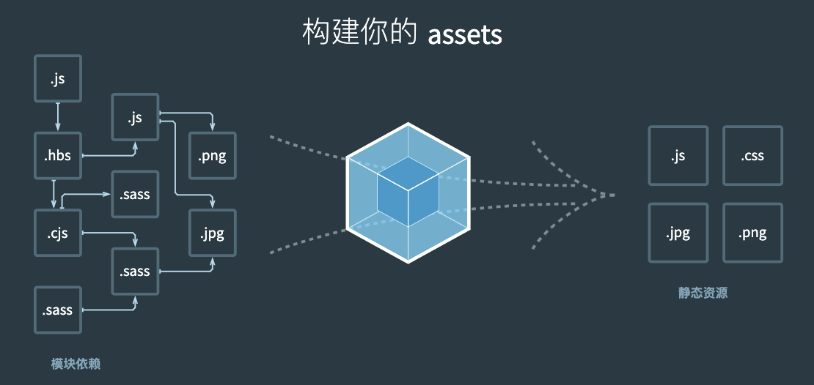


### a. 过程概要

有一个项目，需要一个Entry，来告诉webpack入口，当遇到 less 文件，此时需要 Loader 将 Less 转为 CSS 文件，遇到 img 等文件，需要 Plugins 处理资源压缩等复杂功能，最后生成 Bundle 在 Output 出口 输出。

* Webpack 需要一个入口，这里入口就是 `index.js` 文件；
* `index.js` 文件中，又依赖了 `jQuery` 和 `index.less` 等其他文件；
* 这些文件形成 `chunk` （代码块），再对代码块进行处理，如：less -> css、js语法兼容等等；这些操作成为 **打包**。
* 打包完成后，输出的文件叫 `Bundle`。

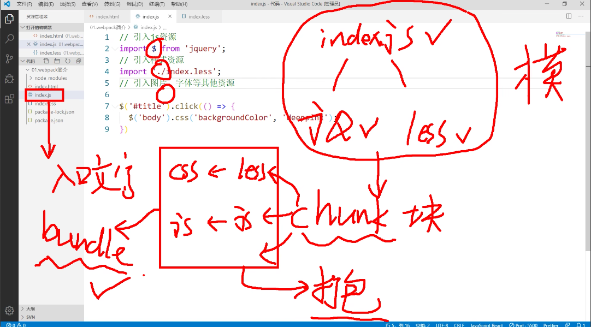


## 3. webpack 的 module、bundle、chunk 分别指的是什么？

### a. Module（模块）：

module指的是Webpack处理的代码的单个文件。这可以是JavaScript、CSS、图片或其他类型的文件。

在Webpack中，每个文件都被视为一个独立的模块，它们可以通过import、require等方式引入和导出。

模块可以包含代码、依赖关系]和其他相关资源，它们通常用于组织和管理应用程序的各个部分。

### b. Bundle（捆绑包）：

bundle是由Webpack根据模块之间的依赖关系生成的最终输出文件。它将多个模块打包成一个或多个捆绑包。

在开发过程中，Webpack会根据入口文件（entry）和模块之间的依赖关系，递归地构建一个或多个捆绑包。

捆绑包通常是用于在浏览器中加载和执行的最终文件，包含了应用程序所需的所有代码和资源。

### c. Chunk（代码块）：

chunk是Webpack在构建过程中生成的代码块，它是一种逻辑上的概念，表示一组相互依赖的模块。

当Webpack构建应用程序时，它会根据依赖关系将模块组织成不同的代码块，例如按需加载（懒加载）时生成的分割代码块。

默认情况下，Webpack会将所有入口点（entry point）及其依赖的模块打包到一个主要的初始代码块中。但是，通过使用代码分割（code splitting）技术，可以将应用程序拆分成多个代码块，以实现按需加载和优化性能。

**总结：**

module是Webpack处理的单个文件，代表了应用程序的组成部分。

bundle是由Webpack生成的最终输出文件，它包含了所有模块的代码和资源。

chunk是逻辑上的代码块，表示一组相互依赖的模块。它可以根据需要进行拆分和加载。


## 4. Webpack五个核心概念

1. Entry：入口(Entry)指示 webpack 以哪个文件为入口起点开始打包，分析构建内部依赖图。

2. Output：输出(Output)指示 webpack 打包后的资源 bundles 输出到哪里去，以及如何命名。

3. Loader ：处理非js文件，翻译工作

    Loader 让 webpack 能 够 去 处 理 那 些 非 JavaScript 文 件 ( **webpack 自 身 只 理 解 JavaScript** ) 

4. Plugins：插件，执行范围更广的任务，打包优化，压缩，定义环境中的变量等

    插件(Plugins)可以用于执行范围更广的任务。插件的范围包括，从打包优化和压缩，一直到重新定义环境中的变量等。

5. mode：指示 Webpack 使用相应模式的配置。

    - development 开发模式：会将 process.env.NODE_ENV 的值设为 development。启用 NameChunksPlugin 和 NameModulesPlugin。特点是能让代码本地调试运行的环境。
    - production 生产模式：会将 process.env.NODE_ENV 的值设为 production。启用 FlagDependencyUsagePlugin, FlagIncludedChunksPlugin, ModuleConcatenationPlugin, NoEmitOnErrorsPlugin, OccurrenceOrderPlugin, SideEffectsFlagPlugin 和 UglifyJsPlugin。特点是能让代码优化上线运行的环境。


## 5. webpack 的主要配置项有哪些

* [webpack 的主要配置项有哪些](https://github.com/pro-collection/interview-question/issues/752)

Webpack 是一个现代 JavaScript 应用程序的静态模块打包器。配置文件名通常为 `webpack.config.js`，它提供了一种配置 Webpack 的方式。下面是一些主要的 Webpack 配置选项：

1. **entry**: 入口起点(entry point)指示 webpack 应该使用哪个模块，来作为构建其内部依赖图的开始。可以指定一个或多个入口起点。
2. **output**: output 属性告诉 webpack 在哪里输出它所创建的 bundles，以及如何命名这些文件，默认值为 `./dist`。
3. **module**: module 属性用于决定如何处理项目中的不同类型的模块。
    - **rules**: 配置模块的读取和解析规则，通常用来配置 loader。
4. **resolve**: 配置模块如何解析。
    - **extensions**: 自动解析确定的扩展，此选项能够使用户在引入模块时不带扩展。
5. **plugins**: 插件是用来扩展 webpack 功能的。它们会在构建流程中的特定时机注入运行逻辑来改变构建结果或做你想要的事情。
6. **devServer**: 通过来自 `webpack-dev-server` 的这些选项能够对开发服务器的行为进行控制。
7. **devtool**: 此选项控制是否生成，以及如何生成 source map。
8. **mode**: 通过设置 `development` 或 `production` 之中的一个，来为流程提供相应模式下的内置优化。
9. **optimization**: 包含一组可用来调整构建输出的选项。
    - **splitChunks**: 配置模块的拆分，可以将公共的依赖模块提取到已有的入口 chunk 中，或者提取到一个新生成的 chunk。
    - **runtimeChunk**: 为每个 entry 创建一个运行时文件。
10. **performance**: 允许 webpack 根据某些参数，控制资产和入口起点的最大大小。
11. **externals**: 防止将某些 import 包(package)打包到 bundle 中，而是在运行时(runtime)再去从外部获取这些扩展依赖。

每个项目的具体需求不同，Webpack 的配置也会有所不同。这些选项提供了强大的配置能力和灵活性，可以用来定制 Webpack 的打包、加载和转换行为。


## 6. `webpack.config.js` 介绍

* `webpack.config.js`：webpack的配置文件
* 作用：指示 webpack 干哪些活（当你运行 webpack 指令时，会加载里面的配置）

* 所有构建工具都是基于nodejs平台运行的，模块化默认采用commonjs。
    * 区分：src中的代码，基于ES6与 `webpack.config.js` 不冲突！！！！
    * 导入：`require('path');`
    * 导出：`module.exports = {}`


## 7. `webpack`命令行 与 `webpack.config.js`关系

* `webpack.config.js`是`webpack`打包的默认配置文件，其默认位于项目的根目录中。
* 比如说如果我们在控制台中输入`webpack`指令，后面不跟任何参数的话，则`webpack`默认查找位于根目录中的`webpack.config.js`文件，并根据该文件加载与执行相应的依赖。


## 8. 为什么需要loader和plugins

webpack是一个打包工具，即webpack会将一切文件视为模块，但是webpack在打包的时候只是认识JS文件或者JSON文件，并不认识CSS文件，png图片等，如果想让webpack能够在打包的时候识别其他文件，就必须要使用loader，即loader的作用就是让webpack拥有可以加载和了解除JS文件以外的其他文件。


## 9. 手写loader

[深度解读Webpack中的loader原理](https://www.cnblogs.com/gogo2027/p/16812364.html)

[Webpack 原理系列：如何编写loader](https://www.51cto.com/article/664515.html)


## 10. loader 单个与多个的写法

### a. loader默认配置

```js
// webpack.config.js
module.exports = {
  entry: './src/js/index.js',
  module: {
    rules: [
      {
        test: /\.css$/,
        use: [
          MiniCssExtractPlugin.loader,
          'css-loader',
          /**
           * css兼容性处理：postcss --> postcss-loader postcss-preset-env
           */
//--------------------------------------------------------------------------
          // 使用 loader 默认配置
          'postcss-loader',
          // 等价于
          {
          	 loader: 'postcss-loader'
          }
//--------------------------------------------------------------------------
        ]
      }
    ]
  },
  ......
};
```


### b. loader修改配置 - options

```js

          
          
// webpack.config.js
module.exports = {
  entry: './src/js/index.js',
  module: {
    rules: [
      {
        test: /\.css$/,
        use: [
          MiniCssExtractPlugin.loader,
          'css-loader',
          /**
           * css兼容性处理：postcss --> postcss-loader postcss-preset-env
           */
//--------------------------------------------------------------------------
		  {
            loader: 'postcss-loader',
            options: { 
              ident: 'postcss',
              plugins: () => [
                // postcss的插件 
                require('postcss-preset-env')()
              ]
            }
          }
//--------------------------------------------------------------------------
        ]
      }
    ]
  },
  ......
};
```


### c. loader多种写法

```json
 module: {
    rules: [
      {
        test: /\.less$/,
        use: [ 'style-loader', 'css-loader', 'less-loader' ]
      },
      {
        // 问题：默认处理不了html中img图片
        // 处理图片资源
        test: /\.(jpg|png|gif)$/,
        // 使用一个loader
        // 下载 url-loader file-loader
        loader: 'url-loader',
        options: {
          // 图片大小小于8kb，就会被base64处理
          // 优点: 减少请求数量（减轻服务器压力）
          // 缺点：图片体积会更大（文件请求速度更慢）
          limit: 8 * 1024,
          // 问题：因为url-loader默认使用es6模块化解析，而html-loader引入图片是commonjs
          // 解析时会出问题：[object Module]
          // 解决：关闭url-loader的es6模块化，使用commonjs解析
          esModule: false,
          // 给图片进行重命名
          // [hash:10]取图片的hash的前10位
          // [ext]取文件原来扩展名
          name: '[hash:10].[ext]'
        }
      }
   }
}
```


# 二、Webpack4 - 打包初体验

## 1. 项目创建

```sh
$ mkdir webpack-demo
$ cd webpack-demo

# 初始化项目目录
$ npm init -y

# 安装webpack
$ npm i webpack webpack-cli -D
# 指定版本
$ npm i webpack@4 webpack-cli@3 -D

# 更新
$ pnpm up weboack@4
```

安装指定版本的webpack

| 依赖               | 版本 | 新版本 |
| ------------------ | ---- | ------ |
| webpack            | 4    | 5      |
| webpack-cli        | 3    | 4      |
| webpack-dev-server | 3    | 3      |

## 2. 源码文件

```json
// ./src/data.json
{
  "name": "jack",
  "age": 18
}
```

```css
// ./src/index.css 
html,
body {
  height: 100%;
  background-color: pink;
}
```

```js
// ./src/index.js
/*
  index.js: webpack入口起点文件

  1. 运行指令：
    开发环境：webpack ./src/index.js -o ./build/built.js --mode=development
      webpack会以 ./src/index.js 为入口文件开始打包，打包后输出到 ./build/built.js
      整体打包环境，是开发环境
    生产环境：webpack ./src/index.js -o ./build/built.js --mode=production
      webpack会以 ./src/index.js 为入口文件开始打包，打包后输出到 ./build/built.js
      整体打包环境，是生产环境

   2. 结论：
    1. webpack能处理js/json资源，不能处理css/img等其他资源
    2. 生产环境和开发环境将ES6模块化编译成浏览器能识别的模块化~
    3. 生产环境比开发环境多一个压缩js代码。
*/

// import './index.css';   // webpack无法处理css

import data from './data.json';
console.log(data);

function add(x, y) {
  return x + y;
}

console.log(add(1, 2));
```

### a. 结论：
    1. webpack能处理js/json资源，不能处理css/img等其他资源
    2. 生产环境和开发环境将ES6模块化编译成浏览器能识别的模块化~
    3. 生产环境比开发环境多一个压缩js代码。


## 3. 打包 - 命令行

```sh
# NodeJs版本：16
$ nvm use 16
```

```json
{
  "scripts": {
    // 源代码运行
    "dev": "node ./src/index.js",
    // webpack打包 dev模式
    "webpack:dev": "webpack ./src/index.js -o ./dist_dev/built_dev.js --mode=development",
    // webpack打包 pro模式
    "webpack:pro": "webpack ./src/index.js -o ./dist_pro/built_pro.js --mode=production",
    // 测试 dev输出代码
    "dist:dev": "node ./dist_dev/built_dev.js",
    // 测试 pro输出代码
    "dist:pro": "node ./dist_pro/built_pro.js",
  },

  "devDependencies": {
    "webpack": "^4.47.0",
    "webpack-cli": "^3.3.12"
  }
}
```


# 三、webpack4 - 打包CSS

第一个工程中，webpack命令行，无法将css文件进行打包。

需要创建 配置文件 `webpack.config.js` 进行配置。

## 1. 项目创建

```sh
$ pnpm add webpack@4 webpack-cli@3 -D

$ pnpm add css-loader@3 -D
$ pnpm up css-loader@3 -D

$ pnpm add style-loader@1 -D
$ pnpm up style-loader@1 -D

$ pnpm add less-loader@5 -D
$ pnpm up less-loader@5 -D
```

## 2. 打包

```sh
# 全局安装webpack
$ webpack

# 局部安装webpack
$ npx webpack
Hash: ef117f32f8ff7181f27b
Version: webpack 4.47.0
Time: 272ms
Built at: 02/01/2024 2:31:52 PM
   Asset      Size  Chunks             Chunk Names
built.js  20.7 KiB    main  [emitted]  main
Entrypoint main = built.js
[./node_modules/.pnpm/css-loader@3.6.0_webpack@4.47.0/node_modules/css-loader/dist/cjs.js!./node_modules/.pnpm/less-loader@5.0.0_less@3.13.1_webpack@4.47.0/node_modules/less-loader/dist/cjs.js!./src/index.less] 312 bytes {main} [built]
[./node_modules/.pnpm/css-loader@3.6.0_webpack@4.47.0/node_modules/css-loader/dist/cjs.js!./src/index.css] 380 bytes {main} [built]
[./src/index.css] 623 bytes {main} [built]
[./src/index.js] 70 bytes {main} [built]
[./src/index.less] 728 bytes {main} [built]
    + 2 hidden modules
```

## 3. `webpack.config.js` 完整版

```js
// webpack.config.js
/*
  webpack.config.js  webpack的配置文件
    作用: 指示 webpack 干哪些活（当你运行 webpack 指令时，会加载里面的配置）

    所有构建工具都是基于nodejs平台运行的~模块化默认采用commonjs。
*/

// resolve用来拼接绝对路径的方法
const { resolve } = require('path');

module.exports = {
  // webpack配置
  // 入口起点
  entry: './src/index.js',
  // 输出
  output: {
    // 输出文件名
    filename: 'built.js',
    // 输出路径
    // __dirname nodejs的变量，代表当前文件的目录绝对路径
    path: resolve(__dirname, 'build')
  },
  // loader的配置
  module: {
    rules: [
      // 详细loader配置
      // 不同文件必须配置不同loader处理
      {
        // 匹配哪些文件
        test: /\.css$/,
        // 使用哪些loader进行处理
        use: [
          // use数组中loader执行顺序：从右到左，从下到上 依次执行
          // 创建style标签，将js中的样式资源插入进行，添加到head中生效
          'style-loader',
          // 将css文件变成commonjs模块加载js中，里面内容是样式字符串
          'css-loader'
        ]
      },
      {
        test: /\.less$/,
        use: [
          'style-loader',
          'css-loader',
          // 将less文件编译成css文件
          // 需要下载 less-loader和less
          'less-loader'
        ]
      }
    ]
  },
  // plugins的配置
  plugins: [
    // 详细plugins的配置
  ],
  // 模式
  mode: 'development', // 开发模式
  // mode: 'production', // 生产模式
}
```


## 4. webpack配置文件详解 ⭐️⭐️⭐️

### a. 模块化默认采用commonjs

* 所有构建工具都是基于nodejs平台运行的，模块化默认采用commonjs。
    * 区分：src中的代码，基于ES6与 `webpack.config.js` 不冲突！！！！
    * 导入：`require('path');`
    * 导出：`module.exports = {}`


### b. output

这里引入 nodejs的变量：`__dirname`， 表示当前文件的目录的绝对路径。

```js
output: {
    // 输出文件名
    filename: 'built.js',
    // 输出路径
    // __dirname nodejs的变量，代表当前文件的目录绝对路径
    path: resolve(__dirname, 'build')
},
```


### c. module（Loader的配置）

* 不同文件必须配置不同loader处理，如：css与less需要不同的loader处理。
* `test` 字段：使用正则，匹配哪些文件；
* `use` 字段：使用哪些loader进行处理；
    * `use` 是数组
    * `use` 数组中loader执行顺序：从右到左，从下到上 依次执行；
* <font color='red' size=4>多个loader配合使用时，处理顺序是：**从下到上，从右到左** 的顺序；</font>

```js
  // loader的配置
  module: {
    rules: [
      // 详细loader配置
      // 不同文件必须配置不同loader处理
      {
        // 匹配哪些文件
        test: /\.css$/,
        // 使用哪些loader进行处理
        use: [
          // use数组中loader执行顺序：从右到左，从下到上 依次执行
          // 创建style标签，将js中的样式资源插入进行，添加到head中生效
          'style-loader',
          // 将css文件变成commonjs模块加载js中，里面内容是样式字符串
          'css-loader'
        ]
      },
      {
        test: /\.less$/,
        use: [
          'style-loader',
          'css-loader',
          // 将less文件编译成css文件
          // 需要下载 less-loader和less
          'less-loader'
        ]
      }
    ]
  },
      
//　注意：写法是有顺序的
```


#### Ⅰ. css-loader 的作用

* [css-loader、style-loader作用](https://www.cnblogs.com/goloving/p/14793201.html)

* [听说webpack连less/css也能打包？](https://array-huang.gitbooks.io/multipage-webapp-architecture-with-webpack/content/chapter1/webpack-css-and-less.html)

1、先讲css-loader的作用：css-loader是帮助webpack打包处理css文件的工具；

​	  可以理解为**css-loader将a.css、b.css和c.css的样式内容以字符串的形式拼接在一起，并将其作为js模块的导出内容**。

2、css-loader 使用注意项：

* `css-loader`: 加载.css文件

* `style-loader：`使用`<style>`将css-loader内部样式注入到我们的HTML页面

（1）使用css-loader必须要配合使用style-loader

（2）css-loader的作用是帮我们分析出各个css文件之间的关系，把各个css文件合并成一段css

（3）style-loader的作用是将css-loader生成的css代码挂载到页面的header部分

（4）多个loader配合使用时，处理顺序是：**从下到上，从右到左** 的顺序；


#### Ⅱ. `css-loader` -> `style-loader`

<font color='red' size=4>webpack是用JS写的，运行在node环境，所以默认webpack打包的时候只会处理JS之间的依赖关系！</font>

因为像 .css 这样的文件不是一个 JavaScript 模块，你需要配置 webpack 使用 css-loader 或者 style-loader 去合理地处理它们。


css-loader会遍历css文件，找到所有的url(...)并且处理。style-loader会把所有的样式插入到你页面的一个style标签；

`　　css-loader` 会对 `@import` 和 `url()` 进行处理，就像 `js` 解析 `import/require()` 一样，默认生成一个数组存放存放处理后的样式字符串，并将其导出。


`style-loader` 是通过一个JS脚本创建一个style标签，里面包含一些样式。**`style-loader`是不能单独使用的**，因为它并不负责解析 css 之前的依赖关系，每个loader的功能都是单一的，各自拆分独立

`style-loader`的作用是把 `CSS` 插入到 `DOM` 中，就是处理`css-loader`导出的模块数组，然后将样式通过`style`标签或者其他形式插入到`DOM`中。

配置项`injectType`可配置把 `styles` 插入到 `DOM` 中的方式。


#### Ⅲ. `less-loader` -> `css-loader` -> `style-loader`

　　Less是CSS预处理语言，扩展了CSS语言，增加了变量、Mixin、函数等特性，Less-loader的作用就是将less代码转译为浏览器可以识别的CSS代码。

1. 所以less-loader的原理很简单，就是调用less库提供的方法，转译less语法后输出。

2. css-loader的作用主要是解析css文件中的@import和url语句，处理css-modules，并将结果作为一个js模块返回。

    可以理解为**css-loader将a.css、b.css和c.css的样式内容以字符串的形式拼接在一起，并将其作为js模块的导出内容**。

3. style-loader的作用：经过css-loader的转译，我们已经得到了完整的css样式代码，style-loader的作用就是将结果以style标签的方式插入DOM树中。


# 四、webpack4 - 打包html文件

* [如何利用webpack生成HTML页面](https://array-huang.gitbooks.io/multipage-webapp-architecture-with-webpack/content/chapter4/webpack-build-html-page.html)

webpack生成HTML页面主要是通过 [`html-webpack-plugin`](https://github.com/ampedandwired/html-webpack-plugin) 来实现的。

```sh
# 可能有版本问题，@4
$ npm i html-webpack-plugin -D
$ pnpm add html-webpack-plugin -D
```


## 1. `html-webpack-plugin` 配置

```json
/**
 * 对比：
 *  loader:  1. 下载  2. 使用（配置loader）
 *  plugins: 1. 下载  2. 引入  3. 使用
*/

const HtmlWebpackPlugin = require('html-webpack-plugin');

module.exports = {
  plugins: [
    // 默认：自动创建一个html文件
    new HtmlWebpackPlugin()
      
    // 指定具体的html
    new HtmlWebpackPlugin({
       template: './src/index.html'
    })
  ],
}
```


## 2. loader / plugins 使用步骤对比

 * loader:  1. 下载  2. 使用（配置loader）
 * plugins: 1. 下载  2. 引入  3. 使用


# 五、webpack4 - 打包图片资源

场景：js中引入less文件，less文件中url() 包含图片。

```sh
# 需要下载两个包，url-loader 依赖 file-loader
$ pnpm add url-loader -D
$ pnpm add file-loader -D

$ pnpm add html-loader -D
```


## 第一类：css中的url引入的图片

### 1. `url-loader` 配置

* `url-loader`问题：默认处理不了html中img图片。

```json
module.exports = {
  module: {
    rules: [
      {
        // 问题：默认处理不了html中img图片
        // 处理图片资源
        test: /\.(jpg|png|gif)$/,
        // 使用一个loader
        // 下载 url-loader file-loader
        loader: 'url-loader',
        options: {
          // 图片大小小于8kb，就会被base64处理
          // 优点: 减少请求数量（减轻服务器压力）
          // 缺点：图片体积会更大（文件请求速度更慢）
          limit: 8 * 1024,
          // 问题：因为url-loader默认使用es6模块化解析，而html-loader引入图片是commonjs
          // 解析时会出问题：[object Module]
          // 解决：关闭url-loader的es6模块化，使用commonjs解析
          esModule: false,
          // 给图片进行重命名
          // [hash:10]取图片的hash的前10位
          // [ext]取文件原来扩展名
          name: '[hash:10].[ext]'
        }
      },
    ]
  },
}
```


## 第二类：html中的图片

### 1. `html-loader` 版本问题

尝试了多个版本，发现都不行，最后尝试 0 的版本，才适配webpack4 ！！

```sh
$ pnpm add html-loader@0 -D
```

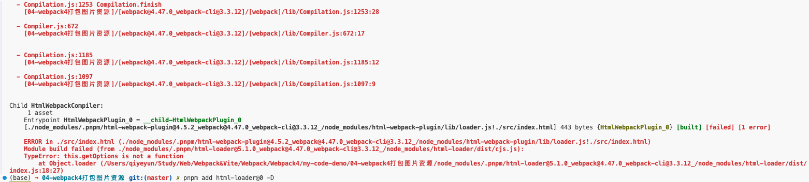


### 2. `html-loader` 配置

```json
module: {
    rules: [
      {
        test: /\.html$/,
        // 处理html文件的img图片（负责引入img，从而能被url-loader进行处理）
        loader: 'html-loader'
      }
    ]
},
```


#### a. 初始 html

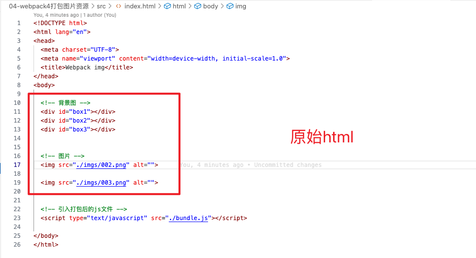


#### b. 打包后的html

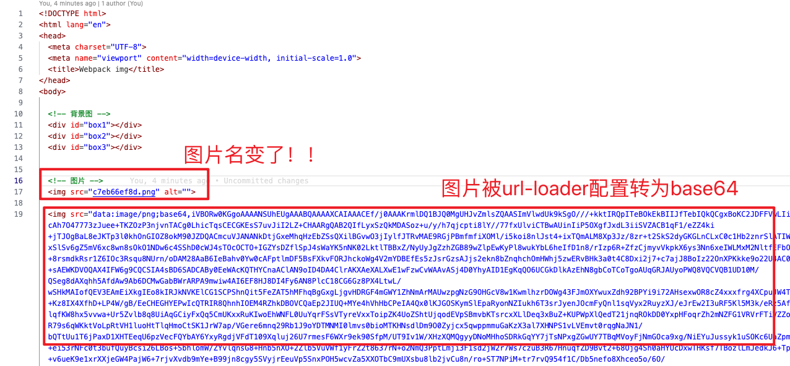


#### c.  `url-loader` 中 `esModule: false, ` 的作用

可以看到，如果不设置 `url-loader` 中 `esModule: false, ` ，则打包出来的图片不认识！！！


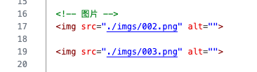

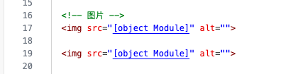


#### d.  `url-loader` 中 `name: '[hash:10].[ext]'` 的作用

设置图片名规则！！！

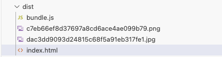

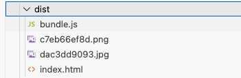


# 六、webpack4 - 打包其他资源

<font color='red' size=5>核心：这类资源不需要做任何处理，直接输出出去即可！！！例如字体</font>

具体看项目。

## 1、配置

```json
module: {
    rules: [
      {
        test: /\.css$/,
        use: ['style-loader', 'css-loader']
      },
      {
        // 排除css/js/html...资源
        exclude: /\.(html|js|css|less|jpg|png|gif)$/,
        loader: 'file-loader',
        options: {
          name: '[hash:10].[ext]'
        }
      }
    ]
  },
}
```


# 七、webpack4 - devServer

为了能够实时修改代码，实时能查看打包结果的功能。推出了 『开发服务器』devServer。


## 1、依赖 `webpack-dev-server` 实现实时构建

```sh
# 注意匹配版本，webpack4 & webpack-dev-server@3
$ pnpm add webpack-dev-server@3 -D
```


## 2、 `devServer` 作用与特点

* 开发服务器 devServer：用来自动化（自动编译，自动打开浏览器，自动刷新浏览器~~）
* 特点：只会在内存中编译打包，不会有任何输出
* 由于只在项目内安装，启动devServer指令为：`$ npx webpack-dev-server`
    * webpack是全局安装，所以运行只需要：`$ webpack`


## 3、 `devServer` 配置

```json
module.exports = {
  entry: './src/index.js',
  mode: 'development',

  // 开发服务器 devServer：用来自动化（自动编译，自动打开浏览器，自动刷新浏览器~~）
  // 特点：只会在内存中编译打包，不会有任何输出
  // 启动devServer指令为：npx webpack-dev-server
  devServer: {
    // 项目构建后路径
    contentBase: resolve(__dirname, 'build'),
    // 启动gzip压缩
    compress: true,
    // 端口号
    port: 3000,
    // 自动打开浏览器
    open: true
  }
}
```


# 八、开发环境配置（全）


## 1. 上面学习的所有配置集合

```json
/*
  开发环境配置：能让代码运行
    运行项目指令：
      webpack 会将打包结果输出出去
      npx webpack-dev-server 只会在内存中编译打包，没有输出
*/

const { resolve } = require('path');
const HtmlWebpackPlugin = require('html-webpack-plugin');

module.exports = {
  entry: './src/js/index.js',
  output: {
    filename: 'js/built.js',
    path: resolve(__dirname, 'build')
  },
  module: {
    rules: [
      // loader的配置
      {
        // 处理less资源
        test: /\.less$/,
        use: ['style-loader', 'css-loader', 'less-loader']
      },
      {
        // 处理css资源
        test: /\.css$/,
        use: ['style-loader', 'css-loader']
      },
      {
        // 处理图片资源
        test: /\.(jpg|png|gif)$/,
        loader: 'url-loader',
        options: {
          limit: 8 * 1024,
          name: '[hash:10].[ext]',
          // 关闭es6模块化
          esModule: false,
          outputPath: 'imgs'
        }
      },
      {
        // 处理html中img资源
        test: /\.html$/,
        loader: 'html-loader'
      },
      {
        // 处理其他资源
        exclude: /\.(html|js|css|less|jpg|png|gif)/,
        loader: 'file-loader',
        options: {
          name: '[hash:10].[ext]',
          outputPath: 'media'
        }
      }
    ]
  },
  plugins: [
    // plugins的配置
    new HtmlWebpackPlugin({
      template: './src/index.html'
    })
  ],
  mode: 'development',
  devServer: {
    contentBase: resolve(__dirname, 'build'),
    compress: true,
    port: 3000,
    open: true
  }
};
```


## 2. 运行

* `$ npx webpack-dev-server` 运行开发模拟环境
* `$ npx webpack` 打包


# 九、环境介绍

* 开发环境
    * 主要将原生代码  ---》  webpack  --》 bundle.js
    * 将代码通过webpack构建生成bundle.js，其中也加入一些自动化，如：自动打开等；
* 生产环境
    * 将css代码从js中剥离，避免js文件过大，还有闪屏的问题；
    * 代码压缩
    * 兼容多平台，多版本


# 十、生产环境 - 提取CSS成单独文件

## 1. 安装插件 `mini-css-extract-plugin@1`

```sh
# 注意版本
$ pnpm add mini-css-extract-plugin@1 -D
```


## 2. 配置

* 引入 `mini-css-extract-plugin`
* 配置plugins： `MiniCssExtractPlugin`
* `rules` 中 使用 `MiniCssExtractPlugin.loader,`  这个loader取代style-loader。作用：提取js中的css成单独文件。

```json
const MiniCssExtractPlugin = require('mini-css-extract-plugin');

module.exports = {
  //....
  module: {
    rules: [
      {
        test: /\.css$/,
        use: [
          // 创建style标签，将样式放入
          // 'style-loader', 
          // 这个loader取代style-loader。作用：提取js中的css成单独文件
          MiniCssExtractPlugin.loader,
          // 将css文件整合到js文件中
          'css-loader'
        ]
      }
    ]
  },
  plugins: [
    // plugins的配置
    new HtmlWebpackPlugin({
      template: './src/index.html'
    }),
    new MiniCssExtractPlugin({
      // 对输出的css文件进行重命名
      filename: 'css/built.css'
    })
  ],
}
```


## 3. 打包截图

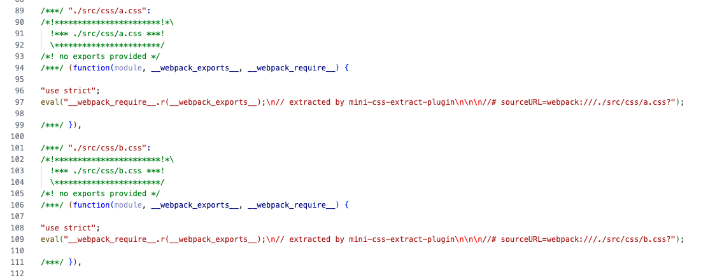

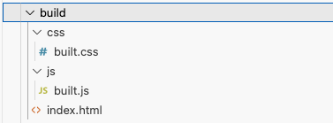


# 十一、生产环境 - CSS兼容性处理

* [webpack官网 - postcss-loader](https://webpack.docschina.org/loaders/postcss-loader/)

## 1. 安装loader 和 插件

* Webpack4 注意版本：

* "postcss-loader": "^4.3.0",
* "postcss-preset-env": "^5.3.0",
    * 用来识别当前具体的环境，精确到浏览器具体的版本。


## 2-1. `postcss-loader` 配置 - 方式一

```js
// webpack.config.js
module.exports = {
  entry: './src/js/index.js',
  module: {
    rules: [
      {
        test: /\.css$/,
        use: [
          MiniCssExtractPlugin.loader,
          'css-loader',
          /**
           * css兼容性处理：postcss --> postcss-loader postcss-preset-env
           *
           * postcss-preset-env的作用：
           * 	帮postcss找到package.json中browserslist里面的配置，通过配置加载指定的css兼容性样式。
           */
            
//---------------------------------------------------------------------------
          // 使用 loader 默认配置
          'postcss-loader',
          // 等价于
          {
          	 loader: 'postcss-loader'
          }
//---------------------------------------------------------------------------

//---------------------------------------------------------------------------
          // 修改 postcss-loader 配置
          {
            loader: 'postcss-loader',
            options: {
              postcssOptions: {
                plugins: [
                  [
                    'postcss-preset-env',
                    {
                      // 其他选项
                    },
                  ],
                ],
              },
            },
          },
//---------------------------------------------------------------------------            
        ]
      }
    ]
  },
  ......
};
```


## 2-2.  `postcss-loader` 配置 - 方式二

使用 PostCSS 本身的配置文件：**postcss.config.js**

```js
module.exports = {
  plugins: [
    [
      'postcss-preset-env',
      {
        // 其他选项
      },
    ],
  ],
};
```

Loader 将会**自动**搜索配置文件。

**webpack.config.js**

```js
module.exports = {
  module: {
    rules: [
      {
        test: /\.css$/i,
        use: ['style-loader', 'css-loader', 'postcss-loader'],
      },
    ],
  },
};
```


## 3. `postcss-preset-env` 配置和作用

* `postcss-preset-env` 是 `postcss` 的插件 
* `postcss-preset-env` 的作用
    * 帮 `postcss` 找到 `package.json` 中 `browserslist` 里面的配置，通过配置加载指定的css兼容性样式。


### a. package.json 中 browserslist

**`package.json`** 文件中 `browserslist` ：

```json
{
  "name": "my-code-demo",
  "devDependencies": {
  },
  "browserslist": {
    // 开发环境 --》 与 `webpack.config.js` 中的 `  mode: 'development',` 不是一个东西
    //  --》 设置node环境变量：process.env.NODE_ENV = 'development';
    "development": [
      "last 1 chrome version",
      "last 1 firefox version",
      "last 1 safari version"
    ],
    // 生产环境：默认
    "production": [
      ">0.2%",
      "not dead",
      "not op_mini all"
    ]
  }
}
```


## 4. 设置 `NodeJS` 环境

> 设置node环境变量：process.env.NODE_ENV = 'development';

<font color='red' size=5>注意：这里的NodeJS环境 与 `webpack.config.js` 中的 `  mode: 'development',` 不是一个东西！！！！</font>

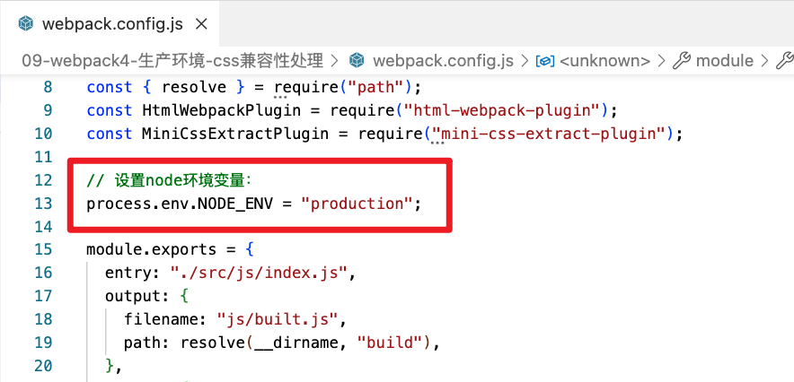

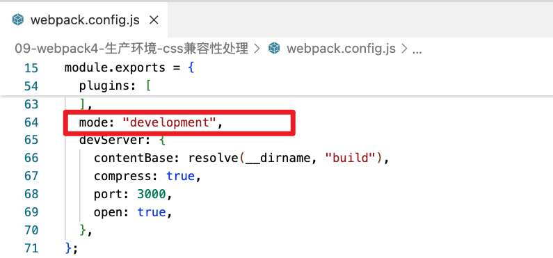


## 5. 修改 node 环境，对比打包后的CSS

### a. node环境 = 'development'

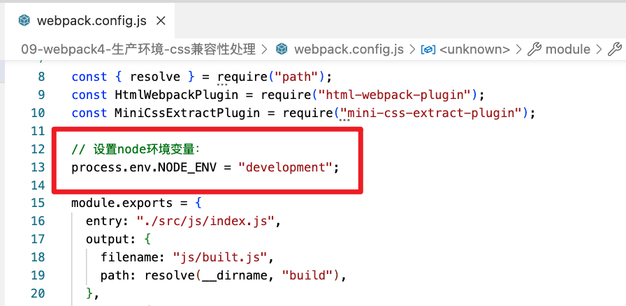

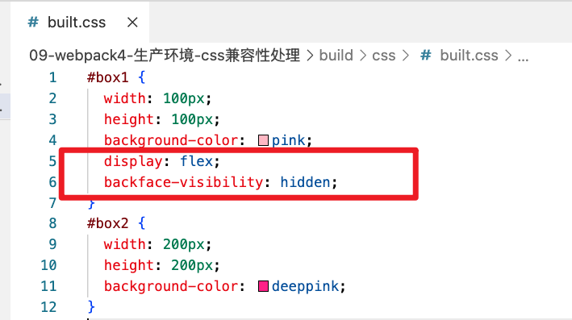


### b. Nodejs 环境 = 'production'

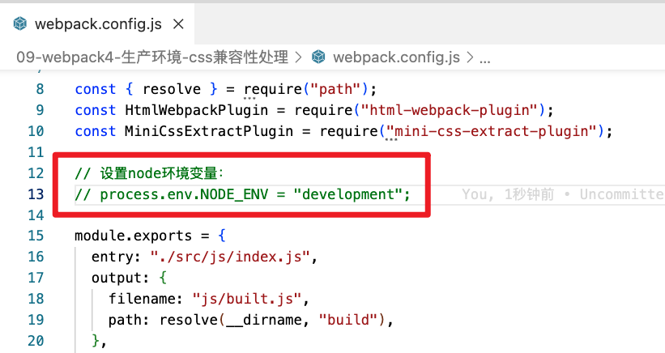

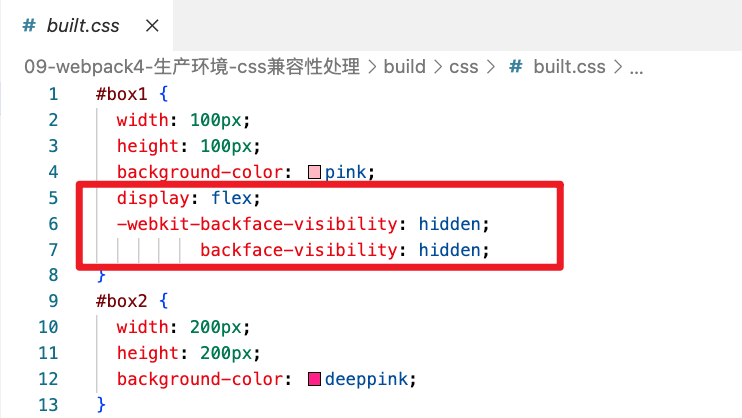


# 十二、生产环境 - CSS压缩

## 1. 安装插件

* `optimize-css-assets-webpack-plugin`
    * `$ pnpm add optimize-css-assets-webpack-plugin -D `


webpack.config.js：

```js
const OptimizeCssAssetsWebpackPlugin = require("optimize-css-assets-webpack-plugin");

module.exports = {
  entry: "./src/js/index.js",
  output: {
    filename: "js/built.js",
    path: resolve(__dirname, "build"),
  },
  plugins: [
    // css压缩，无需多余配置
    new OptimizeCssAssetsWebpackPlugin(),
  ],
};

```


构建： `$ npx webpack`

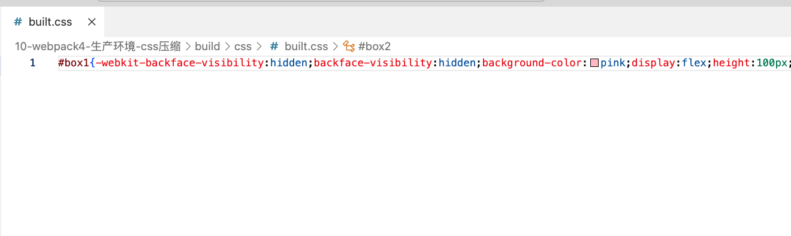


# 十三、eslint检查js语法

## 1. 安装包 和 loader

* webpack4：js语法检测
    * eslint：` $ pnpm add eslint@8 -D`
    * eslint-loader：`$ pnpm add eslint-loader -D`
* 检测规则airbnb：eslint-config-airbnb-base：https://www.npmjs.com/package/eslint-config-airbnb-base
    * ECMAScript 6+
        * requires `eslint` and `eslint-plugin-import`.
        * `$ pnpm add eslint-config-airbnb-base eslint-plugin-import -D`
        * Add `"extends": "airbnb-base"` to your .eslintrc.
    * Lints ES5 and below.
        * Requires `eslint` and `eslint-plugin-import`
        * Add `"extends": "airbnb-base/legacy"` to your .eslintrc


注意：Webpack4 对应版本：

```js
"eslint": "6",
"eslint-config-airbnb-base": "13",
"eslint-loader": "2",
"eslint-plugin-import": "^2.31.0",
```


## 2. 使用package.json中eslintConfig中设置。

或者 Add `"extends": "airbnb-base"` to your .eslintrc.

```json
  "eslintConfig": {
    "extends": "airbnb-base"
  }
```

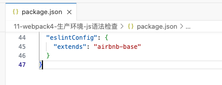


## 3. 配置 `webpack.config.js`

可配置：自动修复。

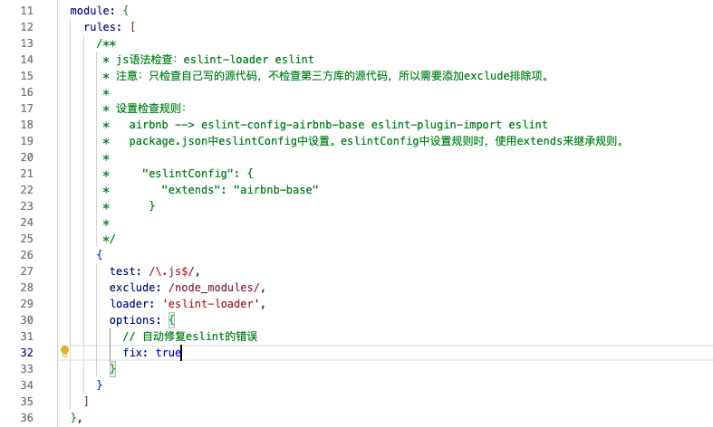


## 4. 打包 `$ npx webpack`

js源码：

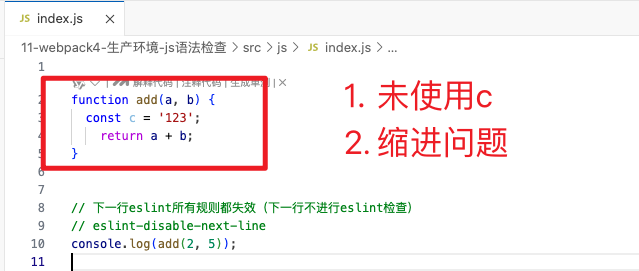

控制台报错：

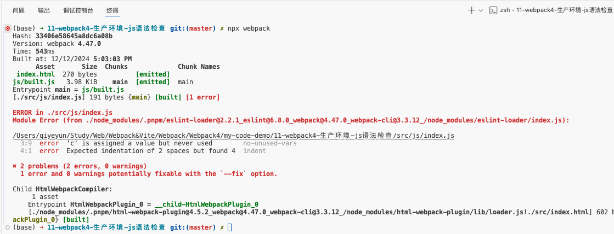


# 十四、 babel兼容性处理js

* https://blog.csdn.net/hbiao68/article/details/104070143


## A. 普通函数，直接打包运行

看看代码，低版本浏览器打开

```js
function add(x, y) {
  return x + y;
}
console.log(add(2, 5));
```

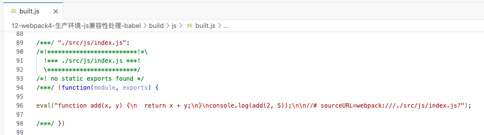

**使用低版本firefox打开：**

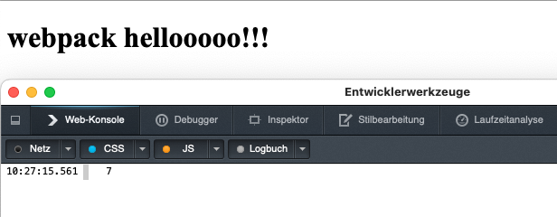


## B. 箭头函数，直接打包运行

看看代码，低版本浏览器打开

```js
// 源码
const add = (x, y) => {
  return x + y;
};
console.log(add(2, 5));
```

打包：`$ npx webpack`，可以看到没有做任何兼容，无法在低版本Firefox浏览器打开！！！

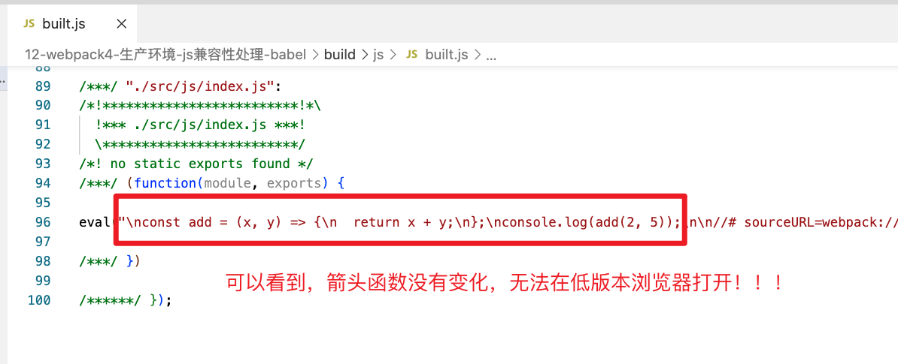

**使用低版本firefox打开：失败**

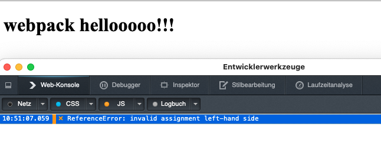


**总揽：**

```js
/*
  js兼容性处理：babel-loader @babel/core 
    1. 基本js兼容性处理 --> @babel/preset-env
      问题：只能转换基本语法，如promise高级语法不能转换
    2. 全部js兼容性处理 --> @babel/polyfill  
      问题：我只要解决部分兼容性问题，但是将所有兼容性代码全部引入，体积太大了~
    3. 需要做兼容性处理的就做：按需加载  --> core-js
*/  
```


## 1. 入门版本 - 基本js兼容性处理

### a. 下载包

* `webpack 4.x`

* `babel-loader@8`  ：是webpack的babel插件
* `@babel/core@7` ：是babel的基础包，必装依赖
* `@babel/preset-env@7` ：js语法转码的插件

* 命令：`$ pnpm add babel-loader@8 @babel/core@7 @babel/preset-env@7 -D`  


### b. `webpack.config.js` 配置 babel

```js
 module: {
    rules: [
      /*
        js兼容性处理：babel-loader @babel/core 
          1. 基本js兼容性处理 --> @babel/preset-env
            问题：只能转换基本语法，如promise高级语法不能转换
      */
      {
        test: /\.js$/,
        exclude: /node_modules/,
        loader: 'babel-loader',
        options: {
          presets: [ '@babel/preset-env' ]
        }
      }
    ]
  }
```


### c. 构建，兼容失败

结果：`$ npx webpack`，没有对箭头函数进行兼容，原因未知！！！！！


## 2. 进阶版本 - 全部js兼容性处理

* `@babel/polyfill  @7`


## 3. 最终版本 - 根据浏览器版本按需设置


# 十五、js与html压缩

## 1、js压缩

生产环境下，自动压缩js代码，所以将 `webpack.config.js` 中 `model='prodiction'` 即可！！！


## 2、html压缩

在 `html-webpack-plugin` 配置中添加更多配置

* 移除空格行
* 移除注释

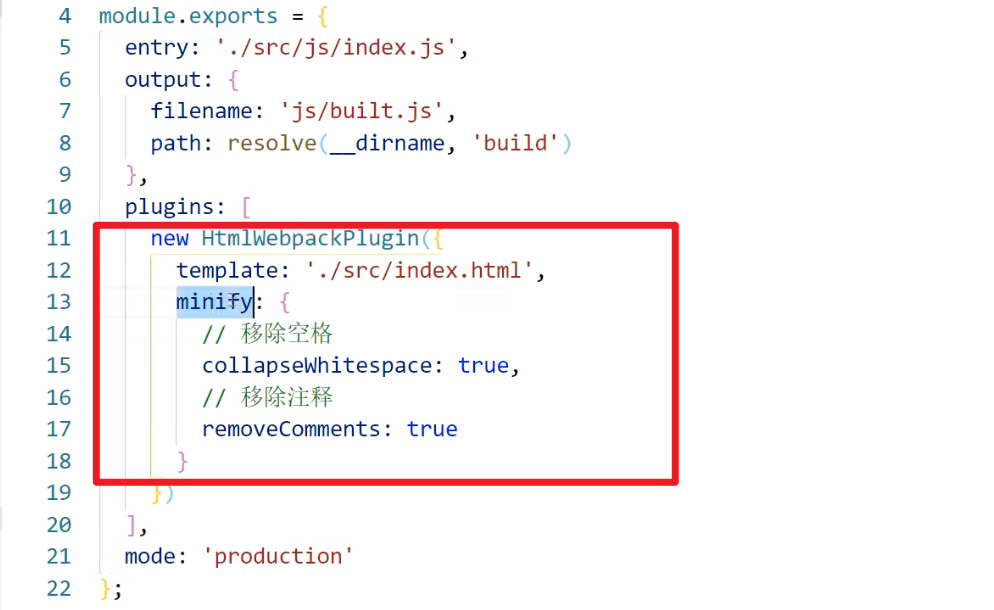


# 十六、生产环境配置（全）

## 1、上面学习的所有配置集合


### a. `webpack.config.js`

```js
const { resolve } = require('path');
const MiniCssExtractPlugin = require('mini-css-extract-plugin');
const OptimizeCssAssetsWebpackPlugin = require('optimize-css-assets-webpack-plugin');
const HtmlWebpackPlugin = require('html-webpack-plugin');

// 定义nodejs环境变量：决定使用browserslist的哪个环境
process.env.NODE_ENV = 'production';

// 复用loader
const commonCssLoader = [
  MiniCssExtractPlugin.loader,
  'css-loader',
  {
    // 还需要在package.json中定义browserslist
    loader: 'postcss-loader',
    options: {
      ident: 'postcss',
      plugins: () => [require('postcss-preset-env')()]
    }
  }
];

module.exports = {
  entry: './src/js/index.js',
  output: {
    filename: 'js/built.js',
    path: resolve(__dirname, 'build')
  },
  module: {
    rules: [
      {
        test: /\.css$/,
        use: [...commonCssLoader]
      },
      {
        test: /\.less$/,
        use: [...commonCssLoader, 'less-loader']
      },
      /*
        正常来讲，一个文件只能被一个loader处理。
        当一个文件要被多个loader处理，那么一定要指定loader执行的先后顺序：
          先执行eslint 在执行babel
      */
      {
        // 在package.json中eslintConfig --> airbnb
        test: /\.js$/,
        exclude: /node_modules/,
        // 优先执行
        enforce: 'pre',
        loader: 'eslint-loader',
        options: {
          fix: true
        }
      },
      {
        test: /\.js$/,
        exclude: /node_modules/,
        loader: 'babel-loader',
        options: {
          presets: [
            [
              '@babel/preset-env',
              {
                useBuiltIns: 'usage',
                corejs: {version: 3},
                targets: {
                  chrome: '60',
                  firefox: '50'
                }
              }
            ]
          ]
        }
      },
      {
        test: /\.(jpg|png|gif)/,
        loader: 'url-loader',
        options: {
          limit: 8 * 1024,
          name: '[hash:10].[ext]',
          outputPath: 'imgs',
          esModule: false
        }
      },
      {
        test: /\.html$/,
        loader: 'html-loader'
      },
      {
        exclude: /\.(js|css|less|html|jpg|png|gif)/,
        loader: 'file-loader',
        options: {
          outputPath: 'media'
        }
      }
    ]
  },
  plugins: [
    new MiniCssExtractPlugin({
      filename: 'css/built.css'
    }),
    new OptimizeCssAssetsWebpackPlugin(),
    new HtmlWebpackPlugin({
      template: './src/index.html',
      minify: {
        collapseWhitespace: true,
        removeComments: true
      }
    })
  ],
  mode: 'production'
};
```


### b. `package.json`


