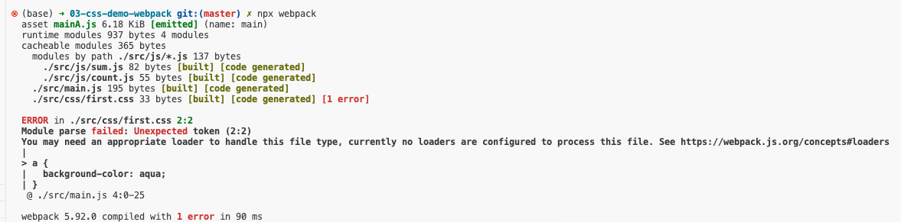
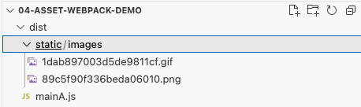

官网

* [webpack中文官网](https://webpack.docschina.org/)

* [官网文档 - webpack安装](https://webpack.docschina.org/guides/installation#local-installation)

* [webpack GitHub release](https://github.com/webpack/webpack/releases)

尚硅谷

* [尚硅谷2022版Webpack5入门到原理](https://www.bilibili.com/video/BV14T4y1z7sw)

在线笔记

- https://lionsom.github.io/webpack5-docs/
- https://yk2012.github.io/sgg_webpack5/
- http://xxpromise.gitee.io/webpack5-docs/

其他参考

* [30 分钟掌握 Webpack - 视频](https://www.bilibili.com/video/BV11g411y7Sd/?spm_id_from=333.337.search-card.all.click&vd_source=611f1c6701469d82272fd49ca9b9f7d2)

* [30 分钟掌握 Webpack - 笔记](https://www.yuque.com/zhangyuge-vkorl/nmt4ko/plsxw6irc06kwqqc)

三金

* [保姆级教程！从零搭建一个 Vue-Cli 脚手架【基础篇】](https://mp.weixin.qq.com/s/gcH_jQWcuJSlUot1JJ7kdQ)
* [【优化篇】从零搭建 Vue-Cli，15个 Webpack 优化点，速度提升70%，体积减小80%！](https://mp.weixin.qq.com/s/X5ntqJFc-91s-hFRg793WA)
* [【代码规范篇】从零到一带你搭建一个脚手架 Vue-Cli](https://mp.weixin.qq.com/s/vL7N12jkA5SqRletog848A)
* [Webpack来了！三心教你实现一个Vue-Cli的「基础搭建」](https://mp.weixin.qq.com/s?__biz=Mzg2NjY2NTcyNg==&mid=2247485902&idx=1&sn=14e0e68cc79573b9c8660646423354c3&chksm=ce461c5ff931954901fb4029cfd0b3eefc4ebaaded854cbf2ad51295b6fc1089775d3621f083&scene=21#wechat_redirect)
* [15个 Webpack 优化点，速度提升70%，体积减小80%！](https://mp.weixin.qq.com/s?__biz=Mzg2NjY2NTcyNg==&mid=2247485938&idx=1&sn=a7d1a7a0f4dffd44242f5eb8fac4097e&chksm=ce461c63f9319575372331fe7a8373fed34e0993260523c2ce4aea6cf20437a255f44aaac25f&scene=21#wechat_redirect)

视频

* [从零搭建 Vue 脚手架，基于 webpack 5【我觉得我讲明白了系列】](https://www.bilibili.com/video/BV1234y1D7Bv/?spm_id_from=333.337.search-card.all.click&vd_source=dc55c355e9f5b6174832aacfb5d8b6aa)


# 一、部署尚硅谷文档

## 1. 运行文档项目

路径：尚硅谷Webpack5-课件 -> webpack_docs

```sh
# 项目使用VuePress进行文档预览

$ yarn install

$ yarn run start 
```


## 2. Github Pages 部署

* https://lionsom.github.io/webpack5-docs/


# 二、尚硅谷 - 视频学习记录

前提依赖：NodeJs 16+

## 1. 为什么需要打包工具？

开发时，我们会使用框架（React、Vue），ES6 模块化语法，Less/Sass 等 css 预处理器等语法进行开发。

这样的代码要想在浏览器运行必须经过编译成浏览器能识别的 JS、Css 等语法，才能运行。

所以我们需要打包工具帮我们做完这些事。

一个个小工具编译成浏览器能够识别的代码；这些小工具的集合就是 **构建工具**，而 webpack 就是构建工具的一种。

除此之外，打包工具还能压缩代码、做兼容性处理、提升代码性能等。

**有哪些打包工具？**

- Grunt
- Gulp
- Parcel
- Webpack
- Rollup
- Vite


## 2. Webpack是什么

Webpack 是一个强大的 JavaScript 模块打包工具，它可以将各种资源（JavaScript、CSS、HTML、图片等）作为模块来处理，并最终打包成一个或多个优化后的输出文件（Bundle），用于在浏览器中加载。

> webpack 是一种前端资源 **构建工具**，一个 **静态资源打包工具**  (module bundler)。 


## 3. Webpack功能介绍

[原文地址](https://lionsom.github.io/webpack5-docs/base/base.html#%E5%9F%BA%E6%9C%AC%E4%BD%BF%E7%94%A8)

> **webpack 只能理解 JavaScript 和 JSON 文件，这是 webpack 开箱可用的自带能力。**

Webpack 本身功能是有限的:

- 开发模式：仅能编译 JS 中的 `ES Module` 语法
- 生产模式：能编译 JS 中的 `ES Module` 语法，还能压缩 JS 代码


### a. 最基础的Webpack项目

> Demo: ./my-code-demo/01-base-demo

#### Ⅰ. 创建项目

- 初始化`package.json`

```sh
$ npm init -y
```

此时会生成一个基础的 `package.json` 文件。

**需要注意的是 `package.json` 中 `name` 字段不能叫做 `webpack`, 否则下一步会报错**


#### Ⅱ. 安装依赖

- 下载依赖

```sh
$ npm i webpack webpack-cli -D
```

* 安装指定版本的webpack

| 依赖               | 版本 | 新版本 |
| ------------------ | ---- | ------ |
| webpack            | 4    | 5      |
| webpack-cli        | 3    | 4      |
| webpack-dev-server | 3    | 3      |

> 拓：Webpack Dev Server 是一个轻量级的 Node.js Express 服务器，提供实时重载（Live Reload）和热模块替换（Hot Module Replacement，HMR）功能。


#### Ⅲ. 简单代码

* 项目结构

```sh
webpack_code_demo # 项目根目录（所有指令必须在这个目录运行）
    └── src # 项目源码目录
        ├── js # js文件目录
        │   ├── count.js
        │   └── sum.js
        └── main.js # 项目主文件
```

* 源码

```sh
# src/count.js
export default function count(x, y) {
  return x - y;
}

# src/sum.js
export default function sum(...args) {
  return args.reduce((p, c) => p + c, 0);
}

# main.js
import count from "./js/count";
import sum from "./js/sum";

console.log(count(2, 1));
console.log(sum(1, 2, 3, 4));
```


#### Ⅳ. ESM设置

```sh
# package.json
{
  ...
  "type": "module",   # 支持ES Module
  ...
}
```


#### Ⅴ. 启用 Webpack

- 开发模式

```sh
$ npx webpack ./src/main.js --mode=development

# 指定dist路径
"webpack:dev": "npx webpack ./src/main.js -o ./dist_dev --mode=development"
```

- 生产模式

```sh
$ npx webpack ./src/main.js --mode=production

# 指定dist路径
"webpack:pro": "npx webpack ./src/main.js -o ./dist_pro --mode=production"
```

* `npx webpack`: 是用来运行本地安装 `Webpack` 包的。

* `./src/main.js`: 指定 `Webpack` 从 `main.js` 文件开始打包，不但会打包 `main.js`，还会将其依赖也一起打包进来。

* `--mode=xxx`：指定模式（环境）。


**观察输出文件**

默认 `Webpack` 会将文件打包输出到 `dist` 目录下，我们查看 `dist` 目录下文件情况就好了


## 4. Webpack基础配置 

### a. 五大核心概念

1. entry（入口）：指示 Webpack 从哪个文件开始打包

2. output（输出）：指示 Webpack 打包完的文件输出到哪里去，如何命名等

3. loader（加载器）：webpack 本身只能处理 js、json 等资源，其他资源需要借助 loader，Webpack 才能解析

4. plugins（插件）：扩展 Webpack 的功能

5. mode（模式）：

    * 开发模式：development

    - 生产模式：production


### b. Webpack.config.js

> Demo:  ./my-code-demo/02-base-webpack-config-demo

在根目录创建： `webpack.config.js` 

**Webpack 是基于 Node.js 运行的，所以采用 Common.js 模块化规范**

需要移除：`package.josn` 中的  `  "type": "module" `  

```js
// webpack.config.js
module.exports = {
  // 入口
  entry: "",
  // 输出
  output: {},
  // 加载器
  module: {
    rules: [],
  },
  // 插件
  plugins: [],
  // 模式
  mode: "",
};
```


### c. 修改配置文件

打包效果等同于上面《最基础的Webpack项目》

```js
// webpack.config.js
// Node.js的核心模块，专门用来处理文件路径
const path = require("path");

module.exports = {
  /* 入口
      相对路径和绝对路径都行
  */
  entry: "./src/main.js",
  
  /* 输出 */
  output: {
    // path: 文件输出目录，必须是绝对路径
    // path.resolve()方法返回一个绝对路径
    // __dirname 当前文件的文件夹绝对路径
    path: path.resolve(__dirname, "dist"),
    // filename: 输出文件名
    filename: "mainA.js",
  },
  
  /* 加载器 */
  module: {
    rules: [],
  },

  /* 插件 */
  plugins: [],

  /* 模式
      开发模式: development
      生产模式: production
  */
  mode: "development",
};
```

* 打包

此时功能和之前一样，也不能处理样式资源

```sh
# 全局安装webpack
$ webpack

# 局部安装webpack
$ npx webpack
```


## 5. 处理样式资源 - css / scss / less / styles

### a. css

> Demo:  ./my-code-demo/03-css-less-sass-stylus-webpack-demo

#### Ⅰ. 新建一个css文件

```css
// src/css/first.css
.box1111 {
  background-color: aqua;
  height: 100px;
  width: 200px;
  margin: 100px auto;
}
```

**此处仅仅是导入css文件，才能被webpack识别并打包。**

```js
// src/main.js
import sum from "./js/sum.js";
import count from "./js/count.js";
// 需要引入css，才能被webpack识别到
import "./css/first.css";

console.log(count(2, 1));
console.log(sum(1, 2, 3, 4));
```


#### Ⅱ. 什么都不做，直接webpack打包

```sh
# 全局安装webpack
$ webpack

# 局部安装webpack
$ npx webpack
```




#### Ⅲ. 加入css-loader，再webpack打包

[官网 - css-loader](https://webpack.docschina.org/loaders/css-loader)

1. 你需要先安装 `css-loader`、`style-loader`：

```sh
$ npm install --save-dev css-loader
$ npm install --save-dev style-loader
```

2. 然后把 loader 引用到你 `webpack` 的配置中。如下所示：

```js
// webpack.config.js
module.exports = {
  /* 加载器 */
  module: {
    rules: [
      {
        test: /\.css$/,  // 只检测.css文件
        use: [
          /*
            loader执行顺序是从右到左，从下到上
            loader的配置顺序不能乱
          */
          'style-loader', // 将js中的css通过创建style标签添加到html文件中生效
          'css-loader' // 将css文件编译成commonjs模块加载到js中，里面内容是字符串
        ],
      },
    ],
  },
};
```


#### Ⅳ. html导入输出包测试

新建html文件，并导入webpack打包的js文件，同时测试css文件是否有作用。

直接打开html文件查看。


### b. less

[官网 - less-loader](https://webpack.docschina.org/loaders/less-loader/)

#### Ⅰ. 新建less文件

```less
// second.less
.box2222 {
  width: 100px;
  height: 100px;
  background-color: yellow;
  border: 1px solid red;

  .inner {
    width: 50%;
    height: 50%;
    background-color: blue;
  }
}
```

**此处仅仅是导入css文件，才能被webpack识别并打包。**

```js
// src/main.js
import sum from "./js/sum.js";
import count from "./js/count.js";
// 需要引入css，才能被webpack识别到
import "./css/first.css";
import "./css/second.less";

console.log(count(2, 1));
console.log(sum(1, 2, 3, 4));
```


#### Ⅱ. 加入less-loader

你需要先安装 `less` 和 `less-loader`：

```sh
$ npm install less less-loader --save-dev
```

然后把 loader 引用到你 `webpack` 的配置中。如下所示：

```js
// webpack.config.js
module.exports = {
  /* 加载器 */
  module: {
    rules: [
      {
        .......
      },
      {
        test: /\.less$/, // 只匹配less文件
        /* loader vs use: 
            loader: 只能使用一个loader 
            use: 可以使用多个loader
        */
        use: [
          'style-loader', // 将js中的css通过创建style标签添加到html文件中生效
          'css-loader', // 将css文件编译成commonjs模块加载到js中，里面内容是字符串
          'less-loader', // 将less文件编译成css文件
        ],
      },
    ],
  },
};
```


#### Ⅲ. 打包并在html中运行

```sh
# 全局安装webpack
$ webpack

# 局部安装webpack
$ npx webpack
```


### c. sass

#### Ⅰ. 新建sass文件

```css
// third.sass

$body-color: red;

.box3333 {
  width: 100px;
  height: 100px;
  background-color: $body-color;
  border: 1px solid #000;
  margin: 100px auto;

  .inner {
    width: 50px;
    height: 50px;
    background-color: blue;
  }
}
```

**此处仅仅是导入css文件，才能被webpack识别并打包。**

```js
// src/main.js
import sum from "./js/sum.js";
import count from "./js/count.js";
// 需要引入css，才能被webpack识别到
import "./css/first.css";
import "./css/second.less";
import "./css/third.scss";

console.log(count(2, 1));
console.log(sum(1, 2, 3, 4));
```


#### Ⅱ. 加入sass-loader

你需要安装 sass-loader：

```sh
$ npm install sass-loader sass --save-dev
```

然后把 loader 引用到你 `webpack` 的配置中。如下所示：

```js
// webpack.config.js
module.exports = {
  /* 加载器 */
  module: {
    rules: [
      {
        .......
      },
      {
        test: /\.s[ac]ss$/,
        use: [
          'style-loader', // 将 JS 字符串生成为 style 节点
          'css-loader', // 将 CSS 转化成 CommonJS 模块
          'sass-loader', // 将 Sass 编译成 CSS
        ],
      },
    ],
  },
};
```


#### Ⅲ. 打包并在html中运行

```sh
# 全局安装webpack
$ webpack

# 局部安装webpack
$ npx webpack
```


### d. stylus

#### Ⅰ. 新建 styl 文件

```css
// fourth.styl
.box4444 {
  width: 100px;
  height: 100px;
  background-color: yellow;
  border: 1px solid red;
  margin: 100px auto;

  .inner {
    width: 50%;
    height: 50%;
    background-color: blue;
  }
}
```

**此处仅仅是导入css文件，才能被webpack识别并打包。**

```js
// src/main.js
import sum from "./js/sum.js";
import count from "./js/count.js";
// 需要引入css，才能被webpack识别到
import "./css/first.css";
import "./css/second.less";
import "./css/third.scss";
import "./css/fourth.styl";

console.log(count(2, 1));
console.log(sum(1, 2, 3, 4));
```


#### Ⅱ. 加入 stylus-loader

你需要安装 `stylus` 和 `stylus-loader`：

```sh
$ npm install stylus stylus-loader --save-dev
```

然后把 loader 引用到你 `webpack` 的配置中。如下所示：

```js
// webpack.config.js
module.exports = {
  /* 加载器 */
  module: {
    rules: [
      {
        .......
      },
      {
        test: /\.styl$/,
        use: [
          'style-loader', // 将 JS 字符串生成为 style 节点
          'css-loader', // 将 CSS 转化成 CommonJS 模块
          'stylus-loader', // 将 Stylus 文件编译为 CSS
        ],
      },
    ],
  },
};
```


#### Ⅲ. 打包并在html中运行

```sh
# 全局安装webpack
$ webpack

# 局部安装webpack
$ npx webpack
```


## 6. 处理图片资源

> Demo:  ./my-code-demo/04-asset-webpack-demo

[官网 - 资源模块](https://webpack.docschina.org/guides/asset-modules#inlining-assets)

过去在 Webpack4 时，我们处理图片资源通过 `file-loader` 和 `url-loader` 进行处理

现在 Webpack5 已经将两个 Loader 功能内置到 Webpack 里了，我们只需要简单配置即可处理图片资源


### a. Webpack5默认处理图片资源

#### Ⅰ. 新增图片资源

新增几个图片，并在css中调用，


#### Ⅱ. `webpack.config.js` 不做任何处理，直接打包，并在html中运行

```sh
# 全局安装webpack
$ webpack

# 局部安装webpack
$ npx webpack
```

导出来的dist文件中，可以看到图片：


打开html页面，也可以看到我们的dist中的资源可以被正常加载。


### b. 小图片转base64

小图片转base64，减少图片请求次数。提升速度。

webpack 将按照默认条件，自动地在 `resource` 和 `inline` 之间进行选择：小于 8kb 的文件，将会视为 `inline` 模块类型，否则会被视为 `resource` 模块类型。

#### Ⅰ. `webpack.config.js` 配置处理base64

```js
// webpack.config.js
module.exports = {
  /* 加载器 */
  module: {
    rules: [
     {
        .......
     },
     {
        test: /\.(png|jpg|gif|jpeg)/,
        type: 'asset',
        parser: {
          dataUrlCondition: {
            // 小于10kb的图片会被base64处理
            // 优点: 减少请求数量
            // 缺点: 体积会更大
            maxSize: 10 * 1024 // 10kb
          }
        }
      }
    ],
  },
};
```


#### Ⅱ. 打包并在html中运行

```sh
# 全局安装webpack
$ webpack

# 局部安装webpack
$ npx webpack
```

导出来的dist文件中，可以看到只有两个大于10k的图片，小于10k的图片已经被转成了base64：


打开html页面，也可以看到我们的dist中的资源可以被正常加载。


### c. 修改打包资源路径

#### Ⅰ. 默认资源路径


#### Ⅱ. `webpack.config.js` 配置处理资源路径

```js
// webpack.config.js
module.exports = {
  /* 加载器 */
  module: {
    rules: [
     {
        .......
     },
     {
        test: /\.(png|jpg|gif|jpeg)/,
        type: 'asset',
        parser: {
          dataUrlCondition: {
            // 小于10kb的图片会被base64处理
            // 优点: 减少请求数量
            // 缺点: 体积会更大
            maxSize: 10 * 1024 // 10kb
          }
        },
        generator: {
          // 将图片文件输出到 static/images 目录中
          // 将图片文件命名 [hash:8][ext][query]
          // [hash:8]: hash值取8位
          // [ext]: 使用之前的文件扩展名
          // [query]: 添加之前的query参数
          filename: 'static/images/[hash][ext][query]'
        }
      }
    ],
  },
};
```




## 7.自动清空上次打包资源

`webpack.config.js` 的 `output` 配置：  `clean: true,`

```js
const path = require("path");

module.exports = {
  entry: "./src/main.js",
  output: {
    path: path.resolve(__dirname, "dist"),
    filename: "static/js/main.js",
    clean: true, // 自动将上次打包目录资源清空
  },
  ......
}
```


## 8. Iconfont打包

[https://www.iconfont.cn/](https://www.iconfont.cn/)

> Demo:  ./my-code-demo/05-iconfont-webpack-demo

### a. 导入iconfont资源


**此处仅仅是导入css文件，才能被webpack识别并打包。**

```js
import sum from "./js/sum.js";
import count from "./js/count.js";
// 需要引入css，才能被webpack识别到
import "./css/first.css";
import "./css/second.less";
import "./css/third.scss";
import "./css/fourth.styl";
// iconfont
import "./asset/iconfont/iconfont.css";

console.log(count(2, 1));
console.log(sum(1, 2, 3, 4));
```


### b. `webpack.config.js` 配置处理iconfont

然后把 loader 引用到你 `webpack` 的配置中。如下所示：

```js
// webpack.config.js
module.exports = {
  /* 加载器 */
  module: {
    rules: [
      {
         .......
      },
      // iconfont
      {
        test: /\.(ttf|woff2?)$/,
        type: "asset/resource",
        generator: {
          filename: "static/media/[hash:8][ext][query]",
        },
      },
    ],
  },
};
```

`type: "asset/resource"`和`type: "asset"`的区别：

* `type: "asset/resource"` 相当于`file-loader`, 将文件转化成 Webpack 能识别的资源，其他不做处理

* `type: "asset"` 相当于`url-loader`, 将文件转化成 Webpack 能识别的资源，同时小于某个大小的资源会处理成 data URI 形式


### c. webpack打包并在html运行测试

```sh
# 全局安装webpack
$ webpack

# 局部安装webpack
$ npx webpack
```

导出的包，可以看到iconfont：


打开html页面，也可以看到我们的dist中的资源可以被正常加载。


## 9. 其他资源打包

同上：

```js
// webpack.config.js
module.exports = {
  /* 加载器 */
  module: {
    rules: [
      {
         .......
      },
      // iconfont & 音视频 等资源
      {
        test: /\.(ttf|woff2?|map4|map3|avi)$/,
        type: "asset/resource",
        generator: {
          filename: "static/media/[hash:8][ext][query]",
        },
      },
    ],
  },
};
```


## 10. ESlint


## 11. Babel


