[官网 - Model Context Protocol](https://modelcontextprotocol.io/introduction)

[Cursor官网 - Model Context Protocol](https://docs.cursor.com/context/model-context-protocol)


[MCP库 - 官网examples](https://modelcontextprotocol.io/examples)

[MCP库 - smithery](https://smithery.ai/)


[知乎专栏 - MCP100 个案例](https://www.zhihu.com/column/c_1882579828550641584)

[知乎 - Cline最新发布：最受欢迎的10款MCP](https://zhuanlan.zhihu.com/p/1902402889487476008)

[知乎 - 还在到处找MCP资源？这11个MCP资源库收好](https://link.zhihu.com/?target=https%3A//mp.weixin.qq.com/s%3F__biz%3DMzIyMzk3MTEwNQ%3D%3D%26mid%3D2247485404%26idx%3D1%26sn%3Da5413038109c02cd149a8eec53bcd955%26scene%3D21%23wechat_redirect)

[知乎 - 轻松上手MCP：用Cursor解锁强大的AI工具（无需Claude Desktop）](https://zhuanlan.zhihu.com/p/1891172966517163593)

[知乎 - 前端开发又幸福了，如何实现Cursor + Figma MCP 快速还原设计稿？](https://zhuanlan.zhihu.com/p/32907832217)


[CSDN - 在 Cursor 中 配置 GitHub MCP Server](https://blog.csdn.net/bestcxx/article/details/147561443)

[CSDN - Cursor 配置 MCP(Model Context Protocol)](https://blog.csdn.net/bestcxx/article/details/147516158)


[Github - awesome-mcp-servers](https://github.com/punkpeye/awesome-mcp-servers)

[Github - github-mcp-server](https://github.com/github/github-mcp-server)

[Github - mcp-hotnews-server](https://github.com/wopal-cn/mcp-hotnews-server)


# Cursor配置MCP

## 1. MCP库 - Weather MCP Tool

[smithery.ai - Weather MCP Tool](https://smithery.ai/server/@MrCare/mcp_tool)

[openweathermap.org](https://openweathermap.org/)

[Github - mcp_tool](https://github.com/MrCare/mcp_tool)


## 2. 申请 OpenWeather 的 key

```
7c00261bd618b87cfbb33bf485262729
```

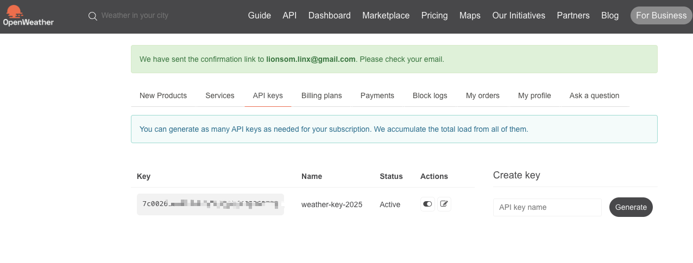


##  3. json配置 - 局部项目

### a. 从 `smithery.ai` 官网获取 `Weather MCP Tool` 的key。

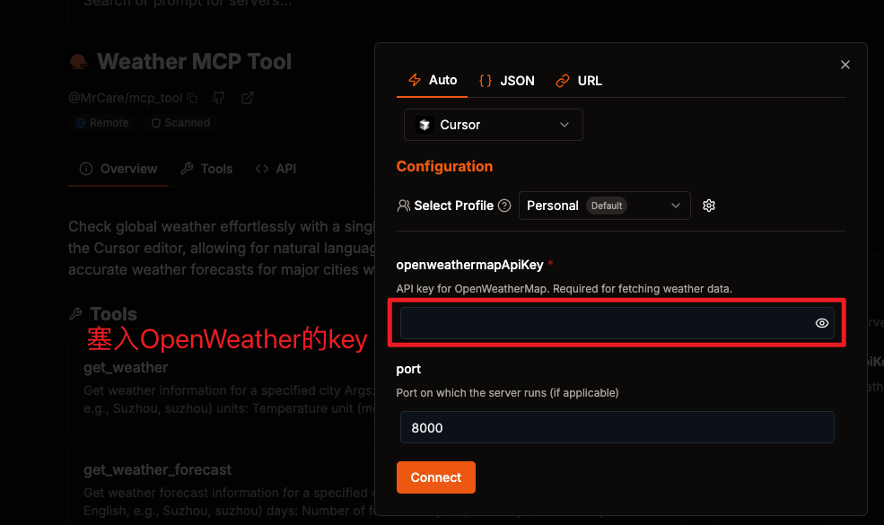

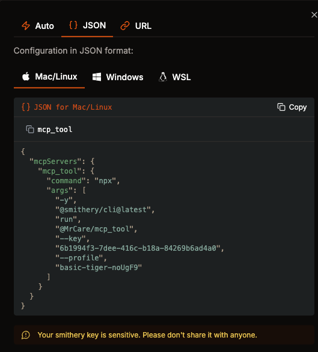

```json
{
  "mcpServers": {
    "mcp_tool": {
      "command": "npx",
      "args": [
        "-y",
        "@smithery/cli@latest",
        "run",
        "@MrCare/mcp_tool",
        "--key",
        "6b1994f3-7dee-416c-b18a-84269b6ad4a0",
        "--profile",
        "basic-tiger-noUgF9"
      ]
    }
  }
}
```


### b. 项目本地 `mcp.json` 配置文件

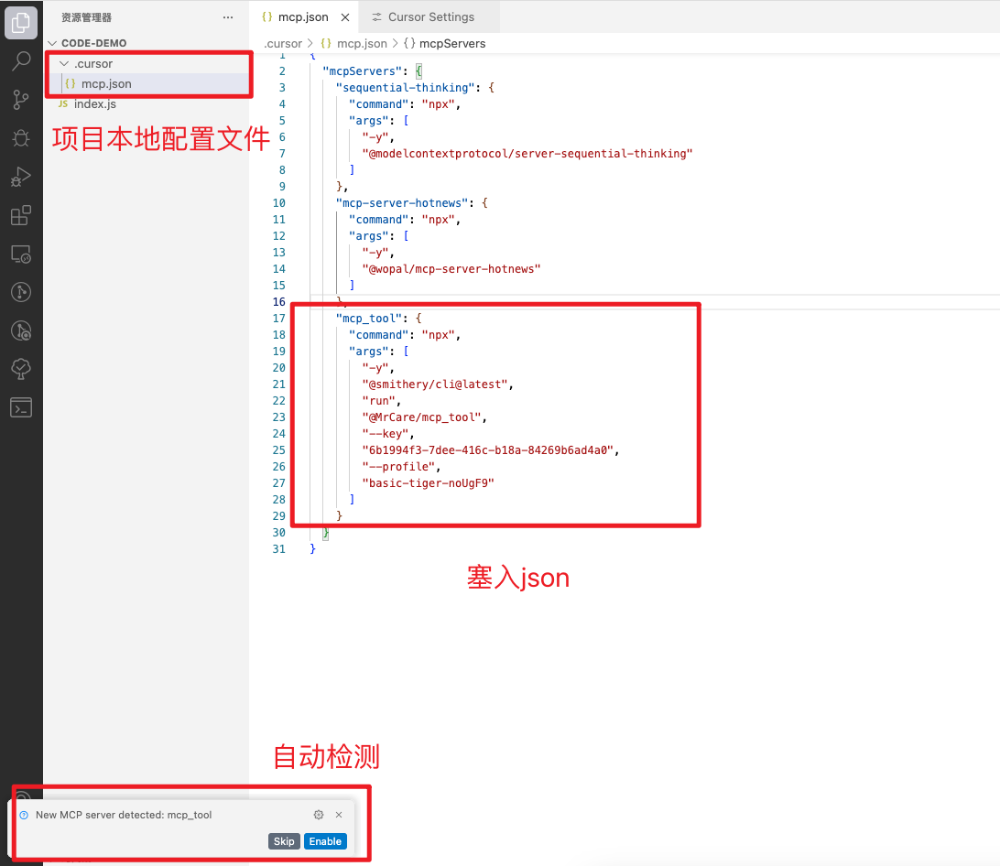

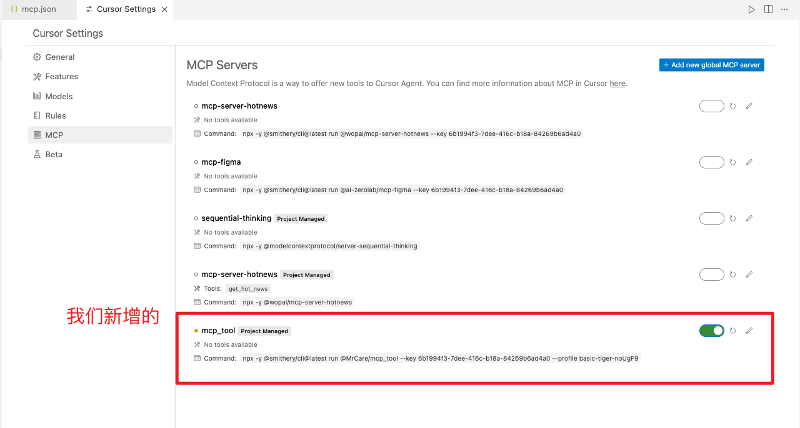


### c. 验证

验证一：

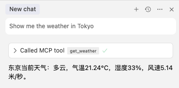

验证二：

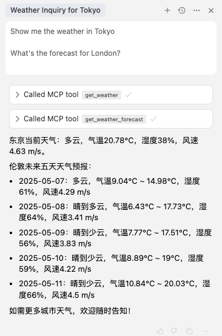


## 4. json配置 - 全局

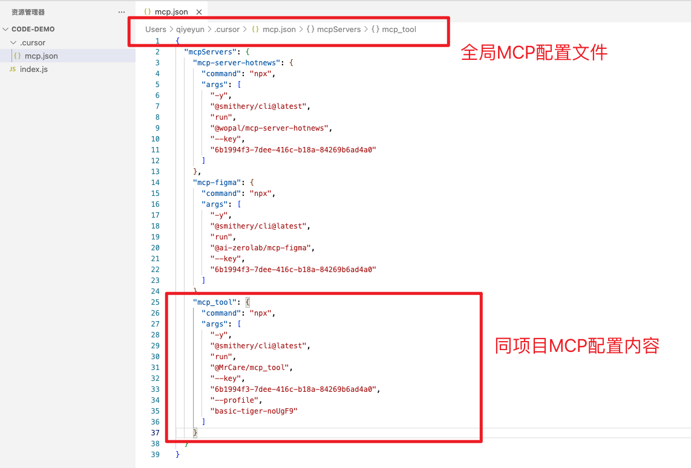

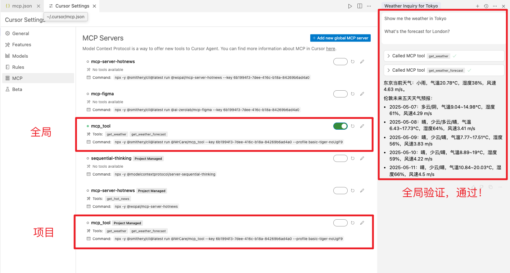


## 5. 命令行安装 - 全局

### a. Github仓库推荐命令

[Github -  mcp_tool - 2. One-Click Installation (Recommended)](https://github.com/MrCare/mcp_tool)

```sh
$ npx -y @smithery/cli@latest install @MrCare/mcp_tool --client cursor --config "{\"openweathermapApiKey\":\"your_api_key_here\",\"port\":8000}"

# 塞入key
$ npx -y @smithery/cli@latest install @MrCare/mcp_tool --client cursor --config "{\"openweathermapApiKey\":\"7c00261bd618b87cfbb33bf485262729\",\"port\":8000}"
```


#### 安装

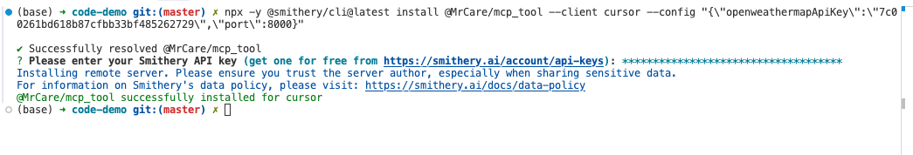

#### 需要 `smithery.ai` 的key

* https://smithery.ai/account/api-keys


#### 查看全局MCP配置文件

```json
// 新增
"mcp_tool": {
  "command": "npx",
  "args": [
    "-y",
    "@smithery/cli@latest",
    "run",
    "@MrCare/mcp_tool",
    "--key",
    "6b1994f3-7dee-416c-b18a-84269b6ad4a0",
    "--config",
    "\"{\\\"port\\\":8000,\\\"openweathermapApiKey\\\":\\\"7c00261bd618b87cfbb33bf485262729\\\"}\""
  ]
}
```

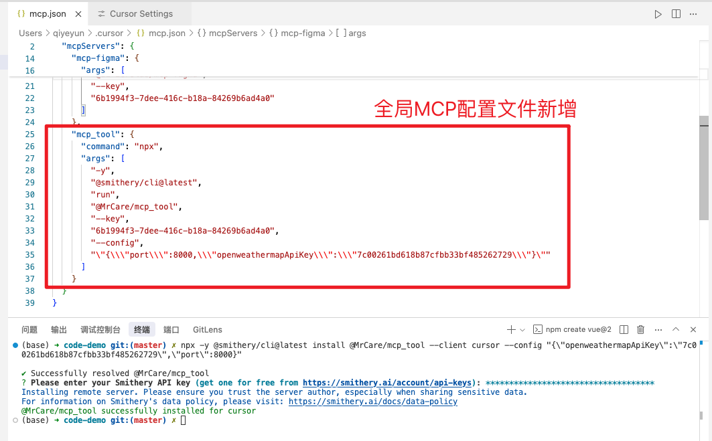


#### 安装成功、验证通过

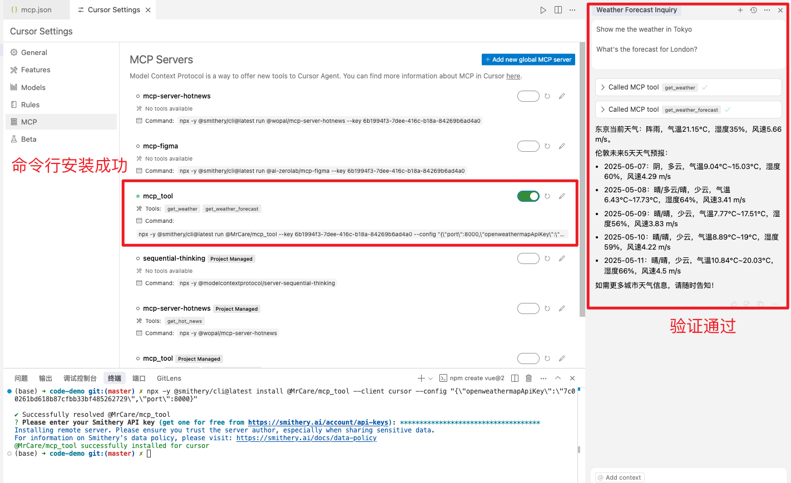


### b. 从 `smithery.ai` 获取命令

```sh
$ npx -y @smithery/cli@latest install @MrCare/mcp_tool --client cursor --profile basic-tiger-noUgF9 --key 6b1994f3-7dee-416c-b18a-84269b6ad4a0
```


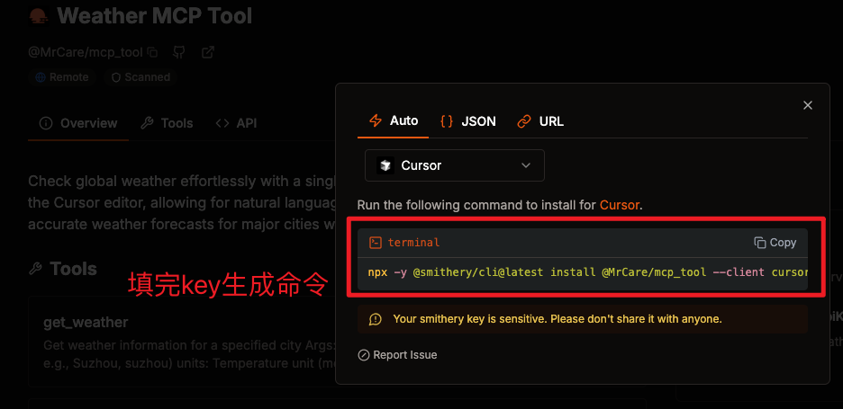


#### 安装成功、验证通过

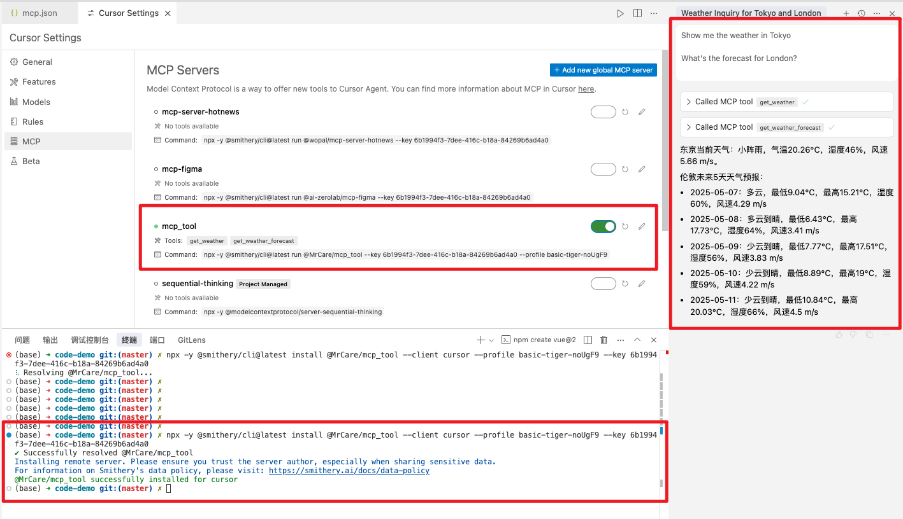


#### 查看全局MCP配置文件

```json
"mcp_tool": {
  "command": "npx",
  "args": [
    "-y",
    "@smithery/cli@latest",
    "run",
    "@MrCare/mcp_tool",
    "--key",
    "6b1994f3-7dee-416c-b18a-84269b6ad4a0",
    "--profile",
    "basic-tiger-noUgF9"
  ]
}
```

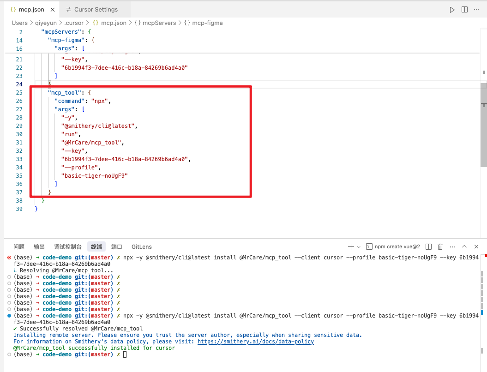


## 6. Manual Installation

[Github -  mcp_tool - 3. Manual Installation](https://github.com/MrCare/mcp_tool)


