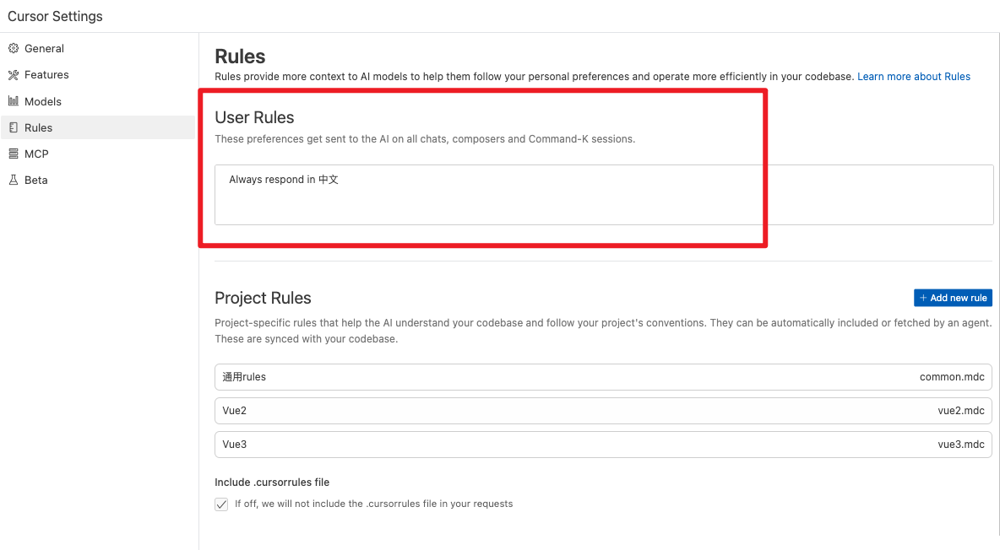

# 一、Cursor Rules 文档

* [cursor.directory](https://cursor.directory/)
    * [Vue rules](https://cursor.directory/rules/vue)
* [awesome-cursorrules - Github](https://github.com/PatrickJS/awesome-cursorrules)
    * [Vue3 rules](https://github.com/PatrickJS/awesome-cursorrules/tree/main/rules/vue3-composition-api-cursorrules-prompt-file)

* [⭐️知乎参考 - 【Cursor 进阶指南】老规则系统说拜拜！手把手带你玩转 .cursor/rules](https://zhuanlan.zhihu.com/p/23669294752)

    

## 1. 本地现成的源码

* [别人的rules参考 - 当前文件下：cursor-rules-参考1](./cursor-rules-参考1)


## 二、全局规则

[启业云内部文档](https://blogqpaas.yuque.com/org-wiki-blogqpaas-xgx00y/me4ydl/vnt72igyoe75ddp7#vq366)




# 三、Project Rules 升级

[⭐️知乎参考 - 【Cursor 进阶指南】老规则系统说拜拜！手把手带你玩转 .cursor/rules](https://zhuanlan.zhihu.com/p/23669294752)

从原来的 `.cursorrules` 迁移到了 `.cursor/rules`


## 1. 规则文件结构

新的规则文件采用 `.mdc` 格式,由两部分组成:

1. YAML 头部配置
2. Markdown 规则内容

一个完整的规则文件示例:

```sh
---
name: typescript-rules
description: TypeScript coding standards and best practices
globs:
    - 'src/**/*.ts'
    - 'src/**/*.tsx'
    - '!src/**/*.test.ts'
priority: 1
---

# TypeScript Coding Standards

## 基础规范

-   使用 2 空格缩进
-   优先使用 const 声明变量
-   显式声明函数返回类型

## 最佳实践

-   避免 any 类型
-   合理使用泛型
-   接口优于类型别名

## 参考文档

Read more from @common-rules.mdc
```


## 2. 规则分类示例

推荐按照以下方式组织规则文件:

```sh
.cursor/rules/
├── common/
│   ├── general.mdc     # 通用规则
│   └── git.mdc         # Git 规范
├── frontend/
│   ├── javascript.mdc  # JS 规则
│   ├── typescript.mdc  # TS 规则
│   └── react.mdc       # React 规则
├── backend/
│   ├── node.mdc       # Node.js 规则
│   └── database.mdc   # 数据库规则
└── style/
    ├── css.mdc        # CSS 规则
    └── less.mdc       # LESS 规则
```


## 3. Glob 模式详解

- [命令行通配符教程 - 阮一峰](http://www.ruanyifeng.com/blog/2018/09/bash-wildcards.html)

* [Glob 语法及解析](https://rgb-24bit.github.io/blog/2018/glob.html)

新系统支持强大的 glob 匹配模式:

```sh
globs:
    # 匹配所有 .ts 文件
    - '**/*.ts'

    # 排除测试文件
    - '!**/*.test.ts'

    # 排除构建目录
    - '!**/dist/**'
    - '!**/build/**'

    # 匹配特定目录
    - 'src/components/**/*.tsx'
```

常用的 glob 语法:

- `*`: 匹配任意文件名
- `**`: 匹配任意目录深度
- `!`: 排除匹配
- `{}`: 组合匹配


