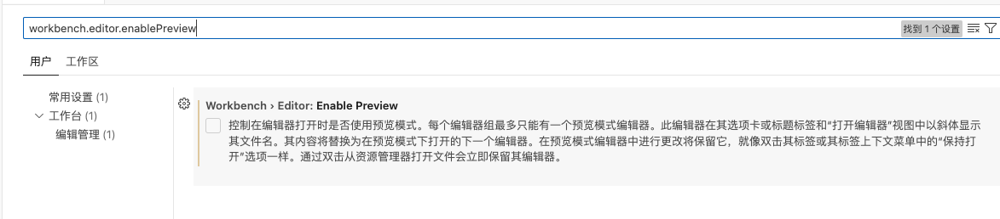
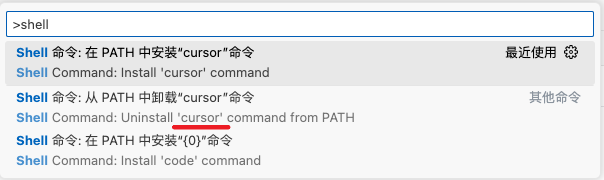
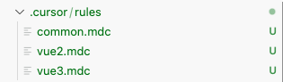

# 文档

* [启业云知识库 - 前端](https://blogqpaas.yuque.com/org-wiki-blogqpaas-xgx00y/me4ydl/ywzv54v1rimc9r4g)

* [Cursor](https://www.cursor.com/cn)

    * [Cursor Doc](https://docs.cursor.com/get-started/welcome)
    * [Cursor Directory](https://cursor.directory/)
    * [Cursor快捷键大全](https://learn-cursor.com/shortcuts/)

* [Learn Cursor](https://learn-cursor.com/wiki/user-guide/programming-basics-for-beginners)

* [Cursor教程 - Runoob](https://www.runoob.com/cursor/cursor-tutorial.html)

* 其他

    * [Cursor 中文文档](https://cursor.qiannianlu.com/docs/)
    * [万字长文--Cursor的界面及模块介绍](https://zhuanlan.zhihu.com/p/26745647855)
    * [从 VSCode 迁移到 Cursor](https://github.com/maomao1996/daily-notes/issues/50)
    * [一篇文章掌握 Cursor 的90%，AI 编程小白必备](https://mp.weixin.qq.com/s/YC_DCCYZZ_CUMoqbJoWmOA)
    * [AI编程](https://www.zhihu.com/column/c_1536659763614322688)
        * [AI 编程：Cursor 安装注册与功能配置说明](https://zhuanlan.zhihu.com/p/15907515516)

    * [cursor MCP 最佳实践](https://blogqpaas.yuque.com/rpsdfh/ans9sm/uqzgar97ztrg7fud)

# 常用快捷键 + AI 快捷键

* [Cursor快捷键大全](https://learn-cursor.com/shortcuts/)

| 快捷键              | 操作               |
| ------------------- | ------------------ |
| Command + Shift + J | 打开Cursor Setting |
|                     |                    |
|                     |                    |
|                     |                    |

- `Ctrl/⌘ + K` 在光标处插入 AI 生成的代码
- `Ctrl/⌘ + I` 对选中的代码进行快速智能编辑和补全，直接在编辑器中显示建议
- `Ctrl/⌘ + Shift + I` 打开独立的智能编辑面板，提供更详细的编辑建议和交互选项（功能和 `Ctrl/⌘ + I` 一样）
- `Ctrl/⌘ + L` 打开 AI 聊天面板,可以与 AI 进行对话交互

| 功能       | macOS            |
| :--------- | :--------------- |
| 命令面板   | `Cmd+Shift+P`    |
| 快速打开   | `Cmd+P`          |
| 智能提示   | `Option+/`       |
| 帮助对话   | `Cmd+K`          |
| 代码格式化 | `Option+Shift+F` |

# 修改设置

## 1. 修改活动栏布局

Cursor 的活动栏默认是水平的，用起来很别扭

1. 打开 VSCode，按 `Command + ,` 打开设置
2. 设置 `workbench.activityBar.orientation` 为 `vertical`

## 2. 关闭页面预览，每次都打开一个新页签

* `command + ,`
* `workbench.editor.enablePreview`：取消勾选

## 3. Cursor 中文设置

* [Cursor 中文设置 - Runoob](https://www.runoob.com/cursor/cursor-extensions-chinese.html)

## 4. 安装 `cursor .`  or `code .`

* [Cursor code/cursor 命令 - Runoob](https://www.runoob.com/cursor/cursor-cursor-command.html)

| 命令                                    | 功能说明                 |
| :-------------------------------------- | :----------------------- |
| `code <路径>`                           | 打开文件或文件夹         |
| `cursor .`                              | 打开当前目录作为工作区   |
| `cursor --new-window`                   | 在新窗口中打开           |
| `cursor --diff`                         | 对比两个文件的内容       |
| `cursor --wait`                         | 等待窗口关闭后再返回终端 |
| `cursor --disable-extensions`           | 禁用所有扩展运行 VS Code |
| `cursor --install-extension <扩展名>`   | 安装指定扩展             |
| `cursor --list-extensions`              | 列出所有已安装的扩展     |
| `cursor --uninstall-extension <扩展名>` | 卸载指定扩展             |

# 技巧

## 1. 聊天中的 `@` 符号

在 AI 对话框中可以使用 `@` 符合添加对应上下文

- `@Files` 引入文件，使用文件内容进行 AI 分析
- `@Folders` 引入文件夹，可以让 AI 了解整个项目结构
- `@Code` 当前选中的代码，将选中的代码片段发送给 AI 分析
- `@Docs` 引用内置的第三方文档内容进行 AI 分析
- `@Git` 引入 Git 相关信息，如提交历史、分支等
- `@Codebase` 引入整个代码库的上下文，让 AI 了解项目全貌
- `@Web` 允许 AI 访问网络资源获取信息
- `@Chat` 引用之前的对话内容
- `@Definitions` 引入代码中的定义，如函数、类等

## 2. Rules

* [awesome-cursorrules - Github](https://github.com/PatrickJS/awesome-cursorrules)
* [Cursor - rules](https://cursor.directory/rules)

组合使用 rules for AI & cursorrules & mdc & notepads & docs & mcp
https://dotcursorrules.com/
https://mp.weixin.qq.com/s/Dhmiq8uUmwbzVBtoKN9hRA
https://juejin.cn/post/7471044704647053353
https://github.com/PatrickJS/awesome-cursorrules
https://github.com/grapeot/devin.cursorrules

## 3. `.cursorignore` 文件 vs `.cursorindexingignore` 文件

Cursor 会根据 `.cursorignore` 文件中的内容忽略一些文件或文件夹，可以用来排除一些不希望被 AI 分析的文件

- 官网文档 [Ignore Files | Cursor](https://docs.cursor.com/context/ignore-files)

最新的rules目录结构：

# Agent、Ask、Edit对比

* Composer

Composer 是位于编辑器中的 AI 编码助手。它可以帮助您在不离开工作流程的情况下浏览代码、编写新功能和修改现有代码。使用 Ctrl + I 打开它，使用 Ctrl + N 创建新的 Composer。　

* Agent 模式

Cursor Agent 是 Cursor 4.3 版本推出的一种革命性的 AI 代理系统，不仅是一个简单的代码助手，而是一个能够像真实程序员一样思考和工作的智能伙伴，能够自主完成复杂的编程任务，理解项目上下文，并提供持续的开发支持。　

## 1. Agent 和 Composer 有什么区别？

您可以在 Composer 中切换普通模式和代理Agent模式。主要区别在于代理会更加认真思考，使用推理和工具来解决它遇到的问题。普通模式（编辑）用于单次编辑，而询问Ask模式可帮助您理解和探索代码。

## 2. [Cursor Composer disappeared in Version: 0.46.2](https://forum.cursor.com/t/cursor-composer-disappeared-in-version-0-46-2/53798)

Hey, actually, Agent and Edit are the same as Composer. We’ve combined them for your convenience. Edit is equivalent to Composer in normal mode, and Agent is the agent mode.

嘿，实际上，Agent 和 Edit 与 Composer 相同。为了您的方便，我们将它们合并在一起。Edit 等同于普通模式下的 Composer，Agent 是代理模式。

