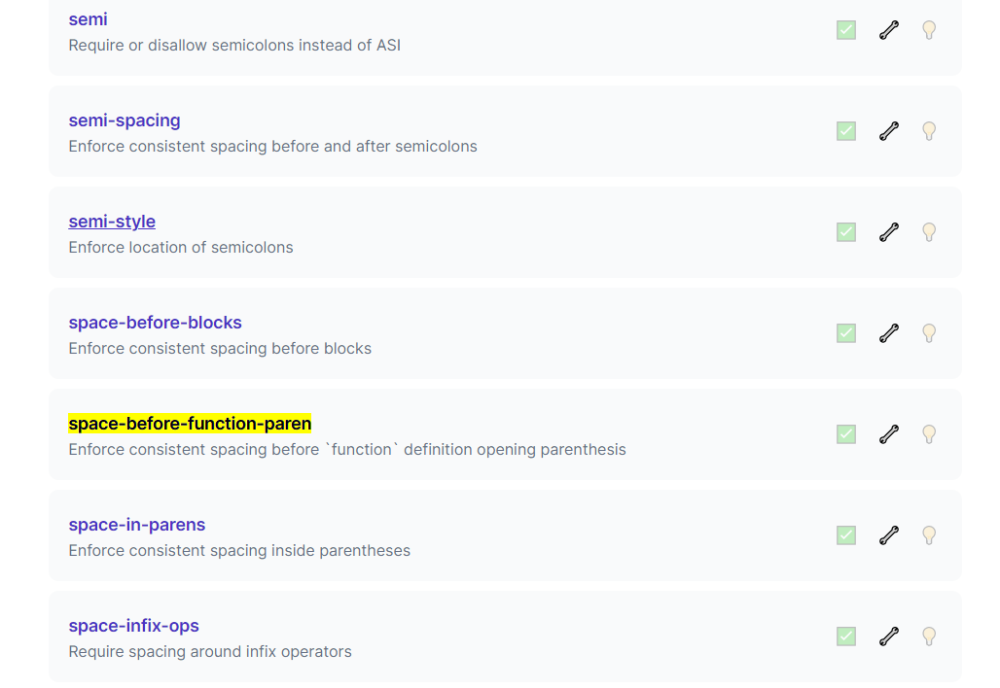
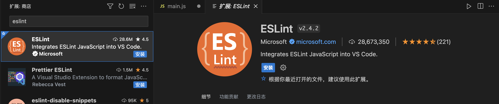
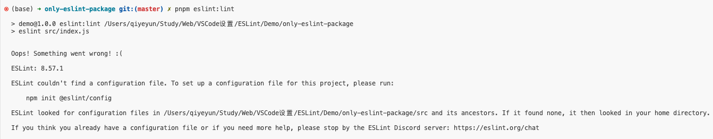
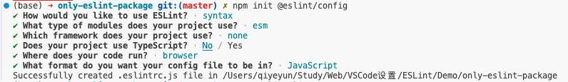
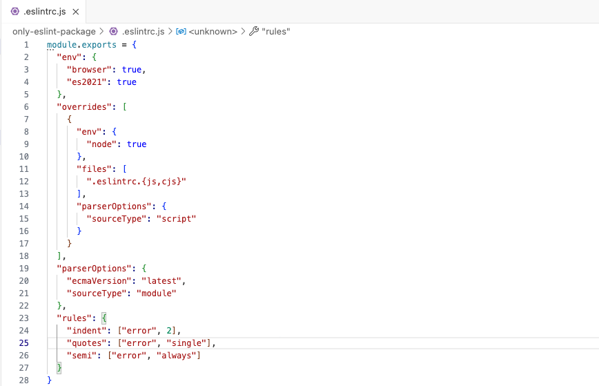
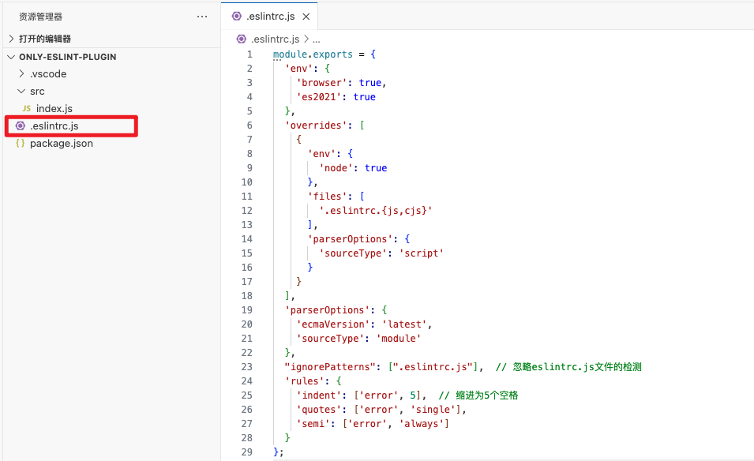
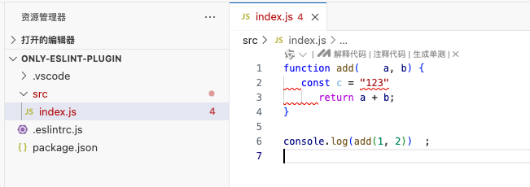
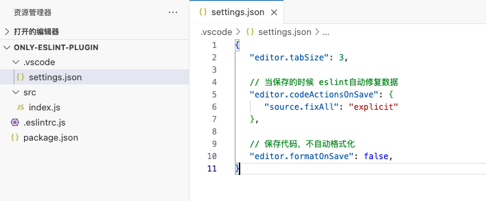

[新手入，一篇文章讲清eslint和prettier的npm包和vscode插件的关系](https://juejin.cn/post/6990929456382607374#heading-1)


# ESLint

## 一、ESlint代码规范

### JavaScript Standard Style 规范说明

ESLint:是一个代码检查工具，用来检查你的代码是否符合指定的规则(你和你的团队可以自行约定一套规则)。在创建项目时，我们使用的是 [JavaScript Standard Style](https://standardjs.com/readme-zhcn.html) 代码风格的规则。

建议把：https://standardjs.com/rules-zhcn.html 看一遍，然后在写的时候,  遇到错误就查询解决。


例如：

- *字符串使用单引号* – 需要转义的地方除外
- *无分号* – [这](http://blog.izs.me/post/2353458699/an-open-letter-to-javascript-leaders-regarding)[没什么不好。](http://inimino.org/~inimino/blog/javascript_semicolons)[不骗你！](https://www.youtube.com/watch?v=gsfbh17Ax9I)
- *关键字后加空格* `if (condition) { ... }`
- *函数名后加空格* `function name (arg) { ... }`
- 坚持使用全等 `===` 摒弃 `==` 一但在需要检查 `null || undefined` 时可以使用 `obj == null`
- ......


### 库

```
2022年10月11日18:21

+ prettier 2.7.1：prettier核心代码库

+ eslint 8.25.0 ：ESlint核心代码库
+ eslint-config-airbnb-base 15.0.0 ：airbnb的代码规范（依赖eslint-plugin-import ）
+ eslint-config-prettier 8.5.0 ：eslint 结合prettier的格式化
+ eslint-plugin-import 2.26.0 ：项目里支持eslint
+ eslint-plugin-prettier 4.2.1 ： 将prettier结合进入eslint的插件
+ eslint-plugin-vue 9.6.0 ：eslint在vue里的代码规范

+ @types/eslint 8.4.6
+ @types/node 18.8.4
+ @typescript-eslint/eslint-plugin 5.40.0 ：ESLint插件，包含各类定义好的检测ts代码的规范
+ @typescript-eslint/parser 5.40.0 : ESLint的解析器，用于解析ts，从而检查和规范ts代码
+ eslint-import-resolver-alias 1.1.2 ：让我们在import的时候可以使用@别名

2022年10月11日 20:19

发现还需要安装一个包 ：eslint/create-config
```


## 二、代码规范错误

## 1. 模拟错误

下面我们在main.js中随意做一些改动：添加一些空行、空格

```js
import Vue from 'vue'
import App from './App.vue'

import './styles/index.less'
import router from './router'
Vue.config.productionTip = false

new Vue ( {
  render: h => h(App),
  router
}).$mount('#app')
```


## 2. 手动修正

如果你不认识命令行中的语法报错是什么意思，你可以根据错误代码（func-call-spacing, space-in-parens,.....）去 ESLint 规则列表中查找其具体含义。

打开 [ESLint 规则表](https://zh-hans.eslint.org/docs/latest/rules/)，使用页面搜索（Ctrl + F）这个代码，查找对该规则的一个释义。




## 3. 通过eslint插件来实现自动修正

> 1. eslint会自动高亮错误显示；
> 2. 通过配置，eslint会自动帮助我们修复错误。

### 3.1 安装ESLint插件



### 3.2 配置

```json
// 当保存的时候，eslint自动帮我们修复错误
"editor.codeActionsOnSave": {
    "source.fixAll": true
},
// 保存代码，不自动格式化
"editor.formatOnSave": false
```

### 3.3 注意点

+ 注意：eslint的配置文件必须在根目录下，这个插件才能才能生效。打开项目必须以根目录打开，一次打开一个项目
+ 注意：使用了eslint校验之后，把vscode带的那些格式化工具全禁用了 Beatify 、Prettier


# ESlint 实操 - 2024-12


## 零、概念区分：VSCode插件与npm包的区别和使用（ESlint、Prettier、Vetur）

* https://www.panyanbin.com/article/47d1c4a4.html


## 一、只安装 `eslint` 包

ESLint 包是一个 JavaScript 的代码检查工具。你可以通过在项目的终端中运行`$ npm install eslint --save-dev`（如果使用 npm 作为包管理器）来安装它。

### 1. 安装

```sh
$ pnpm add eslint -D
```

### 2. `eslint` 检测

```sh
$ pnpm eslint:lint
```

```json
// package.json
{
  "scripts": {
    "eslint:lint": "eslint src/index.js",
    "eslint:fix":  "eslint src/index.js --fix"    // 自动修复问题
  },
}
```

### 3. 报错 - 没找到 `eslint` 配置文件



### 4. 创建 `eslint` 配置文件

#### 方式一：`$ npm init @eslint/config`



自动创建 `.eslintrc.js` 文件：




#### 方式二：VSCode命令行 `> Create ESLint configuration`


#### 方式三：终端 `$ npx eslint --init`


####  方式四：手动创建多种配置文件格式

常见的配置文件有`.eslintrc.js`、`.eslintrc.json`或者`.eslintrc.yml`。

```js
// 简单的.eslintrc.js配置文件示例
module.exports = {
   "env": {
     "browser": true,
     "es6": true
   },
   "extends": "eslint:recommended",
   "rules": {
     "indent": ["error", 2],
     "linebreak - style": ["error", "unix"],
     "quotes": ["error", "single"],
     "semi": ["error", "always"]
   }
 };
```


## 二、只安装 `eslint vscode ` 插件

### 1. 问：只安装 `vscode ESLint` 插件 需要安装 eslint包吗？

<font color='red' size=5>答案：必须安装eslint包！！</font>

vscode中的eslint插件仅仅只是eslint插件，其本质还是会调用项目本地或全局安装的eslint（npm包），然后将eslint的报错反馈给vscode，因此我们可以直接在编辑器中看到错误

也就说ESlint必须依赖 **本地安装 / 全局安装** 的eslint才可以正常工作，可以对比webpack-cli与webpack的关系。

当安装这个扩展插件后，可以在编辑器的配置文件（`.vscode/settings.json`）中进行eslint的配置，如编辑器识别文件类型，保存之后进行lint等






### 2. 忽略某些文件

* [官网 - 忽略文件](https://zh-hans.eslint.org/docs/latest/use/configure/ignore#%E9%85%8D%E7%BD%AE%E6%96%87%E4%BB%B6%E4%B8%AD%E7%9A%84-ignorepatterns)

#### a. 配置文件中的 `ignorePatterns` 

```js
// .eslintrc.js
module.exports = {
  "ignorePatterns": [".eslintrc.js"],  // 忽略eslintrc.js文件的检测
  'rules': {
    'indent': ['error', 5],  // 缩进为5个空格
    'quotes': ['error', 'single'],
    'semi': ['error', 'always']
  }
};
```


#### b. `.eslintignore` 文件


#### c. 使用替代文件

如果你想使用一个不同于当前工作目录中的 `.eslintignore` 的文件，你可以在命令行中使用 `--ignore-path` 选项来指定它。比如你也可以使用 `.jshintignore` 文件，因为它们格式一样：

```shell
$ eslint --ignore-path .jshintignore file.js
```

你也可以使用 `.gitignore` 文件：

```shell
$ eslint --ignore-path .gitignore file.js
```

任何遵循标准忽略文件格式的文件都可以被使用。请记住，指定 `--ignore-path` 意味着任何现有的 `.eslintignore` 文件将不会被使用。注意 `.eslintignore`中的 glob 规则遵循 `.gitignore` 中的规则。


#### d. package.json 中的 eslintIgnore

```json
{
    "name": "mypackage",
    "version": "0.0.1",
    "eslintConfig": {
        "env": {
            "browser": true,
            "node": true
        }
    },
    "eslintIgnore": ["hello.js", "world.js"]
}
```


### 3. 保存自动修复 ` .vscode/settings.json`

<font color='red' size=5>如果不生效，重启VSCode！！！</font>

` .vscode/settings.json`：

```json
{
   "editor.tabSize": 3,
   // 当保存的时候 eslint自动修复数据
   "editor.codeActionsOnSave": {
      "source.fixAll": "explicit"
   },
   // 保存代码，不自动格式化
   "editor.formatOnSave": false,
}
```




## 三、安装 `eslint` 包和 `eslint vscode ` 插件

效果一样，两个互补！

* `eslint` 包，可通过 `$ eslint src/index.js` 进行检测。

* `eslint vscode ` 插件：通过 `settings.json` 配置，可设置保存修改。


