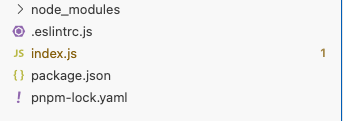
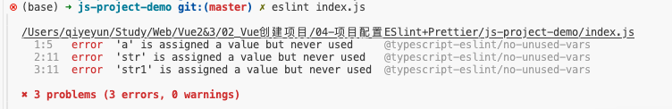
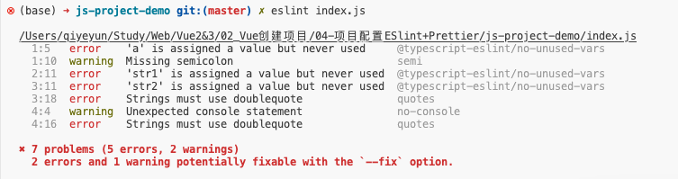
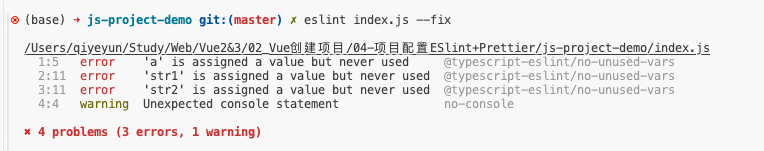
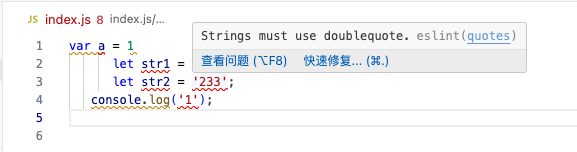

[新手入，一篇文章讲清eslint和prettier的npm包和vscode插件的关系](https://juejin.cn/post/6990929456382607374#heading-0)


# npm包 与 vscode插件


## ESLint的npm包

全局安装eslint

```sh
# 全局安装eslint包
$ npm i eslint -g

# 查看全局包列表
$ npm list -g 

/Users/qiyeyun/.nvm/versions/node/v18.16.0/lib
├── @vue/cli@5.0.8
├── corepack@0.17.0
├── create-preset@0.13.1
├── eslint@8.57.0      # 安装成功
├── npm@9.5.1
├── nrm@1.2.6
├── pnpm@6.35.1
├── sass@1.69.5
├── ts-node@10.9.1
├── typescript@5.2.2
└── yarn@1.22.19
```


eslint初始化

`npx eslint --init`  or  `npm init @eslint/config`，接着会出现几个选择，因为是测试，所以随便选，一直回车就行了。

选完之后会自动下载eslint包，并在项目的根目录自动创建`.eslintrc.js`文件。

```sh
$ npx eslint --init      
You can also run this command directly using 'npm init @eslint/config'.
✔ How would you like to use ESLint? · problems
✔ What type of modules does your project use? · none
✔ Which framework does your project use? · none
✔ Does your project use TypeScript? · No / Yes
✔ Where does your code run? · browser
✔ What format do you want your config file to be in? · JavaScript
Local ESLint installation not found.
The config that you've selected requires the following dependencies:

@typescript-eslint/eslint-plugin@latest @typescript-eslint/parser@latest eslint@latest
✔ Would you like to install them now? · No / Yes
✔ Which package manager do you want to use? · pnpm
Installing @typescript-eslint/eslint-plugin@latest, @typescript-eslint/parser@latest, eslint@latest
Packages: +130
++++++++++++++++++++++++++++++++++++++++++++++++++++++++++++++++++++++++++++++++++++++++++++++++++++++++++++++++++++++++++++++++++
Packages are hard linked from the content-addressable store to the virtual store.
  Content-addressable store is at: /Users/qiyeyun/Library/pnpm/store/v3
  Virtual store is at:             node_modules/.pnpm
Progress: resolved 130, reused 120, downloaded 10, added 130, done

devDependencies:
+ @typescript-eslint/eslint-plugin 7.1.1
+ @typescript-eslint/parser 7.1.1
+ eslint 8.57.0

The integrity of 1205 files was checked. This might have caused installation to take longer.
Done in 12.1s
Successfully created .eslintrc.js file in /Users/qiyeyun/Study/Web/Vue2&3/02_Vue创建项目/04-项目配置ESlint+Prettier/js-project-demo
```

运行完成，目录



index.js中代码

```js
var a = 1
      let str1 = "ss";
      let str2 = '233';
   console.log('1');
```

此时准备工作已经做好了，我们可以开始演示了。先执行`eslint index.js`

这时，终端会报错，说定义了几个变量，但没有使用它们。这就是最基本的用法。



但我上面书写的格式风格都不同，eslint并没有检测出来。所以我们要去配置`.eslintrc.js`文件

因为里面已经生成好了，所以这里只放出rules部分：`0是忽略，1是警告，2是报错`

```json
// .eslintrc.js
{
    ....
	"rules": {
        "quotes": 2,
        "semi": 1,
        "no-console": 1,
        "space-before-function-paren": 0,
    }
}
```

这时再执行`eslint index.js`



修复问题

```sh
$ eslint index.js --fix
```



可以看到，格式部分的报错已经被修复。

```js
var a = 1;
      let str1 = "ss";
      let str2 = "233";
   console.log("1");
```


## 为什么需要eslint的vscode插件

我们每次做项目的时候，都要先`eslint . --fix`统一格式，再push提交代码。或者是把指令添加到package.json文件中，执行`npm run lint`，再push。这样就很麻烦，并且也不够直观，因为错误问题只有在你执行了指令之后才能看到。
**那么我想在我一边写代码的时候就能直接看到错误，然后就能直接随手改正错误，这要怎么做呢？** 这时eslint的vscode插件诞生了。


安装完后，就能看到带波浪线的报错效果了。




## 配置.eslintignore文件

此文件是eslint忽略文件配置，配置到此文件的文件文件夹都会被eslint的检测规则忽略

```js
src/utils
src/three/libs
src/three/utils
```


## 既然有vscode插件，那么还装eslint的npm包吗？

要装。虽然vscode插件也可以单独配置格式，但是如果项目中有`.eslintrc.js`文件，那么eslint插件会优先执行`.eslintrc.js`文件的配置。
并且不是每个人都会装eslint的vscode插件。此时eslint的npm包就作为一个保障，并且里面的`.eslintrc.js`配置就作为标准配置。
**装vscode插件只是为了方便自己开发而已。**
