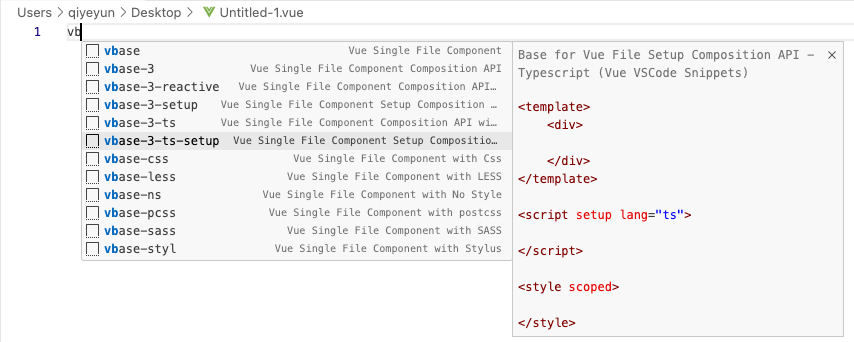
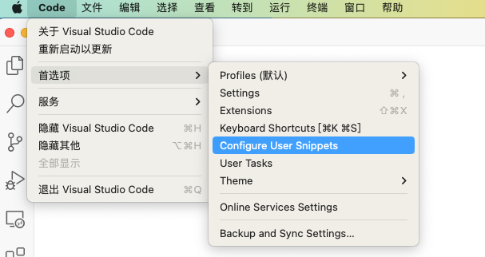
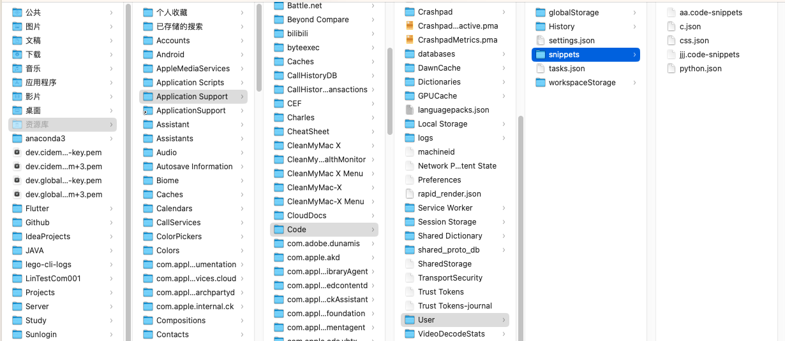
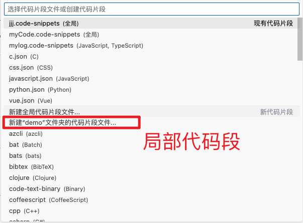
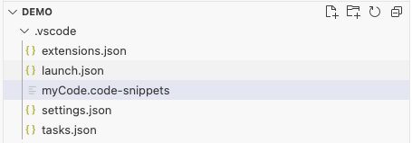

* [Snippets in Visual Studio Code](https://code.visualstudio.com/docs/editor/userdefinedsnippets)


# 一、内置的Snippets


# 二、插件


## 1. 使用代码片段插件




# 三、自定义Snippets

## 1. 入口

### a. Code -> 首选项 -> Configure User Snippets




### b. 快捷框 CMD + shit + p


## 2. 全局代码片段

全局代码片段（每种语言环境下都能触发代码块）

* 新建全局代码片段会在 `snippets` 目录下生成 `.code-snippets` 为后缀的配置文件。


###a. 打开 Configure User Snippets


### b. 新建一个全局Snippets

```js
{
	// Place your 全局 snippets here. Each snippet is defined under a snippet name and has a scope, prefix, body and 
	// description. Add comma separated ids of the languages where the snippet is applicable in the scope field. If scope 
	// is left empty or omitted, the snippet gets applied to all languages. The prefix is what is 
	// used to trigger the snippet and the body will be expanded and inserted. Possible variables are: 
	// $1, $2 for tab stops, $0 for the final cursor position, and ${1:label}, ${2:another} for placeholders. 
	// Placeholders with the same ids are connected.
	// Examplec:
	"Print to console": {
		"scope": "javascript,typescript",
		"prefix": "lxlog",
		"body": [
			"console.log('$1');",
			"$2"
		],
		"description": "Log output to console"
	}
}
```


### c. 文件路径




## 3. 局部代码片段

对应语言的局部代码片段（只能在对应语言环境下才能触发）。

* 而新建对应语言的代码片段会生成 `对应语言 + .json` 的配置文件。


###a. 打开 Configure User Snippets


### b. 新建一个局部代码片段




### c. 文件路径

项目工作区中 .vscode 文件夹中：



### d. 验证


