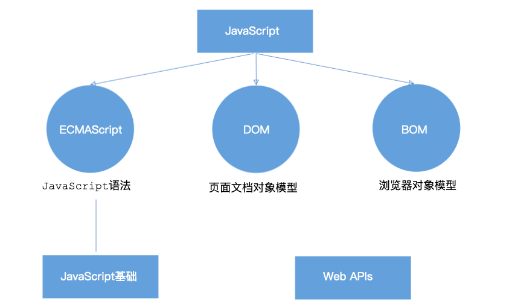

# 一、关系图

# 二、什么是DOM

**文档对象模型（Document Object Model，简称 DOM）**，是 W3C 组织推荐的处理可扩展标记语言（HTML或者XML）的标准编程接口。
W3C 已经定义了一系列的 DOM 接口，通过这些 DOM 接口可以改变网页的内容、结构和样式。

# 三、DOM 树

* 文档：一个页面就是一个文档，DOM 中使用 document 表示
* 元素：页面中的所有标签都是元素，DOM 中使用 element 表示
* 节点：网页中的所有内容都是节点（标签、属性、文本、注释等），DOM 中使用 node 表示

**DOM 把以上内容都看做是对象**

